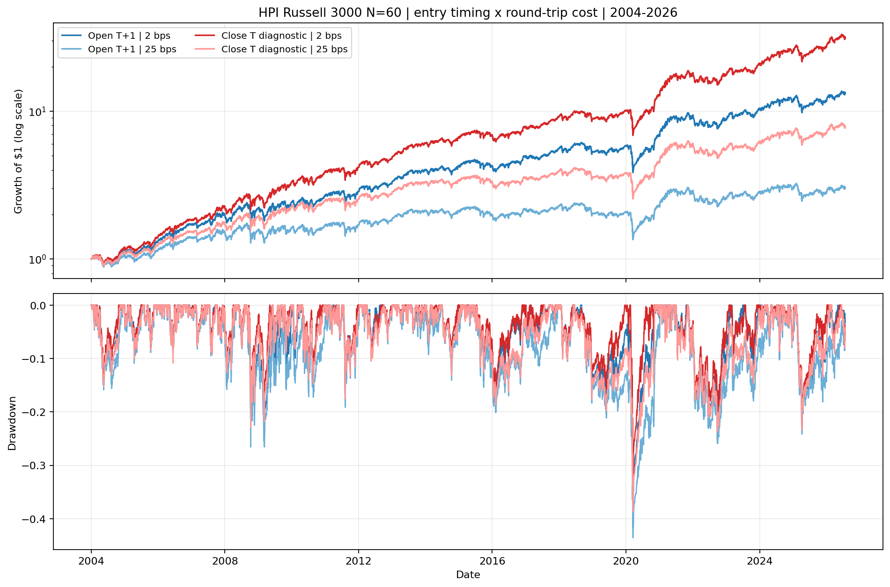
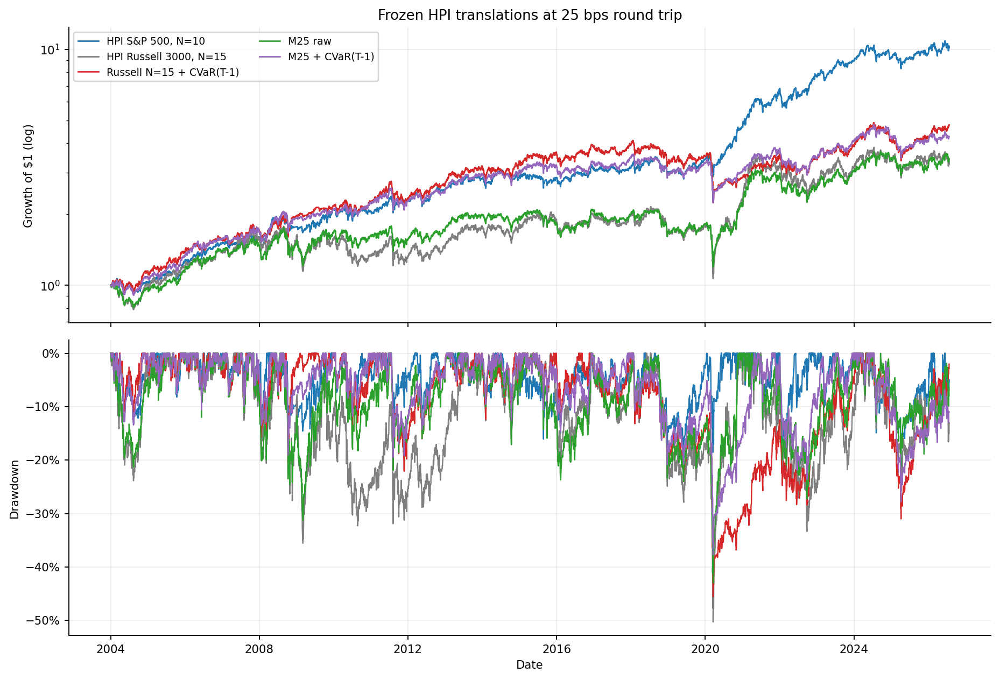

<!-- GENERATED FILE. EDIT THE CANONICAL KNOWLEDGE RECORD. -->

# HPI More Bets, rolling CVaR and fragility filters

!!! warning "Research-only"
    This page summarizes saved research evidence. It does not authorize LIVE, allocation, or deployment.

## TL;DR

> **Verdict:** נמצאו שיפורים נקודתיים, אך הם נכשלו באחד או יותר משערי התקופות, החשיפה, המובהקות או הקיבולת; אין מועמד לקידום.

> **Status:** `diagnostic`

> **Disposition:** `diagnostic`

> **Replication:** `not_reproducible`

## Research question

Translate the paper's More Bets and rolling CVaR concepts into the official causal HPI engine and test additional prior-only fragility mechanisms.

## Exact setup

| Field | Value |
| --- | --- |
| Signal family | cross-sectional long-only HPI mean reversion |
| Universe | ["S&P 500 current and past PIT", "Russell 3000 current and past PIT", "Russell 3000 ex S&P 500 PIT"] |
| Decision | All features and selection are known at Close_T. |
| Fill | Entry and ordinary exit at Open_(T+1); documented removal fallback only. |
| Primary cost layer | conservative_survival |
| Last reviewed | 2026-08-22T09:42:05+00:00 |

## Timing and overnight attribution

```text
information available: All features and selection are known at Close_T.
primary executable fill: Entry and ordinary exit at Open_(T+1); documented removal fallback only.
```

If final `Close_T` data formed the signal, a hypothetical `Close_T` entry is diagnostic only unless a separate pre-close protocol was modeled. Comparing that diagnostic with `Open_(T+1)` and applying the compounded return identity shows whether the apparent edge occurred in the overnight gap. Missing attribution numbers mean **not tested**, not zero.

| Attribution field | Value |
| --- | --- |
| Status | tested_diagnostic_only |
| Diagnostic Path | final Close_T signal -> same Close_T fill |

## Primary metrics

| Metric | Value |
| --- | ---: |
| Period | 2004-01-02/2026-07-24 |
| Universe | S&P 500 PIT official HPI parity anchor |
| Cost Layer | conservative_survival |
| Cagr | 10.83% |
| Annualized Volatility | 15.51% |
| Sharpe | 0.741 |
| Maximum Drawdown | -20.49% |
| Turnover | 5467.67% |

## Four separate verdicts

| Question | Conclusion |
| --- | --- |
| Source Replication | not_reproducible_due_material_omissions |
| Predictive Value | mixed_or_failed_frozen_gates |
| Economic Value | diagnostic |
| Promotion | no_paper_or_live; at_most_locked_forward_hypothesis |

## Key findings

| Feature | Role | Direction | Status | Effect | Action |
| --- | --- | --- | --- | --- | --- |
| rolling_CVaR_Tm1 | risk_filter | mixed_or_failed | diagnostic | 6/10 core gates passed | stop_without_rescue_tuning |
| M25_shared_capital | portfolio_construction | mixed_or_failed | diagnostic | 5/8 core gates passed | stop_without_rescue_tuning |
| GapQ05_252_prior | risk_filter | mixed_or_failed | diagnostic | 8/12 core gates passed | stop_without_rescue_tuning |
| MDD63_prior | risk_filter | mixed_or_failed | diagnostic | 8/12 core gates passed | stop_without_rescue_tuning |
| Amihud63_prior | liquidity_fragility_filter | mixed_or_failed | diagnostic | 8/12 core gates passed | stop_without_rescue_tuning |
| same_close_entry_timing | timing_attribution | improved_all_three_retrospective_periods | diagnostic_only | +4.37 percentage points CAGR and +0.222 Sharpe at 2 bps | retain causal Open_(T+1); test only a separately frozen pre-close/MOC design |

## Visual evidence






## Limitations

- The source omits material timing, CVaR, portfolio, cost, and capacity rules.
- All historical periods were already seen; validation and confirmation are retrospective.
- The impact model is uncalibrated and uses daily ADV63 rather than opening-auction volume.
- Exposure matching is forbidden when it requires leverage; no rescue variant was run.
- No borrow, short, broker, PAPER, LIVE, scheduler, allocation, or release evidence exists.
- Same-close entry uses the final Close/High/Low that also determine the signal and is therefore timing-conflicted.
- The same-close path raises average exposure and position count, so the contrast is not pure entry-price repricing.
- Common support excludes 120 of 165,086 Russell candidates.

## Next gates

- If and only if a component passed all frozen gates, run a locked forward shadow with no threshold changes.
- Calibrate participation against opening-auction volume before any capacity claim.
- Do not retune failed CVaR, GapQ05, MDD63, or Amihud thresholds on the same history.
- If same-day execution remains interesting, freeze and forward-test a pre-close signal plus documented MOC protocol.

## Sources

- `{"path": "C:\\\\Users\\\\User\\\\Downloads\\\\more_bets.pdf", "role": "paper_source", "sha256": "2d13bb53fccff499c45eec23aa8caa5313089032cc0e530228b05342b682f2c4"}`
- `{"path": "SOURCE_RULE_MAP.md", "role": "literal_and_missing_rule_map"}`

## Canonical artifacts

| Artifact | Pakal path |
| --- | --- |
| Concise Report | `pakal-research/reports/hpi_more_bets_cvar_study/REPORT.md` |
| Full Report | `pakal-research/reports/hpi_more_bets_cvar_study/REPORT_FULL.md` |
| Notebook | `C:\\Users\\User\\Documents\\workspace\\pakal\\pakal-research\\notebooks\\hpi_more_bets_cvar_study.ipynb` |
| Frozen Specification | `pakal-research/reports/hpi_more_bets_cvar_study/research_spec_frozen.json` |
| Manifest | `pakal-research/reports/hpi_more_bets_cvar_study/run_manifest.json` |
| Primary Source Code | `["pakal-research/hpi_more_bets_cvar_study.py", "pakal-research/hpi_more_bets_execute.py", "pakal-research/hpi_more_bets_parity_compare.py", "pakal-research/hpi_more_bets_timing_diagnostic.py"]` |
| Primary Tables | `["pakal-research/reports/hpi_more_bets_cvar_study/tables/frozen_gate_results.csv", "pakal-research/reports/hpi_more_bets_cvar_study/tables/decision_summary.csv", "pakal-research/reports/hpi_more_bets_cvar_study/tables/overall_metrics.csv", "pakal-research/reports/hpi_more_bets_cvar_study/tables/subperiod_metrics.csv", "pakal-research/reports/hpi_more_bets_cvar_study/tables/entry_timing_2x2_metrics.csv", "pakal-research/reports/hpi_more_bets_cvar_study/tables/entry_timing_2x2_subperiods.csv", "pakal-research/reports/hpi_more_bets_cvar_study/tables/entry_timing_2x2_contrasts.csv"]` |
| Primary Charts | `["pakal-research/reports/hpi_more_bets_cvar_study/charts/primary_equity_drawdown.png", "pakal-research/reports/hpi_more_bets_cvar_study/charts/subperiod_cagr_deltas.png", "pakal-research/reports/hpi_more_bets_cvar_study/charts/capacity_impact_cagr.png", "pakal-research/reports/hpi_more_bets_cvar_study/charts/entry_timing_2x2_equity_drawdown.png"]` |
| Research State | `research_state.json` |
| Hypothesis Registry | `hypothesis_registry.json` |
| Experiment Ledger | `experiment_ledger.jsonl` |
| Decision Log | `decision_log.jsonl` |
| Source Rule Map | `SOURCE_RULE_MAP.md` |
