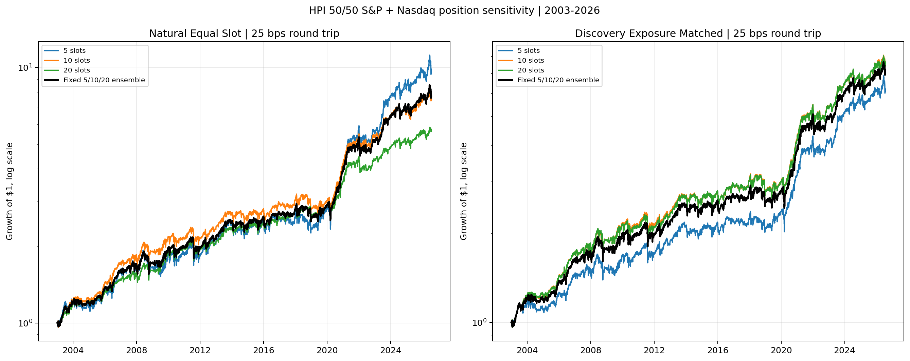
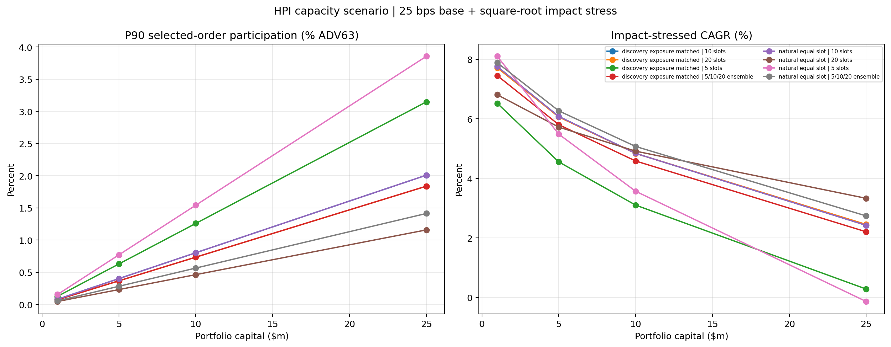

<!-- GENERATED FILE. EDIT THE CANONICAL KNOWLEDGE RECORD. -->

# HPI Position Sensitivity and Fixed Slot Ensemble

!!! warning "Research-only"
    This page summarizes saved research evidence. It does not authorize LIVE, allocation, or deployment.

## TL;DR

> **Verdict:** Keep 10 slots as the simple control and advance the natural equal-capital 5/10/20 ensemble as a research-only forward hypothesis. Five-slot return and twenty-slot risk improvements were materially driven by unequal gross exposure.

> **Status:** `forward_hypothesis`

> **Disposition:** `not_recorded`

> **Replication:** `not_recorded`

## Research question

Determine whether 5, 10, or 20 HPI positions provide a genuine concentration or diversification improvement after matching average gross exposure, and whether a frozen 5/10/20 ensemble is preferable to selecting one winner.

## Exact setup

| Field | Value |
| --- | --- |
| Signal family | long_equity_mean_reversion |
| Universe | ["S&P 500 Current & Past with point-in-time membership", "Nasdaq 100 Current & Past with point-in-time membership"] |
| Decision | after Close_T |
| Fill | Open_T+1 |
| Primary cost layer | conservative_survival |
| Last reviewed | 2026-07-25T23:15:00+03:00 |

## Timing and overnight attribution

```text
information available: after Close_T
primary executable fill: Open_T+1
```

If final `Close_T` data formed the signal, a hypothetical `Close_T` entry is diagnostic only unless a separate pre-close protocol was modeled. Comparing that diagnostic with `Open_(T+1)` and applying the compounded return identity shows whether the apparent edge occurred in the overnight gap. Missing attribution numbers mean **not tested**, not zero.


## Primary metrics

| Metric | Value |
| --- | ---: |
| Period | 2003-01-01 through 2026-07-24 |
| Universe | fixed initial 50/50 S&P 500 plus Nasdaq-100; fixed one-third capital across 5/10/20 slot paths |
| Cost Layer | 25 bps round-trip conservative survival proxy; capacity impact excluded |
| Cagr | 9.21% |
| Annualized Volatility | 13.36% |
| Sharpe | 0.726 |
| Maximum Drawdown | -18.51% |
| Turnover | 2121.17% |

## Key findings

| Feature | Role | Direction | Status | Effect | Action |
| --- | --- | --- | --- | --- | --- |
| maximum positions in {5,10,20} | portfolio concentration parameter | natural 5 slots increase exposure and concentration; natural 20 slots reduce exposure and hold more cash | diagnostic | natural full-period CAGR/Sharpe/max drawdown were 10.26%/0.68/-23.58% for 5, 9.13%/0.73/-18.05% for 10, and 7.70%/0.74/-16.28% for 20 | do not select one slot count from natural-sizing results |
| discovery-period gross-exposure normalization | position-size control | removes most apparent 20-slot diversification improvement and the 5-slot return advantage | diagnostic | matched full-period 10 and 20 paths were 9.13% versus 9.07% CAGR, 0.731 versus 0.724 Sharpe, and -18.05% versus -18.56% drawdown | use only as a diagnostic control; do not promote calibrated fractions as strategy parameters |
| fixed natural-size 5/10/20 slot ensemble | parameter-risk ensemble | preserves 10-slot economics while reducing dependence on one arbitrary concentration setting | forward_hypothesis | at 25 bps the ensemble delivered 9.21% CAGR, 0.726 Sharpe, -18.51% drawdown and 53.98% average gross exposure versus 9.13%, 0.731, -18.05% and 53.62% for 10 slots | carry as a research shadow with 10 slots retained as the simple control |
| selected-order ADV63 capacity stress | capacity diagnostic | the slot ensemble modestly spreads orders but capacity still deteriorates rapidly with capital | diagnostic | moderate stressed CAGR was 7.89% at $1m, 6.27% at $5m, 5.07% at $10m and 2.74% at $25m | retain capacity as the next binding research gate |

## Visual evidence






## Limitations

- The HPI signal and Nasdaq position-count results were partly seen before the freeze.
- Exposure matching controls discovery-period average gross exposure, not day-by-day exposure or identical names.
- Flat costs are not calibrated from actual fills.
- Daily ADV is not opening-auction liquidity and the impact curve is hypothetical.
- The six-subpath ensemble is operationally more complex than one 10-slot path.
- S&P and Nasdaq sleeves overlap and share the same mean-reversion mechanism.
- No live parity or deployment evidence is provided.

## Next gates

- Carry both the 10-slot control and frozen natural 5/10/20 ensemble into the next liquidity, price and opening-auction study.
- Aggregate same-symbol orders across all subpaths before applying participation controls.
- Calibrate spread, auction basis risk, slippage and partial fills from representative order-level data.
- Run the short side only under a separate frozen specification with borrow, locate, recall, dividend and squeeze assumptions.

## Sources

- `C:\\Users\\User\\Downloads\\qpi_1.pdf`
- `C:\\Users\\User\\Downloads\\qpi_2.pdf`
- `C:\\Users\\User\\Downloads\\qpi_3.pdf`
- `C:\\Users\\User\\Downloads\\qpi_4.pdf`
- `C:\\Users\\User\\Downloads\\3. Testing for an Edge _ Quantitativo.pdf`
- `pakal-research/reports/qpi_cross_universe_ensemble/research_spec_frozen.json`

## Canonical artifacts

| Artifact | Pakal path |
| --- | --- |
| Concise Report | `pakal-research/reports/hpi_position_sensitivity/REPORT.md` |
| Full Report | `pakal-research/reports/hpi_position_sensitivity/REPORT_FULL.md` |
| Notebook | `pakal-research/hpi_position_sensitivity.ipynb` |
| Frozen Specification | `pakal-research/reports/hpi_position_sensitivity/research_spec_frozen.json` |
| Manifest | `pakal-research/reports/hpi_position_sensitivity/run_manifest.json` |
| Primary Source Code | `["pakal-research/hpi_position_sensitivity.py", "pakal-research/qpi_vectorized_portfolio_engine.py"]` |
| Primary Tables | `["pakal-research/reports/hpi_position_sensitivity/tables/portfolio_period_summary.csv", "pakal-research/reports/hpi_position_sensitivity/tables/exposure_calibration.csv", "pakal-research/reports/hpi_position_sensitivity/tables/paired_slot_tests.csv", "pakal-research/reports/hpi_position_sensitivity/tables/capacity_scenarios.csv"]` |
| Primary Charts | `["pakal-research/reports/hpi_position_sensitivity/charts/primary_equity_by_slots.png", "pakal-research/reports/hpi_position_sensitivity/charts/slot_metric_sensitivity.png", "pakal-research/reports/hpi_position_sensitivity/charts/exposure_calibration.png", "pakal-research/reports/hpi_position_sensitivity/charts/capacity_by_slot_construction.png"]` |
