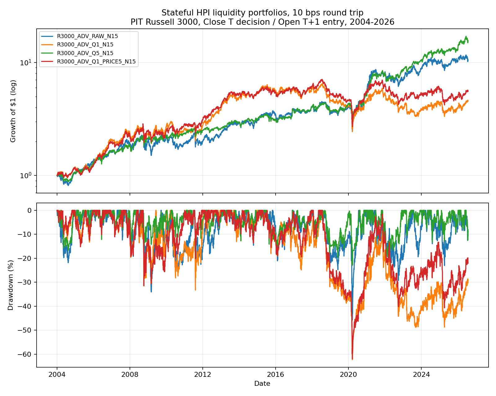
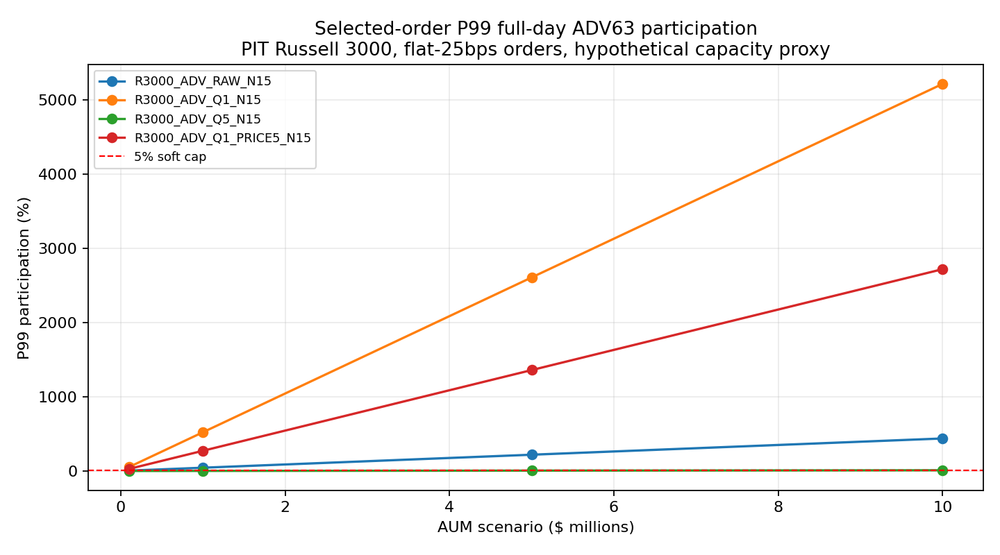

<!-- GENERATED FILE. EDIT THE CANONICAL KNOWLEDGE RECORD. -->

# HPI Russell 3000 Liquidity Mean-Reversion Study

!!! warning "Research-only"
    This page summarizes saved research evidence. It does not authorize LIVE, allocation, or deployment.

## TL;DR

> **Verdict:** Low ADV did not improve HPI. The least-liquid quintile had weaker return, Sharpe, drawdown, tail behavior, and unusable selected-order capacity; all three frozen gates failed.

> **Status:** `diagnostic`

> **Disposition:** `rejected`

> **Replication:** `replicated`

## Research question

Determine whether executable HPI mean reversion improves as Russell 3000 candidate liquidity declines and survives costs and capacity.

## Exact setup

| Field | Value |
| --- | --- |
| Signal family | mean_reversion |
| Universe | ["Russell 3000 Current & Past with PIT membership"] |
| Decision | Close_T |
| Fill | Open_T+1 |
| Primary cost layer | central_research_flat_10bps_round_trip |
| Last reviewed | 2026-08-22T20:47:10+00:00 |

## Timing and overnight attribution

```text
information available: Close_T
primary executable fill: Open_T+1
```

If final `Close_T` data formed the signal, a hypothetical `Close_T` entry is diagnostic only unless a separate pre-close protocol was modeled. Comparing that diagnostic with `Open_(T+1)` and applying the compounded return identity shows whether the apparent edge occurred in the overnight gap. Missing attribution numbers mean **not tested**, not zero.

| Attribution field | Value |
| --- | --- |
| Status | not_applicable |
| Diagnostic Path | Parent study already assessed same-close timing separately |
| Executable Path | Open_T+1 to the unchanged official HPI exit |
| Method | This incremental test preserved the executable path only |
| Headline Result | No new same-close claim was made. |
| Metrics | {} |
| Artifact | N/A |

## Primary metrics

| Metric | Value |
| --- | ---: |
| Period | 2004-01-02/2026-07-24 |
| Universe | PIT Russell 3000 |
| Cost Layer | 10 bps nominal round trip |
| Cagr | N/A |
| Annualized Volatility | 21.00% |
| Sharpe | N/A |
| Maximum Drawdown | -61.96% |
| Turnover | 5631.51% |

## Four separate verdicts

| Question | Conclusion |
| --- | --- |
| Source Replication | The R3000 N15 baseline reproduced the parent study across 21 checked metric cells within 1e-12. |
| Predictive Value | Q1 mean gross candidate return was 0.842% versus 1.051% for Q5; Q1-Q5 was negative in the two later retrospective periods and full history. |
| Economic Value | At 10 bps Q1_PRICE5 returned 7.91% CAGR with 0.468 Sharpe and -61.96% max drawdown, below raw and Q5. |
| Promotion | Rejected as a liquidity preference; no PAPER, LIVE, allocation, or official-rank change. |

## Key findings

| Feature | Role | Direction | Status | Effect | Action |
| --- | --- | --- | --- | --- | --- |
| ADV63 quintile | liquidity diagnostic | lower ADV was worse overall | rejected | Q1 mean trade return 0.842% vs Q5 1.051%; same-date annualized mean difference -48.09 percentage points | Do not add a low-ADV preference or reverse Turnover ranking. |

## Visual evidence






## Limitations

- All historical periods were already seen in the parent study.
- Historical spreads, auction volume, depth, queue position, and partial fills are unavailable.
- ADV63 is liquidity, not historical market capitalization.
- Candidate holding paths overlap; primary inference aggregated to signal date.
- Global research-registry refresh was blocked by an unrelated Inflation Compass knowledge record that references a missing REPORT.md; this study's local record and manifest validated.

## Next gates

- Do not tune another low-ADV threshold on this history.
- Retain the official Turnover-descending rank unless a genuinely new mechanism and future unseen sample justify a separate freeze.

## Sources

- `pakal-research/reports/hpi_more_bets_cvar_study/research_spec_frozen.json`
- `user-proposed liquidity hypothesis on 2026-08-22`

## Canonical artifacts

| Artifact | Pakal path |
| --- | --- |
| Concise Report | `pakal-research/reports/hpi_r3000_liquidity_mr_study/REPORT.md` |
| Full Report | `pakal-research/reports/hpi_r3000_liquidity_mr_study/REPORT_FULL.md` |
| Notebook | `pakal-research/notebooks/hpi_r3000_liquidity_mr_study.ipynb` |
| Frozen Specification | `pakal-research/reports/hpi_r3000_liquidity_mr_study/research_spec_frozen.json` |
| Manifest | `pakal-research/reports/hpi_r3000_liquidity_mr_study/run_manifest.json` |
| Primary Source Code | `["pakal-research/hpi_r3000_liquidity_mr_study.py"]` |
| Primary Tables | `["pakal-research/reports/hpi_r3000_liquidity_mr_study/tables/overall_metrics.csv", "pakal-research/reports/hpi_r3000_liquidity_mr_study/tables/frozen_gate_results.csv", "pakal-research/reports/hpi_r3000_liquidity_mr_study/tables/capacity_summary.csv"]` |
| Primary Charts | `["pakal-research/reports/hpi_r3000_liquidity_mr_study/charts/candidate_return_by_adv_quintile.png", "pakal-research/reports/hpi_r3000_liquidity_mr_study/charts/central_cost_equity_drawdown.png", "pakal-research/reports/hpi_r3000_liquidity_mr_study/charts/p99_adv_participation_by_aum.png"]` |
