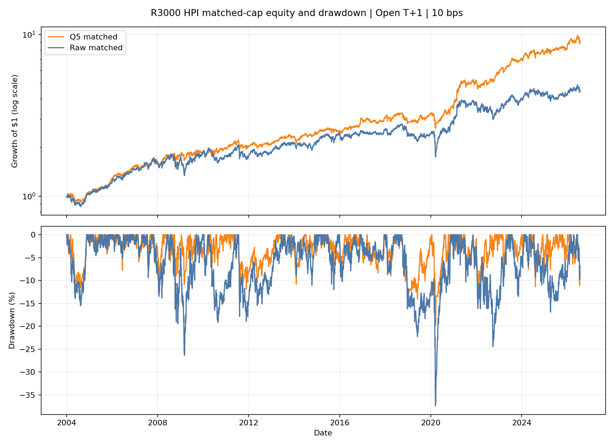
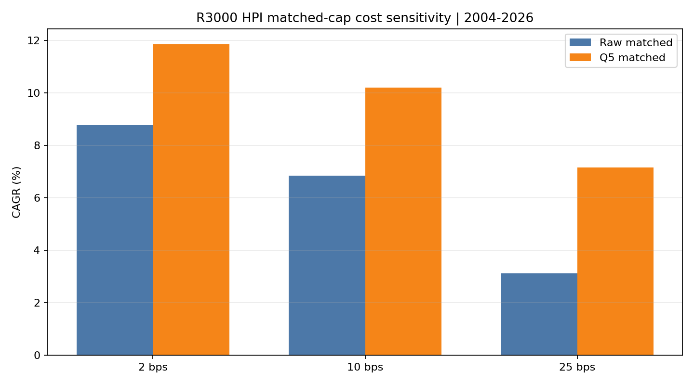

<!-- GENERATED FILE. EDIT THE CANONICAL KNOWLEDGE RECORD. -->

# HPI Russell 3000 Q5 Exposure-Matched Study

!!! warning "Research-only"
    This page summarizes saved research evidence. It does not authorize LIVE, allocation, or deployment.

## TL;DR

> **Verdict:** Q5 passed every frozen equal-capital, exposure-efficiency, stability, cost, and capacity gate, but only as a forward hypothesis because the full history was already seen.

> **Status:** `forward_hypothesis`

> **Disposition:** `promising_component`

> **Replication:** `replicated`

## Research question

Test whether Q5 high-liquidity HPI adds value after equal capital-opportunity caps.

## Exact setup

| Field | Value |
| --- | --- |
| Signal family | mean_reversion |
| Universe | ["Russell 3000 Current & Past point-in-time"] |
| Decision | Close_T |
| Fill | Open_T+1 |
| Primary cost layer | central_research |
| Last reviewed | 2026-08-22T22:06:09+00:00 |

## Timing and overnight attribution

```text
information available: Close_T
primary executable fill: Open_T+1
```

If final `Close_T` data formed the signal, a hypothetical `Close_T` entry is diagnostic only unless a separate pre-close protocol was modeled. Comparing that diagnostic with `Open_(T+1)` and applying the compounded return identity shows whether the apparent edge occurred in the overnight gap. Missing attribution numbers mean **not tested**, not zero.

| Attribution field | Value |
| --- | --- |
| Status | not_applicable |
| Diagnostic Path | No new same-close path |
| Executable Path | Open_T+1 through inherited next-open exits |
| Method | Parent timing evidence reused; only eligibility and position cap changed |
| Headline Result | Executable timing remained unchanged. |
| Metrics | {} |
| Artifact | ../hpi_more_bets_cvar_study/tables/entry_timing_2x2_metrics.csv |

## Primary metrics

| Metric | Value |
| --- | ---: |
| Period | 2004-01-02/2026-07-24 |
| Universe | Russell 3000 PIT |
| Cost Layer | 10 bps nominal round trip |
| Cagr | 10.20% |
| Annualized Volatility | 12.64% |
| Sharpe | 0.832 |
| Maximum Drawdown | -19.86% |
| Turnover | 3739.07% |

## Four separate verdicts

| Question | Conclusion |
| --- | --- |
| Source Replication | Parent raw and Q5 definitions and executable timing were preserved. |
| Predictive Value | Retrospective matched-cap and target-allocation-efficiency evidence only. |
| Economic Value | At 10 bps Q5 matched CAGR=0.102035, Sharpe=0.831895. |
| Promotion | Maximum status is forward_hypothesis because the full history was previously seen. |

## Key findings

| Feature | Role | Direction | Status | Effect | Action |
| --- | --- | --- | --- | --- | --- |
| ADV63 Q5 | liquidity_filter | prefer highest same-date liquidity quintile | forward_hypothesis | Q5 passed every frozen equal-capital, exposure-efficiency, stability, cost, and capacity gate, but only as a forward hypothesis because the full history was already seen. | No official strategy change; future shadow only if all gates pass. |

## Visual evidence






## Limitations

- All historical observations were seen before the Q5 follow-up was frozen.
- Full-day ADV63 is not opening-auction volume.
- No empirical spread, depth, queue, or partial-fill history.
- Global research registry refresh is blocked by an unrelated Inflation Compass knowledge record that references a missing REPORT.md; the local record validates.

## Next gates

- Future shadow observations after 2026-07-24 only if every frozen gate passes.

## Sources

- `pakal-research/reports/hpi_r3000_liquidity_mr_study/research_spec_frozen.json`
- `conversation_2026-08-23`

## Canonical artifacts

| Artifact | Pakal path |
| --- | --- |
| Concise Report | `pakal-research/reports/hpi_r3000_q5_exposure_match_study/REPORT.md` |
| Full Report | `pakal-research/reports/hpi_r3000_q5_exposure_match_study/REPORT_FULL.md` |
| Notebook | `pakal-research/notebooks/hpi_r3000_q5_exposure_match_study.ipynb` |
| Frozen Specification | `pakal-research/reports/hpi_r3000_q5_exposure_match_study/research_spec_frozen.json` |
| Manifest | `pakal-research/reports/hpi_r3000_q5_exposure_match_study/run_manifest.json` |
| Primary Source Code | `["pakal-research/hpi_r3000_q5_exposure_match_study.py"]` |
| Primary Tables | `["pakal-research/reports/hpi_r3000_q5_exposure_match_study/tables/overall_metrics.csv", "pakal-research/reports/hpi_r3000_q5_exposure_match_study/tables/paired_inference.csv", "pakal-research/reports/hpi_r3000_q5_exposure_match_study/tables/frozen_gate_results.csv"]` |
| Primary Charts | `["pakal-research/reports/hpi_r3000_q5_exposure_match_study/charts/matched_equity_drawdown_10bps.png", "pakal-research/reports/hpi_r3000_q5_exposure_match_study/charts/matched_cost_sensitivity.png", "pakal-research/reports/hpi_r3000_q5_exposure_match_study/charts/rolling_sp500_correlation_126d.png", "pakal-research/reports/hpi_r3000_q5_exposure_match_study/charts/matched_capacity_p99.png"]` |
| Research State | `pakal-research/reports/hpi_r3000_q5_exposure_match_study/research_state.json` |
| Hypothesis Registry | `pakal-research/reports/hpi_r3000_q5_exposure_match_study/hypothesis_registry.json` |
| Experiment Ledger | `pakal-research/reports/hpi_r3000_q5_exposure_match_study/experiment_ledger.jsonl` |
| Decision Log | `pakal-research/reports/hpi_r3000_q5_exposure_match_study/decision_log.jsonl` |
| Source Rule Map | `pakal-research/reports/hpi_r3000_q5_exposure_match_study/SOURCE_RULE_MAP.md` |
