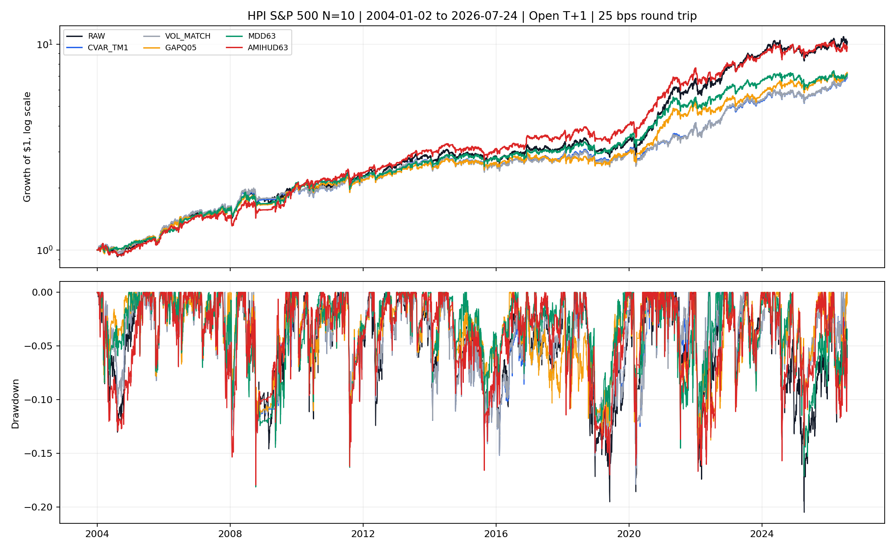
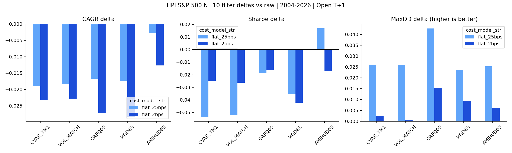

<!-- GENERATED FILE. EDIT THE CANONICAL KNOWLEDGE RECORD. -->

# HPI S&P 500 Risk-Filter Transfer

!!! warning "Research-only"
    This page summarizes saved research evidence. It does not authorize LIVE, allocation, or deployment.

## TL;DR

> **Verdict:** No tested overlay improved the raw HPI portfolio across frozen economic, stability, multiplicity, exposure, and cost gates; retain raw HPI.

> **Status:** `diagnostic`

> **Disposition:** `rejected`

> **Replication:** `replicated`

## Research question

Test whether frozen CVaR, GapQ05, MDD63, or Amihud63 overlays improve executable official HPI S&P 500 N=10 without retuning.

## Exact setup

| Field | Value |
| --- | --- |
| Signal family | cross-sectional long-only HPI mean reversion |
| Universe | ["S&P 500 Current and Past point-in-time"] |
| Decision | All signal and filter inputs are known after final Close_T. |
| Fill | Entry and ordinary exit at Open_(T+1). |
| Primary cost layer | conservative_survival |
| Last reviewed | 2026-08-22T19:24:00+00:00 |

## Timing and overnight attribution

```text
information available: All signal and filter inputs are known after final Close_T.
primary executable fill: Entry and ordinary exit at Open_(T+1).
```

If final `Close_T` data formed the signal, a hypothetical `Close_T` entry is diagnostic only unless a separate pre-close protocol was modeled. Comparing that diagnostic with `Open_(T+1)` and applying the compounded return identity shows whether the apparent edge occurred in the overnight gap. Missing attribution numbers mean **not tested**, not zero.

| Attribution field | Value |
| --- | --- |
| Status | not_tested |
| Diagnostic Path | same-close path excluded |
| Executable Path | Close_T decision to Open_(T+1) fill |
| Method | Parent study already established same-close timing conflict; this extension isolates executable filter value. |
| Headline Result | All reported filter results use executable next-open entry. |
| Metrics | {} |
| Artifact | pakal-research/reports/hpi_more_bets_cvar_study/tables/entry_timing_2x2_metrics.csv |

## Primary metrics

| Metric | Value |
| --- | ---: |
| Period | 2004-01-02/2026-07-24 |
| Universe | S&P 500 PIT |
| Cost Layer | flat_25bps_round_trip |
| Cagr | 10.83% |
| Annualized Volatility | 15.51% |
| Sharpe | 0.741 |
| Maximum Drawdown | -20.49% |
| Turnover | 5467.67% |

## Four separate verdicts

| Question | Conclusion |
| --- | --- |
| Source Replication | This is an internal HPI transfer, not literal QPI replication; the official HPI baseline reproduced exactly. |
| Predictive Value | No overlay passed corrected inference and later-period gates. |
| Economic Value | Risk reductions were accompanied by lower exposure and lower CAGR; no robust incremental value. |
| Promotion | No promotion; research-only and all historical periods seen. |

## Key findings

| Feature | Role | Direction | Status | Effect | Action |
| --- | --- | --- | --- | --- | --- |
| CVaR252_Tm1 | risk_overlay | lower_risk_lower_return | rejected | 25 bps CAGR -1.89pp, Sharpe -0.054, MaxDD +2.61pp versus raw | do not add to HPI S&P 500 |
| GapQ05_252_Tm1 | risk_overlay | defensive_de_risking | rejected | 25 bps CAGR -1.67pp, Sharpe -0.019, MaxDD +4.27pp versus raw | only reconsider in a separately frozen target-risk design |
| MDD63_Tm1 | risk_overlay | lower_risk_lower_return | rejected | 25 bps CAGR -1.75pp, Sharpe -0.036, MaxDD +2.36pp versus raw | do not add to HPI S&P 500 |
| Amihud63_Tm1 | liquidity_fragility_overlay | mixed_defensive | diagnostic | 25 bps CAGR -0.28pp, Sharpe +0.017, MaxDD +2.54pp; at 2 bps CAGR -1.26pp and Sharpe -0.017 | retain as descriptive liquidity diagnostic only |

## Visual evidence






## Limitations

- All historical periods were already seen in the parent study.
- This is HPI transfer evidence, not literal QPI reproduction.
- Filter paths change exposure, slot occupancy, turnover, and future sizing.
- Daily ADV and square-root impact are not opening-auction fill evidence.
- No same-close, threshold neighborhood, interaction, or rescue tuning was run.

## Next gates

- Keep the raw HPI S&P 500 specification unchanged.
- If downside targeting is desired, predeclare a target-risk or exposure-matched overlay on future unseen data.
- Do not retune CVaR, GapQ05, MDD63, or Amihud63 thresholds on this history.

## Sources

- `{"path": "C:/Users/User/Downloads/more_bets.pdf", "role": "paper source", "sha256": "2d13bb53fccff499c45eec23aa8caa5313089032cc0e530228b05342b682f2c4"}`
- `{"path": "pakal-research/reports/hpi_sp500_risk_filter_transfer/SOURCE_RULE_MAP.md", "role": "source and transfer rule map"}`

## Canonical artifacts

| Artifact | Pakal path |
| --- | --- |
| Concise Report | `pakal-research/reports/hpi_sp500_risk_filter_transfer/REPORT.md` |
| Full Report | `pakal-research/reports/hpi_sp500_risk_filter_transfer/REPORT_FULL.md` |
| Notebook | `pakal-research/notebooks/hpi_sp500_risk_filter_transfer.ipynb` |
| Frozen Specification | `pakal-research/reports/hpi_sp500_risk_filter_transfer/research_spec_frozen.json` |
| Manifest | `pakal-research/reports/hpi_sp500_risk_filter_transfer/run_manifest.json` |
| Primary Source Code | `["pakal-research/hpi_sp500_risk_filter_transfer.py", "pakal-research/hpi_more_bets_portfolio.py", "pakal-research/hpi_more_bets_filters.py"]` |
| Primary Tables | `["pakal-research/reports/hpi_sp500_risk_filter_transfer/tables/overall_metrics.csv", "pakal-research/reports/hpi_sp500_risk_filter_transfer/tables/subperiod_metrics.csv", "pakal-research/reports/hpi_sp500_risk_filter_transfer/tables/frozen_gate_results.csv", "pakal-research/reports/hpi_sp500_risk_filter_transfer/tables/paired_inference.csv"]` |
| Primary Charts | `["pakal-research/reports/hpi_sp500_risk_filter_transfer/charts/equity_drawdown_25bps.png", "pakal-research/reports/hpi_sp500_risk_filter_transfer/charts/metric_deltas_by_cost.png", "pakal-research/reports/hpi_sp500_risk_filter_transfer/charts/subperiod_cagr_delta_25bps.png"]` |
| Research State | `pakal-research/reports/hpi_sp500_risk_filter_transfer/research_state.json` |
| Hypothesis Registry | `pakal-research/reports/hpi_sp500_risk_filter_transfer/hypothesis_registry.json` |
| Experiment Ledger | `pakal-research/reports/hpi_sp500_risk_filter_transfer/experiment_ledger.jsonl` |
| Decision Log | `pakal-research/reports/hpi_sp500_risk_filter_transfer/decision_log.jsonl` |
| Source Rule Map | `pakal-research/reports/hpi_sp500_risk_filter_transfer/SOURCE_RULE_MAP.md` |
