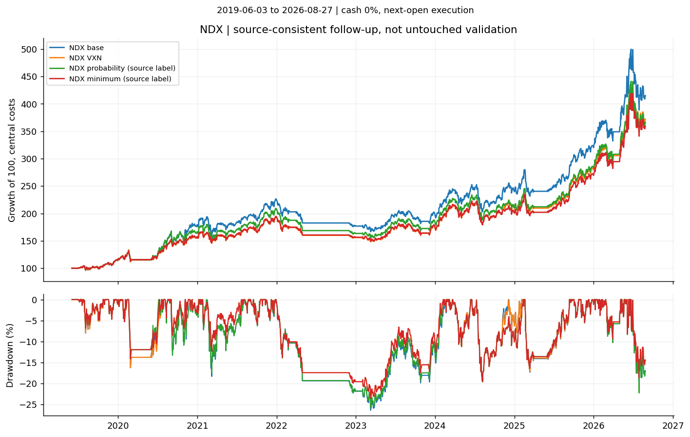
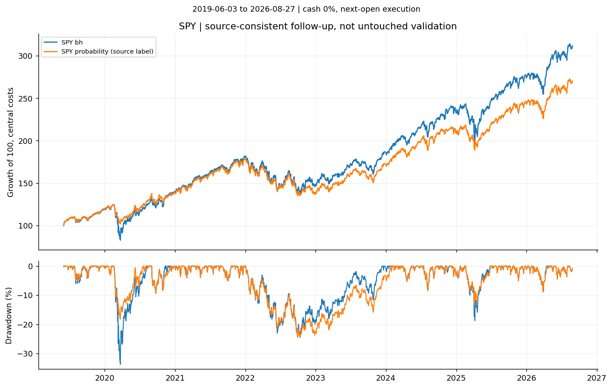

<!-- GENERATED FILE. EDIT THE CANONICAL KNOWLEDGE RECORD. -->

# Volatility-indicator probabilities as risk overlays for SPY and NDX momentum

!!! warning "Research-only"
    This page summarizes saved research evidence. It does not authorize LIVE, allocation, or deployment.

## TL;DR

> **Verdict:** Reject replacing or combining current NDX VXN with this probability multiplier. SPY has useful downside reduction but insufficient stable validation; research-only, no promotion.

> **Status:** `diagnostic`

> **Disposition:** `rejected`

> **Replication:** `directionally_replicated`

## Research question

Does a causal monthly SPY-loss probability improve SPY and existing NDX momentum downside after costs, beyond VXN and static exposure reduction?

## Exact setup

| Field | Value |
| --- | --- |
| Signal family | risk_overlay |
| Universe | ["SPY", "230 historical NDX constituents; vendor PIT membership"] |
| Decision | Monthly Close_T after all indicator publications; trailing24months and matured labels only |
| Fill | Next trading Open_T+1; quantities fixed from previous NAV and Close; cash-constrained partial-fill proxy |
| Primary cost layer | central_research |
| Last reviewed | 2026-08-28T11:33:59.875904+00:00 |

## Timing and overnight attribution

```text
information available: Monthly Close_T after all indicator publications; trailing24months and matured labels only
primary executable fill: Next trading Open_T+1; quantities fixed from previous NAV and Close; cash-constrained partial-fill proxy
```

If final `Close_T` data formed the signal, a hypothetical `Close_T` entry is diagnostic only unless a separate pre-close protocol was modeled. Comparing that diagnostic with `Open_(T+1)` and applying the compounded return identity shows whether the apparent edge occurred in the overnight gap. Missing attribution numbers mean **not tested**, not zero.

| Attribution field | Value |
| --- | --- |
| Status | tested |
| Diagnostic Path | Prior-close fill substituted at same next-day trade dates |
| Executable Path | Next-open simulation |
| Method | Counterfactual same-exit comparison; not causal MOC |
| Headline Result | Timing does not rescue economics; diagnostic not executable |
| Artifact | pakal-research/reports/indicator_volatility_risk_overlay/tables/timing_diagnostics.csv |

## Primary metrics

| Metric | Value |
| --- | ---: |
| Period | 2019-06-03:2026-08-27 |
| Universe | NDX minimum combination, source-consistent post-result followup |
| Cost Layer | central_research |
| Cagr | 19.35% |
| Annualized Volatility | 19.49% |
| Sharpe | 1.005 |
| Maximum Drawdown | -23.45% |
| Turnover | 763.54% |

## Four separate verdicts

| Question | Conclusion |
| --- | --- |
| Source Replication | Source total-return AUC approximately reproduced;85vs86 forecasts and missing ridge details prevent exact replication |
| Predictive Value | Weak rank discrimination,8tail events; slight Brier improvement, unstable calibration |
| Economic Value | No stable NDX value beyond existing VXN; SPY MDD reduction at lower CAGR, failed period consistency |
| Promotion | None; no LIVE, PAPER, PM_READY or allocation authority |

## Key findings

| Feature | Role | Direction | Status | Effect | Action |
| --- | --- | --- | --- | --- | --- |
| VIX/VIX9D ratio/VXTLT equal probability mean | risk_overlay | Higher predicted SPY monthly loss reduces a pre-existing sleeve | diagnostic | Source-label AUC0.6461,8events/85months; NDX minimum CAGR19.35%,Sharpe1.005 vsVXN19.94%,1.016 | Keep existing VXN unchanged; do not promote this exposure rule |

## Visual evidence






## Limitations

- Eight source OOS events
- source date/label count and adjustment ambiguities
- VIX9D/VXTLT prelaunch back-history excluded by source masks
- Norgate current vintage, not historical decision snapshots
- stock price-return accounting and adjusted-unit integer commissions
- cash-only partial fills are a simulation proxy
- source historical period already used to select features
- monthly probability is SPY risk, not calibrated NDX drawdown probability
- Five missing-held-open prior-close settlement proxies around8.2-10.2%NAV each
- NDX replacement static controls cannot attain matching exposure/volatility under scalar<=1
- Source-consistent economic followup after inspecting primary results; all history seen
- Only38post-publication sessions; overlapping stability window

## Next gates

- Resolve raw corporate-action/settlement and opening execution accounting before any promotion
- Freeze future calibration/loss-severity evaluation on new dates; no more threshold search on observed history

## Sources

- `{"content_id": "feca40d10b5c0fc47fe602862810d264196432ae24e5e0a89a8161230b3a4ba5", "location": "C:/Users/User/Downloads/vol_for_indicators.pdf", "title": "QuantSeeker attached article"}`
- `{"location": "https://www.nber.org/papers/w22208", "title": "Volatility Managed Portfolios"}`
- `{"location": "https://www.nber.org/papers/w20439", "title": "Momentum Crashes"}`
- `{"location": "https://www.sciencedirect.com/science/article/pii/S0304405X2030132X", "title": "On the performance of volatility-managed portfolios"}`

## Canonical artifacts

| Artifact | Pakal path |
| --- | --- |
| Concise Report | `pakal-research/reports/indicator_volatility_risk_overlay/REPORT.md` |
| Full Report | `pakal-research/reports/indicator_volatility_risk_overlay/REPORT_FULL.md` |
| Notebook | `pakal-research/indicator_volatility_risk_overlay.ipynb` |
| Frozen Specification | `pakal-research/reports/indicator_volatility_risk_overlay/research_spec_final.json` |
| Original Frozen Specification | `pakal-research/reports/indicator_volatility_risk_overlay/research_spec_frozen.json` |
| Manifest | `pakal-research/reports/indicator_volatility_risk_overlay/run_manifest.json` |
| Primary Source Code | `["pakal-research/indicator_volatility_risk_overlay_study.py", "pakal-research/indicator_volatility_forecasts.py", "pakal-research/indicator_volatility_portfolio.py"]` |
| Primary Tables | `["pakal-research/reports/indicator_volatility_risk_overlay/tables/portfolio_metrics.csv", "pakal-research/reports/indicator_volatility_risk_overlay/tables/source_consistent_economics.csv", "pakal-research/reports/indicator_volatility_risk_overlay/tables/forecast_metrics.csv"]` |
| Primary Charts | `["pakal-research/reports/indicator_volatility_risk_overlay/charts/spy_equity_drawdown.png", "pakal-research/reports/indicator_volatility_risk_overlay/charts/ndx_equity_drawdown.png"]` |
| Research State | `pakal-research/reports/indicator_volatility_risk_overlay/research_state.json` |
| Hypothesis Registry | `pakal-research/reports/indicator_volatility_risk_overlay/hypothesis_registry.json` |
| Experiment Ledger | `pakal-research/reports/indicator_volatility_risk_overlay/experiment_ledger.jsonl` |
| Decision Log | `pakal-research/reports/indicator_volatility_risk_overlay/decision_log.jsonl` |
| Source Rule Map | `pakal-research/reports/indicator_volatility_risk_overlay/SOURCE_RULE_MAP.md` |
