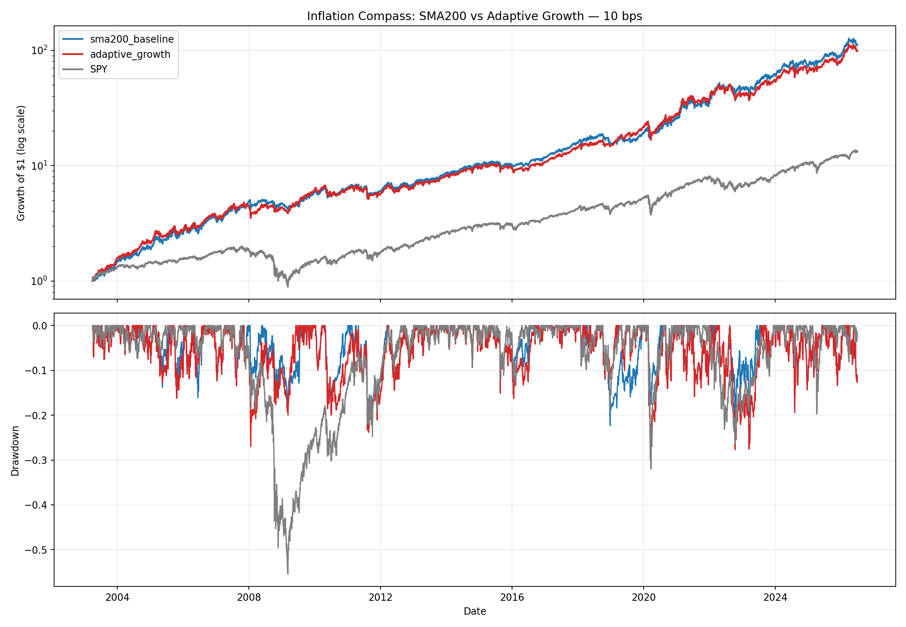

<!-- GENERATED FILE. EDIT THE CANONICAL KNOWLEDGE RECORD. -->

# Inflation Compass Adaptive Growth Replacement

!!! warning "Research-only"
    This page summarizes saved research evidence. It does not authorize LIVE, allocation, or deployment.

## TL;DR

> **Verdict:** Reject the direct replacement: it passed only validation Sharpe and failed confirmation CAGR and full-sample drawdown gates.

> **Status:** `diagnostic`

> **Disposition:** `rejected`

> **Replication:** `replicated`

## Research question

Test a direct frozen Adaptive Momentum replacement for the Inflation Compass SPY-above-SMA200 growth state.

## Exact setup

| Field | Value |
| --- | --- |
| Signal family | macro_regime_growth_classifier |
| Universe | ["SPY signal input and frozen XLE/XLK/XLU/XLP/IEF sleeves"] |
| Decision | After month-end Close_T |
| Fill | First Open_(T+1) |
| Primary cost layer | central_research |
| Last reviewed | 2026-08-20T14:32:00+03:00 |

## Timing and overnight attribution

```text
information available: After month-end Close_T
primary executable fill: First Open_(T+1)
```

If final `Close_T` data formed the signal, a hypothetical `Close_T` entry is diagnostic only unless a separate pre-close protocol was modeled. Comparing that diagnostic with `Open_(T+1)` and applying the compounded return identity shows whether the apparent edge occurred in the overnight gap. Missing attribution numbers mean **not tested**, not zero.


## Primary metrics

| Metric | Value |
| --- | ---: |
| Period | 2003-04-01 through 2026-07-01 terminal open mark |
| Universe | Inflation Compass with Adaptive Momentum growth state |
| Cost Layer | 10 bps round trip |
| Cagr | 21.82% |
| Annualized Volatility | 20.98% |
| Sharpe | 1.048 |
| Maximum Drawdown | -30.72% |
| Turnover | 327.58% |

## Four separate verdicts

| Question | Conclusion |
| --- | --- |
| Source Replication | Inherited literal Inflation Compass and Adaptive Momentum replications remained unchanged. |
| Predictive Value | The challenger was not robust across exposed subperiods and crisis windows. |
| Economic Value | Full CAGR and Sharpe fell while maximum drawdown worsened by about 7.5 percentage points. |
| Promotion | Rejected as a direct replacement; diagnostic only. |

## Key findings

| Feature | Role | Direction | Status | Effect | Action |
| --- | --- | --- | --- | --- | --- |
| Adaptive Momentum growth state | signal | Mixed: better 2013-2019, weaker crisis protection and 2020-2026 CAGR | rejected | -0.006162 | preserve_SMA200_baseline |

## Visual evidence




## Limitations

- All historical periods were exposed by the component studies.
- T5YIE is current-vintage rather than point-in-time.
- Norgate total-return opens are research marks rather than auction fills.
- The separate Adaptive Momentum study failed its breadth-validation gate.

## Next gates

- Do not replace SMA200; any AND/OR ensemble must be separately predeclared and frozen before testing.

## Sources

- `pakal-research/reports/inflation_compass_model_study/REPORT.md`
- `pakal-research/reports/vardi_adaptive_momentum_etf_study/REPORT.md`

## Canonical artifacts

| Artifact | Pakal path |
| --- | --- |
| Concise Report | `pakal-research/reports/inflation_compass_adaptive_growth_study/REPORT.md` |
| Full Report | `pakal-research/reports/inflation_compass_adaptive_growth_study/REPORT_FULL.md` |
| Notebook | `pakal-research/inflation_compass_adaptive_growth_study.ipynb` |
| Frozen Specification | `pakal-research/reports/inflation_compass_adaptive_growth_study/research_spec_frozen.json` |
| Manifest | `pakal-research/reports/inflation_compass_adaptive_growth_study/run_manifest.json` |
| Primary Source Code | `["pakal-research/inflation_compass_adaptive_growth_study.py"]` |
| Primary Tables | `["pakal-research/reports/inflation_compass_adaptive_growth_study/tables/period_metrics.csv", "pakal-research/reports/inflation_compass_adaptive_growth_study/tables/crisis_metrics.csv"]` |
| Primary Charts | `["pakal-research/reports/inflation_compass_adaptive_growth_study/charts/equity_and_drawdown.png"]` |
| Research State | `pakal-research/reports/inflation_compass_adaptive_growth_study/research_state.json` |
| Hypothesis Registry | `pakal-research/reports/inflation_compass_adaptive_growth_study/hypothesis_registry.json` |
| Experiment Ledger | `pakal-research/reports/inflation_compass_adaptive_growth_study/experiment_ledger.jsonl` |
| Decision Log | `pakal-research/reports/inflation_compass_adaptive_growth_study/decision_log.jsonl` |
| Source Rule Map | `pakal-research/reports/inflation_compass_adaptive_growth_study/SOURCE_RULE_MAP.md` |
