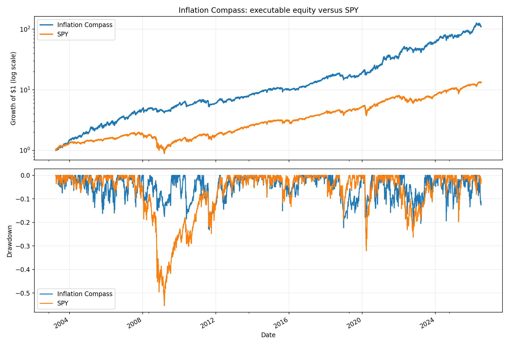
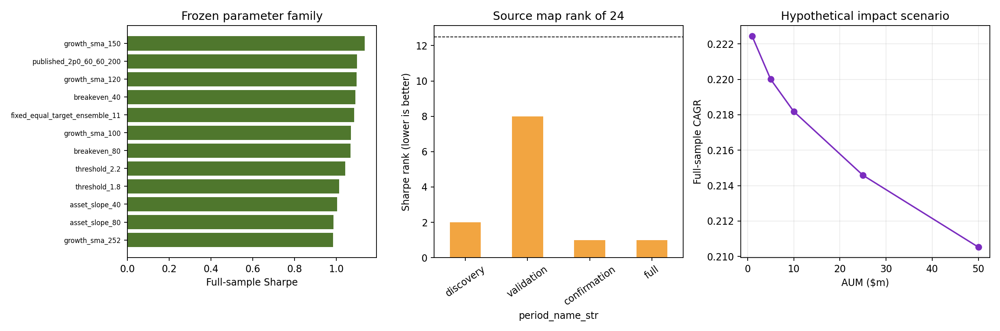

<!-- GENERATED FILE. EDIT THE CANONICAL KNOWLEDGE RECORD. -->

# The Inflation Compass Model - Literal Replication and Causal Validation

!!! warning "Research-only"
    This page summarizes saved research evidence. It does not authorize LIVE, allocation, or deployment.

## TL;DR

> **Verdict:** The article is directly replicated and the causal strategy remains economically strong, but it fails the frozen 2013-2019 Sharpe gate and lacks independent point-in-time and opening-auction evidence; retain only as a forward hypothesis.

> **Status:** `forward_hypothesis`

> **Disposition:** `promising_component`

> **Replication:** `replicated`

## Research question

Determine whether the literal monthly Inflation Compass reproduces and retains crisis-aware economic value after causal next-open timing, costs, frozen robustness tests, and chronological evaluation.

## Exact setup

| Field | Value |
| --- | --- |
| Signal family | macro_regime_rotation |
| Universe | ["Fixed signal ETFs: SPY, XLE, XLI, XLF, XLB, XLU, XLV, XLP", "Fixed traded ETFs: XLE, XLK, XLU, XLP, IEF"] |
| Decision | After final month-end Close_T and date-T T5YIE are available |
| Fill | Primary first Open_T+1; second-open sensitivity |
| Primary cost layer | central_research |
| Last reviewed | 2026-08-20T09:08:14+00:00 |

## Timing and overnight attribution

```text
information available: After final month-end Close_T and date-T T5YIE are available
primary executable fill: Primary first Open_T+1; second-open sensitivity
```

If final `Close_T` data formed the signal, a hypothetical `Close_T` entry is diagnostic only unless a separate pre-close protocol was modeled. Comparing that diagnostic with `Open_(T+1)` and applying the compounded return identity shows whether the apparent edge occurred in the overnight gap. Missing attribution numbers mean **not tested**, not zero.

| Attribution field | Value |
| --- | --- |
| Status | completed |
| Diagnostic Path | Month-end Close_T to next month-end Close |
| Executable Path | First Open_T+1 to the same next month-end Close; separate continuous Open-to-Open stateful path |
| Method | Exact compounded overnight and same-exit executable-return decomposition |
| Headline Result | Comparable same-exit delay reduced gross CAGR from 23.75% to 19.94%; continuous next-open at 10 bps produced 22.44%; second-open produced 21.19%. |
| Metrics | {"continuous_next_open_10bps_CAGR": 0.2243954748197039, "diagnostic_CAGR": 0.2375378062365172, "overnight_component_CAGR": 0.03177052104410949, "same_exit_next_open_CAGR": 0.19943125045303645, "second_open_10bps_CAGR": 0.21194222318042977} |
| Unavailable Reason | N/A |
| Artifact | pakal-research/reports/inflation_compass_model_study/tables/timing_summary.csv |

## Primary metrics

| Metric | Value |
| --- | ---: |
| Period | 2003-04-01 through 2026-07-01 terminal mark |
| Universe | Fixed US sector ETFs plus IEF defensive blend |
| Cost Layer | central_research_10bps_round_trip |
| Cagr | 22.44% |
| Annualized Volatility | 20.34% |
| Sharpe | 1.099 |
| Maximum Drawdown | -23.22% |
| Turnover | 302.32% |

## Four separate verdicts

| Question | Conclusion |
| --- | --- |
| Source Replication | replicated |
| Predictive Value | promising but threshold-specific inference is descriptive because locked subperiod BH tests did not pass |
| Economic Value | strong historical next-open economics and crisis defense survive 25 bps and exclusion of 2008/2022 |
| Promotion | no-go for research_candidate; validation Sharpe, source-exposed periods, PIT FRED, and auction capacity remain blocking gates |

## Key findings

| Feature | Role | Direction | Status | Effect | Action |
| --- | --- | --- | --- | --- | --- |
| literal_four_state_inflation_compass | signal | rotate to energy in growth inflation, technology in growth disinflation, utilities in contraction inflation, and staples/Treasuries in contraction disinflation | forward_hypothesis | 22.44% causal central-cost CAGR versus 11.79% SPY; -23.22% versus -55.42% maximum drawdown | Freeze unchanged for new point-in-time forward shadow only |
| fixed_equal_target_parameter_ensemble | portfolio_construction | average the 11 predeclared OFAT target weights | promising_component | 21.22% CAGR, 1.085 Sharpe, and -20.62% drawdown | Use as the frozen robustness comparator in any future shadow |
| T5YIE_binary_2pct_level | signal | above 2 percent favors energy relative to technology when direction confirmation is present | diagnostic | Full-sample next-month XLE-minus-XLK coefficient 2.23 percentage points | Do not claim a confirmed structural threshold; preserve only as part of the frozen source rule |
| four_regime_sleeve_map | portfolio_construction | source mapping ranks above the median of all complete permutations | diagnostic | Sharpe rank 2/24 discovery, 8/24 validation, 1/24 confirmation and full | Treat the mapping as unconfirmed ex ante until a new untouched shadow |
| XLP_IEF_equal_defensive_blend | risk_overlay | combine recession duration exposure and equity defense | promising_component | Best full-sample Sharpe among blend, XLP-only, and IEF-only; avoids XLP-only -33.77% drawdown | Retain as the literal blend; do not optimize weights |
| monthly_crisis_regime_rotation | risk_overlay | reduce crash exposure in slow bear markets but lag sharp rebounds | diagnostic | GFC bear -4.90% versus -55.04% SPY; COVID crash -17.30% versus -32.05%; 2022 +34.92% versus -18.79% | Set expectations for multi-year benchmark lag; do not market as crash insurance |

## Visual evidence






## Limitations

- Every local chronological period through 2026 H1 was exposed by the source and earns no independent-confirmation credit.
- FRED T5YIE is a current-vintage snapshot rather than point-in-time ALFRED data; historical publication timing and revisions are unverified.
- Same-close source execution is infeasible; Norgate total-return Open is not an opening-auction fill tape.
- The source map may have been chosen after seeing outcomes; it ranked only 8/24 in validation.
- The contraction-inflation XLU state occurred on only 5.76% of sessions.
- Opening-auction spreads, volumes, queue priority, partial fills, and taxes are unmeasured.
- Structural technology and energy tailwinds cannot be separated from the signal mechanism in one historical sample.

## Next gates

- Freeze the literal map and fixed ensemble unchanged for a genuinely new future shadow period.
- Use point-in-time T5YIE vintages with historical release timestamps before every Open_T+1 decision.
- Measure opening-auction volume, spread, basis, partial fills, and selected-order participation before any capacity claim.
- Require the future shadow to beat SPY on both CAGR and Sharpe without worse drawdown; do not retune after a failure.

## Sources

- `C:/Users/User/Downloads/the_inflation_compass_model_vardi.pdf`
- `Norgate Data US Equities TOTALRETURN and raw snapshots`
- `Official FRED current-vintage T5YIE and CPIAUCSL snapshots`

## Canonical artifacts

| Artifact | Pakal path |
| --- | --- |
| Concise Report | `pakal-research/reports/inflation_compass_model_study/REPORT.md` |
| Full Report | `pakal-research/reports/inflation_compass_model_study/REPORT_FULL.md` |
| Notebook | `pakal-research/inflation_compass_model_study.ipynb` |
| Frozen Specification | `pakal-research/reports/inflation_compass_model_study/research_spec_frozen.json` |
| Manifest | `pakal-research/reports/inflation_compass_model_study/run_manifest.json` |
| Primary Source Code | `["pakal-research/inflation_compass_model_study.py", "tests/test_inflation_compass_model_study.py"]` |
| Primary Tables | `["pakal-research/reports/inflation_compass_model_study/tables/source_metric_comparison.csv", "pakal-research/reports/inflation_compass_model_study/tables/baseline_period_metrics.csv", "pakal-research/reports/inflation_compass_model_study/tables/crisis_metrics.csv", "pakal-research/reports/inflation_compass_model_study/tables/parameter_variant_metrics.csv", "pakal-research/reports/inflation_compass_model_study/tables/map_permutation_metrics.csv", "pakal-research/reports/inflation_compass_model_study/tables/promotion_gate.csv"]` |
| Primary Charts | `["pakal-research/reports/inflation_compass_model_study/charts/equity_and_drawdown.png", "pakal-research/reports/inflation_compass_model_study/charts/crisis_windows.png", "pakal-research/reports/inflation_compass_model_study/charts/rolling_market_relationship.png", "pakal-research/reports/inflation_compass_model_study/charts/robustness_and_capacity.png"]` |
| Research State | `pakal-research/reports/inflation_compass_model_study/research_state.json` |
| Hypothesis Registry | `pakal-research/reports/inflation_compass_model_study/hypothesis_registry.json` |
| Experiment Ledger | `pakal-research/reports/inflation_compass_model_study/experiment_ledger.jsonl` |
| Decision Log | `pakal-research/reports/inflation_compass_model_study/decision_log.jsonl` |
| Source Rule Map | `pakal-research/reports/inflation_compass_model_study/SOURCE_RULE_MAP.md` |
