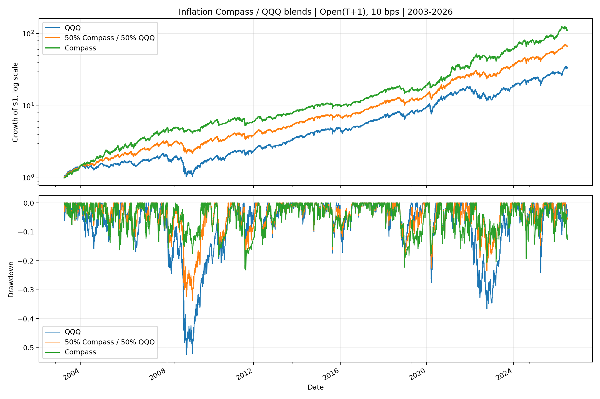

<!-- GENERATED FILE. EDIT THE CANONICAL KNOWLEDGE RECORD. -->

# Inflation Compass and QQQ Static Blend

!!! warning "Research-only"
    This page summarizes saved research evidence. It does not authorize LIVE, allocation, or deployment.

## TL;DR

> **Verdict:** תערובת 50/50 עם QQQ עוברת את שערי QQQ וגם משפרת את השארפ לעומת תערובת SPY

> **Status:** `forward_hypothesis`

> **Disposition:** `promising_component`

> **Replication:** `replicated`

## Research question

Test whether QQQ is a better fixed passive sleeve than SPY for the causal Inflation Compass.

## Exact setup

| Field | Value |
| --- | --- |
| Signal family | macro_regime_portfolio_construction |
| Universe | ["QQQ plus frozen Inflation Compass ETF sleeves"] |
| Decision | After month-end Close_T |
| Fill | First Open_(T+1) |
| Primary cost layer | central_research |
| Last reviewed | 2026-08-20T14:07:03.038957+03:00 |

## Timing and overnight attribution

```text
information available: After month-end Close_T
primary executable fill: First Open_(T+1)
```

If final `Close_T` data formed the signal, a hypothetical `Close_T` entry is diagnostic only unless a separate pre-close protocol was modeled. Comparing that diagnostic with `Open_(T+1)` and applying the compounded return identity shows whether the apparent edge occurred in the overnight gap. Missing attribution numbers mean **not tested**, not zero.

| Attribution field | Value |
| --- | --- |
| Status | not_applicable |
| Diagnostic Path | Inherited source-like Close_T path |
| Executable Path | Stateful Open_(T+1) to next rebalance open |
| Method | No new timing rule; exact frozen source targets reused. |
| Headline Result | The QQQ extension preserves the already-tested causal boundary. |
| Metrics | {} |
| Artifact | reports/inflation_compass_model_study/tables/timing_attribution.csv |

## Primary metrics

| Metric | Value |
| --- | ---: |
| Period | 2003-04-01 through 2026-07-01 terminal open mark |
| Universe | 50% QQQ plus 50% frozen Compass target |
| Cost Layer | 10 bps round trip |
| Cagr | 19.84% |
| Annualized Volatility | 18.38% |
| Sharpe | 1.079 |
| Maximum Drawdown | -33.71% |
| Turnover | 158.38% |

## Four separate verdicts

| Question | Conclusion |
| --- | --- |
| Source Replication | Inherited from the separately replicated source study; not rerun here. |
| Predictive Value | No new predictive signal was introduced. |
| Economic Value | תערובת 50/50 עם QQQ עוברת את שערי QQQ וגם משפרת את השארפ לעומת תערובת SPY |
| Promotion | Forward hypothesis only because every historical period was already exposed. |

## Key findings

| Feature | Role | Direction | Status | Effect | Action |
| --- | --- | --- | --- | --- | --- |
| Static QQQ passive sleeve | portfolio_construction | Replace only the passive SPY sleeve, not the signal input | forward_hypothesis | 0.0533244559076822 | freeze_for_forward_shadow |

## Visual evidence




## Limitations

- All historical periods were exposed before this extension.
- T5YIE is current-vintage rather than point-in-time.
- Norgate total-return opens are not auction fills.

## Next gates

- Freeze QQQ, SPY, and the two 50/50 blends in a no-change forward shadow.

## Sources

- `reports/inflation_compass_model_study/REPORT.md`
- `reports/inflation_compass_spy_blend_study/REPORT.md`

## Canonical artifacts

| Artifact | Pakal path |
| --- | --- |
| Concise Report | `pakal-research/reports/inflation_compass_qqq_blend_study/REPORT.md` |
| Decision Log | `pakal-research/reports/inflation_compass_qqq_blend_study/decision_log.jsonl` |
| Experiment Ledger | `pakal-research/reports/inflation_compass_qqq_blend_study/experiment_ledger.jsonl` |
| Frozen Specification | `pakal-research/reports/inflation_compass_qqq_blend_study/research_spec_frozen.json` |
| Full Report | `pakal-research/reports/inflation_compass_qqq_blend_study/REPORT_FULL.md` |
| Hypothesis Registry | `pakal-research/reports/inflation_compass_qqq_blend_study/hypothesis_registry.json` |
| Manifest | `pakal-research/reports/inflation_compass_qqq_blend_study/run_manifest.json` |
| Notebook | `pakal-research/inflation_compass_qqq_blend_study.ipynb` |
| Primary Charts | `["pakal-research/reports/inflation_compass_qqq_blend_study/charts/qqq_blend_equity_and_drawdown.png"]` |
| Primary Source Code | `["pakal-research/inflation_compass_qqq_blend_study.py"]` |
| Primary Tables | `["pakal-research/reports/inflation_compass_qqq_blend_study/tables/qqq_blend_metrics_10bps.csv"]` |
| Research State | `pakal-research/reports/inflation_compass_qqq_blend_study/research_state.json` |
| Source Rule Map | `pakal-research/reports/inflation_compass_qqq_blend_study/SOURCE_RULE_MAP.md` |
