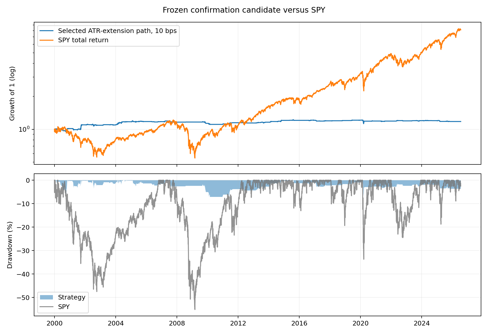
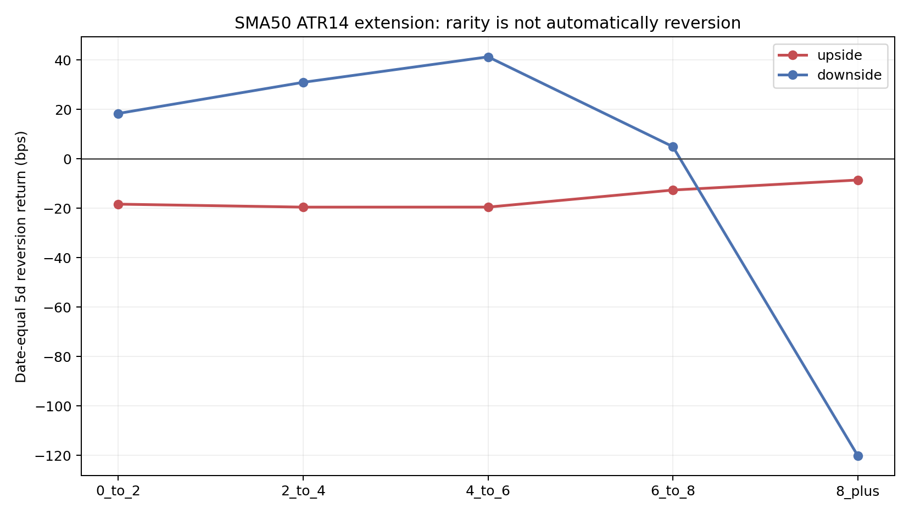

<!-- GENERATED FILE. EDIT THE CANONICAL KNOWLEDGE RECORD. -->

# Jeff Sun ATR-normalized multi-moving-average extension predictability

!!! warning "Research-only"
    This page summarizes saved research evidence. It does not authorize LIVE, allocation, or deployment.

## TL;DR

> **Verdict:** המדד מתאר מצב נדיר, אך לא הוכיח פרדיקטיביליות יציבה בשני חלונות האימות ובשני הצדדים.

> **Status:** `diagnostic`

> **Disposition:** `not_recorded`

> **Replication:** `not_recorded`

## Research question

Test whether rare ATR-normalized distance from multiple moving averages predicts causal next-open mean reversion.

## Exact setup

| Field | Value |
| --- | --- |
| Signal family | cross_sectional_mean_reversion |
| Universe | ["PIT Russell 3000 proxy", "Russell Top 200", "Russell Mid Cap", "Russell 2000"] |
| Decision | Close_T |
| Fill | Open_T+1 |
| Primary cost layer | central_research |
| Last reviewed | 2026-08-09T14:06:12.796155+03:00 |

## Timing and overnight attribution

```text
information available: Close_T
primary executable fill: Open_T+1
```

If final `Close_T` data formed the signal, a hypothetical `Close_T` entry is diagnostic only unless a separate pre-close protocol was modeled. Comparing that diagnostic with `Open_(T+1)` and applying the compounded return identity shows whether the apparent edge occurred in the overnight gap. Missing attribution numbers mean **not tested**, not zero.


## Primary metrics

| Metric | Value |
| --- | ---: |
| Period | 2021-01-01 through 2026-07-24 confirmation |
| Universe | PIT Russell 3000 proxy |
| Cost Layer | central_research |
| Cagr | -0.18% |
| Annualized Volatility | 1.13% |
| Sharpe | -0.155 |
| Maximum Drawdown | -2.43% |
| Turnover | 54.20% |

## Key findings

| Feature | Role | Direction | Status | Effect | Action |
| --- | --- | --- | --- | --- | --- |
| extension_50_magnitude | diagnostic_and_rank | higher_expected_reversion | diagnostic | {"confirmation_mean_ic_across_sides": 0.0023310796549171} | retain_in_frozen_rank |
| stock_tail_percentile_756 | diagnostic_and_rank | higher_expected_reversion | diagnostic | {"confirmation_mean_ic_across_sides": 0.0066885513066382} | retain_in_frozen_rank |
| stretched_anchor_count | diagnostic_and_rank | no_stable_positive_direction | diagnostic | {"confirmation_mean_ic_across_sides": -0.0020159327633883} | diagnostic_only |
| momentum_20 | diagnostic_and_rank | higher_expected_reversion | diagnostic | {"confirmation_mean_ic_across_sides": 0.0064703044608418496} | retain_in_frozen_rank |
| momentum_63 | diagnostic_and_rank | higher_expected_reversion | diagnostic | {"confirmation_mean_ic_across_sides": 0.0016827037845548003} | retain_in_frozen_rank |

## Visual evidence






## Limitations

- Article omitted ATR specification, executable timing, and forward-return evidence.
- Short borrow, recalls, dividends-in-lieu, SSR, partial fills, and opening-auction liquidity are unresolved.
- Russell 3000 is represented by a transparent union of three PIT Russell sleeves.
- Capacity impact is a hypothetical square-root stress, not an empirical calibration.

## Next gates

- Freeze a post-2026-07-24 shadow sample without parameter changes.
- Measure opening-auction spread, volume, partial fills, and borrow availability for selected orders.

## Sources

- `C:/Users/User/Downloads/jeff_sun.pdf`
- `current Codex task prompt research brief`

## Canonical artifacts

| Artifact | Pakal path |
| --- | --- |
| Concise Report | `pakal-research/reports/jeff_sun_atr_extension_feature_study/REPORT.md` |
| Full Report | `pakal-research/reports/jeff_sun_atr_extension_feature_study/REPORT_FULL.md` |
| Notebook | `pakal-research/jeff_sun_atr_extension_feature_study.ipynb` |
| Frozen Specification | `pakal-research/reports/jeff_sun_atr_extension_feature_study/research_spec_frozen.json` |
| Manifest | `pakal-research/reports/jeff_sun_atr_extension_feature_study/run_manifest.json` |
| Primary Source Code | `["pakal-research/jeff_sun_atr_extension_feature_study.py", "tests/test_jeff_sun_atr_extension_feature_study.py"]` |
| Primary Tables | `["pakal-research/reports/jeff_sun_atr_extension_feature_study/tables/article_tail_returns.csv", "pakal-research/reports/jeff_sun_atr_extension_feature_study/tables/stateful_grid_summary.csv", "pakal-research/reports/jeff_sun_atr_extension_feature_study/tables/capacity_summary.csv"]` |
| Primary Charts | `["pakal-research/reports/jeff_sun_atr_extension_feature_study/charts/baseline_extension_bands_5d.png", "pakal-research/reports/jeff_sun_atr_extension_feature_study/charts/selected_equity_drawdown.png", "pakal-research/reports/jeff_sun_atr_extension_feature_study/charts/rolling_spy_correlation.png"]` |
