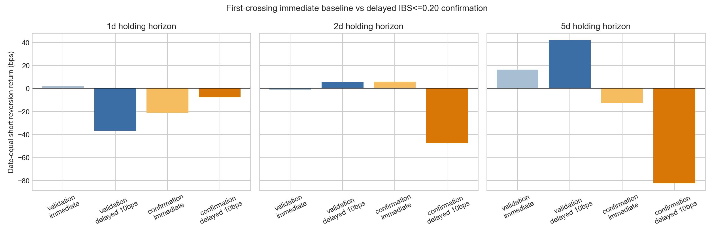
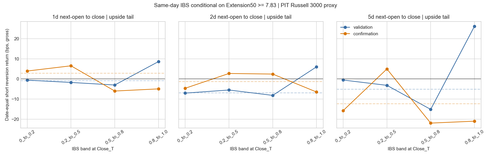

<!-- GENERATED FILE. EDIT THE CANONICAL KNOWLEDGE RECORD. -->

# Jeff Sun ATR Extension plus IBS follow-up

!!! warning "Research-only"
    This page summarizes saved research evidence. It does not authorize LIVE, allocation, or deployment.

## TL;DR

> **Verdict:** IBS לא עבר את שערי התוספת מול הבסיס או את שער כלל ההמתנה. יש להשאיר אותו כמשתנה אבחוני ולא להוסיף אותו ל־ensemble.

> **Status:** `diagnostic`

> **Disposition:** `not_recorded`

> **Replication:** `not_recorded`

## Research question

Test whether same-day or delayed IBS adds causal upside-short mean-reversion information after a fixed 7.83-ATR extension above SMA50.

## Exact setup

| Field | Value |
| --- | --- |
| Signal family | mean_reversion |
| Universe | ["Point-in-time Russell 3000 proxy"] |
| Decision | Close_T or delayed confirmation Close_S |
| Fill | Open_T+1 or Open_S+1 |
| Primary cost layer | central_research |
| Last reviewed | 2026-08-09T20:36:08.049493+03:00 |

## Timing and overnight attribution

```text
information available: Close_T or delayed confirmation Close_S
primary executable fill: Open_T+1 or Open_S+1
```

If final `Close_T` data formed the signal, a hypothetical `Close_T` entry is diagnostic only unless a separate pre-close protocol was modeled. Comparing that diagnostic with `Open_(T+1)` and applying the compounded return identity shows whether the apparent edge occurred in the overnight gap. Missing attribution numbers mean **not tested**, not zero.


## Primary metrics

| Metric | Value |
| --- | ---: |
| Period | confirmation |
| Universe | Point-in-time Russell 3000 proxy |
| Cost Layer | central_research_10bps |
| Cagr | N/A |
| Annualized Volatility | N/A |
| Sharpe | N/A |
| Maximum Drawdown | N/A |
| Turnover | N/A |

## Key findings

| Feature | Role | Direction | Status | Effect | Action |
| --- | --- | --- | --- | --- | --- |
| same_day_ibs_band_1d | entry_filter | 0_to_0.2 | diagnostic | {"confirmation_incremental_bps": 1.6949731045600862} | Do not ensemble unless the frozen gate passed; otherwise retain as diagnostic. |
| same_day_ibs_band_2d | entry_filter | 0.5_to_0.8 | diagnostic | {"confirmation_incremental_bps": 1.5946226972133815} | Do not ensemble unless the frozen gate passed; otherwise retain as diagnostic. |
| same_day_ibs_band_5d | entry_filter | 0.2_to_0.5 | diagnostic | {"confirmation_incremental_bps": 8.347845207769353} | Do not ensemble unless the frozen gate passed; otherwise retain as diagnostic. |
| delayed_ibs_at_or_below_0.20_within_3_sessions | entry_timing_signal | upside_short_after_low_ibs_confirmation | diagnostic | {"confirmation_10bps_date_equal_reversion_bps": {"1": -7.840288201073485, "2": -47.65849435254037, "5": -82.5423364050348}} | Reject as an ensemble component and do not search nearby IBS or wait thresholds on the same sample. |

## Visual evidence






## Limitations

- Post-hoc follow-up; maximum status is forward_hypothesis.
- Overlapping endpoint evidence is not portfolio CAGR, Sharpe, or drawdown.
- Short borrow and opening-execution frictions remain unresolved.
- No liquidity, regime, momentum, or multi-MA interaction expansion was allowed.

## Next gates

- Do not search nearby IBS thresholds or wait windows on the same sample.
- Revisit IBS only with genuinely new data or a separately motivated mechanism.

## Sources

- `C:/Users/User/Downloads/jeff_sun.pdf`
- `pakal-research/reports/jeff_sun_atr_extension_feature_study`
- `user IBS follow-up request dated 2026-08-09`

## Canonical artifacts

| Artifact | Pakal path |
| --- | --- |
| Concise Report | `pakal-research/reports/jeff_sun_atr_extension_ibs_followup/REPORT.md` |
| Full Report | `pakal-research/reports/jeff_sun_atr_extension_ibs_followup/REPORT_FULL.md` |
| Notebook | `pakal-research/jeff_sun_atr_extension_ibs_followup.ipynb` |
| Frozen Specification | `pakal-research/reports/jeff_sun_atr_extension_ibs_followup/research_spec_frozen.json` |
| Manifest | `pakal-research/reports/jeff_sun_atr_extension_ibs_followup/run_manifest.json` |
| Primary Source Code | `["pakal-research/jeff_sun_atr_extension_ibs_followup.py"]` |
| Primary Tables | `["pakal-research/reports/jeff_sun_atr_extension_ibs_followup/tables/same_day_ibs_bands.csv", "pakal-research/reports/jeff_sun_atr_extension_ibs_followup/tables/delayed_episode_summary.csv", "pakal-research/reports/jeff_sun_atr_extension_ibs_followup/tables/delayed_costs.csv"]` |
| Primary Charts | `["pakal-research/reports/jeff_sun_atr_extension_ibs_followup/charts/same_day_ibs_bands.png", "pakal-research/reports/jeff_sun_atr_extension_ibs_followup/charts/delayed_confirmation_comparison.png"]` |
