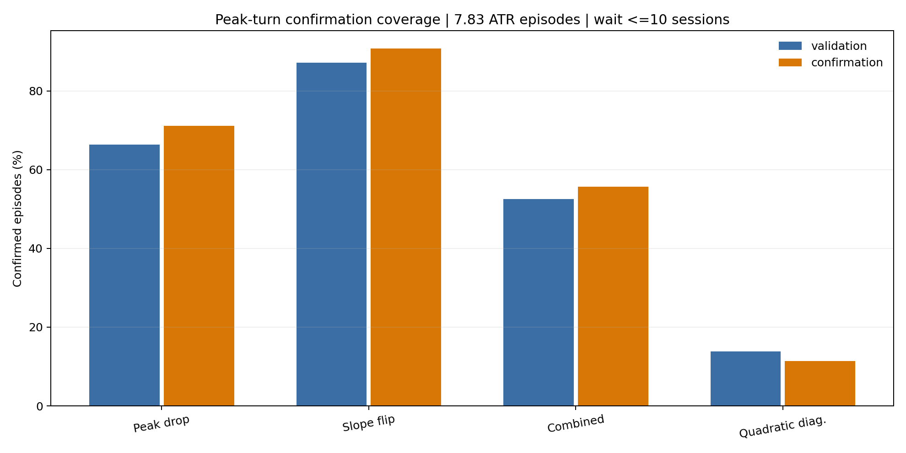
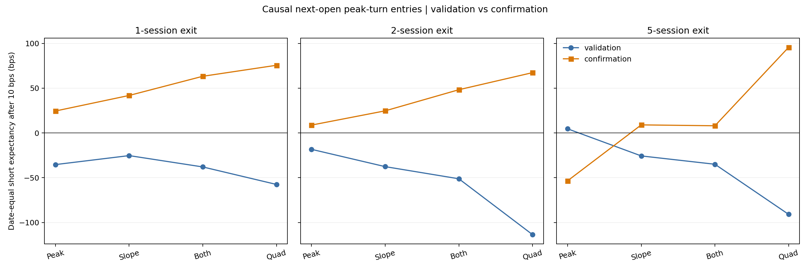

<!-- GENERATED FILE. EDIT THE CANONICAL KNOWLEDGE RECORD. -->

# Jeff Sun ATR Extension Causal Peak-Turn Confirmation

!!! warning "Research-only"
    This page summarizes saved research evidence. It does not authorize LIVE, allocation, or deployment.

## TL;DR

> **Verdict:** No frozen causal peak-turn confirmation passed the combined validation, confirmation, cost, sample, and adverse-excursion gates. Keep the features diagnostic and out of an ensemble.

> **Status:** `diagnostic`

> **Disposition:** `not_recorded`

> **Replication:** `not_recorded`

## Research question

Test whether a causal start-of-decline confirmation leaves tradable short expectancy after a 7.83-ATR upside extension.

## Exact setup

| Field | Value |
| --- | --- |
| Signal family | mean_reversion |
| Universe | ["Point-in-time Russell 3000 proxy"] |
| Decision | Close_T0 trigger and delayed Close_S confirmation |
| Fill | Open_S+1 |
| Primary cost layer | central_research |
| Last reviewed | 2026-08-09T21:06:04.219029+03:00 |

## Timing and overnight attribution

```text
information available: Close_T0 trigger and delayed Close_S confirmation
primary executable fill: Open_S+1
```

If final `Close_T` data formed the signal, a hypothetical `Close_T` entry is diagnostic only unless a separate pre-close protocol was modeled. Comparing that diagnostic with `Open_(T+1)` and applying the compounded return identity shows whether the apparent edge occurred in the overnight gap. Missing attribution numbers mean **not tested**, not zero.


## Primary metrics

| Metric | Value |
| --- | ---: |
| Period | confirmation |
| Universe | Point-in-time Russell 3000 proxy |
| Cost Layer | central_research_10bps |
| Cagr | N/A |
| Annualized Volatility | N/A |
| Sharpe | N/A |
| Maximum Drawdown | N/A |
| Turnover | N/A |

## Key findings

| Feature | Role | Direction | Status | Effect | Action |
| --- | --- | --- | --- | --- | --- |
| peak_drop_0.50_atr | entry_timing_signal | upside_short_after_causal_decline_confirmation | diagnostic | {"confirmation_10bps_date_equal_reversion_bps": {"1": 24.5105961403583, "2": 8.787967655248641, "5": -53.42979409363624}, "confirmation_coverage": 0.711340206185567} | do not add to an ensemble |
| slope3_flip | entry_timing_signal | upside_short_after_causal_decline_confirmation | diagnostic | {"confirmation_10bps_date_equal_reversion_bps": {"1": 41.86233621391198, "2": 24.69790237168181, "5": 9.007802234523309}, "confirmation_coverage": 0.9072164948453608} | do not add to an ensemble |
| peak_drop_0.50_atr_and_slope3_flip | entry_timing_signal | upside_short_after_causal_decline_confirmation | diagnostic | {"confirmation_10bps_date_equal_reversion_bps": {"1": 63.28203918664403, "2": 48.2782526367445, "5": 8.015404793164775}, "confirmation_coverage": 0.5567010309278351} | do not add to an ensemble |
| quadratic_7_recent_vertex_r2_0.80_diagnostic | diagnostic | upside_short_after_causal_decline_confirmation | diagnostic | {"confirmation_10bps_date_equal_reversion_bps": {"1": 75.5765193841942, "2": 67.34167761084726, "5": 95.59718906556124}, "confirmation_coverage": 0.1134020618556701} | do not add to an ensemble |

## Visual evidence






## Limitations

- Post-hoc feature proposal; maximum status is forward_hypothesis.
- Daily bars cannot identify or fill the exact intraday apex.
- Short borrow, fees, recalls, dividends-in-lieu, SSR, and impact are unresolved.
- Overlapping endpoint evidence is not a portfolio backtest.

## Next gates

- If and only if a primary rule passes, freeze it for future shadow evidence before any stateful portfolio work.
- Do not optimize the peak-drop threshold, slope window, or quadratic window on this sample.

## Sources

- `C:/Users/User/Downloads/jeff_sun.pdf`
- `pakal-research/reports/jeff_sun_atr_extension_feature_study`
- `pakal-research/reports/jeff_sun_atr_extension_ibs_followup`

## Canonical artifacts

| Artifact | Pakal path |
| --- | --- |
| Concise Report | `pakal-research/reports/jeff_sun_atr_extension_peak_confirmation_followup/REPORT.md` |
| Full Report | `pakal-research/reports/jeff_sun_atr_extension_peak_confirmation_followup/REPORT_FULL.md` |
| Notebook | `pakal-research/jeff_sun_atr_extension_peak_confirmation_followup.ipynb` |
| Frozen Specification | `pakal-research/reports/jeff_sun_atr_extension_peak_confirmation_followup/research_spec_frozen.json` |
| Manifest | `pakal-research/reports/jeff_sun_atr_extension_peak_confirmation_followup/run_manifest.json` |
| Primary Source Code | `["pakal-research/jeff_sun_atr_extension_peak_confirmation_followup.py"]` |
| Primary Tables | `["pakal-research/reports/jeff_sun_atr_extension_peak_confirmation_followup/tables/cost_summary.csv", "pakal-research/reports/jeff_sun_atr_extension_peak_confirmation_followup/tables/coverage.csv"]` |
| Primary Charts | `["pakal-research/reports/jeff_sun_atr_extension_peak_confirmation_followup/charts/central_cost_returns.png", "pakal-research/reports/jeff_sun_atr_extension_peak_confirmation_followup/charts/confirmation_coverage.png"]` |
