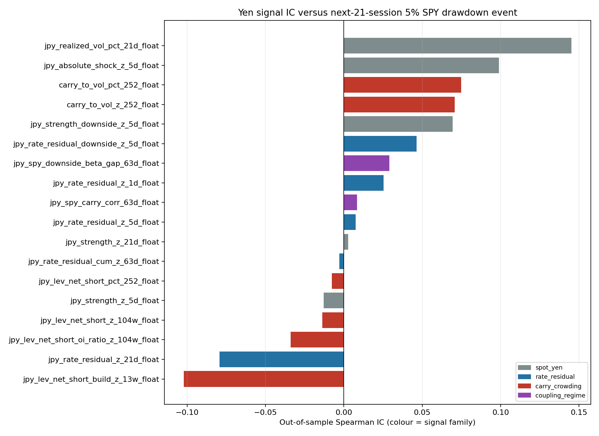
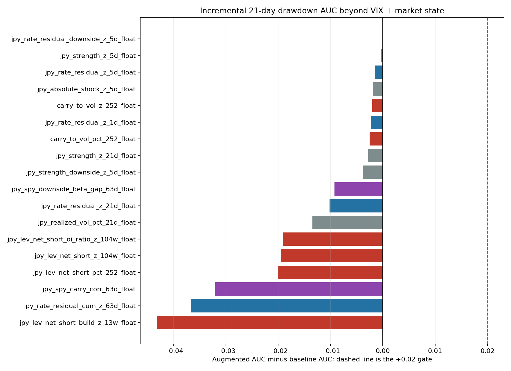

<!-- GENERATED FILE. EDIT THE CANONICAL KNOWLEDGE RECORD. -->

# Yen-Dollar Carry as a Forward Equity-Risk Signal

!!! warning "Research-only"
    This page summarizes saved research evidence. It does not authorize LIVE, allocation, or deployment.

## TL;DR

> **Verdict:** REJECT_NO_ROBUST_PREDICTIVE_EDGE. Yen strength is coincident with equities rather than leading them, no signal survives Holm correction, and the best incremental AUC beyond VIX plus market state is exactly zero while every other signal degrades the model. Unlike HY OAS the failure is not VIX redundancy: these signals are statistically distinct from VIX and simply do not predict equity drawdowns.

> **Status:** `diagnostic`

> **Disposition:** `not_recorded`

> **Replication:** `not_recorded`

## Research question

Test whether the yen-dollar relationship yields a forward-looking equity-risk signal comparable to VIX, across four predeclared families: spot yen moves, the yen move orthogonal to the US-Japan 2y rate spread, carry crowding from CFTC leveraged-fund positioning and carry-to-vol, and the USDJPY/SPY coupling regime.

## Exact setup

| Field | Value |
| --- | --- |
| Signal family | market_risk_regime |
| Universe | ["SPY as the equity risk target", "USDJPY spot", "CME JPY futures (CFTC contract 097741)"] |
| Decision | signal formed after Close_T |
| Fill | no overlay was produced because no signal passed the gate; any overlay would trade Open_T+1 |
| Primary cost layer | not applicable, diagnostic study |
| Last reviewed | 2026-08-03T14:30:00+03:00 |

## Timing and overnight attribution

```text
information available: signal formed after Close_T
primary executable fill: no overlay was produced because no signal passed the gate; any overlay would trade Open_T+1
```

If final `Close_T` data formed the signal, a hypothetical `Close_T` entry is diagnostic only unless a separate pre-close protocol was modeled. Comparing that diagnostic with `Open_(T+1)` and applying the compounded return identity shows whether the apparent edge occurred in the overnight gap. Missing attribution numbers mean **not tested**, not zero.


## Primary metrics

| Metric | Value |
| --- | ---: |
| Period | 2006-06-13 through 2026-07-31; out-of-sample from 2019-01-01 |
| Universe | N/A |
| Cost Layer | N/A |
| Cagr | N/A |
| Annualized Volatility | N/A |
| Sharpe | N/A |
| Maximum Drawdown | N/A |
| Turnover | N/A |

## Key findings

| Feature | Role | Direction | Status | Effect | Action |
| --- | --- | --- | --- | --- | --- |
| spot_yen family (5 signals) | candidate market risk regime | yen strength declared risk-positive in advance | rejected | {"best_incremental_auc_vs_vix_market": -0.0003, "best_raw_oos_ic_jpy_realized_vol_pct_21d": 0.1452} | Do not build a yen-VIX from spot. The relationship is real and contemporaneous, so it cannot warn. |
| rate_residual family (5 signals) | candidate market risk regime | yen strength orthogonal to the US-Japan 2y spread, declared risk-positive | rejected | {"best_incremental_auc_vs_vix_market": 0.0, "best_raw_oos_ic_jpy_rate_residual_downside_z_5d": 0.0463} | This was the strongest prior hypothesis and it produced the study's best result, which was exactly zero incremental information. Do not retry without option-implied data. |
| carry_crowding family (6 signals: CFTC leveraged net short, OI ratio, 13w build, carry-to-vol) | candidate fragility or sizing input | more crowded short yen declared risk-positive | rejected | {"best_raw_oos_ic_carry_to_vol_pct_252": 0.0747, "spearman_to_vix_range": "-0.203 to -0.346", "worst_incremental_auc_jpy_lev_net_short_build_z_13w": -0.0432} | Least VIX-correlated family and the worst predictor in the study. Crowding may describe how bad a shock could get; it does not forecast one. Do not put it in a sizing rule on this evidence. |
| coupling_regime family (2 signals) | candidate market risk regime | tighter USDJPY/SPY coupling declared risk-positive | rejected | {"jpy_spy_carry_corr_63d_incremental_auc": -0.032, "jpy_spy_carry_corr_63d_raw_ic": 0.0085} | Archive. |

## Visual evidence






## Limitations

- No option-implied family. USDJPY implied volatility and the 25-delta risk reversal are the true forward-looking analogues of VIX, and the Cboe/CME JYVIX index was discontinued 2025-11-15 with only one usable free observation remaining. This study cannot rule out that the option-implied family carries the information the tested families lack.
- Norgate USDJPY is a spot rate, so carry accrual is not embedded; the rate differential enters separately.
- MOF publishes the JGB curve with a lag, ending 2026-06-30 at run time, so the most recent weeks of the rate-differential families thin out.
- Ten declared stress episodes is a very small event sample; the lift-over-chance column exists precisely because raw hit counts at that sample size are uninformative.
- CFTC Traders in Financial Futures starts 2006-06-13, which bounds the sample and excludes the 1998 LTCM yen unwind.
- The study tests predictive risk information, not the profitability of the carry trade and not a yen trading strategy.

## Next gates

- Only worth revisiting with a paid USDJPY implied-volatility and 25-delta risk-reversal history; without it, consider the yen-as-equity-risk question closed
- Do not add filters, thresholds, or new transforms to rescue the spot, rates, positioning or coupling families
- Reindex onto the equity trading calendar in any future FX/equity study in this repo

## Sources

- `{"location": "pakal-research/hy_oas_equity_risk_signal_study.py", "read_complete": true, "role": "Study template: same targets, same VIX baselines, same Holm and incremental-AUC gate", "source_id": "prior-hy-oas-equity-risk-framework"}`
- `{"location": "pakal-research/oil_equity_risk_signal_study.py", "read_complete": true, "role": "Shared primitives: lagged rolling z-score and percentile rank, stationary bootstrap, Holm adjustment, walk-forward ridge and logistic, forward target construction", "source_id": "oil-equity-risk-core"}`
- `{"location": "https://publicreporting.cftc.gov/resource/gpe5-46if.json", "read_complete": true, "role": "Weekly leveraged-money long, short and open interest for JPY futures contract 097741", "source_id": "cftc-traders-in-financial-futures"}`
- `{"location": "https://www.mof.go.jp/jgbs/reference/interest_rate/data/jgbcm_all.csv", "read_complete": true, "role": "Daily JGB 2y yield, Japanese-era dated, for the US-Japan rate differential", "source_id": "japan-mof-jgb-curve"}`
- `{"location": "https://fred.stlouisfed.org/graph/fredgraph.csv?id=DGS2", "read_complete": true, "role": "US 2y constant-maturity yield for the rate differential", "source_id": "fred-dgs2"}`
- `{"location": "https://finance.yahoo.com/quote/%5EJYVIX/history/", "read_complete": true, "role": "Confirms the Cboe/CME yen volatility index is discontinued and retains one usable observation, which is why no option-implied family could be built", "source_id": "jyvix-discontinuation"}`
- `{"location": "current Claude Code session in C:\\\\Users\\\\User\\\\Documents\\\\workspace\\\\pakal", "read_complete": true, "role": "Request to test whether the yen-dollar relationship can yield a VIX-like risk signal, and delegation of the OOS cut and sample-start decisions", "source_id": "user-request"}`

## Canonical artifacts

| Artifact | Pakal path |
| --- | --- |
| Concise Report | `JPY_CARRY_RESEARCH_FINDINGS.md` |
| Full Report | `pakal-research/reports/jpy_carry_equity_risk_signal_study/summary.md` |
| Notebook | `pakal-research/jpy_carry_equity_risk_signal_study.ipynb` |
| Frozen Specification | `pakal-research/reports/jpy_carry_equity_risk_signal_study/signal_definitions.csv` |
| Manifest | `pakal-research/reports/jpy_carry_equity_risk_signal_study/config_snapshot.json` |
| Primary Source Code | `["pakal-research/jpy_carry_equity_risk_signal_study.py", "tests/test_jpy_carry_equity_risk_signal_study.py"]` |
| Primary Tables | `["pakal-research/reports/jpy_carry_equity_risk_signal_study/vix_incremental_metrics.csv", "pakal-research/reports/jpy_carry_equity_risk_signal_study/association_metrics.csv", "pakal-research/reports/jpy_carry_equity_risk_signal_study/episode_alert_lift.csv", "pakal-research/reports/jpy_carry_equity_risk_signal_study/lead_lag_metrics.csv", "pakal-research/reports/jpy_carry_equity_risk_signal_study/feature_coverage.csv"]` |
| Primary Charts | `["pakal-research/reports/jpy_carry_equity_risk_signal_study/fig_lead_lag.png", "pakal-research/reports/jpy_carry_equity_risk_signal_study/fig_incremental_event_auc.png", "pakal-research/reports/jpy_carry_equity_risk_signal_study/fig_primary_event_ic.png", "pakal-research/reports/jpy_carry_equity_risk_signal_study/fig_positioning_overview.png"]` |
