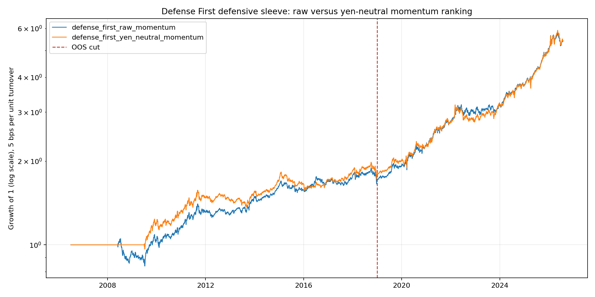

<!-- GENERATED FILE. EDIT THE CANONICAL KNOWLEDGE RECORD. -->

# Yen-Neutral Momentum Ranking for the Defense First Defensive Sleeve

!!! warning "Research-only"
    This page summarizes saved research evidence. It does not authorize LIVE, allocation, or deployment.

## TL;DR

> **Verdict:** Part B rejected as a textbook in-sample-only improvement: in-sample Sharpe rose from 0.535 to 0.622 and max drawdown improved from -20.3% to -14.3%, and even the full sample favoured the variant, but the frozen out-of-sample block reversed it to Sharpe 1.377 versus 1.458 and drawdown -13.4% versus -10.5%. Part A produced the only surviving predictive result across three yen studies: yen realized-volatility percentile predicts DBC forward 21-session realized volatility with IC 0.358 and Holm-corrected p 0.0145, and the yen composite gives IC 0.255 at Holm p 0.0097. Every forward-return and drawdown-event target in the same family had Holm p of 1.0, so the yen remains a volatility relationship and never a directional one.

> **Status:** `diagnostic`

> **Disposition:** `not_recorded`

> **Replication:** `not_recorded`

## Research question

Two separate questions. Part A: does the yen risk state predict forward returns, volatility or drawdown for the defensive assets TLT, GLD, DBC and UUP, which no prior study tested because every earlier predictive test used SPY targets. Part B: does ranking the Defense First rotation on yen-factor-residual momentum beat ranking on raw momentum, given that three of the four defensive assets load on one shared real-rate axis.

## Exact setup

| Field | Value |
| --- | --- |
| Signal family | defensive_tactical_allocation |
| Universe | ["Defense First defensive sleeve: TLT, GLD, DBC, UUP", "SPY as the aggressive sleeve, BIL as the cash hurdle", "USDJPY spot as the factor source"] |
| Decision | month-end signal formed after Close_T |
| Fill | weights apply from T+1 |
| Primary cost layer | central_research |
| Last reviewed | 2026-08-03T20:05:00+03:00 |

## Timing and overnight attribution

```text
information available: month-end signal formed after Close_T
primary executable fill: weights apply from T+1
```

If final `Close_T` data formed the signal, a hypothetical `Close_T` entry is diagnostic only unless a separate pre-close protocol was modeled. Comparing that diagnostic with `Open_(T+1)` and applying the compounded return identity shows whether the apparent edge occurred in the overnight gap. Missing attribution numbers mean **not tested**, not zero.


## Primary metrics

| Metric | Value |
| --- | ---: |
| Period | 2006-07-03 through 2026-07-31; out-of-sample from 2019-01-02 |
| Universe | N/A |
| Cost Layer | N/A |
| Cagr | N/A |
| Annualized Volatility | N/A |
| Sharpe | N/A |
| Maximum Drawdown | N/A |
| Turnover | N/A |

## Key findings

| Feature | Role | Direction | Status | Effect | Action |
| --- | --- | --- | --- | --- | --- |
| yen-residual momentum ranking | cross-sectional rank | rank on momentum with the shared yen factor removed | rejected | {"in_sample_max_drawdown_delta": 0.0602, "in_sample_sharpe_delta": 0.0873, "oos_max_drawdown_delta": -0.0287, "oos_sharpe_delta": -0.0804, "oos_turnover_reduction": 0.635} | Do not adopt. Retain as evidence that the frozen out-of-sample cut prevented an adoption the full-sample numbers would have justified. |
| yen realized-volatility percentile as a DBC volatility precursor | market regime / volatility precursor | higher yen volatility implies higher forward commodity volatility | diagnostic | {"dbc_forward_vol_composite_holm_p": 0.0097, "dbc_forward_vol_holm_p": 0.0145, "dbc_forward_vol_ic_composite": 0.2548, "dbc_forward_vol_ic_realized_vol_pct": 0.3579, "tlt_forward_vol_holm_p": 0.0546, "tlt_forward_vol_ic": 0.2906} | Logged as REG-15. Diagnostic only. Any sizing or allocation use requires a dedicated study with its own frozen specification. |

## Visual evidence




## Limitations

- The aggressive sleeve is SPY only. The original Defense First study also supports SSO, which would change the level of every number but not the raw-versus-neutral comparison.
- The absorption-ratio state machine overlay is not included, so this tests the ranking rule and not the full integrated strategy.
- UUP history begins 2007-02-20 and BIL 2007-05-30, so the first usable 12-month signal is well into 2008.
- Part A tested four yen signals against four assets and three targets; the surviving results are concentrated on one asset and one target type and have not been checked for sub-regime stability.
- The cash hurdle is always evaluated on raw momentum because clearing cash is an absolute return question; an alternative design evaluating the hurdle on residual momentum was not tested and would be a separate variant.
- Only one variant was compared against one baseline, so there is no correction for strategy-variant selection, but equally no search was performed.

## Next gates

- Do not add filters or parameter variants to rescue the yen-neutral ranking
- If REG-15 is pursued, run it as a dedicated commodity-volatility study with its own frozen specification rather than extending this one
- Any future FX-and-equity work in this repo must reindex onto the equity trading calendar before computing rolling windows

## Sources

- `{"location": "pakal-research/norgate_defense_first_taa_study.py", "read_complete": true, "role": "Source of the universe, blended 1/3/6/12-month momentum, 0.40/0.30/0.20/0.10 rank weights, BIL cash hurdle and cost convention, all copied unchanged", "source_id": "defense-first-taa-study"}`
- `{"location": "pakal-research/jpy_risk_scaling_study.py", "read_complete": true, "role": "Frozen definitions of the yen risk state composite and the market-orthogonal yen factor, imported rather than reimplemented", "source_id": "jpy-risk-scaling-study"}`
- `{"location": "pakal-research/reports/jpy_carry_equity_risk_signal_study/summary.md", "read_complete": true, "role": "Established that the yen does not predict SPY downside, which is why Part A restricted itself to defensive-asset targets", "source_id": "jpy-carry-equity-risk-study"}`
- `{"location": "current Claude Code session in C:\\\\Users\\\\User\\\\Documents\\\\workspace\\\\pakal", "read_complete": true, "role": "Asked how to turn the yen factor finding into a strategy for an existing defensive tactical allocation, and approved running the ranking test", "source_id": "user-request"}`

## Canonical artifacts

| Artifact | Pakal path |
| --- | --- |
| Concise Report | `JPY_CARRY_RESEARCH_FINDINGS.md` |
| Full Report | `pakal-research/reports/jpy_neutral_defensive_taa_study/summary.md` |
| Notebook | `pakal-research/jpy_neutral_defensive_taa_study.ipynb` |
| Frozen Specification | `pakal-research/reports/jpy_neutral_defensive_taa_study/config_snapshot.json` |
| Manifest | `pakal-research/reports/jpy_neutral_defensive_taa_study/config_snapshot.json` |
| Primary Source Code | `["pakal-research/jpy_neutral_defensive_taa_study.py", "tests/test_jpy_neutral_defensive_taa_study.py"]` |
| Primary Tables | `["pakal-research/reports/jpy_neutral_defensive_taa_study/rotation_performance.csv", "pakal-research/reports/jpy_neutral_defensive_taa_study/defensive_prediction_metrics.csv", "pakal-research/reports/jpy_neutral_defensive_taa_study/selection_agreement.csv"]` |
| Primary Charts | `["pakal-research/reports/jpy_neutral_defensive_taa_study/fig_equity_curves.png"]` |
