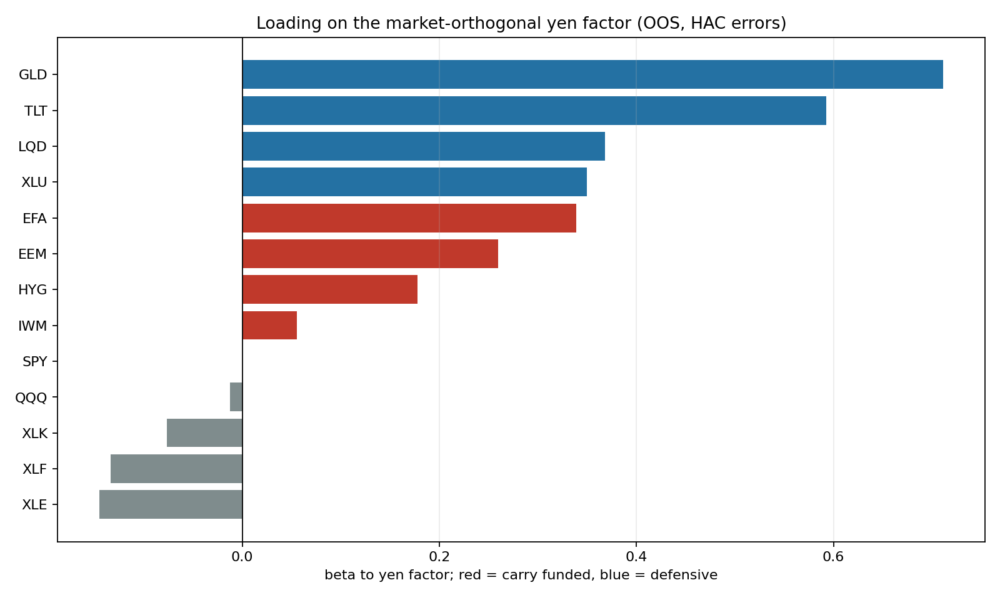
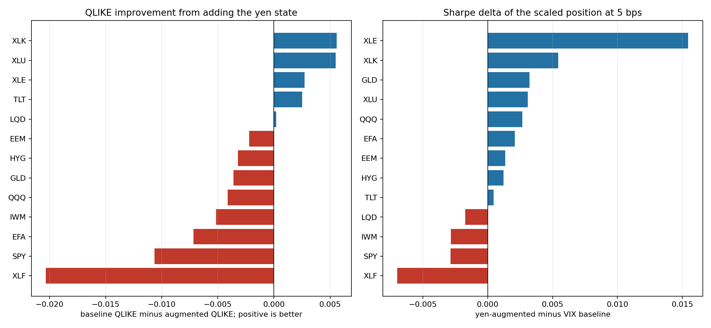

<!-- GENERATED FILE. EDIT THE CANONICAL KNOWLEDGE RECORD. -->

# Yen Risk State as a Position-Scaling Input and Risk Factor

!!! warning "Research-only"
    This page summarizes saved research evidence. It does not authorize LIVE, allocation, or deployment.

## TL;DR

> **Verdict:** Two separate verdicts. Scaling: REJECT_NO_SCALING_IMPROVEMENT - adding the yen state to a VIX-based volatility forecast worsens QLIKE on 62% of the basket, moves SPY sized-position Sharpe from 1.008 to 1.005, and changes basket median Sharpe by +0.0012 which is noise. Factor: PRESENT_BUT_NOT_CARRY_ORDERED - the yen factor is real and highly significant (8 of 13 assets at abs HAC t > 2, GLD beta 0.711 at t 11.78, incremental contemporaneous R-squared 0.132) but loads on duration and gold rather than carry-funded assets, which refutes the predeclared carry ordering while confirming the factor exists.

> **Status:** `forward_hypothesis`

> **Disposition:** `not_recorded`

> **Replication:** `not_recorded`

## Research question

Test whether a yen risk state improves how an equity position is normalised, in the way target_vol/VIX is used to scale exposure, and separately whether the market-orthogonal yen factor behaves as a risk factor across a 13-ETF basket. This is the exposure-control question, distinct from the timing question answered by jpy_carry_equity_risk_signal_study.

## Exact setup

| Field | Value |
| --- | --- |
| Signal family | market_risk_regime |
| Universe | ["13 liquid US-listed ETFs: SPY, QQQ, IWM, EEM, EFA, HYG, LQD, TLT, GLD, XLU, XLK, XLF, XLE", "USDJPY spot as the factor source"] |
| Decision | volatility forecast and weight formed after Close_T |
| Fill | Open_T+1 entry, earning Open_T+1 to Open_T+2 |
| Primary cost layer | central_research |
| Last reviewed | 2026-08-03T18:10:00+03:00 |

## Timing and overnight attribution

```text
information available: volatility forecast and weight formed after Close_T
primary executable fill: Open_T+1 entry, earning Open_T+1 to Open_T+2
```

If final `Close_T` data formed the signal, a hypothetical `Close_T` entry is diagnostic only unless a separate pre-close protocol was modeled. Comparing that diagnostic with `Open_(T+1)` and applying the compounded return identity shows whether the apparent edge occurred in the overnight gap. Missing attribution numbers mean **not tested**, not zero.


## Primary metrics

| Metric | Value |
| --- | ---: |
| Period | 2006-06-13 through 2026-07-31; out-of-sample from 2019-01-01 |
| Universe | N/A |
| Cost Layer | N/A |
| Cagr | N/A |
| Annualized Volatility | N/A |
| Sharpe | N/A |
| Maximum Drawdown | N/A |
| Turnover | N/A |

## Key findings

| Feature | Role | Direction | Status | Effect | Action |
| --- | --- | --- | --- | --- | --- |
| jpy_risk_state composite in a volatility-scaling forecast | gross-exposure scaler input | higher yen stress should imply higher forward volatility and smaller position | rejected | {"basket_median_sharpe_delta": 0.0012, "qlike_improvement_asset_fraction": 0.38, "spy_maxdd_delta": -0.0008, "spy_sharpe_delta": -0.0029} | Do not add the yen to a volatility-scaling rule. This is a clean null, not a marginal case. |
| market-orthogonal yen factor | risk-decomposition factor | predeclared as carry-funded assets loading above defensives | diagnostic | {"carry_minus_defensive_beta_gap": -0.2974, "gld_beta": 0.711, "hac_significant_assets": 8, "lqd_beta": 0.3684, "median_incremental_r2": 0.0116, "tlt_beta": 0.5928, "xle_beta": -0.1448, "xlf_beta": -0.1338} | Usable as a risk-decomposition axis for a gold or duration sleeve, where it explains 11-13% of variance beyond the market. Approximately zero loading on SPY, QQQ and XLK, so not a risk axis for a pure US equity book. Do not label it a carry factor. |
| volatility-targeted scaling itself, estimator comparison | gross-exposure scaler | smaller position when forecast volatility is high | diagnostic | {"basket_median_maxdd_improvement": 0.095, "estimator_median_sharpe_range": "0.598 to 0.677", "spy_best_estimator": "trailing_21d_realized_vol"} | Logged as RISK-19. Whether you scale matters far more than which estimator you use. Not promotable from this study because it was a control arm with no parameter, cost, or capacity work. |

## Visual evidence






## Limitations

- Selection disclosure: the three yen composite components were chosen after reading the companion study's volatility-target results, so this is confirmation of a post-hoc observation and status is capped at forward_hypothesis.
- The yen factor is orthogonalised to SPY, which removes the very channel through which carry-funded equities would load on the yen. The identity test can refute a carry label but cannot establish one.
- The test basket is liquid ETFs, not the live HPI, DV2 or momentum sleeves, so the loading table describes asset classes rather than this book's actual exposure.
- Ridge alpha fixed at 1.0 with no hyperparameter search; a different regulariser could change the fitted-model arms.
- HYG history begins 2007-04-11, later than the rest of the basket.
- No option-implied yen input, because Cboe/CME JYVIX was discontinued 2025-11-15 and no free point-in-time history exists.
- Factor loadings are estimated over the full out-of-sample block and are not tested for regime stability.

## Next gates

- Run RISK-19 as a dedicated volatility-targeting estimator study with the window and target frozen ex ante, since whether-to-scale dominated which-estimator here
- If a gold or duration sleeve is ever sized, decompose its variance against the yen factor rather than the market alone
- Do not retry the yen as an equity sizing input without option-implied data

## Sources

- `{"location": "pakal-research/reports/jpy_carry_equity_risk_signal_study/summary.md", "read_complete": true, "role": "Source of the single Holm-surviving volatility association that motivated this follow-up, and of the calendar-alignment lesson applied here", "source_id": "companion-jpy-carry-study"}`
- `{"location": "pakal-research/oil_equity_risk_signal_study.py", "read_complete": true, "role": "Shared primitives: lagged rolling percentile rank, walk-forward ridge, markdown table rendering, panel normalisation", "source_id": "oil-equity-risk-core"}`
- `{"location": "pakal-research/knowledge/STRATEGY_FEATURE_CATALOG.md RISK-03", "read_complete": true, "role": "Prior record that a direct 12/VIX exposure rule cut tails but retained too little return, used as the benchmark expectation", "source_id": "existing-vix-band-entry"}`
- `{"location": "current Claude Code session in C:\\\\Users\\\\User\\\\Documents\\\\workspace\\\\pakal", "read_complete": true, "role": "Clarified that the goal is a metric usable for reducing equity exposure, in the manner of normalising a position by VIX, and selected the diverse ETF basket as the test set", "source_id": "user-request"}`

## Canonical artifacts

| Artifact | Pakal path |
| --- | --- |
| Concise Report | `JPY_CARRY_RESEARCH_FINDINGS.md` |
| Full Report | `pakal-research/reports/jpy_risk_scaling_study/summary.md` |
| Notebook | `pakal-research/jpy_risk_scaling_study.ipynb` |
| Frozen Specification | `pakal-research/reports/jpy_risk_scaling_study/config_snapshot.json` |
| Manifest | `pakal-research/reports/jpy_risk_scaling_study/config_snapshot.json` |
| Primary Source Code | `["pakal-research/jpy_risk_scaling_study.py", "tests/test_jpy_risk_scaling_study.py"]` |
| Primary Tables | `["pakal-research/reports/jpy_risk_scaling_study/factor_loadings.csv", "pakal-research/reports/jpy_risk_scaling_study/headline_comparison.csv", "pakal-research/reports/jpy_risk_scaling_study/sizing_metrics.csv", "pakal-research/reports/jpy_risk_scaling_study/forecast_accuracy.csv", "pakal-research/reports/jpy_risk_scaling_study/falsification_test.csv"]` |
| Primary Charts | `["pakal-research/reports/jpy_risk_scaling_study/fig_factor_loadings.png", "pakal-research/reports/jpy_risk_scaling_study/fig_headline_comparison.png"]` |
