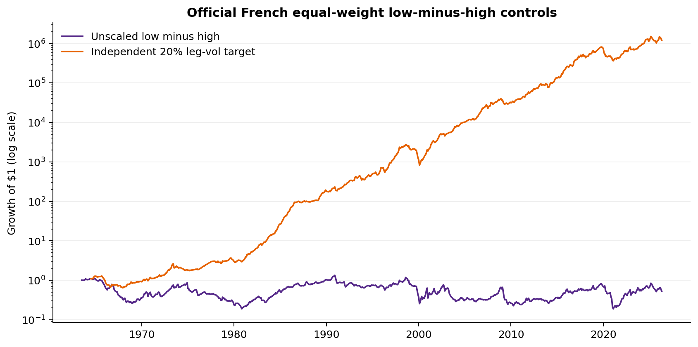
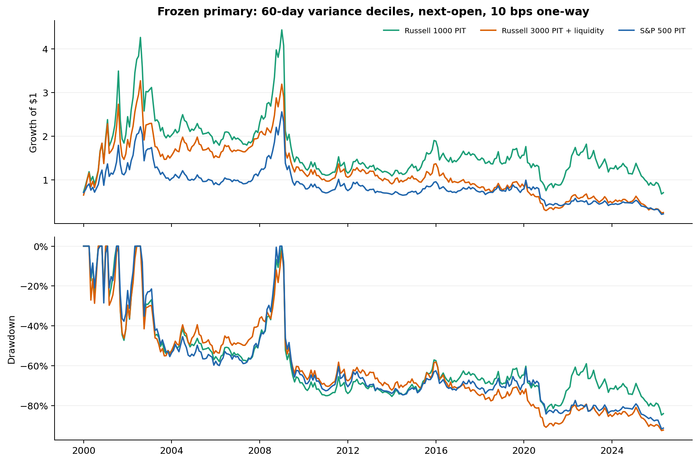

<!-- GENERATED FILE. EDIT THE CANONICAL KNOWLEDGE RECORD. -->

# Low-Volatility Anomaly Across PIT U.S. Universes

!!! warning "Research-only"
    This page summarizes saved research evidence. It does not authorize LIVE, allocation, or deployment.

## TL;DR

> **Verdict:** The low-volatility anomaly is visible in the official control, but the frozen executable transfer did not pass every multi-universe research gate. Retain it as a diagnostic and do not select a post-hoc winning universe.

> **Status:** `diagnostic`

> **Disposition:** `not_recorded`

> **Replication:** `not_recorded`

## Research question

Test whether a monthly low-minus-high realized-variance portfolio survives executable next-open timing, costs, confirmation, and liquidity controls across three PIT U.S. universes.

## Exact setup

| Field | Value |
| --- | --- |
| Signal family | cross_sectional_low_volatility |
| Universe | ["S&P 500 PIT", "Russell 1000 PIT", "Russell 3000 PIT + liquidity"] |
| Decision | After final Close_T of each calendar month |
| Fill | First Open_(T+1) entry to first Open_(T+2) exit |
| Primary cost layer | central_research |
| Last reviewed | 2026-07-29T00:24:12.980404+03:00 |

## Timing and overnight attribution

```text
information available: After final Close_T of each calendar month
primary executable fill: First Open_(T+1) entry to first Open_(T+2) exit
```

If final `Close_T` data formed the signal, a hypothetical `Close_T` entry is diagnostic only unless a separate pre-close protocol was modeled. Comparing that diagnostic with `Open_(T+1)` and applying the compounded return identity shows whether the apparent edge occurred in the overnight gap. Missing attribution numbers mean **not tested**, not zero.


## Primary metrics

| Metric | Value |
| --- | ---: |
| Period | 2000-01 through 2026-05 |
| Universe | S&P 500 PIT representative row; all three universes reported in norgate_performance.csv |
| Cost Layer | 10 bps one-way on drift-aware turnover |
| Cagr | -1.30% |
| Annualized Volatility | 32.77% |
| Sharpe | 0.131 |
| Maximum Drawdown | -84.73% |
| Turnover | 126.95% |

## Key findings

| Feature | Role | Direction | Status | Effect | Action |
| --- | --- | --- | --- | --- | --- |
| 60-session realized variance | cross-sectional rank | long lowest decile, short highest decile | diagnostic | {"russell1000_pit": {"full_cagr": -0.0129945486343715, "full_sharpe": 0.1312001278503248}, "russell3000_practical_pit": {"full_cagr": -0.0506930490425171, "full_sharpe": 0.0253915571919891}, "sp500_pit": {"full_cagr": -0.0552481291207803, "full_sharpe": -0.0238538865886603}} | Retain the frozen primary as research-only; do not choose a post-hoc universe or wire to LIVE. |
| ADV63 and raw-price restrictions | universe capacity restriction | exclude raw Close below $5 and require ADV63 >= $5M in the Russell 3000 practical universe | diagnostic | See price_adv_dependence.csv and variance_adv_interaction.csv | Keep as a frozen practical universe restriction. |

## Visual evidence






## Limitations

- Borrow, financing, recalls, dividends, and locate availability are excluded.
- Opening-auction volume, spreads, queue position, impact, and partial fills are unavailable.
- Norgate PIT index transfers are not the literal French all-exchange universe.
- Historical PIT market capitalization is unavailable for Norgate value-weighting.

## Next gates

- If the research gates pass, freeze a borrow-aware, auction-aware shadow protocol before any deployment review.
- Optionally predeclare Nasdaq-100 as a concentration stress, not as a replacement primary universe.

## Sources

- `C:/Users/User/Downloads/low_vol_.pdf`
- `https://concretumgroup.substack.com/p/when-risk-is-not-rewarded`
- `https://mba.tuck.dartmouth.edu/Pages/Faculty/Ken.French/Data_Library/det_port_form_VAR.html`

## Canonical artifacts

| Artifact | Pakal path |
| --- | --- |
| Concise Report | `pakal-research/reports/low_volatility_universe_study/REPORT.md` |
| Full Report | `pakal-research/reports/low_volatility_universe_study/REPORT_FULL.md` |
| Notebook | `pakal-research/low_volatility_universe_study.ipynb` |
| Frozen Specification | `pakal-research/reports/low_volatility_universe_study/research_spec_frozen.json` |
| Manifest | `pakal-research/reports/low_volatility_universe_study/run_manifest.json` |
| Primary Source Code | `["pakal-research/low_volatility_universe_study.py", "pakal-research/low_volatility_universe_report.py", "tests/test_low_volatility_universe_study.py"]` |
| Primary Tables | `["pakal-research/reports/low_volatility_universe_study/tables/norgate_performance.csv", "pakal-research/reports/low_volatility_universe_study/tables/primary_inference.csv", "pakal-research/reports/low_volatility_universe_study/tables/promotion_gates.csv", "pakal-research/reports/low_volatility_universe_study/tables/capacity_summary.csv"]` |
| Primary Charts | `["pakal-research/reports/low_volatility_universe_study/charts/french_control_equity.png", "pakal-research/reports/low_volatility_universe_study/charts/primary_equity_drawdown.png", "pakal-research/reports/low_volatility_universe_study/charts/primary_period_sharpe.png", "pakal-research/reports/low_volatility_universe_study/charts/primary_cost_sensitivity.png", "pakal-research/reports/low_volatility_universe_study/charts/variance_decile_curve.png", "pakal-research/reports/low_volatility_universe_study/charts/variance_adv_interaction.png", "pakal-research/reports/low_volatility_universe_study/charts/parameter_marginals.png", "pakal-research/reports/low_volatility_universe_study/charts/capacity_participation.png", "pakal-research/reports/low_volatility_universe_study/charts/primary_inference.png", "pakal-research/reports/low_volatility_universe_study/charts/promotion_gates.png"]` |
