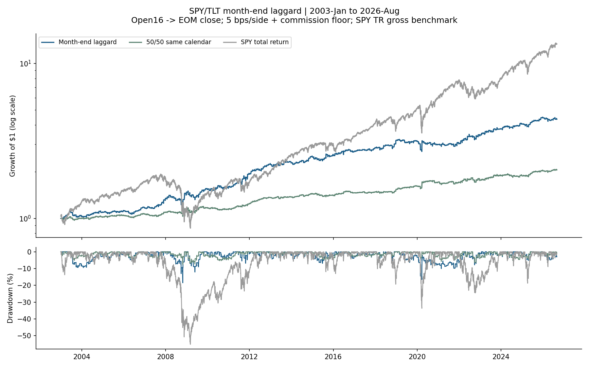
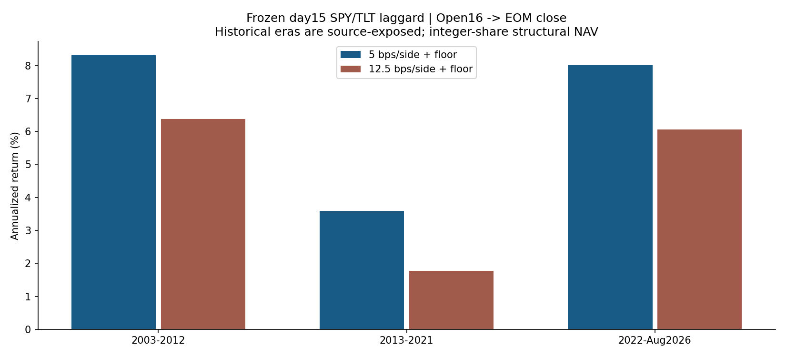

<!-- GENERATED FILE. EDIT THE CANONICAL KNOWLEDGE RECORD. -->

# Month-End Laggard Rotation: SPY/TLT source replication and PAPER feasibility

!!! warning "Research-only"
    This page summarizes saved research evidence. It does not authorize LIVE, allocation, or deployment.

## TL;DR

> **Verdict:** Month-End Laggard Rotation is prepared for a small isolated PAPER review as a forward hypothesis. Historical central/stress economics and fixed-unit feasibility survive; incremental selection is inconsistent across eras. No clean historical holdout, verified auction fills or broker transport evidence exists.

> **Status:** `forward_hypothesis`

> **Disposition:** `promising_component`

> **Replication:** `not_reproducible`

## Research question

Reproduce disclosed macro ETF rules, investigate flow mechanisms and qualify one robust, simple hypothesis for reviewing a small PAPER experiment.

## Exact setup

| Field | Value |
| --- | --- |
| Signal family | cross_asset_calendar_reversal |
| Universe | ["Source-fixed SPY/TLT ETFs; IEF only for60/40 pressure diagnostics. Observed common sessions; no current stock membership used. Source choice remains selection-exposed."] |
| Decision | Completed trading-day15 Close; adjusted MTD from previous EOMClose. Tie cash. |
| Fill | Next-session Open16 entry; predetermined EOMClose exit. Consolidated daily price proxy, primary-auction fills unverified. |
| Primary cost layer | central_research |
| Last reviewed | 2026-09-11T16:29:58+00:00 |

## Timing and overnight attribution

```text
information available: Completed trading-day15 Close; adjusted MTD from previous EOMClose. Tie cash.
primary executable fill: Next-session Open16 entry; predetermined EOMClose exit. Consolidated daily price proxy, primary-auction fills unverified.
```

If final `Close_T` data formed the signal, a hypothetical `Close_T` entry is diagnostic only unless a separate pre-close protocol was modeled. Comparing that diagnostic with `Open_(T+1)` and applying the compounded return identity shows whether the apparent edge occurred in the overnight gap. Missing attribution numbers mean **not tested**, not zero.

| Attribution field | Value |
| --- | --- |
| Status | tested |
| Diagnostic Path | Ratio5 completed Close_T to Close_T+1 using selected asset; laggard source already enters Open16 |
| Executable Path | Ratio5 Open_T+1 to same Close_T+1 attribution; stateful strategies compared at next_open and causal_close. Laggard primary Open16 to EOMClose; alternate exit next Open. |
| Method | Same-asset gross CC=(1+ON)*(1+ID)-1 with interaction; independently priced raw-share stateful paths after costs |
| Headline Result | Ratio5 selected-asset gross daily6.55bps includes3.65 overnight,2.87 intraday,0.03 interaction; high turnover defeats stress. Laggard central CAGR6.43% EOMClose exit vs5.11% next-open exit. |
| Metrics | {"daily_SPY_TR_beta": 0.12638300224929652, "daily_SPY_TR_correlation": 0.26894280063243414, "ratio5_identity_max_abs_residual": 2.220446049250313e-16} |
| Artifact | pakal-research/reports/macro_etf_three_edges_robustness_study/tables/diagnostic_summary.json |

## Primary metrics

| Metric | Value |
| --- | ---: |
| Period | 2003-01-01 to2026-08-31;5953 sessions284 complete months; source-exposed |
| Universe | SPY/TLT; day15 laggard; full target structural NAV, integer raw shares and idle dividend cash |
| Cost Layer | central_research |
| Cagr | 6.43% |
| Annualized Volatility | 8.72% |
| Sharpe | 0.759 |
| Maximum Drawdown | -18.49% |
| Turnover | 2398.78% |

## Four separate verdicts

| Question | Conclusion |
| --- | --- |
| Source Replication | April disclosed rules directionally reproduced with period/timing/capital differences; September advertised improved mapping absent from provided paywalled preview, hence aggregate not_reproducible. |
| Predictive Value | Calendar economics survive descriptive stress tests; selector increment fails significance in2013-2021. Pressure association is inconsistent. No pristine historical confirmation. |
| Economic Value | Day15 long-only Open16 to EOMClose central CAGR6.43%, Sharpe0.759, MDD18.49%; stress CAGR4.54%. Fixed previous-close quantity20% virtual10k central CAGR1.26%, MDD3.74%. |
| Promotion | Prepared for PAPER review as forward_hypothesis; broker lifecycle, actual fills, account isolation and new observations remain untested. No LIVE or PAPER orders submitted. |

## Key findings

| Feature | Role | Direction | Status | Effect | Action |
| --- | --- | --- | --- | --- | --- |
| Day15 SPY/TLT month-to-date laggard | signal | buy lower adjusted MTD return | forward_hypothesis | Central CAGR6.43%, stress4.54%; paired increment vs same-calendar50/50 mean27.96bps/month full | Freeze day15 and collect new isolated PAPER review evidence; no additional historical tuning |
| Calendar long TLT final5 / short first5 | signal and exit | long EOM, short BOM | diagnostic | Raw short gross mean53.81bps becomes27.85bps after dividends; omission overstates25.96bps/month | Retain signed dividend liability accounting; no short sleeve in selected PAPER plan |
| SPY/IEF60/40 rebalance pressure sign | internal signal filter/switch | TLT if positive, otherwise cash or SPY as explicitly frozen hypotheses | rejected | Pressure-switch causal-close central CAGR7.74%, but recent-era stress CAGR-0.50% | Do not adopt filtered variants; do not label them reproduction of unavailable paid mapping |
| log(SPY/TLT) versus inclusive5-close mean | signal | relative mean reversion | rejected | Next-open central CAGR7.45%, stress-3.20%, annual one-way turnover~139x | Reject for small PAPER candidate; retain timing diagnostic |
| Previous-close fixed integer shares at20% virtual10k NAV | sizing and operational validation | reserve cash and avoid fill-price hindsight quantity | offline_feasibility_passed | Central CAGR1.26%, MDD3.74%; stress0.92%, MDD3.97%; no cash breaches | Review20% virtual NAV plan with separate PAPER broker transport validation |

## Visual evidence






## Limitations

- All historical periods source-exposed; prior local studies used related mechanisms. No clean historical holdout or selection-wide p-value.
- September promoted rules unavailable in supplied22page preview; nearly4000% claim not reproduced.
- Source includes adjustment, timing, capital and fee gaps; source fixed10k plots compared directionally only.
- Norgate current corrected history, not decision-time snapshots; reconstructed calendar not historical announcement vintage.
- Daily opens are consolidated first eligible prints, not verified primary-auction executions.
- Positive dividend cash delayed5observed sessions; actual historical payable dates not reproduced. Short dividend liabilities reserved separately.
- Same-calendar50/50 control defeats universal selector-alpha claim;2013-2021 increment not significant.
- Independent Yahoo Open/Close and1013signals agree, but unused SPY Low2025-12-22 differs30.61bps; no stop/range model validation.
- Actual account isolation, route, orders, partial fills, restart idempotency and reconciliation untested. Proposed operational pauses not backtested.
- Separate rj_macro_etf_flow_edges_study discovered during closeout after selection; different rule/cost contract not independent confirmation; see context note.
- Browser security policy blocked local HTML preview; charts visually checked, Markdown/HTML references and formulas checked offline.

## Next gates

- Review frozen20% virtual10k plan; verify isolated PAPER account, contract, route, order lifecycle and recovery, then gather genuinely new cycles without tuning. No broker action was performed.
- Keep selector and same-calendar50/50 reference frozen during forward collection; measure actual primary-auction cost and dividend cash.
- At least6complete monthly cycles for operational review; this is not statistical proof of alpha.
- Obtain missing full source rules before any claim of September exact replication.

## Sources

- `{"local_path": "C:/Users/User/Documents/workspace/0_papers/rj's trading/three dead simple edges in macro etfs.pdf", "pages": "all12, rules6,8-10", "title": "Three dead simple edges in macro ETFs", "url": "https://robotjames.substack.com/p/three-dead-simple-edges-in-macro"}`
- `{"local_path": "C:/Users/User/Downloads/kenmakeyp.pdf", "pages": "all22, paywall21", "title": "A simple crazy-effective calendar effect trade in macro ETFs", "url": "https://robotjames.substack.com/p/a-simple-crazy-effective-calendar"}`
- `{"path": "pakal-research/reports/macro_etf_three_edges_robustness_study/sources/EXTERNAL_EXECUTION_REVIEW.md", "title": "Official execution/data review"}`
- `{"path": "pakal-research/reports/macro_etf_three_edges_robustness_study/sources/VENDOR_CROSSCHECK.md", "title": "Independent vendor crosscheck"}`

## Canonical artifacts

| Artifact | Pakal path |
| --- | --- |
| Concise Report | `pakal-research/reports/macro_etf_three_edges_robustness_study/REPORT.md` |
| Full Report | `pakal-research/reports/macro_etf_three_edges_robustness_study/REPORT_FULL.md` |
| Notebook | `pakal-research/reports/macro_etf_three_edges_robustness_study/macro_etf_flow_study.ipynb` |
| Frozen Specification | `pakal-research/reports/macro_etf_three_edges_robustness_study/research_spec_frozen.json` |
| Manifest | `pakal-research/reports/macro_etf_three_edges_robustness_study/run_manifest.json` |
| Research State | `pakal-research/reports/macro_etf_three_edges_robustness_study/research_state.json` |
| Hypothesis Registry | `pakal-research/reports/macro_etf_three_edges_robustness_study/hypothesis_registry.json` |
| Experiment Ledger | `pakal-research/reports/macro_etf_three_edges_robustness_study/experiment_ledger.jsonl` |
| Decision Log | `pakal-research/reports/macro_etf_three_edges_robustness_study/decision_log.jsonl` |
| Source Rule Map | `pakal-research/reports/macro_etf_three_edges_robustness_study/SOURCE_RULE_MAP.md` |
| Paper Plan | `pakal-research/reports/macro_etf_three_edges_robustness_study/PAPER_REVIEW_PLAN.md` |
| Reproducibility | `pakal-research/reports/macro_etf_three_edges_robustness_study/REPRODUCIBILITY.json` |
| Validation | `pakal-research/reports/macro_etf_three_edges_robustness_study/validation_results.json` |
| Reproduction Instructions | `pakal-research/reports/macro_etf_three_edges_robustness_study/REPRODUCE.md` |
| Publication Status | `pakal-research/reports/macro_etf_three_edges_robustness_study/PUBLICATION_STATUS.json` |
| Primary Source Code | `["pakal-research/macro_etf_flow_data.py", "pakal-research/macro_etf_flow_engine.py", "pakal-research/macro_etf_flow_study.py", "pakal-research/macro_etf_flow_qualification.py", "pakal-research/macro_etf_flow_diagnostics.py", "pakal-research/macro_etf_vendor_crosscheck.py", "pakal-research/macro_etf_paper_review.py", "pakal-research/build_macro_etf_flow_artifacts.py", "pakal-research/macro_etf_replay_validation.py", "pakal-research/close_macro_etf_flow_study.py"]` |
| Primary Tables | `["pakal-research/reports/macro_etf_three_edges_robustness_study/tables/baseline_metrics.csv", "pakal-research/reports/macro_etf_three_edges_robustness_study/tables/adaptive_metrics.csv", "pakal-research/reports/macro_etf_three_edges_robustness_study/tables/qualification_metrics.csv", "pakal-research/reports/macro_etf_three_edges_robustness_study/tables/paper_feasibility_metrics.csv", "pakal-research/reports/macro_etf_three_edges_robustness_study/tables/candidate_selector_increment.csv", "pakal-research/reports/macro_etf_three_edges_robustness_study/tables/grid_inference.csv", "pakal-research/reports/macro_etf_three_edges_robustness_study/tables/diagnostic_summary.json"]` |
| Primary Charts | `["pakal-research/reports/macro_etf_three_edges_robustness_study/charts/equity_drawdown.png", "pakal-research/reports/macro_etf_three_edges_robustness_study/charts/period_cost_survival.png", "pakal-research/reports/macro_etf_three_edges_robustness_study/charts/entry_neighborhood.png", "pakal-research/reports/macro_etf_three_edges_robustness_study/charts/rolling_correlation.png"]` |
