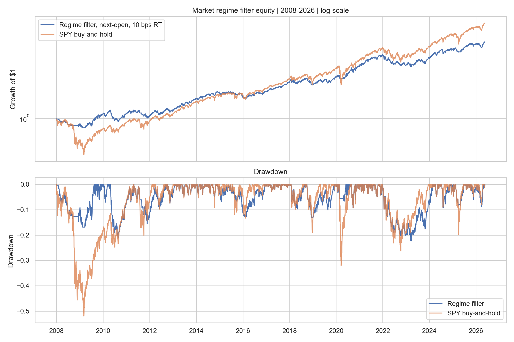
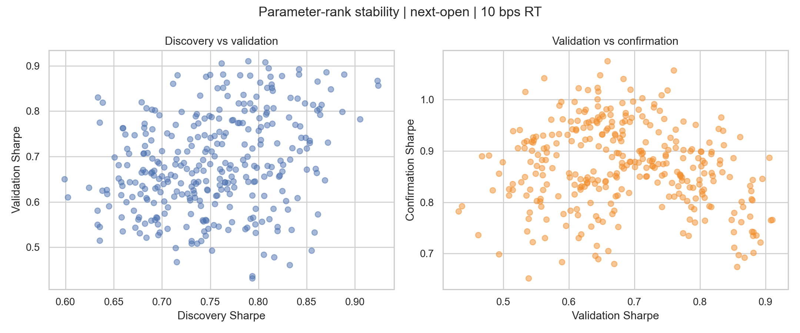

<!-- GENERATED FILE. EDIT THE CANONICAL KNOWLEDGE RECORD. -->

# Three-lens SPY market regime filter

!!! warning "Research-only"
    This page summarizes saved research evidence. It does not authorize LIVE, allocation, or deployment.

## TL;DR

> **Verdict:** Diagnostic only. The filter is a transparent beta and drawdown overlay, but this history is source-contaminated and the executable next-open evidence does not justify deployment without a pristine forward window and live fill/cash implementation.

> **Status:** `diagnostic`

> **Disposition:** `not_recorded`

> **Replication:** `not_recorded`

## Research question

Determine whether the literal three-lens regime filter preserves at least 70% of SPY CAGR while improving Sharpe and reducing maximum drawdown by at least 25% under executable next-open timing and central costs.

## Exact setup

| Field | Value |
| --- | --- |
| Signal family | market_regime_allocation |
| Universe | ["SPY single-ETF allocation"] |
| Decision | After Close_T |
| Fill | Open_T+1 |
| Primary cost layer | central_research |
| Last reviewed | 2026-07-30T22:41:10.826833+03:00 |

## Timing and overnight attribution

```text
information available: After Close_T
primary executable fill: Open_T+1
```

If final `Close_T` data formed the signal, a hypothetical `Close_T` entry is diagnostic only unless a separate pre-close protocol was modeled. Comparing that diagnostic with `Open_(T+1)` and applying the compounded return identity shows whether the apparent edge occurred in the overnight gap. Missing attribution numbers mean **not tested**, not zero.


## Primary metrics

| Metric | Value |
| --- | ---: |
| Period | 2008-01-02 to 2026-07-29 |
| Universe | SPY single-ETF allocation |
| Cost Layer | central_research |
| Cagr | 8.98% |
| Annualized Volatility | 11.70% |
| Sharpe | 0.794 |
| Maximum Drawdown | -22.35% |
| Turnover | 1152.14% |

## Key findings

| Feature | Role | Direction | Status | Effect | Action |
| --- | --- | --- | --- | --- | --- |
| SPY above SMA200 | market trend exposure vote | favorable when above | diagnostic | -1.212 bps next-open pass-minus-fail | Retain only in frozen forward shadow |
| VIX below VIX3M | volatility-term-structure exposure vote | favorable in contango | diagnostic | -0.005 bps next-open pass-minus-fail | Retain only in frozen forward shadow |
| HYG/IEF 100-day z-score above -2 | credit-condition exposure vote | favorable above cutoff | diagnostic | -7.424 bps next-open pass-minus-fail | Retain only in frozen forward shadow |

## Visual evidence






## Limitations

- No untouched historical confirmation because the source saw nearly the full sample.
- Yahoo Finance is a mutable public data source; the immutable cache hash is authoritative for this run.
- Opening-auction volume, spread, basis risk, partial fills, and order cutoffs are not measured.
- Idle cash earns zero in the primary, so a future live design must state its cash instrument.
- The original May 2026 TASC article is paywalled and was not supplied.

## Next gates

- Run the literal parameters unchanged for at least 12 months of pristine daily shadow decisions.
- Predeclare the open order type and measure open spread, auction volume, slippage, and partial fills.
- Add a separately frozen cash-instrument implementation without retuning the regime thresholds.

## Sources

- `C:/Users/User/Downloads/theFinancialHacker-MarketRegimeFilter.pdf`
- `https://financial-hacker.com/the-market-regime-filter/`
- `https://fabiobaruffa.com/articles/market-regime-framework/`
- `https://github.com/fbaru-dev/regime-framework/commit/86e82b6be4e64ec44a801673039078043deafca0`

## Canonical artifacts

| Artifact | Pakal path |
| --- | --- |
| Concise Report | `pakal-research/reports/market_regime_filter_study/REPORT.md` |
| Full Report | `pakal-research/reports/market_regime_filter_study/REPORT_FULL.md` |
| Notebook | `pakal-research/market_regime_filter_study.ipynb` |
| Frozen Specification | `pakal-research/reports/market_regime_filter_study/research_spec_frozen.json` |
| Manifest | `pakal-research/reports/market_regime_filter_study/run_manifest.json` |
| Primary Source Code | `["pakal-research/market_regime_filter_study.py", "pakal-research/build_market_regime_filter_notebook.py", "pakal-research/build_market_regime_filter_manifest.py"]` |
| Primary Tables | `["pakal-research/reports/market_regime_filter_study/tables/baseline_metrics.csv", "pakal-research/reports/market_regime_filter_study/tables/parameter_grid.csv", "pakal-research/reports/market_regime_filter_study/tables/state_evidence.csv"]` |
| Primary Charts | `["pakal-research/reports/market_regime_filter_study/charts/primary_equity_drawdown.png", "pakal-research/reports/market_regime_filter_study/charts/score_state_returns.png", "pakal-research/reports/market_regime_filter_study/charts/parameter_stability_scatter.png"]` |
