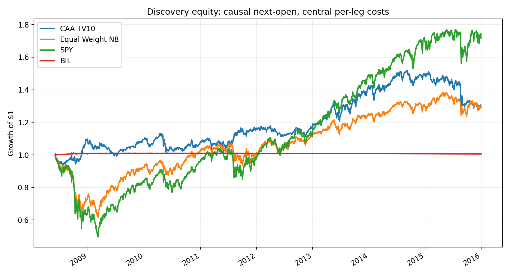
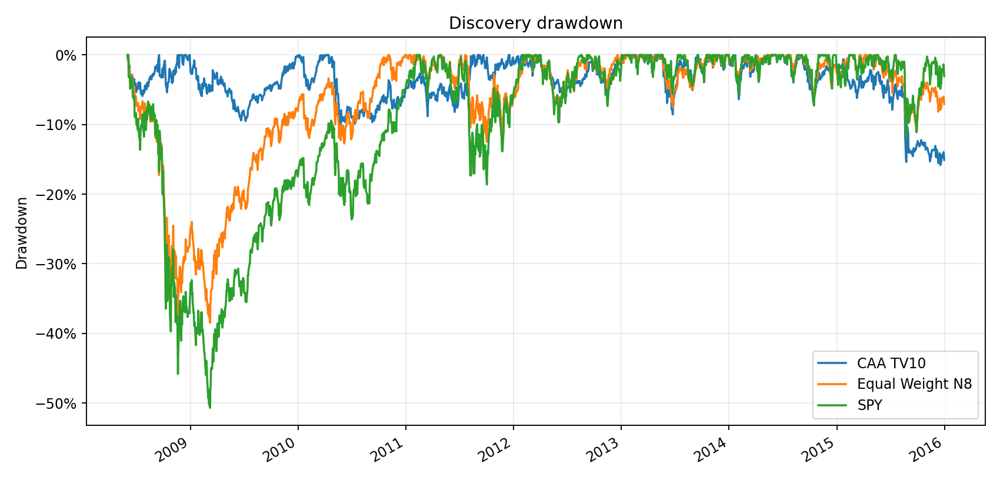

<!-- GENERATED FILE. EDIT THE CANONICAL KNOWLEDGE RECORD. -->

# Momentum and Markowitz Classical Asset Allocation

!!! warning "Research-only"
    This page summarizes saved research evidence. It does not authorize LIVE, allocation, or deployment.

## TL;DR

> **Verdict:** DIRECTIONALLY_REPLICATED_BUT_REJECTED: the modern ETF proxy reduced risk, but executable active return was negligible, timing-sensitive, statistically weak, and unstable across blocks; historical holdouts stayed closed.

> **Status:** `diagnostic`

> **Disposition:** `rejected`

> **Replication:** `directionally_replicated`

## Research question

Test whether the paper's N=8 CAA rule adds causal, cost-aware, stable value over identical-universe equal weight and return-agnostic controls.

## Exact setup

| Field | Value |
| --- | --- |
| Signal family | cross_asset_momentum_mean_variance_allocation |
| Universe | ["Fixed modern ETF proxy: SPY, EFA, EEM, XLK, EWJ, IEF, BIL, HYG"] |
| Decision | After final completed month-end Norgate TOTALRETURN Close_T. |
| Fill | First common Open_(T+1); stateful hold until the Open after the next completed month-end decision. |
| Primary cost layer | central_research |
| Last reviewed | 2026-08-30T21:25:00+00:00 |

## Timing and overnight attribution

```text
information available: After final completed month-end Norgate TOTALRETURN Close_T.
primary executable fill: First common Open_(T+1); stateful hold until the Open after the next completed month-end decision.
```

If final `Close_T` data formed the signal, a hypothetical `Close_T` entry is diagnostic only unless a separate pre-close protocol was modeled. Comparing that diagnostic with `Open_(T+1)` and applying the compounded return identity shows whether the apparent edge occurred in the overnight gap. Missing attribution numbers mean **not tested**, not zero.


## Primary metrics

| Metric | Value |
| --- | ---: |
| Period | discovery 2008-06-02 through 2015-12-31 |
| Universe | fixed N=8 modern ETF proxy |
| Cost Layer | central_research 10 bps per traded notional leg |
| Cagr | 3.42% |
| Annualized Volatility | 9.69% |
| Sharpe | 0.388 |
| Maximum Drawdown | -15.81% |
| Turnover | 294.91% |

## Four separate verdicts

| Question | Conclusion |
| --- | --- |
| Source Replication | Directionally replicated only on a fixed modern N=8 ETF proxy; exact source histories and preprocessing are unavailable. |
| Predictive Value | Rejected: source IC was positive but missed BH q<=0.20, rank spread and active-return inference were null, and timing retention was 1.64%. |
| Economic Value | Diagnostic risk reduction, but only +0.022 percentage points of central active CAGR and negative conservative active CAGR versus 1/N. |
| Promotion | No promotion; validation and confirmation remain unopened and there is no PAPER or LIVE authority. |

## Key findings

| Feature | Role | Direction | Status | Effect | Action |
| --- | --- | --- | --- | --- | --- |
| 1/3/6/12-month total-return composite | source-literal cross-asset signal | Positive but weak next-month rank association. | diagnostic_rejected | {"IC_BH_q": 0.227814241988959, "mean_spearman_IC": 0.076984126984127, "top4_bottom4_monthly_spread": 0.001612672290699} | Do not tune horizons on seen history; require prospectively frozen future evidence. |
| Uncapped IEF and BIL defensive sleeves | risk overlay and exposure construction | Large early-sample drawdown reduction with late-block failure. | diagnostic_rejected | {"baseline_max_drawdown": -0.15813543498767, "equal_weight_max_drawdown": -0.3845641640964162, "risk_overlay_blocks_passed": 2} | Keep as mechanism evidence only; no historical holdout opening. |
| Close_T versus Open_(T+1) same-exit attribution | timing validation | Most source-like active return occurred before the executable open. | required_diagnostic_failed | {"active_CAGR_retention": 0.0164104471784295, "recomposition_error": 2.220446049250313e-16} | Never use the same-close diagnostic as executable evidence. |

## Visual evidence






## Limitations

- Exact stitched source histories, splices, missing-asset rules, and preprocessing are unavailable.
- The fixed surviving ETF universe begins in 2007 and has survivorship and product-launch conditioning.
- Discovery contains the 2008 crisis and only 91 monthly decisions; 2008 exceeds the positive active-contribution concentration gate.
- Same-close evidence is timing-conflicted; the causal next-open active edge is negligible.
- Capacity is a full-day ADV stress proxy, not opening-auction or live-fill evidence.
- Validation 2016-2020 and confirmation 2021-2026-08 were intentionally not opened after discovery gates failed.

## Next gates

- Do not reopen the historical holdouts for this rejected route. If revisited, freeze a materially new hypothesis and collect unseen future monthly decisions.
- Obtain exact source histories and splice rules before claiming century replication.
- Collect opening-auction volumes, quotes, spreads, partial fills, and broker executions before any capacity or deployment claim.

## Sources

- `{"path": "C:\\\\Users\\\\User\\\\Downloads\\\\ssrn-2606884.pdf", "read_complete": true, "role": "Literal paper rules, appendix code, and author-reported results", "sha256": "F342CDEE46983ADEFD105FBA2C5FA606E3DBAAECADD97DF5045A094598676F47", "source_id": "ssrn-2606884-v099d", "title": "Momentum and Markowitz: a Golden Combination", "unresolved_gap": "Exact asset histories, splice rules, execution timing, and missing-data treatment are not supplied."}`
- `{"path": "pakal-research/reports/momentum_markowitz_caa_signal_study/data/norgate_caa_n8_panel.parquet", "read_complete": true, "role": "TOTALRETURN Open/Close and raw ADV63 inputs", "source_id": "norgate_local_fixed_etf_proxy", "title": "Local Norgate Data fixed N=8 ETF panel", "unresolved_gap": "Fixed modern products are not the paper's century asset-class indices or a PIT constituent universe."}`

## Canonical artifacts

| Artifact | Pakal path |
| --- | --- |
| Concise Report | `pakal-research/reports/momentum_markowitz_caa_signal_study/REPORT.md` |
| Decision Log | `pakal-research/reports/momentum_markowitz_caa_signal_study/decision_log.jsonl` |
| Experiment Ledger | `pakal-research/reports/momentum_markowitz_caa_signal_study/experiment_ledger.jsonl` |
| Frozen Specification | `pakal-research/reports/momentum_markowitz_caa_signal_study/research_spec_frozen.json` |
| Full Report | `pakal-research/reports/momentum_markowitz_caa_signal_study/REPORT_FULL.md` |
| Hypothesis Registry | `pakal-research/reports/momentum_markowitz_caa_signal_study/hypothesis_registry.json` |
| Manifest | `pakal-research/reports/momentum_markowitz_caa_signal_study/run_manifest.json` |
| Notebook | `pakal-research/momentum_markowitz_caa_signal_study.ipynb` |
| Primary Charts | `["pakal-research/reports/momentum_markowitz_caa_signal_study/charts/discovery_equity.png", "pakal-research/reports/momentum_markowitz_caa_signal_study/charts/discovery_drawdown.png", "pakal-research/reports/momentum_markowitz_caa_signal_study/charts/rolling_spy_correlation.png", "pakal-research/reports/momentum_markowitz_caa_signal_study/charts/defensive_target_exposure.png"]` |
| Primary Source Code | `["pakal-research/momentum_markowitz_caa_signal_study.py", "pakal-research/build_momentum_markowitz_caa_artifacts.py"]` |
| Primary Tables | `["pakal-research/reports/momentum_markowitz_caa_signal_study/tables/baseline_discovery_metrics.csv", "pakal-research/reports/momentum_markowitz_caa_signal_study/tables/discovery_variant_comparison.csv", "pakal-research/reports/momentum_markowitz_caa_signal_study/tables/discovery_forecast_ic_summary.csv", "pakal-research/reports/momentum_markowitz_caa_signal_study/tables/discovery_contiguous_blocks.csv", "pakal-research/reports/momentum_markowitz_caa_signal_study/tables/capacity_scenarios.csv"]` |
| Research State | `pakal-research/reports/momentum_markowitz_caa_signal_study/research_state.json` |
| Source Rule Map | `pakal-research/reports/momentum_markowitz_caa_signal_study/SOURCE_RULE_MAP.md` |
