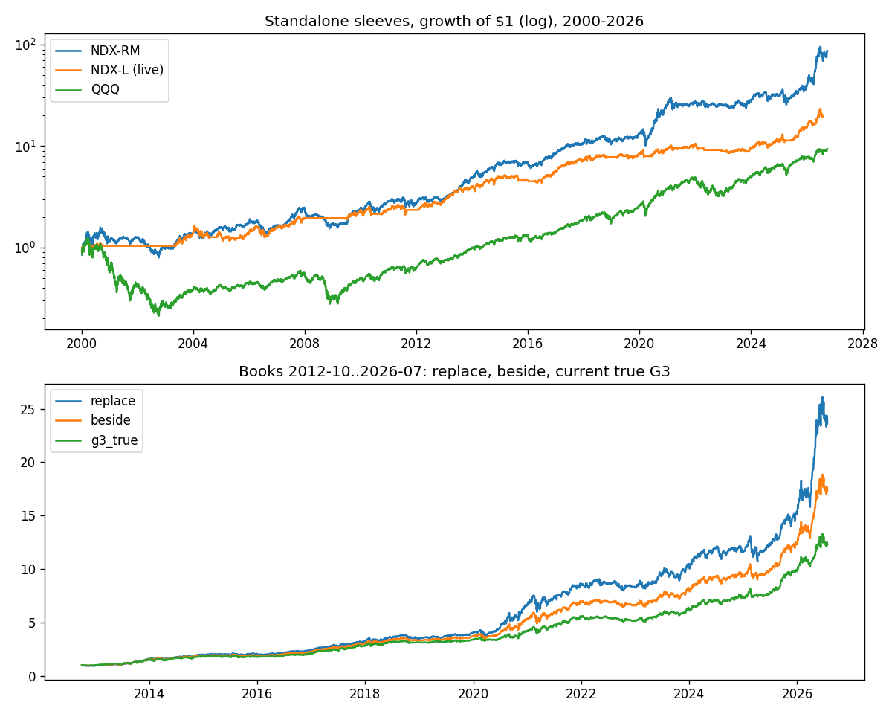
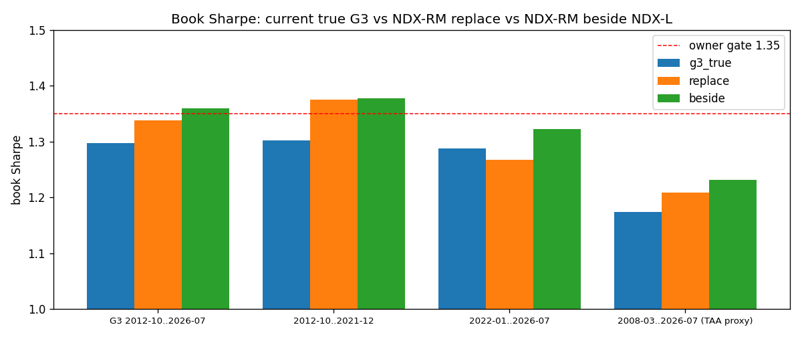

<!-- GENERATED FILE. EDIT THE CANONICAL KNOWLEDGE RECORD. -->

# Momentum/trend universe search after the NDX split look-ahead: orthogonal stack, era-robust NDX momentum, NDX-RM beside NDX-L

!!! warning "Research-only"
    This page summarizes saved research evidence. It does not authorize LIVE, allocation, or deployment.

## TL;DR

> **Verdict:** GOAL NOT MET ROBUSTLY. The pre-registered design winner (R1000 momentum + pullback + seasonality + lottery avoidance, design Sharpe 1.37) failed the 2012-2026 holdout (Sharpe 0.51, book 1.15). Post-hoc, era-robust NDX residual momentum with size-aware weights (NDX-RM) reaches book 1.34 as a replacement and 1.36 / -17.4% beside NDX-L (TAA 50 / L 25 / RM 25), but only because of 2026 (1.31 through 2025) and not significantly better than G3 (p 0.18). Long-only US momentum sleeves cap the book near 1.30-1.34 because TAA's TQQQ leg already carries the Nasdaq factor. Shadow NDX-RM beside L; do not replace L.

> **Status:** `diagnostic`

> **Disposition:** `forward_hypothesis_shadow`

> **Replication:** `not_replicated`

## Research question

Find one clean (split-invariant) momentum/trend sleeve across 10 PIT US universes that replaces or sits beside the live NDX pod and lifts the true G3 book to Sharpe >= 1.35 with max DD >= -20% incl. 2008.

## Exact setup

| Field | Value |
| --- | --- |
| Signal family | cross_sectional_momentum_with_orthogonal_companions |
| Universe | ["S&P 100/500/400/600, Nasdaq-100, Russell 1000/2000/3000/Mid Cap/Top 200 PIT (Norgate); $5 raw floor; $1M median-63d turnover floor"] |
| Decision | Close_T at month end (+0/5/10/15 sessions for 4 tranches); all signals scale-free trailing ratios |
| Fill | Open_(T+1), shares drift to the next fill; v4 daily overlays applied with a one-full-day delay |
| Primary cost layer | central_research |
| Last reviewed | 2026-09-27T12:00:00+03:00 |

## Timing and overnight attribution

```text
information available: Close_T at month end (+0/5/10/15 sessions for 4 tranches); all signals scale-free trailing ratios
primary executable fill: Open_(T+1), shares drift to the next fill; v4 daily overlays applied with a one-full-day delay
```

If final `Close_T` data formed the signal, a hypothetical `Close_T` entry is diagnostic only unless a separate pre-close protocol was modeled. Comparing that diagnostic with `Open_(T+1)` and applying the compounded return identity shows whether the apparent edge occurred in the overnight gap. Missing attribution numbers mean **not tested**, not zero.

| Attribution field | Value |
| --- | --- |
| Status | tested |
| Diagnostic Path | monthly Spearman IC and top-quintile excess, Open_(T+1)->Open_(T'+1) |
| Executable Path | stateful next-open engine, 4 tranches |
| Method | design 1996-2011, holdout 2012-2026 opened once; post-hoc families declared before each run |
| Headline Result | design winner 1.37 -> holdout 0.51; NDX-RM beside-L book 1.36 (1.31 through 2025) |
| Metrics | {"ndx_rm_beside_book_sharpe": 1.359, "p_star_design_sharpe": 1.37, "p_star_holdout_sharpe": 0.514} |
| Unavailable Reason | N/A |
| Artifact | pakal-research/reports/momentum_trend_universe_search/tables/stage3_holdout_results.csv |

## Primary metrics

| Metric | Value |
| --- | ---: |
| Period | 2012-10-02..2026-07-24 (G3 window); standalone 1996-2026 |
| Universe | NDX-RM beside NDX-L: 0.5 taa_rank_tqqq + 0.25 NDX-L + 0.25 NDX-RM |
| Cost Layer | central_research (10 bps per side) |
| Cagr | 22.98% |
| Annualized Volatility | 16.19% |
| Sharpe | 1.359 |
| Maximum Drawdown | -17.42% |
| Turnover | 700.00% |

## Four separate verdicts

| Question | Conclusion |
| --- | --- |
| Source Replication | Pellerano orthogonal-stack thesis held 1996-2011 and failed 2012-2026; Alpha191 robust-core 046/049 decayed in large caps after 2012; 101 alphas not transferable (0.6-6.4 day, dollar-neutral) |
| Predictive Value | momentum (resmom, trend200, tq126) positive in NDX in both eras; pullback/seasonality/low-risk era-specific |
| Economic Value | no sleeve lifts G3 robustly; beside-L diversification +0.02..+0.09 Sharpe in every year jackknife |
| Promotion | shadow_log_only |

## Key findings

| Feature | Role | Direction | Status | Effect | Action |
| --- | --- | --- | --- | --- | --- |
| a046 multi-period MA pullback (Alpha191 #046) | signal | positive 1996-2011, ~0/negative in large caps 2012-2026 | rejected | inc. IC t 3.9-5.5 design; top-20% t -0.3..+1.8 holdout | do not use as a fixed-weight momentum companion in large caps |
| seas Heston-Sadka same-month seasonality | signal | positive design, ~0 holdout | rejected | top-20% t 2.1-2.5 design; -1.1..+1.0 holdout | reject as companion |
| max5 / lowvol / ivol low-risk tilts | filter | positive small caps design, negative 2012-2026 | rejected | top-10 excess -1..-4%/yr holdout | reject for growth sleeves |
| resmom residual momentum in NDX | signal | positive | diagnostic | top-20% t 3.22 design / 2.35 holdout | core of NDX-RM |
| sqrt dollar-turnover weights (size/attention proxy) | sizing | positive | diagnostic | 2012-26 Sharpe 0.86 -> 1.07 vs inverse-vol | shadow with a 15% name cap |
| dual-signal half brake (SPXTR<SMA200 AND 12m<0 -> 50%) | exposure | reduces drawdown | diagnostic | book 1.31-1.36 vs 1.25-1.28 with a full-off SMA200 gate | use in shadow |
| 4-tranche rebalance schedule (month end +0/5/10/15 sessions) | execution | removes day luck | research_candidate | single-day schedules moved design Sharpe 0.87-1.37 | test on live monthly pods |
| walk-forward Grinold-Kahn IC weighting (ADAPT) | signal_combination | too slow | rejected | 2012-26 Sharpe 0.51-0.67 | reject |

## Visual evidence






## Limitations

- post-hoc selection after a failed holdout
- 2026 carries the beside pass
- TAA proxy before 2012-10
- GICS last-known
- dollar turnover is an attention as well as a size proxy
- books rebalanced daily without cost

## Next gates

- forward shadow NDX-RM (15% cap) beside NDX-L from 2026-10, 12-month review
- 4-tranche schedule test on live monthly pods
- non-momentum diversifiers (EOM) for the 1.35 gate

## Sources

- `SSRN 6796678 Pellerano (2026)`
- `arXiv 2601.06499v3 Du, Walter, Ulrich`
- `arXiv 1601.00991 Kakushadze`

## Canonical artifacts

| Artifact | Pakal path |
| --- | --- |
| Concise Report | `pakal-research/reports/momentum_trend_universe_search/REPORT.md` |
| Full Report | `pakal-research/reports/momentum_trend_universe_search/REPORT_FULL.md` |
| Notebook | `pakal-research/reports/momentum_trend_universe_search/momentum_trend_universe_search.ipynb` |
| Frozen Specification | `pakal-research/reports/momentum_trend_universe_search/research_spec_frozen.json` |
| Manifest | `pakal-research/reports/momentum_trend_universe_search/run_manifest.json` |
| Primary Source Code | `["pakal-research/momentum_trend_universe_search/mtus_book.py", "pakal-research/momentum_trend_universe_search/mtus_build_artifacts.py", "pakal-research/momentum_trend_universe_search/mtus_data_build.py", "pakal-research/momentum_trend_universe_search/mtus_final_validation.py", "pakal-research/momentum_trend_universe_search/mtus_holdout.py", "pakal-research/momentum_trend_universe_search/mtus_lib.py", "pakal-research/momentum_trend_universe_search/mtus_portfolio.py", "pakal-research/momentum_trend_universe_search/mtus_stage1_discovery.py", "pakal-research/momentum_trend_universe_search/mtus_stage1b_composites.py", "pakal-research/momentum_trend_universe_search/mtus_stage2_design.py", "pakal-research/momentum_trend_universe_search/mtus_v3.py", "pakal-research/momentum_trend_universe_search/mtus_v4_overlays.py", "pakal-research/momentum_trend_universe_search/mtus_v5_ts.py", "pakal-research/momentum_trend_universe_search/mtus_v7_positioning.py", "pakal-research/momentum_trend_universe_search/mtus_write_record.py", "tests/test_momentum_trend_universe_search.py"]` |
| Primary Tables | `["pakal-research/reports/momentum_trend_universe_search/tables/final_book_calendar_years.csv", "pakal-research/reports/momentum_trend_universe_search/tables/final_calendar_years.csv", "pakal-research/reports/momentum_trend_universe_search/tables/final_jackknife_by_year.csv", "pakal-research/reports/momentum_trend_universe_search/tables/final_single_name_cap_diagnostic.csv", "pakal-research/reports/momentum_trend_universe_search/tables/final_validation_flat.csv", "pakal-research/reports/momentum_trend_universe_search/tables/stage1_design_composites.csv", "pakal-research/reports/momentum_trend_universe_search/tables/stage1_design_signal_ic.csv", "pakal-research/reports/momentum_trend_universe_search/tables/stage1_signal_rank_corr_r1000.csv", "pakal-research/reports/momentum_trend_universe_search/tables/stage2a_design_universe_score.csv", "pakal-research/reports/momentum_trend_universe_search/tables/stage2b_design_construction.csv", "pakal-research/reports/momentum_trend_universe_search/tables/stage3_holdout_results.csv", "pakal-research/reports/momentum_trend_universe_search/tables/stage3_posthoc_holdout_signal_table.csv", "pakal-research/reports/momentum_trend_universe_search/tables/v3_era_robust_family.csv", "pakal-research/reports/momentum_trend_universe_search/tables/v4_daily_overlays.csv", "pakal-research/reports/momentum_trend_universe_search/tables/v5_stock_trend.csv", "pakal-research/reports/momentum_trend_universe_search/tables/v7_size_aware_positioning.csv"]` |
| Primary Charts | `["pakal-research/reports/momentum_trend_universe_search/charts/book_sharpe_by_period.png", "pakal-research/reports/momentum_trend_universe_search/charts/equity_curves.png", "pakal-research/reports/momentum_trend_universe_search/charts/era_scatter.png", "pakal-research/reports/momentum_trend_universe_search/charts/jackknife_by_year.png", "pakal-research/reports/momentum_trend_universe_search/charts/signal_regime_flip.png"]` |
