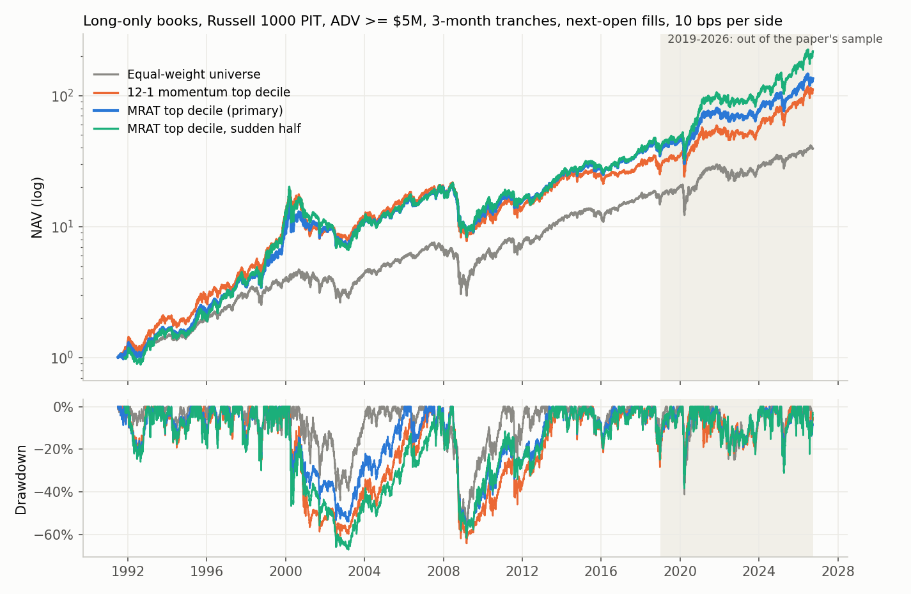
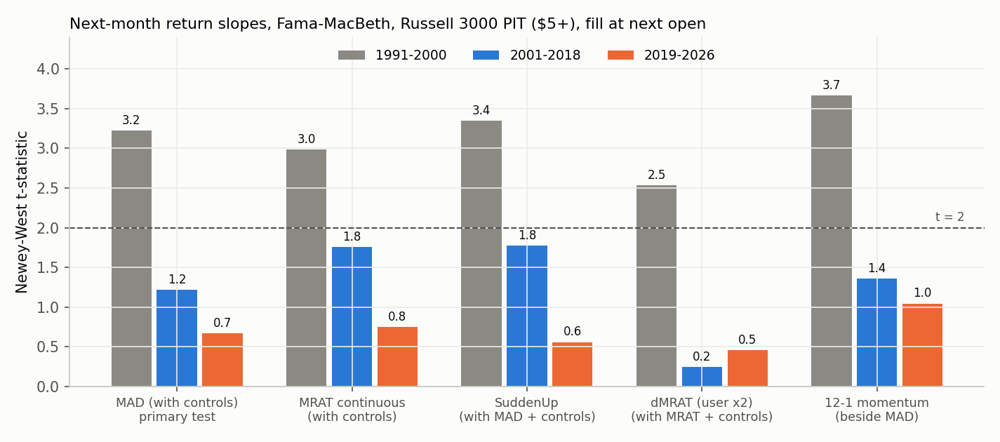

<!-- GENERATED FILE. EDIT THE CANONICAL KNOWLEDGE RECORD. -->

# Moving Average Distance (MA21/MA200, Avramov-Kaplanski-Subrahmanyam) on US PIT universes

!!! warning "Research-only"
    This page summarizes saved research evidence. It does not authorize LIVE, allocation, or deployment.

## TL;DR

> **Verdict:** REJECTED. MRAT reproduces in construction and works in 1991-2000, is flat 2001-2018, and fails out of sample 2019-2026 (primary FM t 0.67). The R1000 top-decile book is ~0.85x a momentum book: Sharpe 0.80 vs momentum 0.83 vs EW 0.66 OOS; alpha vs [EW, MOM] +0.3%/yr (t 0.13). Suddenness is weakly positive but concentrated in bubble names/years; forward hypothesis only.

> **Status:** `diagnostic`

> **Disposition:** `rejected`

> **Replication:** `directionally_replicated`

## Research question

Does MRAT/MAD predict US stock returns beyond momentum and the 52-week high, out of the paper's sample, and does a liquid long-only top-MRAT book beat EW and momentum after costs?

## Exact setup

| Field | Value |
| --- | --- |
| Signal family | cross_sectional_momentum_trend |
| Universe | ["Russell 3000 PIT $5+ (diagnostics)", "S&P 500, Russell 1000, Russell 3000 PIT with ADV >= $5M (books)"] |
| Decision | Close_t, last session of each month |
| Fill | Open_T+1 |
| Primary cost layer | central_research |
| Last reviewed | 2026-10-02T00:38:51+03:00 |

## Timing and overnight attribution

```text
information available: Close_t, last session of each month
primary executable fill: Open_T+1
```

If final `Close_T` data formed the signal, a hypothetical `Close_T` entry is diagnostic only unless a separate pre-close protocol was modeled. Comparing that diagnostic with `Open_(T+1)` and applying the compounded return identity shows whether the apparent edge occurred in the overnight gap. Missing attribution numbers mean **not tested**, not zero.

| Attribution field | Value |
| --- | --- |
| Status | tested |
| Diagnostic Path | Close_t to Open_(t'+1) |
| Executable Path | Open_(t+1) to Open_(t'+1) |
| Method | same-exit comparison of the EW top decile and its excess over the universe |
| Headline Result | about 0.13%/month of the top-decile return is the entry overnight gap; excess over the universe changes little (0.50 vs 0.44%/month full period) |
| Metrics | {"d10_minus_univ_diag_full": 0.504, "d10_minus_univ_exec_full": 0.442, "overnight_gap_pct_month_full": 0.127} |
| Artifact | pakal-research/reports/moving_average_distance_study/tables/timing_attribution_all.csv |

## Primary metrics

| Metric | Value |
| --- | ---: |
| Period | 1991-07..2026-09 (validation 2019-01..2026-09) |
| Universe | U_R1000L, MRAT top decile, 3-month tranches |
| Cost Layer | central_research 10 bps per side |
| Cagr | 14.94% |
| Annualized Volatility | 23.64% |
| Sharpe | 0.708 |
| Maximum Drawdown | -60.06% |
| Turnover | 256.38% |

## Four separate verdicts

| Question | Conclusion |
| --- | --- |
| Source Replication | directionally replicated: same construction (mean 1.04, turnover 34%) and sign; momentum not subsumed; suddenness explains less |
| Predictive Value | positive 1991-2000, flat 2001-2018, insignificant 2019-2026 (all 11 family tests Holm p = 1) |
| Economic Value | none beyond 12-1 momentum after costs in S&P 500, R1000 or liquid R3000 |
| Promotion | none; suddenness frozen as forward diagnostic only |

## Key findings

| Feature | Role | Direction | Status | Effect | Action |
| --- | --- | --- | --- | --- | --- |
| MRAT = MA21/MA200 (continuous) | rank | positive | rejected | 0.29%/month per sd 1991-2018, 0.14 2019-2026 | do not use beyond 12-1 momentum |
| MAD discrete (decile + 1 sigma) | signal | positive | rejected | 0.30%/month 1991-2018 with controls; 0.15 2019-2026 | none |
| SuddenUp / sudden-minus-gradual | filter | positive | forward_hypothesis | +0.25%/month (t 1.4) and +0.61%/month (t 1.6) EW | forward diagnostic only |
| dMRAT (user x2) | signal | positive | rejected | t 1.7 discovery, 0.46 validation | none |
| Golden cross level dummy | diagnostic | positive | diagnostic | t 2.4 discovery, 1.4 validation | none |

## Visual evidence






## Limitations

- paper text inaccessible; rules from commentary
- R3000 instead of all CRSP, sample from 1991
- no market cap (ADV-weighted VW proxy)
- no accounting controls
- FF3 + own UMD instead of FF5 + UMD
- 2019-2026 previously seen for related momentum signals in this workspace

## Next gates

- optional forward diagnostic: EW sudden-minus-gradual inside the top MRAT decile from 2026-10; kill if 24-month t < 1

## Sources

- `https://aligrithm.com/moving-average-distance-the-technical-indicator-that-passed-the-cross-section/`
- `Avramov, Kaplanski, Subrahmanyam (2021) Review of Financial Economics 39(2):127-145, SSRN 3111334`
- `user note 2026-10-01`

## Canonical artifacts

| Artifact | Pakal path |
| --- | --- |
| Concise Report | `pakal-research/reports/moving_average_distance_study/REPORT.md` |
| Full Report | `pakal-research/reports/moving_average_distance_study/REPORT_FULL.md` |
| Notebook | `pakal-research/moving_average_distance_study.ipynb` |
| Frozen Specification | `pakal-research/reports/moving_average_distance_study/research_spec_frozen.json` |
| Manifest | `pakal-research/reports/moving_average_distance_study/run_manifest.json` |
| Primary Source Code | `["pakal-research/moving_average_distance/mad_lib.py", "pakal-research/moving_average_distance/mad_stage1_diagnostics.py", "pakal-research/moving_average_distance/mad_stage2_books.py", "pakal-research/moving_average_distance/mad_stage3_concentration.py", "pakal-research/moving_average_distance/mad_multiplicity.py", "pakal-research/moving_average_distance/mad_charts.py", "pakal-research/moving_average_distance/mad_record.py", "pakal-research/moving_average_distance/mad_build_artifacts.py", "pakal-research/moving_average_distance/test_mad_timing.py"]` |
| Primary Tables | `["pakal-research/reports/moving_average_distance_study/tables/f1_f2_fama_macbeth_all.csv", "pakal-research/reports/moving_average_distance_study/tables/f1_f2_holm.csv", "pakal-research/reports/moving_average_distance_study/tables/f4_book_stats_all.csv", "pakal-research/reports/moving_average_distance_study/tables/stage3_suddenness_concentration.csv"]` |
| Primary Charts | `["pakal-research/reports/moving_average_distance_study/charts/fm_tstats_by_period.png", "pakal-research/reports/moving_average_distance_study/charts/r1000_books_equity_drawdown.png", "pakal-research/reports/moving_average_distance_study/charts/spread_cumulative.png", "pakal-research/reports/moving_average_distance_study/charts/yearly_excess_vs_ew.png"]` |
| Source Rule Map | `pakal-research/reports/moving_average_distance_study/SOURCE_RULE_MAP.md` |
| Research State | `pakal-research/reports/moving_average_distance_study/research_state.json` |
| Hypothesis Registry | `pakal-research/reports/moving_average_distance_study/hypothesis_registry.json` |
| Experiment Ledger | `pakal-research/reports/moving_average_distance_study/experiment_ledger.jsonl` |
| Decision Log | `pakal-research/reports/moving_average_distance_study/decision_log.jsonl` |
