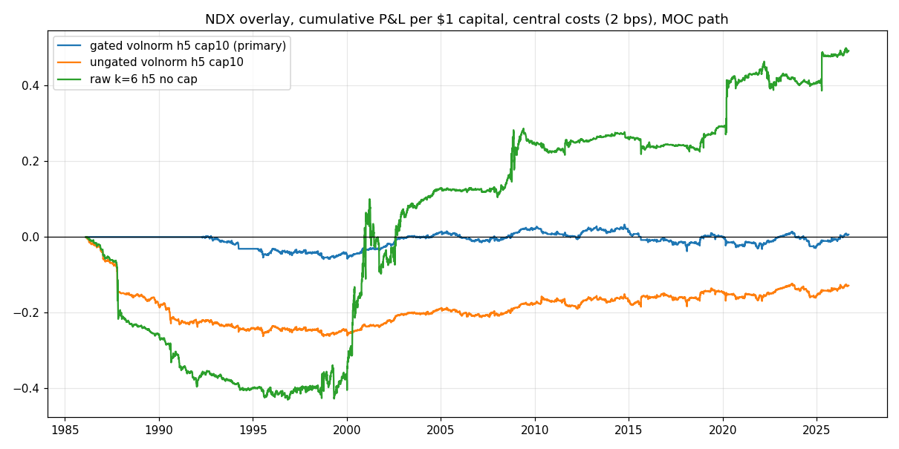
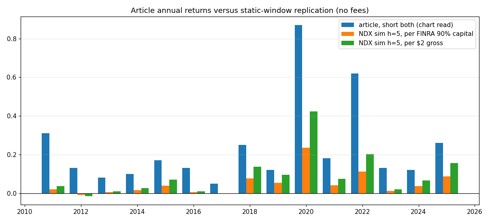

<!-- GENERATED FILE. EDIT THE CANONICAL KNOWLEDGE RECORD. -->

# LETF volatility-decay capture reframed as an NDX variance-ratio overlay

!!! warning "Research-only"
    This page summarizes saved research evidence. It does not authorize LIVE, allocation, or deployment.

## TL;DR

> **Verdict:** Reject for promotion. The pre-declared primary configuration (vol-normalised sizing plus a causal VR gate) failed: central-cost Sharpe 0.14 after 2000 and -0.06 in 2011-2025 with bootstrap intervals spanning zero. The raw k=6 five-session overlay shows a real but modest, regime-dependent, window-phase-dependent bet (central Sharpe 0.44 after 2000, sign-flip q=0.037 in 2011-2025, negative before 2000 and across most SPX decades, roughly zero in 2010-2019) that loses about half its P&L when filled at Open_(t+1). The LETF wrapper only adds borrow, 90 percent margin and a rate-dependent carry that was -4.75 percent per year per USD2 gross in 2023-2025 before borrow. Identity P&L = (k/2)(sum r^2 - (sum r)^2) verified to 1e-12; the article's Sharpe 5.32 is not reproducible.

> **Status:** `diagnostic`

> **Disposition:** `rejected`

> **Replication:** `identity_verified_source_numbers_not_reproduced`

## Research question

Re-express the Valuelytica short TQQQ/SQQQ 'volatility decay capture' trade as its exact content, a bet that the Nasdaq-100 variance ratio is below one inside the rebalance window, and test whether a contrarian overlay in the underlying retains a causal, cost-adjusted, regime-robust and executable edge.

## Exact setup

| Field | Value |
| --- | --- |
| Signal family | index_daily_mean_reversion_variance_ratio |
| Universe | ["NDX index closes 1985-2026 (primary)", "SPX index closes 1928-2026 (regime control)", "QQQ, SPY total-return open/close", "ES continuous futures open/close", "TQQQ, SQQQ, UPRO, SPXU total-return closes for wrapper economics"] |
| Decision | Close_(t-1): cumulative return since anchor, trailing 63-session volatility and trailing 252-session VR(5) |
| Fill | Paper-like market-on-close at Close_(t-1); executable Open_t held to Open_(t+1) |
| Primary cost layer | central_research |
| Last reviewed | 2026-09-13T01:40:00+03:00 |

## Timing and overnight attribution

```text
information available: Close_(t-1): cumulative return since anchor, trailing 63-session volatility and trailing 252-session VR(5)
primary executable fill: Paper-like market-on-close at Close_(t-1); executable Open_t held to Open_(t+1)
```

If final `Close_T` data formed the signal, a hypothetical `Close_T` entry is diagnostic only unless a separate pre-close protocol was modeled. Comparing that diagnostic with `Open_(T+1)` and applying the compounded return identity shows whether the apparent edge occurred in the overnight gap. Missing attribution numbers mean **not tested**, not zero.

| Attribution field | Value |
| --- | --- |
| Status | tested |
| Diagnostic Path | Market-on-close fill at Close_(t-1), matching the daily LETF reset. |
| Executable Path | Fill at Open_t on the position fixed after Close_(t-1), hold to Open_(t+1), final session marked at Close_t. |
| Method | Exact dollar split of the paper-like P&L into overnight and intraday components; executable path computed on the same positions; retention ratios and bootstrap intervals reported. |
| Headline Result | QQQ raw h=5: central Sharpe 0.49 (MOC) versus 0.21 (Open_(t+1)) in 2011-2025 and 0.41 versus 0.31 after 2000; overnight share of the gross MOC P&L 38 percent (2011-2025) and 33 percent (post-2000). |
| Metrics | {"es_open_sharpe_2011_2025": 0.31, "qqq_executable_retention_2011_2025": 0.487, "qqq_executable_retention_post_2000": 0.812, "qqq_moc_sharpe_2011_2025": 0.485, "qqq_open_sharpe_2011_2025": 0.208} |
| Artifact | tables/overnight_intraday_attribution.csv |

## Primary metrics

| Metric | Value |
| --- | ---: |
| Period | 2000-01-03 to 2026-09-11, declared primary configuration NDX\|h5\|cap0.10\|volnorm\|vr5_lt_1, paper-like MOC path |
| Universe | NDX index closes |
| Cost Layer | 2 bps one-way on \|delta position\| |
| Cagr | 0.19% |
| Annualized Volatility | 1.37% |
| Sharpe | 0.136 |
| Maximum Drawdown | -6.90% |
| Turnover | 1130.00% |

## Four separate verdicts

| Question | Conclusion |
| --- | --- |
| Source Replication | Identity reproduced exactly (article two-day example and window test). Static five-session short-both on NDX gives 8.7 percent per year per USD2 gross, 13 of 15 positive years, annual Sharpe 0.78 and correlation 0.92 with the article's chart values; the article's 22 percent CAGR implies an undisclosed capital base or threshold rule, and its Sharpe 5.32 is inconsistent with its own annual dispersion (1.05). |
| Predictive Value | Sign-flip null rejects no-autocorrelation after 2000 (q<=0.001) and marginally in 2011-2025 (h=5 uncapped q=0.037, the only member of 15 with q<=0.05); the same bet was significantly negative in 1986-1999 and for most of the SPX record since 1928. Anchor-phase Sharpe spans 0.21-0.81 in 2011-2025. |
| Economic Value | Raw gated h=5 cap 10 percent overlay: 1.7 percent per year per USD1 capital at 4.1 percent volatility, Sharpe 0.43 at 2 bps and 0.30 at 5 bps plus financing over 1986-2026; executable Open_(t+1) retention 40-50 percent in 2011-2025 for QQQ/SPY, about 100 percent for ES because its open is the Globex evening open. |
| Promotion | Rejected for PAPER, LIVE, allocation and broker wiring. The surviving raw line was identified after the grid was seen and cannot serve as promotion evidence. |

## Key findings

| Feature | Role | Direction | Status | Effect | Action |
| --- | --- | --- | --- | --- | --- |
| LETF pair short identity P&L = (k/2)(sum r^2 - (sum r)^2) | signal definition | exact | verified | correlation 0.9997 with exact LETF simulation; article two-day example reproduced | never backtest the LETF wrapper; test the variance-ratio bet directly |
| contrarian overlay p_t = -k C_{t-1}, five-session windows, raw sizing | entry signal / position sizing | positive after 2000, negative before 2000 | diagnostic | central Sharpe 0.44 after 2000, 0.35 in 2011-2025, -0.59 in 1986-1999 | diagnostic only; re-register as a phase ensemble before any shadow tracking |
| vol-normalised sizing k*(target/sigma)^2 | position sizing | destroys the edge | rejected | post-2000 Sharpe 0.29 versus 0.61 for raw sizing at the same horizon and cap | do not use |
| causal VR(5) < 1 gate on 252 sessions | market regime | neutralises the pre-2000 loss | diagnostic | 1986-1999 Sharpe -0.44 to 0.01; post-2000 0.61 to 0.57; full sample 0.27 to 0.43 | keep as a stand-down rule in any future registration |
| LETF wrapper carry (tracking difference versus 3x daily) | cost / financing | sign flips with the cash rate | verified | +3.1 percent per year per USD2 gross in 2011-2016, -4.75 percent in 2023-2025 before borrow of 3.64 percent | never short the inverse leg without near-full rebate |

## Visual evidence






## Limitations

- The article's rebalance threshold, capital base and index series are undisclosed; chart values were read from an image.
- Index opens are unusable, so the overnight/intraday attribution rests on QQQ (1999+), SPY (1993+) and ES (1997+).
- NQ continuous futures are not in the local Norgate database; ES stands in for the futures path.
- The MOC protocol assumes a fill at the official close; the last minutes are not modelled from intraday data.
- Borrow history and rebate tiers are unavailable; point-in-time rates were used.
- The article's 2011-2025 sample and a scratch fixed-window diagnostic were seen before the specification was frozen.
- The surviving raw configuration was identified after the grid was run.

## Next gates

- Pre-register a phase ensemble (raw k=6, h=5, cap 10 percent, VR<1 gate) on NQ/ES only and shadow-log it through 2027 without parameter changes.
- Measure how much of the overnight component a 15:50 MOC order captures using intraday data.
- Pre-register the top-quintile |r_{t-1}| conditional version with a 2000-2017 discovery and 2018+ validation split.

## Sources

- `C:/Users/User/Downloads/MA KORE PO.pdf`
- `https://valuelytica.substack.com/p/vdc-qqq`
- `https://chartexchange.com/symbol/nasdaq-tqqq/borrow-fee/`
- `https://chartexchange.com/symbol/nasdaq-sqqq/borrow-fee/`
- `https://www.finra.org/rules-guidance/notices/09-53`
- `Norgate US Equities and Futures databases as of 2026-09-12`

## Canonical artifacts

| Artifact | Pakal path |
| --- | --- |
| Concise Report | `pakal-research/reports/ndx_variance_ratio_overlay_study/REPORT.md` |
| Full Report | `pakal-research/reports/ndx_variance_ratio_overlay_study/REPORT_FULL.md` |
| Notebook | `pakal-research/ndx_variance_ratio_overlay_study.ipynb` |
| Frozen Specification | `pakal-research/reports/ndx_variance_ratio_overlay_study/research_spec_frozen.json` |
| Manifest | `pakal-research/reports/ndx_variance_ratio_overlay_study/run_manifest.json` |
| Source Rule Map | `pakal-research/reports/ndx_variance_ratio_overlay_study/SOURCE_RULE_MAP.md` |
| Primary Source Code | `["pakal-research/ndx_variance_ratio_overlay_study.py", "pakal-research/build_ndx_variance_ratio_overlay_notebook.py", "pakal-research/build_ndx_variance_ratio_overlay_manifest.py", "tests/test_ndx_variance_ratio_overlay_study.py"]` |
| Primary Tables | `["pakal-research/reports/ndx_variance_ratio_overlay_study/tables/headline_summary.csv", "pakal-research/reports/ndx_variance_ratio_overlay_study/tables/grid_performance.csv", "pakal-research/reports/ndx_variance_ratio_overlay_study/tables/inference_sign_flip.csv", "pakal-research/reports/ndx_variance_ratio_overlay_study/tables/bootstrap_sharpe.csv", "pakal-research/reports/ndx_variance_ratio_overlay_study/tables/overnight_intraday_attribution.csv", "pakal-research/reports/ndx_variance_ratio_overlay_study/tables/anchor_phase_sensitivity.csv", "pakal-research/reports/ndx_variance_ratio_overlay_study/tables/letf_wrapper_carry_scenarios.csv", "pakal-research/reports/ndx_variance_ratio_overlay_study/tables/article_replication_summary.csv"]` |
| Primary Charts | `["pakal-research/reports/ndx_variance_ratio_overlay_study/charts/primary_equity.png", "pakal-research/reports/ndx_variance_ratio_overlay_study/charts/horizon_cap_surface.png", "pakal-research/reports/ndx_variance_ratio_overlay_study/charts/rolling_variance_ratio_gate.png", "pakal-research/reports/ndx_variance_ratio_overlay_study/charts/overnight_intraday_split.png", "pakal-research/reports/ndx_variance_ratio_overlay_study/charts/letf_wrapper_carry.png", "pakal-research/reports/ndx_variance_ratio_overlay_study/charts/article_vs_replication.png"]` |
