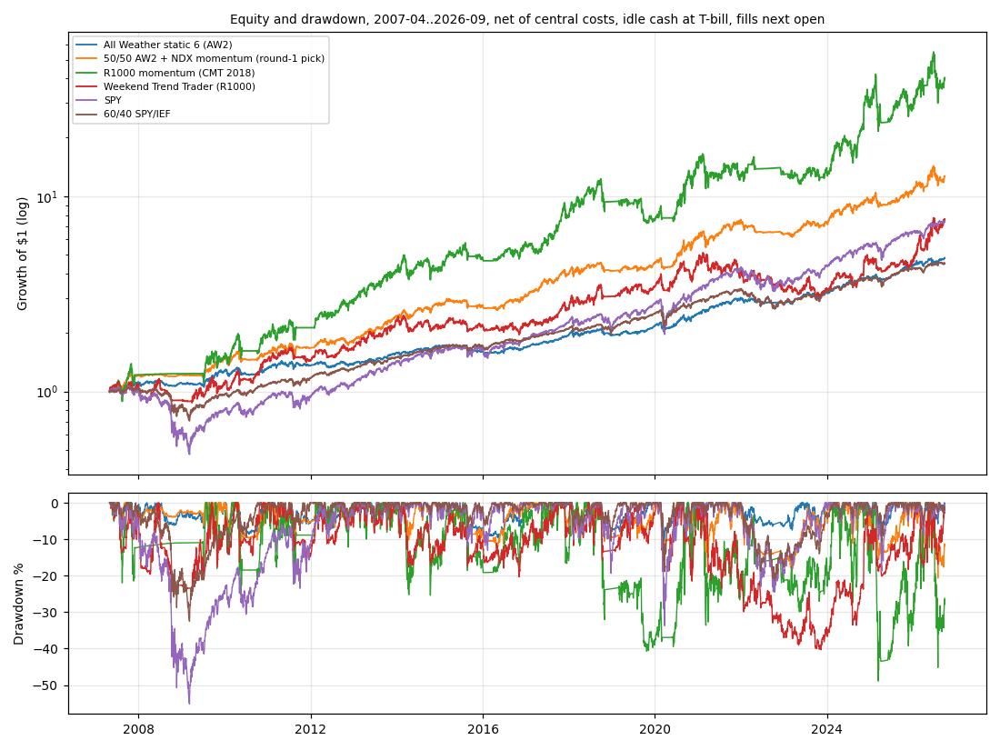
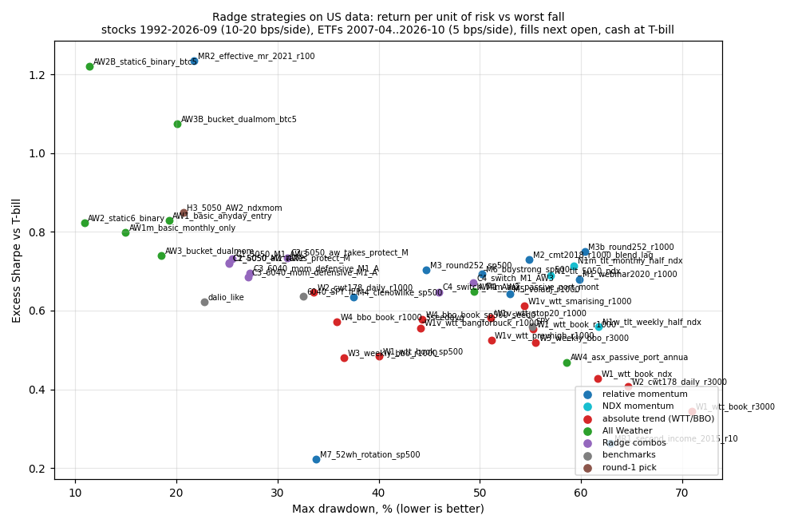

<!-- GENERATED FILE. EDIT THE CANONICAL KNOWLEDGE RECORD. -->

# Nick Radge (The Chartist) strategies and tips on US data: replication, robustness, and one deployable synthesis

!!! warning "Research-only"
    This page summarizes saved research evidence. It does not authorize LIVE, allocation, or deployment.

## TL;DR

> **Verdict:** Extracted strategy: RAW-6, Radge's US All Weather static roster.
- Rules: SPY/QQQ/IOO 20% each and GLD/TLT/DBC 13.33% each. An ETF is held only while its month-end close is above SMA210; otherwise its weight sits in T-bills. Rebalanced monthly, filled at the next open.
- Results: 8.6%/yr, excess Sharpe 0.82 (0.97 for 2016-2026), max drawdown -10.9% (2007-2026). Proxies over 1991-2026: Sharpe 0.83, max drawdown -14.6%. Benchmark 60/40: Sharpe 0.64, drawdown -32%.
- Status: forward_hypothesis for a standalone account. It is redundant with the G3 book (corr 0.81; dominated by the TAA pods).
- Relative momentum works (about 22%/yr, Sharpe ~0.7) but crashes 43-60% in fast reversals. The owner already runs its NDX form (ndx_L).
- Absolute trend (WTT, BBO) fails in the US, as Radge himself says.
- Mean reversion died after 2016.
- The regime-filter menu and the other tips add nothing over a plain SMA200.

> **Status:** `forward_hypothesis`

> **Disposition:** `candidate`

> **Replication:** `directionally_replicated`

## Research question

Which of Nick Radge's publicly specified strategies and tips survive an executable point-in-time US test (stocks 1992-2026, ETFs 2007-2026, proxies 1991-2026), and which single strategy should be extracted for a forward paper shadow.

## Exact setup

| Field | Value |
| --- | --- |
| Signal family | long_only_momentum_trend_and_tactical_asset_allocation |
| Universe | ["R1000 PIT", "S&P 500 PIT", "Nasdaq-100 PIT", "R3000 PIT liquid", "R1000 ex top-100 (turnover proxy)", "US ETFs SPY QQQ QLD IOO EFA EEM IWM IEF TLT TIP GLD DBC GBTC/IBIT IEI AOR", "1991- proxies: $SPXTR, $NDX, XAUUSD, $BCOMTR, synthetic par Treasuries"] |
| Decision | Close_T (month end for momentum and All Weather; week end for WTT; daily for BBO, CWT178 and mean reversion) |
| Fill | Open_T+1. Mean reversion uses a day-limit at min(Open, limit). Proxy rows fill at Close_T+1. |
| Primary cost layer | central_research |
| Last reviewed | 2026-10-06T10:00:00+03:00 |

## Timing and overnight attribution

```text
information available: Close_T (month end for momentum and All Weather; week end for WTT; daily for BBO, CWT178 and mean reversion)
primary executable fill: Open_T+1. Mean reversion uses a day-limit at min(Open, limit). Proxy rows fill at Close_T+1.
```

If final `Close_T` data formed the signal, a hypothetical `Close_T` entry is diagnostic only unless a separate pre-close protocol was modeled. Comparing that diagnostic with `Open_(T+1)` and applying the compounded return identity shows whether the apparent edge occurred in the overnight gap. Missing attribution numbers mean **not tested**, not zero.

| Attribution field | Value |
| --- | --- |
| Status | tested |
| Diagnostic Path | Close_T same-close fill |
| Executable Path | Open_T+1 to the same exits |
| Method | Rerun with Open_(t+1) replaced by Close_t; same signals and exits |
| Headline Result | Next-open fills keep almost all of the same-close result (M1 0.680 vs 0.689; M2 0.730 vs 0.737; AW2 0.823 vs 0.850). |
| Metrics | {"AW2_next_open_sharpe": 0.823, "AW2_same_close_sharpe": 0.85, "M1_next_open_sharpe": 0.68, "M1_same_close_sharpe": 0.689} |
| Artifact | pakal-research/reports/nick_radge_strategies_study/tables/timing_attribution.csv |

## Primary metrics

| Metric | Value |
| --- | ---: |
| Period | 2007-04-02..2026-10-05 |
| Universe | AW2 static roster: SPY QQQ IOO GLD TLT DBC + T-bills |
| Cost Layer | central_research (5 bps per side ETFs) |
| Cagr | 8.60% |
| Annualized Volatility | 8.70% |
| Sharpe | 0.823 |
| Maximum Drawdown | -10.90% |
| Turnover | monthly rebalance; about 2-3% one-way per month (see F4 summary avg_turnover_per_rebalance) |

## Four separate verdicts

| Question | Conclusion |
| --- | --- |
| Source Replication | Directionally replicated. Monthly correlation with the vendor's own series: US Momentum 0.70-0.73, TLT/NDX 0.84, US All Weather 0.72 (0.84 with bitcoin). Vendor levels (22-30% CAGR combos, -13..-19% DD) are not reproduced. The vendor's high-frequency mean-reversion book is not reproduced after 2016. |
| Predictive Value | Momentum ranks carry a crash-prone premium: a plateau of 0.54-0.77 Sharpe over 27 cells, and robust to +/-5% price noise. Per-asset 10-month trend on a fixed ETF roster halves drawdowns versus the same assets untimed. Absolute breakouts are weak in US stocks (WTT R3000 0.34; about 0 after 2016). |
| Economic Value | AW2 is cost-insensitive (conservative-cost Sharpe 0.80) and liquid with ACWI/PDBC substitutes (Sharpe 0.80). Momentum books earn 20-24% per year but with drawdowns of -45..-60%. Radge's combinations do not beat All Weather alone on a risk-adjusted basis. |
| Promotion | AW2: forward_hypothesis, paper shadow only. It passes the standalone gates: post-2016 Sharpe 0.97 vs 0.71 for 60/40, max drawdown -10.9%, bootstrap P 0.81, no single-year dependence. It fails the book-fit gate (G3 1.183 -> 1.169 at 20%). Round-1 synthesis rejected on the locked 2016-2026 holdout. |

## Key findings

| Feature | Role | Direction | Status | Effect | Action |
| --- | --- | --- | --- | --- | --- |
| index_regime_filter_SMA200 | regime | reduces drawdown in slow bears | confirmed | momentum DD -81% -> -60% (no filter vs SMA200), Sharpe 0.62 -> 0.68 | keep as the default; no need to replace |
| breadth_and_vix_regime_filters | regime | worse than SMA200 | rejected | -0.07..-0.13 Sharpe on momentum; deeper drawdowns | do not use |
| diversified_regime_filters | regime | no gain | rejected | 0.61 vs 0.68 (momentum), 0.58 vs 0.55 (WTT) | do not use |
| absolute_trend_breakout_WTT | signal | weak in US | rejected | Sharpe 0.34-0.61; R3000 0.07 after 2016 | do not trade on US stocks |
| relative_momentum_rank_ROC | rank | positive, crash-prone | confirmed | Sharpe 0.68-0.75, CAGR 20-24% | already in the book as ndx_L; no new sleeve |
| rank_lag_and_gap_skip | exit | small positive | inconclusive | +0.05 Sharpe, fewer trades | freeze_as_forward_hypothesis for the L pod |
| annual_reopt_most_volatile_parameter | validation | small gain vs a weak fixed choice | inconclusive | 0.72 vs 0.67; equals fixed SMA200 (0.74) | use longer stock filters; skip the ritual |
| per_asset_10m_trend_on_ETF_roster | regime | halves drawdowns | confirmed | AW1 timed 0.83 / -19% vs the same roster untimed 0.74 / -40% | paper shadow RAW-6 |
| radge_mean_reversion | signal | decayed | rejected | RSI2 Sharpe 1.82 pre-2016, -0.25 after | do not use |
| momentum_plus_all_weather_combos | sizing | no risk-adjusted gain | rejected | 0.65-0.73 vs AW2 0.82 | do not use |

## Visual evidence






## Limitations

- The paid rules (US Momentum vol filter, Portfolio Protect, exact US All Weather list and weights, WTT ebook values) are undisclosed. Our versions are reconstructions, not replications.
- The vendor monthly series mix backtest and live data without a flag, so they are a shape target only.
- ETF sample 2007-2026; the long-history proxies are approximations (DBC vs BCOM TR corr 0.88).
- Bitcoin is available only from 2015, so the 5% sleeve cannot be validated in the discovery window.
- Size proxy = turnover rank, not market cap; breadth comes from index members, not the NYSE feed.
- Stock panel ends 2026-09-25; the book series ends 2026-07-24.

## Next gates

- 12-month paper shadow of RAW-6 with frozen rules (ACWI/PDBC substitutes allowed). Review 2027-10: excess Sharpe >= 0.6 and drawdown <= 12%.
- Optional: rank lag 10/20 and a 25% gap skip on the live L pod as a forward hypothesis, under a new frozen spec (not tuned here).

## Sources

- `S1 Algorithmic Advantage ep. 44 transcript (sha256 7301ccc2...)`
- `S2 thechartist.com.au extraction 2026-10-06 (sha256 4bddfa26...)`
- `S3 thechartist.com.au /performance/ monthly series 2007-2025 (sha256 5197e1e6...)`
- `S4 off-site: WTT ebook quotes, Unholy Grails, tradelongterm.com Wayback, Radge tweets, BST/CWT podcasts, Alvarez 2014`

## Canonical artifacts

| Artifact | Pakal path |
| --- | --- |
| Concise Report | `pakal-research/reports/nick_radge_strategies_study/REPORT.md` |
| Full Report | `pakal-research/reports/nick_radge_strategies_study/REPORT_FULL.md` |
| Notebook | `pakal-research/reports/nick_radge_strategies_study/nick_radge_strategies_study.ipynb` |
| Frozen Specification | `pakal-research/reports/nick_radge_strategies_study/research_spec_frozen.json` |
| Manifest | `pakal-research/reports/nick_radge_strategies_study/run_manifest.json` |
| Primary Source Code | `["pakal-research/nick_radge_strategies/nrs_engine.py", "pakal-research/nick_radge_strategies/nrs_stock_strategies.py", "pakal-research/nick_radge_strategies/nrs_all_weather.py", "pakal-research/nick_radge_strategies/nrs_run_literal.py", "pakal-research/nick_radge_strategies/nrs_run_tips.py", "pakal-research/nick_radge_strategies/nrs_round1.py"]` |
| Primary Tables | `["pakal-research/reports/nick_radge_strategies_study/tables/all_variants_summary.csv", "pakal-research/reports/nick_radge_strategies_study/tables/promotion_checks.csv", "pakal-research/reports/nick_radge_strategies_study/tables/vendor_replication.csv", "pakal-research/reports/nick_radge_strategies_study/tables/R1_holdout_2016_2026.csv"]` |
| Primary Charts | `["pakal-research/reports/nick_radge_strategies_study/charts/01_strategy_map_sharpe_vs_drawdown.png", "pakal-research/reports/nick_radge_strategies_study/charts/02_equity_drawdown_2007_2026.png", "pakal-research/reports/nick_radge_strategies_study/charts/03_regime_filter_family.png"]` |
| Research State | `pakal-research/reports/nick_radge_strategies_study/research_state.json` |
| Hypothesis Registry | `pakal-research/reports/nick_radge_strategies_study/hypothesis_registry.json` |
| Experiment Ledger | `pakal-research/reports/nick_radge_strategies_study/experiment_ledger.jsonl` |
| Decision Log | `pakal-research/reports/nick_radge_strategies_study/decision_log.jsonl` |
| Source Rule Map | `pakal-research/reports/nick_radge_strategies_study/SOURCE_RULE_MAP.md` |
