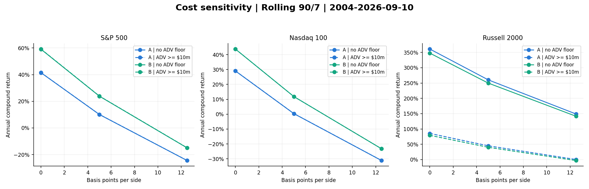
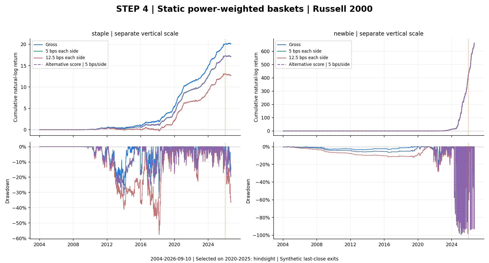

<!-- GENERATED FILE. EDIT THE CANONICAL KNOWLEDGE RECORD. -->

# Overnight Stock Selection - Complete Corrected Reconstruction

!!! warning "Research-only"
    This page summarizes saved research evidence. It does not authorize LIVE, allocation, or deployment.

## TL;DR

> **Verdict:** Full corrected recomputation completed and reconciled. Static Russell2000 staple backcast remains 142.8% gross / 112.8% CAGR at 5bps per side, with hindsight. Rolling results are strongly universe, score, liquidity and period dependent; deep drawdowns, extreme prices, synthetic exits and missing source inputs prevent exact replication or promotion.

> **Status:** `diagnostic`

> **Disposition:** `inconclusive`

> **Replication:** `not_reproducible`

## Research question

Recompute every disclosed source stage from immutable security histories using consistent last-known-close exits and 5bps per side; reconcile previous corrected results and explain stage-specific source discrepancies.

## Exact setup

| Field | Value |
| --- | --- |
| Signal family | overnight_return_persistence |
| Universe | ["S&P 500", "Nasdaq 100", "Russell 2000"] |
| Decision | Rolling primary: before Close_T, 90 overnight returns ending Open_(T-1); companion ends Open_T. Static baskets use full 2020-2025 retrospectively. |
| Fill | Close_T to Open_(T+1); last-known Close_T synthetic fallback if exit absent |
| Primary cost layer | central_research |
| Last reviewed | 2026-09-11T13:20:36.336680+00:00 |

## Timing and overnight attribution

```text
information available: Rolling primary: before Close_T, 90 overnight returns ending Open_(T-1); companion ends Open_T. Static baskets use full 2020-2025 retrospectively.
primary executable fill: Close_T to Open_(T+1); last-known Close_T synthetic fallback if exit absent
```

If final `Close_T` data formed the signal, a hypothetical `Close_T` entry is diagnostic only unless a separate pre-close protocol was modeled. Comparing that diagnostic with `Open_(T+1)` and applying the compounded return identity shows whether the apparent edge occurred in the overnight gap. Missing attribution numbers mean **not tested**, not zero.

| Attribution field | Value |
| --- | --- |
| Status | tested |
| Method | Primary lag1 vs latest-open lag0, same close-to-next-open exit; following intraday retained as unheld diagnostic |
| Headline Result | Lag0 changes magnitude, does not resolve input/auction/cap gaps |
| Artifact | C:\\Users\\User\\Documents\\workspace\\pakal\\pakal-research\\reports\\overnight_effect_corrected_full_study\\tables\\timing_attribution.csv |

## Primary metrics

| Metric | Value |
| --- | ---: |
| Period | 2004-01-05 to 2026-09-10 |
| Universe | Three separate historical indices; no chosen winner |
| Cost Layer | 5bps each side |
| Cagr | N/A |
| Annualized Volatility | N/A |
| Sharpe | N/A |
| Maximum Drawdown | N/A |
| Turnover | N/A |

## Four separate verdicts

| Question | Conclusion |
| --- | --- |
| Source Replication | Every disclosed stage recomputed under user assumptions; original source inputs unavailable, so exact reproduction incomplete |
| Predictive Value | No fresh holdout; static results are selected with hindsight and rolling historical associations remain descriptive |
| Economic Value | Positive in some cases but sensitive to liquidity, scoring and periods; large drawdowns and synthetic exits |
| Promotion | Research only; no trading or allocation approval |

## Key findings

| Feature | Role | Direction | Status | Effect | Action |
| --- | --- | --- | --- | --- | --- |
| Known-entry-close fallback | exit | Remove artificial full loss on a missing quote | diagnostic | R2000 static staple corrected CAGR 142.8% gross /112.8% at5bps-side | Retain explicit assumption, audit actual settlements |
| Prior ADV63 >= USD10m | liquidity | Exclude low dollar turnover | diagnostic | R2000 rolling CAGR ~250-260% without floor versus ~40-45% with floor, central fees | Keep separate from source cap filter; no allocation |

## Visual evidence






## Limitations

- Prior history already inspected; no fresh validation
- Author notebook and exact portfolios/weights unavailable
- Different universe and data vendor
- Historical market capitalization absent; ADV is not market cap
- Same-close official prices and synthetic last-close exits are unverified fills
- Current-vintage corporate-action adjustments
- Extreme penny-stock/OTC overnight returns retained and audited
- Static backcasts contain deliberate hindsight
- Rolling top10 count inherited from static stage; dynamic text does not independently establish that limit

## Next gates

- Obtain source code/weights and historical cap; audit influential low-price and missing-exit observations before any economic or prospective claim

## Sources

- `{"location": "C:\\\\Users\\\\User\\\\Downloads\\\\TheOVerNight.pdf", "pages": 14, "read_complete": true, "role": "literal article", "sha256": "7c2c6d9defeae2433ed15012ca7b299b7aa93f2bd8e6a688b3e12de26816c782", "source_id": "S1"}`

## Canonical artifacts

| Artifact | Pakal path |
| --- | --- |
| Concise Report | `C:\\Users\\User\\Documents\\workspace\\pakal\\pakal-research\\reports\\overnight_effect_corrected_full_study\\REPORT.md` |
| Full Report | `C:\\Users\\User\\Documents\\workspace\\pakal\\pakal-research\\reports\\overnight_effect_corrected_full_study\\REPORT_FULL.md` |
| Notebook | `C:\\Users\\User\\Documents\\workspace\\pakal\\pakal-research\\overnight_effect_corrected_full_study.ipynb` |
| Frozen Specification | `C:\\Users\\User\\Documents\\workspace\\pakal\\pakal-research\\reports\\overnight_effect_corrected_full_study\\research_spec_frozen.json` |
| Manifest | `C:\\Users\\User\\Documents\\workspace\\pakal\\pakal-research\\reports\\overnight_effect_corrected_full_study\\run_manifest.json` |
| Primary Source Code | `["C:\\\\Users\\\\User\\\\Documents\\\\workspace\\\\pakal\\\\pakal-research\\\\overnight_effect_corrected_full_study.py", "C:\\\\Users\\\\User\\\\Documents\\\\workspace\\\\pakal\\\\pakal-research\\\\build_overnight_corrected_full_artifacts.py", "C:\\\\Users\\\\User\\\\Documents\\\\workspace\\\\pakal\\\\pakal-research\\\\finalize_overnight_corrected_full_study.py"]` |
| Primary Tables | `["C:\\\\Users\\\\User\\\\Documents\\\\workspace\\\\pakal\\\\pakal-research\\\\reports\\\\overnight_effect_corrected_full_study\\\\tables\\\\performance_summary.csv", "C:\\\\Users\\\\User\\\\Documents\\\\workspace\\\\pakal\\\\pakal-research\\\\reports\\\\overnight_effect_corrected_full_study\\\\tables\\\\prior_path_parity.csv", "C:\\\\Users\\\\User\\\\Documents\\\\workspace\\\\pakal\\\\pakal-research\\\\reports\\\\overnight_effect_corrected_full_study\\\\tables\\\\independent_accounting.csv"]` |
| Primary Charts | `["C:\\\\Users\\\\User\\\\Documents\\\\workspace\\\\pakal\\\\pakal-research\\\\reports\\\\overnight_effect_corrected_full_study\\\\charts\\\\static_weighted_r2000.png", "C:\\\\Users\\\\User\\\\Documents\\\\workspace\\\\pakal\\\\pakal-research\\\\reports\\\\overnight_effect_corrected_full_study\\\\charts\\\\rolling_r2000.png", "C:\\\\Users\\\\User\\\\Documents\\\\workspace\\\\pakal\\\\pakal-research\\\\reports\\\\overnight_effect_corrected_full_study\\\\charts\\\\cost_sensitivity.png"]` |
| Research State | `C:\\Users\\User\\Documents\\workspace\\pakal\\pakal-research\\reports\\overnight_effect_corrected_full_study\\research_state.json` |
| Hypothesis Registry | `C:\\Users\\User\\Documents\\workspace\\pakal\\pakal-research\\reports\\overnight_effect_corrected_full_study\\hypothesis_registry.json` |
| Experiment Ledger | `C:\\Users\\User\\Documents\\workspace\\pakal\\pakal-research\\reports\\overnight_effect_corrected_full_study\\experiment_ledger.jsonl` |
| Decision Log | `C:\\Users\\User\\Documents\\workspace\\pakal\\pakal-research\\reports\\overnight_effect_corrected_full_study\\decision_log.jsonl` |
| Source Rule Map | `C:\\Users\\User\\Documents\\workspace\\pakal\\pakal-research\\reports\\overnight_effect_corrected_full_study\\SOURCE_RULE_MAP.md` |
