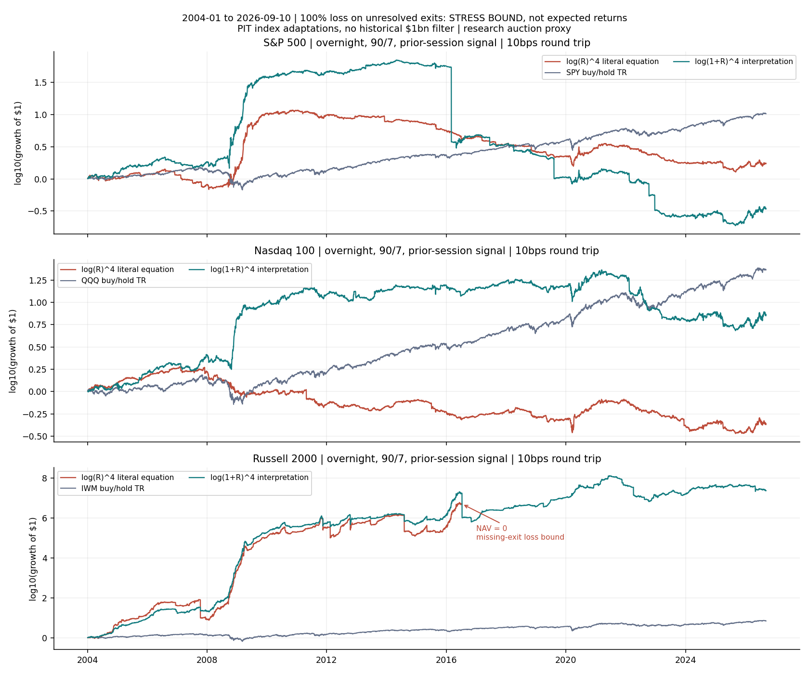
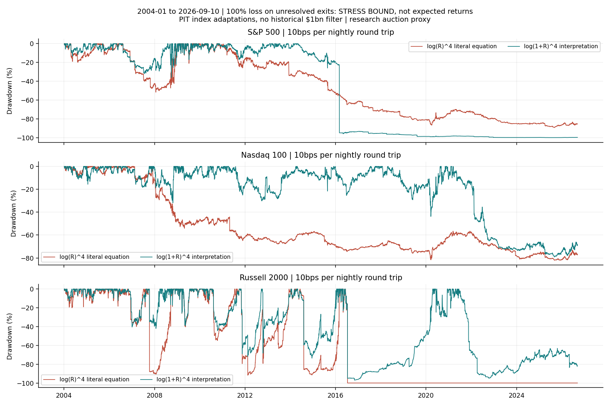

<!-- GENERATED FILE. EDIT THE CANONICAL KNOWLEDGE RECORD. -->

# Overnight Stock Selection - Step-by-Step Source Reconstruction

!!! warning "Research-only"
    This page summarizes saved research evidence. It does not authorize LIVE, allocation, or deployment.

## TL;DR

> **Verdict:** The disclosed method is implemented, with material universe and source-code gaps. Positive overnight rank association is visible; realistic portfolio profitability is unresolved because historical cap, settlement and auction/liquidity evidence are missing.

> **Status:** `diagnostic`

> **Disposition:** `inconclusive`

> **Replication:** `not_reproducible`

## Research question

Reconstruct every disclosed overnight-effect experiment and test whether 90/7 power-weighted overnight stock selection survives 10bps daily round trips in user-authorized PIT index universes.

## Exact setup

| Field | Value |
| --- | --- |
| Signal family | overnight_return_persistence |
| Universe | ["S&P 500", "Nasdaq 100", "Russell 2000"] |
| Decision | Before Close_T; primary history ends Open_(T-1) |
| Fill | Close_T to Open_(T+1), research-only full-auction-price proxy |
| Primary cost layer | central_research |
| Last reviewed | 2026-09-11T12:38:14.812663+00:00 |

## Timing and overnight attribution

```text
information available: Before Close_T; primary history ends Open_(T-1)
primary executable fill: Close_T to Open_(T+1), research-only full-auction-price proxy
```

If final `Close_T` data formed the signal, a hypothetical `Close_T` entry is diagnostic only unless a separate pre-close protocol was modeled. Comparing that diagnostic with `Open_(T+1)` and applying the compounded return identity shows whether the apparent edge occurred in the overnight gap. Missing attribution numbers mean **not tested**, not zero.

| Attribution field | Value |
| --- | --- |
| Status | tested |
| Diagnostic Path | Latest completed overnight history through Open_T, Close_T to Open_(T+1) |
| Executable Path | Conservative history through Open_(T-1), same Close_T to Open_(T+1) exit; auction fills not operationally verified |
| Method | Compare fixed 90/7 paths at two history cutoffs; stock-level compounded ON/ID identity; after-exit ID is diagnostic only |
| Headline Result | Lag and score interpretations are separately reported; missing exits and absent cap filter prevent execution proof |
| Metrics | {} |
| Artifact | C:\\Users\\User\\Documents\\workspace\\pakal\\pakal-research\\reports\\overnight_effect_paper_replication\\tables\\timing_attribution.csv |

## Primary metrics

| Metric | Value |
| --- | ---: |
| Period | 2004-01-05 to 2026-09-10 |
| Universe | S&P500/NDX100/Russell2000 PIT adaptations |
| Cost Layer | central_research |
| Cagr | N/A |
| Annualized Volatility | N/A |
| Sharpe | N/A |
| Maximum Drawdown | N/A |
| Turnover | N/A |

## Four separate verdicts

| Question | Conclusion |
| --- | --- |
| Source Replication | All disclosed stages coded and run on authorized index adaptations; exact Massive/$1bn/private-code result is not reproducible from available inputs |
| Predictive Value | Positive prior-90-night cross-sectional rank IC in all three universes, conditional on observed next-night returns; descriptive and source-informed |
| Economic Value | Unresolved. Portfolio paths use explicit 100% loss bounds on missing exits; static penny-stock curves expose untradeable-price risk |
| Promotion | No promotion; obtain historical market cap, terminal settlements, original notebook and auction evidence |

## Key findings

| Feature | Role | Direction | Status | Effect | Action |
| --- | --- | --- | --- | --- | --- |
| Trailing 90-session compounded overnight return | rank | Higher prior overnight return predicts higher next-night rank on observed endpoints | diagnostic | Mean date-level rank IC approximately 0.039 SP500, 0.056 NDX100, 0.056 Russell2000 | Preserve source recipe; resolve cap, settlement, pricing and auction evidence before portfolio claims |

## Visual evidence






## Limitations

- Unknown author search count
- Private source code unavailable
- No historical market-cap filter
- Daily auction proxy
- Missing exit conservative bounds
- Vendor current vintage
- Source-selected static backcasts
- Static cohort includes ever-members trading later outside the index
- Missing exits are -100% bounds, not actual terminal returns
- Source-selected OTC prices produce non-executable compounding
- 2026 is not proven author-untouched

## Next gates

- Obtain original notebook and exact interpretation of R/top-count
- Supply historical market-cap observations with availability dates
- Resolve halted and terminal security settlement economics
- Validate official auction prices, participation and executable pre-close sizing

## Sources

- `{"location": "C:\\\\Users\\\\User\\\\Downloads\\\\TheOVerNight.pdf", "pages": 14, "read_complete": true, "role": "literal article", "sha256": "7c2c6d9defeae2433ed15012ca7b299b7aa93f2bd8e6a688b3e12de26816c782", "source_id": "S1"}`

## Canonical artifacts

| Artifact | Pakal path |
| --- | --- |
| Concise Report | `C:\\Users\\User\\Documents\\workspace\\pakal\\pakal-research\\reports\\overnight_effect_paper_replication\\REPORT.md` |
| Full Report | `C:\\Users\\User\\Documents\\workspace\\pakal\\pakal-research\\reports\\overnight_effect_paper_replication\\REPORT_FULL.md` |
| Notebook | `C:\\Users\\User\\Documents\\workspace\\pakal\\pakal-research\\overnight_effect_paper_replication.ipynb` |
| Frozen Specification | `C:\\Users\\User\\Documents\\workspace\\pakal\\pakal-research\\reports\\overnight_effect_paper_replication\\research_spec_frozen.json` |
| Manifest | `C:\\Users\\User\\Documents\\workspace\\pakal\\pakal-research\\reports\\overnight_effect_paper_replication\\run_manifest.json` |
| Primary Source Code | `["C:\\\\Users\\\\User\\\\Documents\\\\workspace\\\\pakal\\\\pakal-research\\\\overnight_effect_paper_replication.py"]` |
| Primary Tables | `["C:\\\\Users\\\\User\\\\Documents\\\\workspace\\\\pakal\\\\pakal-research\\\\reports\\\\overnight_effect_paper_replication\\\\tables\\\\performance_summary.csv", "C:\\\\Users\\\\User\\\\Documents\\\\workspace\\\\pakal\\\\pakal-research\\\\reports\\\\overnight_effect_paper_replication\\\\tables\\\\ic_summary.csv", "C:\\\\Users\\\\User\\\\Documents\\\\workspace\\\\pakal\\\\pakal-research\\\\reports\\\\overnight_effect_paper_replication\\\\tables\\\\missing_exit_classification.csv"]` |
| Primary Charts | `["C:\\\\Users\\\\User\\\\Documents\\\\workspace\\\\pakal\\\\pakal-research\\\\reports\\\\overnight_effect_paper_replication\\\\charts\\\\primary_equity.png", "C:\\\\Users\\\\User\\\\Documents\\\\workspace\\\\pakal\\\\pakal-research\\\\reports\\\\overnight_effect_paper_replication\\\\charts\\\\primary_drawdown.png", "C:\\\\Users\\\\User\\\\Documents\\\\workspace\\\\pakal\\\\pakal-research\\\\reports\\\\overnight_effect_paper_replication\\\\charts\\\\cost_sensitivity.png", "C:\\\\Users\\\\User\\\\Documents\\\\workspace\\\\pakal\\\\pakal-research\\\\reports\\\\overnight_effect_paper_replication\\\\charts\\\\signal_quintiles.png"]` |
| Research State | `C:\\Users\\User\\Documents\\workspace\\pakal\\pakal-research\\reports\\overnight_effect_paper_replication\\research_state.json` |
| Hypothesis Registry | `C:\\Users\\User\\Documents\\workspace\\pakal\\pakal-research\\reports\\overnight_effect_paper_replication\\hypothesis_registry.json` |
| Experiment Ledger | `C:\\Users\\User\\Documents\\workspace\\pakal\\pakal-research\\reports\\overnight_effect_paper_replication\\experiment_ledger.jsonl` |
| Decision Log | `C:\\Users\\User\\Documents\\workspace\\pakal\\pakal-research\\reports\\overnight_effect_paper_replication\\decision_log.jsonl` |
| Source Rule Map | `C:\\Users\\User\\Documents\\workspace\\pakal\\pakal-research\\reports\\overnight_effect_paper_replication\\SOURCE_RULE_MAP.md` |
| Static Stage Audit | `C:\\Users\\User\\Documents\\workspace\\pakal\\pakal-research\\reports\\overnight_effect_practical_assumptions\\audits\\static_stage\\REPORT.md` |
