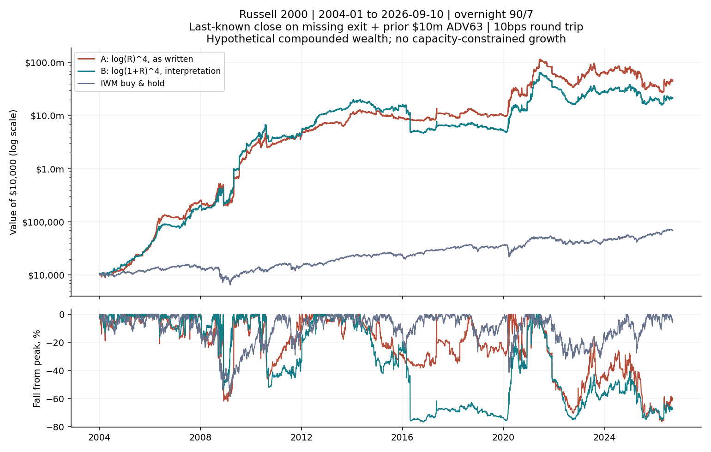
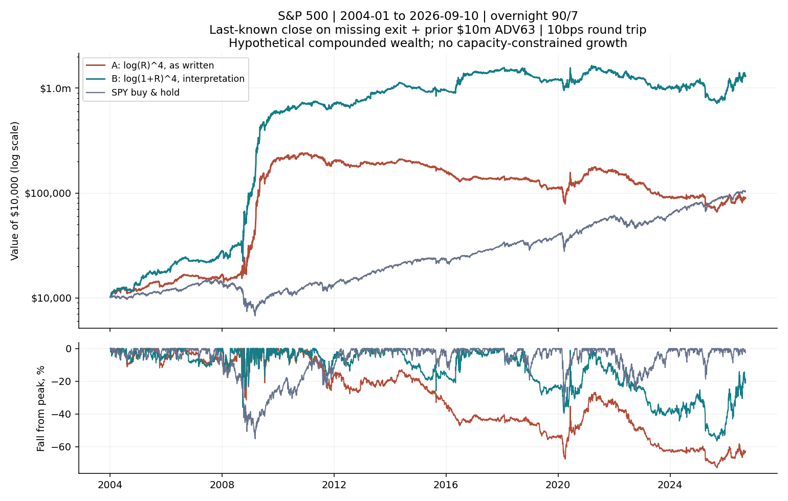

<!-- GENERATED FILE. EDIT THE CANONICAL KNOWLEDGE RECORD. -->

# Overnight Stock Selection - Liquidity and Last-Known-Price Review

!!! warning "Research-only"
    This page summarizes saved research evidence. It does not authorize LIVE, allocation, or deployment.

## TL;DR

> **Verdict:** Last-known-close assumptions materially improve the modeled returns; a fixed dollar-liquidity floor sharply reduces Russell2000 results. Positive historical cases warrant focused research, but large drawdowns, 2020-2025 weakness in large-cap universes, synthetic settlements and seen-history assumptions prevent an executable or exact-source claim.

> **Status:** `diagnostic`

> **Disposition:** `inconclusive`

> **Replication:** `not_reproducible`

## Research question

Explain and test the user's last-known-price proposal and a transparent dollar-liquidity filter, preserving the original research outputs.

## Exact setup

| Field | Value |
| --- | --- |
| Signal family | overnight_return_persistence |
| Universe | ["S&P 500", "Nasdaq 100", "Russell 2000"] |
| Decision | Before Close_T; overnight signal through Open_(T-1); membership and ADV through Close_(T-1) |
| Fill | Close_T to Open_(T+1); synthetic Close_T fallback on missing exit |
| Primary cost layer | central_research |
| Last reviewed | 2026-09-11T12:38:14.812663+00:00 |

## Timing and overnight attribution

```text
information available: Before Close_T; overnight signal through Open_(T-1); membership and ADV through Close_(T-1)
primary executable fill: Close_T to Open_(T+1); synthetic Close_T fallback on missing exit
```

If final `Close_T` data formed the signal, a hypothetical `Close_T` entry is diagnostic only unless a separate pre-close protocol was modeled. Comparing that diagnostic with `Open_(T+1)` and applying the compounded return identity shows whether the apparent edge occurred in the overnight gap. Missing attribution numbers mean **not tested**, not zero.

| Attribution field | Value |
| --- | --- |
| Status | not_tested |
| Method | Fixed parent lag1 timing; this followup isolates exits and liquidity. Parent contains lag0 and return-leg attribution |
| Headline Result | No same-close signal leakage introduced; auction execution unverified |
| Artifact | C:\\Users\\User\\Documents\\workspace\\pakal\\pakal-research\\reports\\overnight_effect_paper_replication\\tables\\timing_attribution.csv |

## Primary metrics

| Metric | Value |
| --- | ---: |
| Period | 2004-01-05 to 2026-09-10 |
| Universe | Three separate PIT universes, both formulas shown |
| Cost Layer | 10bps round trip |
| Cagr | N/A |
| Annualized Volatility | N/A |
| Sharpe | N/A |
| Maximum Drawdown | N/A |
| Turnover | N/A |

## Four separate verdicts

| Question | Conclusion |
| --- | --- |
| Source Replication | Incomplete: dollar ADV is not the author's historical market cap; original notebook remains absent |
| Predictive Value | No new independent predictive evidence; original signal preserved |
| Economic Value | Modeled returns improve with last-known close, but liquidation and capacity assumptions remain; large drawdowns and period dependence |
| Promotion | Continue focused research only |

## Key findings

| Feature | Role | Direction | Status | Effect | Action |
| --- | --- | --- | --- | --- | --- |
| Last-known-close exit and dollar-liquidity floor | diagnostic | Missing-exit assumption lifts modeled returns; liquidity floor reduces small-cap extremes | diagnostic | Filtered 10bps CAGR: SP500 10.1/23.9%, NDX100 0.4/11.8%, R2000 44.9/40.1%; exact values in modeled_scenarios | Audit influential events and auction capacity |

## Visual evidence






## Limitations

- Private source notebook unavailable
- Dollar liquidity is not market cap
- Synthetic last-close sale assumes immediate cash release
- No untouched history
- No calibrated auction impact
- No price floor
- Current-vintage vendor adjustments

## Next gates

- Audit influential missing exits and cash-release dates
- Verify auction fills and participation for concentrated positions
- Diagnose 2020-2025 weakness before any retuning

## Sources

- `{"location": "C:\\\\Users\\\\User\\\\Downloads\\\\TheOVerNight.pdf", "pages": 14, "read_complete": true, "role": "literal article", "sha256": "7c2c6d9defeae2433ed15012ca7b299b7aa93f2bd8e6a688b3e12de26816c782", "source_id": "S1"}`
- `{"location": "https://www.investor.gov/introduction-investing/investing-basics/glossary/market-capitalization", "role": "Market-cap definition"}`
- `{"location": "https://www.sec.gov/Archives/edgar/data/1418135/000141813519000007/kdp-10kx12312018.htm", "role": "GMCR cash acquisition case, explanatory only"}`

## Canonical artifacts

| Artifact | Pakal path |
| --- | --- |
| Concise Report | `C:\\Users\\User\\Documents\\workspace\\pakal\\pakal-research\\reports\\overnight_effect_practical_assumptions\\REPORT.md` |
| Full Report | `C:\\Users\\User\\Documents\\workspace\\pakal\\pakal-research\\reports\\overnight_effect_practical_assumptions\\REPORT_FULL.md` |
| Notebook | `C:\\Users\\User\\Documents\\workspace\\pakal\\pakal-research\\overnight_effect_practical_assumptions.ipynb` |
| Frozen Specification | `C:\\Users\\User\\Documents\\workspace\\pakal\\pakal-research\\reports\\overnight_effect_practical_assumptions\\research_spec_frozen.json` |
| Manifest | `C:\\Users\\User\\Documents\\workspace\\pakal\\pakal-research\\reports\\overnight_effect_practical_assumptions\\run_manifest.json` |
| Primary Source Code | `["C:\\\\Users\\\\User\\\\Documents\\\\workspace\\\\pakal\\\\pakal-research\\\\overnight_effect_practical_assumptions.py", "C:\\\\Users\\\\User\\\\Documents\\\\workspace\\\\pakal\\\\pakal-research\\\\build_overnight_practical_report.py"]` |
| Primary Tables | `["C:\\\\Users\\\\User\\\\Documents\\\\workspace\\\\pakal\\\\pakal-research\\\\reports\\\\overnight_effect_practical_assumptions\\\\tables\\\\performance_summary.csv", "C:\\\\Users\\\\User\\\\Documents\\\\workspace\\\\pakal\\\\pakal-research\\\\reports\\\\overnight_effect_practical_assumptions\\\\tables\\\\parent_parity.csv", "C:\\\\Users\\\\User\\\\Documents\\\\workspace\\\\pakal\\\\pakal-research\\\\reports\\\\overnight_effect_practical_assumptions\\\\tables\\\\missing_exit_audit.csv", "C:\\\\Users\\\\User\\\\Documents\\\\workspace\\\\pakal\\\\pakal-research\\\\reports\\\\overnight_effect_practical_assumptions\\\\tables\\\\capacity_at_1m.csv"]` |
| Primary Charts | `["C:\\\\Users\\\\User\\\\Documents\\\\workspace\\\\pakal\\\\pakal-research\\\\reports\\\\overnight_effect_practical_assumptions\\\\charts\\\\assumption_comparison.png", "C:\\\\Users\\\\User\\\\Documents\\\\workspace\\\\pakal\\\\pakal-research\\\\reports\\\\overnight_effect_practical_assumptions\\\\charts\\\\equity_sp500.png", "C:\\\\Users\\\\User\\\\Documents\\\\workspace\\\\pakal\\\\pakal-research\\\\reports\\\\overnight_effect_practical_assumptions\\\\charts\\\\equity_r2000.png"]` |
| Research State | `C:\\Users\\User\\Documents\\workspace\\pakal\\pakal-research\\reports\\overnight_effect_practical_assumptions\\research_state.json` |
| Hypothesis Registry | `C:\\Users\\User\\Documents\\workspace\\pakal\\pakal-research\\reports\\overnight_effect_practical_assumptions\\hypothesis_registry.json` |
| Experiment Ledger | `C:\\Users\\User\\Documents\\workspace\\pakal\\pakal-research\\reports\\overnight_effect_practical_assumptions\\experiment_ledger.jsonl` |
| Decision Log | `C:\\Users\\User\\Documents\\workspace\\pakal\\pakal-research\\reports\\overnight_effect_practical_assumptions\\decision_log.jsonl` |
| Source Rule Map | `C:\\Users\\User\\Documents\\workspace\\pakal\\pakal-research\\reports\\overnight_effect_practical_assumptions\\SOURCE_RULE_MAP.md` |
| Fee Audit | `C:\\Users\\User\\Documents\\workspace\\pakal\\pakal-research\\reports\\overnight_effect_practical_assumptions\\audits\\five_bps_per_side\\REPORT.md` |
| Static Stage Audit | `C:\\Users\\User\\Documents\\workspace\\pakal\\pakal-research\\reports\\overnight_effect_practical_assumptions\\audits\\static_stage\\REPORT.md` |
