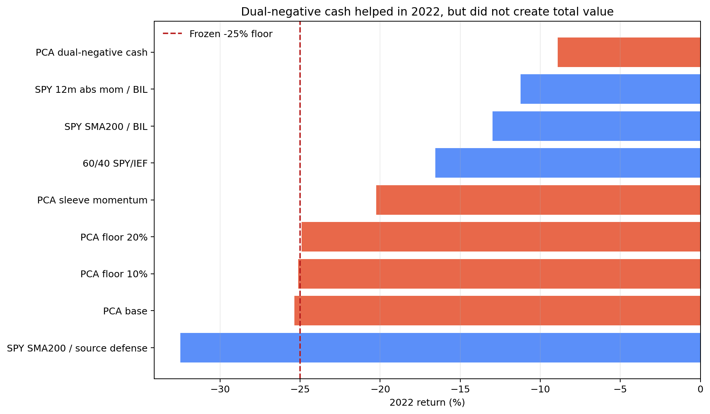
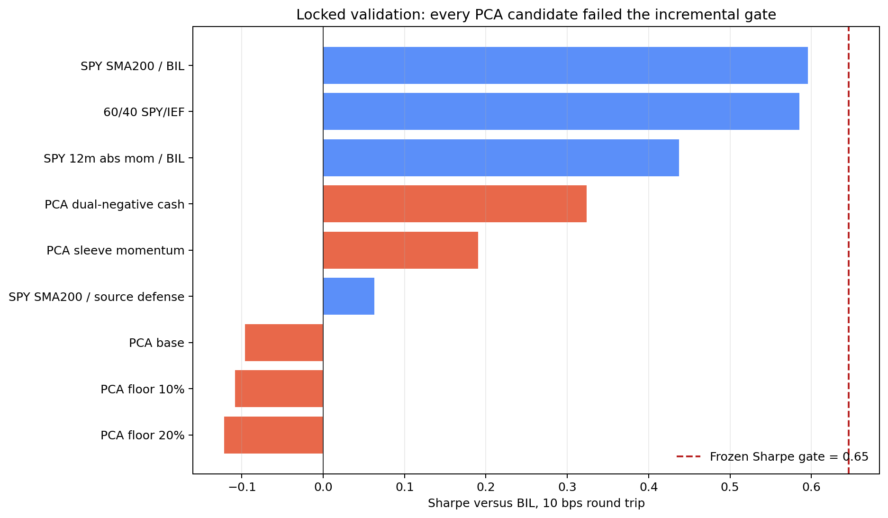

<!-- GENERATED FILE. EDIT THE CANONICAL KNOWLEDGE RECORD. -->

# PCA 2D Asset Allocation: literal replication and walk-forward test

!!! warning "Research-only"
    This page summarizes saved research evidence. It does not authorize LIVE, allocation, or deployment.

## TL;DR

> **Verdict:** PCA described common risk structure and the dual-negative cash overlay helped in 2022, but no frozen PCA candidate beat the strongest simple control in locked validation; confirmation was not opened.

> **Status:** `diagnostic`

> **Disposition:** `rejected`

> **Replication:** `directionally_replicated`

## Research question

Determine whether a causally learned first principal component adds after-cost next-open value beyond simple trend, 60/40, and absolute-momentum controls.

## Exact setup

| Field | Value |
| --- | --- |
| Signal family | cross_asset_pca_risk_regime |
| Universe | ["Fixed source ETF proxies: SPY, EEM, EFA, DBC, HYG, GLD, IEF, TLT", "BIL cash proxy"] |
| Decision | Close_T after final adjusted daily bars; monthly PCA and sleeve update, daily synthetic-offense SMA200 state |
| Fill | Open_(T+1) with old holdings retaining the preceding overnight leg |
| Primary cost layer | central_research |
| Last reviewed | 2026-08-20T13:41:00Z |

## Timing and overnight attribution

```text
information available: Close_T after final adjusted daily bars; monthly PCA and sleeve update, daily synthetic-offense SMA200 state
primary executable fill: Open_(T+1) with old holdings retaining the preceding overnight leg
```

If final `Close_T` data formed the signal, a hypothetical `Close_T` entry is diagnostic only unless a separate pre-close protocol was modeled. Comparing that diagnostic with `Open_(T+1)` and applying the compounded return identity shows whether the apparent edge occurred in the overnight gap. Missing attribution numbers mean **not tested**, not zero.

| Attribution field | Value |
| --- | --- |
| Status | completed |
| Diagnostic Path | Same-Close_T source-like diagnostic in the literal phase only |
| Executable Path | Stateful Open_(T+1) fill and subsequent open-to-close drift |
| Method | Identical target rules and costs in a stateful holdings engine with separate same-close and next-open timing modes |
| Headline Result | At 10 bps, literal tactical next-open CAGR 9.03% and Sharpe versus BIL 0.67 exceeded same-close diagnostic CAGR 8.00% and Sharpe 0.60; same-close was not promoted. |
| Metrics | {"literal_next_open_CAGR_10bps": 0.09034990744270499, "literal_next_open_Sharpe_vs_BIL_10bps": 0.6714667439565861, "literal_same_close_CAGR_10bps": 0.08002221915794294, "literal_same_close_Sharpe_vs_BIL_10bps": 0.6033937770458253} |
| Unavailable Reason | N/A |
| Artifact | pakal-research/reports/pca_2d_asset_allocation_study/tables/literal_metrics.csv |

## Primary metrics

| Metric | Value |
| --- | ---: |
| Period | Locked validation 2019-01-02 through 2022-12-30 |
| Universe | Best frozen PCA candidate: correlation ensemble with dual-negative cash |
| Cost Layer | central_research_10_bps_round_trip |
| Cagr | 3.91% |
| Annualized Volatility | 10.79% |
| Sharpe | 0.324 |
| Maximum Drawdown | -12.54% |
| Turnover | 2352.53% |

## Four separate verdicts

| Question | Conclusion |
| --- | --- |
| Source Replication | Directionally replicated only: the tactical ETF proxy beat its local offense and defense sleeves, but 9.56% optimistic next-open CAGR did not match the source's 14.1% and exact index extensions were unavailable. |
| Predictive Value | PC1 concentration was real but matrix-dependent; correlation PCA explained about 52%-53%, while covariance PCA explained about 61%-69%. |
| Economic Value | Rejected. Best validation candidate Sharpe was 0.324 versus 0.596 for SPY/SMA200/BIL, with lower CAGR and failed BH/bootstrap gates. |
| Promotion | Diagnostic only. No PAPER, LIVE, broker, scheduler, allocation, release, or capital authority. |

## Key findings

| Feature | Role | Direction | Status | Effect | Action |
| --- | --- | --- | --- | --- | --- |
| correlation versus covariance PCA | diagnostic | volatility standardization reduced PC1 explained variance | diagnostic | Static covariance 66.86% versus correlation 52.62%; walk-forward covariance about 61%-69% versus correlation about 52%-53%. | retain as a methodology diagnostic |
| dual-negative synthetic-sleeve cash state | risk overlay | reduced 2022 loss and drawdown but did not pass total-value gates | rejected_candidate | Validation 2022 return -8.92% and MaxDD -12.54%; Sharpe 0.324 versus strongest-control 0.596. | do not promote; a future-data risk-overlay study would require a new freeze |
| within-sleeve 252-session momentum | entry filter | did not overcome the benchmark gap and increased turnover | rejected | Validation CAGR 2.44%, Sharpe 0.190, MaxDD -24.75%, annual turnover 21.61. | reject in this PCA framework |
| D-inverse-v correlation-PCA mapping | factor-mimicking diagnostic | better discovery risk-adjusted results than direct loading baskets, still below 60/40 | forward_hypothesis_only | Discovery Sharpe 0.74-0.83 versus direct correlation baskets about 0.59-0.63; 60/40 was 1.04. | if revisited, freeze a new test on data after 2026-08-19 only |

## Visual evidence






## Limitations

- Unknown source index extensions prevent exact 1995-2018 replication.
- Fixed surviving ETF proxies are not a point-in-time historical asset universe.
- Norgate TOTALRETURN Open is a research proxy rather than measured auction fills.
- Generic 2/10/25 bps costs and full-day ADV63 do not establish execution or capacity.
- PCA loadings maximize explained variance, not expected return or Sharpe.
- External source/chat selection multiplicity is unknown.
- Confirmation 2023-2026 remained unopened because no validation candidate passed.

## Next gates

- Do not reopen 2023-2026 confirmation.
- Only a newly frozen study on observations after 2026-08-19 may test D^-1 v as a candidate or dual-negative cash as a standalone risk overlay.

## Sources

- `C:/Users/User/Downloads/PCA_TA_pt1.pdf`
- `C:/Users/User/Downloads/PCA_TA_pt2.pdf`
- `Chat thread 6a86ec01-61c0-83ed-9008-5ea5c6957a81`

## Canonical artifacts

| Artifact | Pakal path |
| --- | --- |
| Concise Report | `pakal-research/reports/pca_2d_asset_allocation_study/REPORT.md` |
| Full Report | `pakal-research/reports/pca_2d_asset_allocation_study/REPORT_FULL.md` |
| Notebook | `pakal-research/pca_2d_asset_allocation_study.ipynb` |
| Frozen Specification | `pakal-research/reports/pca_2d_asset_allocation_study/research_spec_frozen.json` |
| Manifest | `pakal-research/reports/pca_2d_asset_allocation_study/run_manifest.json` |
| Primary Source Code | `["pakal-research/pca_2d_asset_allocation_study.py", "pakal-research/pca_2d_asset_allocation_closeout.py", "pakal-research/build_pca_2d_asset_allocation_manifest.py", "tests/test_pca_2d_asset_allocation_study.py"]` |
| Primary Tables | `["pakal-research/reports/pca_2d_asset_allocation_study/tables/source_replication_comparison.csv", "pakal-research/reports/pca_2d_asset_allocation_study/tables/validation_gate_results.csv", "pakal-research/reports/pca_2d_asset_allocation_study/tables/pc1_explained_variance_summary.csv", "pakal-research/reports/pca_2d_asset_allocation_study/tables/validation_market_relationship.csv", "pakal-research/reports/pca_2d_asset_allocation_study/tables/search_accounting.csv"]` |
| Primary Charts | `["pakal-research/reports/pca_2d_asset_allocation_study/charts/source_replication_comparison.png", "pakal-research/reports/pca_2d_asset_allocation_study/charts/validation_incremental_sharpe_gate.png", "pakal-research/reports/pca_2d_asset_allocation_study/charts/validation_2022_stress.png", "pakal-research/reports/pca_2d_asset_allocation_study/charts/validation_rolling_corr126_spy.png", "pakal-research/reports/pca_2d_asset_allocation_study/charts/pc1_matrix_standardization_comparison.png"]` |
| Research State | `pakal-research/reports/pca_2d_asset_allocation_study/research_state.json` |
| Hypothesis Registry | `pakal-research/reports/pca_2d_asset_allocation_study/hypothesis_registry.json` |
| Experiment Ledger | `pakal-research/reports/pca_2d_asset_allocation_study/experiment_ledger.jsonl` |
| Decision Log | `pakal-research/reports/pca_2d_asset_allocation_study/decision_log.jsonl` |
| Source Rule Map | `pakal-research/reports/pca_2d_asset_allocation_study/SOURCE_RULE_MAP.md` |
