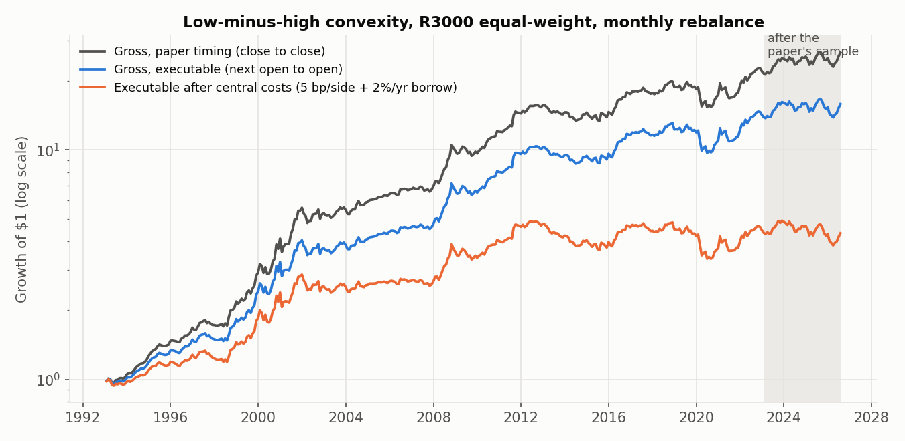
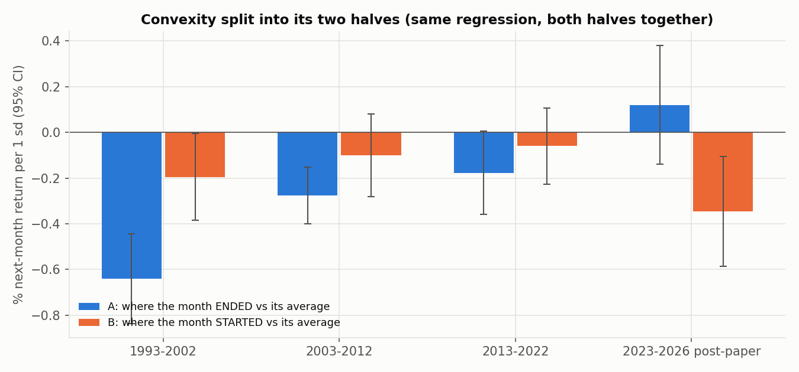

<!-- GENERATED FILE. EDIT THE CANONICAL KNOWLEDGE RECORD. -->

# Price-path convexity: factor spanning, A/B decomposition and post-paper test (Aligrithm 10.14 / Gulen-Woeppel)

!!! warning "Research-only"
    This page summarizes saved research evidence. It does not authorize LIVE, allocation, or deployment.

## TL;DR

> **Verdict:** The headline spread reproduces (R3000 equal-weight 0.87%/month vs paper 0.84%), standard factors including 1-month reversal do not explain it (alpha 0.79%, t 4.0), and both halves of the shape matter in the broad universe. But the per-sd slope is -0.26% not -0.45%, it halves after the last-day return, it is mostly a small-cap effect (liquidity-weighted and large-cap versions are weak and negative since 2023), it has been fading since 2013, and after central costs it earns 0.42%/month with Sharpe 0.44 over 1993-2026 and about zero since 2023. Convexity is a recombination of 'distance from the 1-month average' and the 1-month return (MA-distance + reversal hedge -> alpha 0.18%). Not tradable; keep as a diagnostic feature.

> **Status:** `diagnostic`

> **Disposition:** `rejected`

> **Replication:** `replicated`

## Research question

Test the article's untested claims (about -0.45% per sd in Fama-MacBeth, no factor explains it, distinct from reversal) plus post-2022 out-of-sample, liquidity weighting and same-exit timing.

## Exact setup

| Field | Value |
| --- | --- |
| Signal family | price_path_convexity_short_horizon_reversal |
| Universe | ["r3000 PIT (primary)", "r1000", "r2000", "sp500", "ndx"] |
| Decision | after final Close_T of each month (all formation-month closes) |
| Fill | Open_(T+1) to Open_(T'+1); Close_T paths diagnostic |
| Primary cost layer | central_research |
| Last reviewed | 2026-10-01T21:32:07+00:00 |

## Timing and overnight attribution

```text
information available: after final Close_T of each month (all formation-month closes)
primary executable fill: Open_(T+1) to Open_(T'+1); Close_T paths diagnostic
```

If final `Close_T` data formed the signal, a hypothetical `Close_T` entry is diagnostic only unless a separate pre-close protocol was modeled. Comparing that diagnostic with `Open_(T+1)` and applying the compounded return identity shows whether the apparent edge occurred in the overnight gap. Missing attribution numbers mean **not tested**, not zero.

| Attribution field | Value |
| --- | --- |
| Status | tested |
| Diagnostic Path | Close_T -> Open_(T'+1) |
| Executable Path | Open_(T+1) -> Open_(T'+1) (same exit) |
| Method | exact compounded split per stock: (1+diag) = (1+overnight)(1+exec) |
| Headline Result | overnight leg 0.30%/month in 1993-2002, 0.03-0.07% since 2003; the executable spread is the bulk of the effect |
| Metrics | {"ls_on_1993_2002_pct": 0.304, "ls_on_2023_2026_pct": 0.035} |
| Artifact | pakal-research/reports/ppc_spanning_oos/tables/t5_subperiods.csv |

## Primary metrics

| Metric | Value |
| --- | ---: |
| Period | formation 1993-01 to 2026-07 |
| Universe | R3000 PIT, equal-weight quintile long-short |
| Cost Layer | central_research: 5 bp one-way per unit traded + 200 bp/yr borrow |
| Cagr | 4.46% |
| Annualized Volatility | 11.38% |
| Sharpe | 0.441 |
| Maximum Drawdown | -31.21% |
| Turnover | 312.87% |

## Four separate verdicts

| Question | Conclusion |
| --- | --- |
| Source Replication | replicated in R3000 EW (0.87 vs 0.84%/month); liquidity-weighted proxy 0.55% |
| Predictive Value | real but smaller than claimed (-0.26%/sd vs -0.42) and decaying (1993-2002 -0.42, 2013-2026 -0.12) |
| Economic Value | fails: central-cost Sharpe 0.44, ~0 since 2023, breakeven one-way cost 4 bp in 2023-2026 |
| Promotion | none |

## Key findings

| Feature | Role | Direction | Status | Effect | Action |
| --- | --- | --- | --- | --- | --- |
| conv_1m | signal | low convexity long | diagnostic | -0.26%/sd (t -4.2) R3000 EW FM; -0.15 after last-day return; -0.08 (t -1.1) liquidity-weighted | diagnostic only; do not trade stand-alone |
| a_end (P_N / month mean - 1) | diagnostic | low A long | diagnostic | -0.31%/sd (t -5.5) with B and controls; stand-alone MAD factor 0.56%/month (t 3.3) | already the dominant half; any future reversal feature should use it directly |
| b_start (P_1 / month mean - 1) | diagnostic | low B long | diagnostic | -0.14%/sd (t -2.8) R3000; ~0 in R1000/S&P 500 | forward observation only |

## Visual evidence






## Limitations

- no PIT market cap: ADV63 weighting is a value-weight proxy
- FM lacks B/M, profitability, asset growth, FF3-IV, skewness
- RMW, CMA, LREV, LIQ factors not available locally
- PIT index universes 1993+, not CRSP 1963+
- plain spread through 2026-06 seen by the August studies; post-paper is OOS for the paper only

## Next gates

- none planned; optionally log the B (start-vs-average) post-2023 pattern forward without trading

## Sources

- `pakal-research/sources/price_path_convexity/aligrithm_ppc_article_2026-07-09.html \| sha256:3b9d5e3dcf3814c5ef82588c198c52068e70dcbd3c98a42acbc917d903ddabf5`
- `pakal-research/sources/price_path_convexity/gulen_woeppel_price_path_convexity.pdf \| sha256:ac22533436b5cb268e96e8f079e87f4ab85c8332d6588ffdcb7f69bd8cf60425`
- `pakal-research/sources/price_path_convexity/gulen_woeppel_supplementary.pdf \| sha256:f328a7d3079857ea68473fba48b30ba0db9a8c1eb9d0f1407253e6eb227c5630`
- `pakal-research/reports/price_path_convexity_signal_study (prior internal study)`

## Canonical artifacts

| Artifact | Pakal path |
| --- | --- |
| Concise Report | `pakal-research/reports/ppc_spanning_oos/REPORT.md` |
| Full Report | `pakal-research/reports/ppc_spanning_oos/REPORT_FULL.md` |
| Notebook | `pakal-research/reports/ppc_spanning_oos/ppc_spanning_oos.ipynb` |
| Frozen Specification | `pakal-research/reports/ppc_spanning_oos/research_spec_frozen.json` |
| Manifest | `pakal-research/reports/ppc_spanning_oos/run_manifest.json` |
| Research State | `pakal-research/reports/ppc_spanning_oos/research_state.json` |
| Hypothesis Registry | `pakal-research/reports/ppc_spanning_oos/hypothesis_registry.json` |
| Experiment Ledger | `pakal-research/reports/ppc_spanning_oos/experiment_ledger.jsonl` |
| Decision Log | `pakal-research/reports/ppc_spanning_oos/decision_log.jsonl` |
| Source Rule Map | `pakal-research/reports/ppc_spanning_oos/SOURCE_RULE_MAP.md` |
| Primary Source Code | `["pakal-research/ppc_spanning_oos/ppc_lib.py", "pakal-research/ppc_spanning_oos/ppc_run.py", "pakal-research/ppc_spanning_oos/ppc_charts.py", "pakal-research/ppc_spanning_oos/test_ppc_timing.py", "pakal-research/ppc_spanning_oos/ppc_build_artifacts.py"]` |
| Primary Tables | `["pakal-research/reports/ppc_spanning_oos/tables/gates.csv", "pakal-research/reports/ppc_spanning_oos/tables/t1_replication_longshort.csv", "pakal-research/reports/ppc_spanning_oos/tables/t2_fama_macbeth.csv", "pakal-research/reports/ppc_spanning_oos/tables/t3_spanning.csv", "pakal-research/reports/ppc_spanning_oos/tables/t5_subperiods.csv", "pakal-research/reports/ppc_spanning_oos/tables/t7_cost_performance.csv"]` |
| Primary Charts | `["pakal-research/reports/ppc_spanning_oos/charts/quintile_returns.png", "pakal-research/reports/ppc_spanning_oos/charts/cumulative_long_short.png", "pakal-research/reports/ppc_spanning_oos/charts/fama_macbeth_convexity.png", "pakal-research/reports/ppc_spanning_oos/charts/decomposition_a_b.png", "pakal-research/reports/ppc_spanning_oos/charts/spanning_alphas.png", "pakal-research/reports/ppc_spanning_oos/charts/rolling_36m.png"]` |
