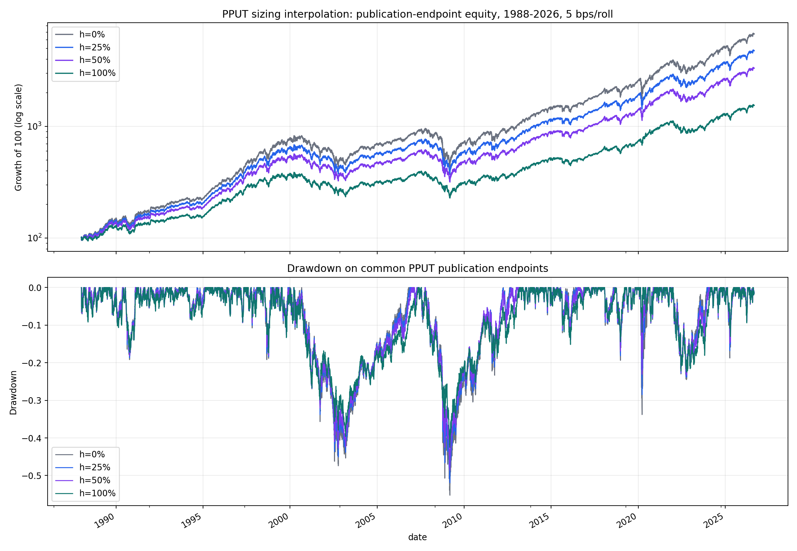
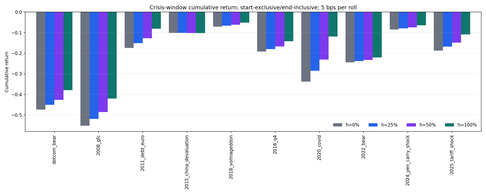

<!-- GENERATED FILE. EDIT THE CANONICAL KNOWLEDGE RECORD. -->

# PPUT and SPX approximate sizing diagnostic

!!! warning "Research-only"
    This page summarizes saved research evidence. It does not authorize LIVE, allocation, or deployment.

## TL;DR

> **Verdict:** Benchmark interpolation only; no ratio selection and no executable option sizing authority.

> **Status:** `diagnostic`

> **Disposition:** `diagnostic`

> **Replication:** `not_assessed`

## Research question

Describe the return-versus-tail-risk trade-off of scaling the official PPUT publication-interval differential over SPXTR.

## Exact setup

| Field | Value |
| --- | --- |
| Signal family | tail_risk_overlay |
| Universe | ["Cboe PPUT", "Norgate $SPXTR"] |
| Decision | not_applicable_always_on |
| Fill | embedded_in_official_pput_index |
| Primary cost layer | central_research_5bps_per_roll |
| Last reviewed | 2026-09-01T22:37:53+03:00 |

## Timing and overnight attribution

```text
information available: not_applicable_always_on
primary executable fill: embedded_in_official_pput_index
```

If final `Close_T` data formed the signal, a hypothetical `Close_T` entry is diagnostic only unless a separate pre-close protocol was modeled. Comparing that diagnostic with `Open_(T+1)` and applying the compounded return identity shows whether the apparent edge occurred in the overnight gap. Missing attribution numbers mean **not tested**, not zero.

| Attribution field | Value |
| --- | --- |
| Status | not_applicable |
| Diagnostic Path | official publication-interval index returns |
| Executable Path | not reconstructed |
| Method | same-endpoint publication-interval benchmark interpolation |
| Headline Result | No close-derived signal exists. |
| Metrics | {} |
| Artifact | N/A |

## Primary metrics

| Metric | Value |
| --- | ---: |
| Period | 1988-01-05 through 2026-08-31 |
| Universe | PPUT and $SPXTR exact common sessions |
| Cost Layer | 5 bps at each official PPUT publication roll |
| Cagr | N/A |
| Annualized Volatility | N/A |
| Sharpe | N/A |
| Maximum Drawdown | N/A |
| Turnover | N/A |

## Four separate verdicts

| Question | Conclusion |
| --- | --- |
| Source Replication | Official PPUT levels are used directly. |
| Predictive Value | Not applicable; the overlay is always on. |
| Economic Value | Descriptive benchmark trade-off only. |
| Promotion | Capped at diagnostic. |

## Key findings

No structured feature findings were recorded.

## Visual evidence






## Limitations

- 1987 unavailable
- PPUT pre-launch history is backfilled
- intermediate ratios are publication-interval return interpolations
- five intervals span two underlying sessions
- no option-chain cash flows, spreads, fees, fills, or capacity

## Next gates

- Acquire point-in-time SPX option chains and precommit contract-level sizing.

## Sources

- `precommit`
- `source_rule_map`
- `frozen_spec`
- `amendment`
- `pput_history`
- `spxtr_panel`
- `spxtr_metadata`
- `source_engine`

## Canonical artifacts

| Artifact | Pakal path |
| --- | --- |
| Concise Report | `pakal-research/reports/pput_spx_sizing_diagnostic/REPORT.md` |
| Crisis Metrics | `pakal-research/reports/pput_spx_sizing_diagnostic/tables/crisis_metrics.csv` |
| Frozen Specification | `pakal-research/reports/pput_spx_sizing_diagnostic/research_spec_frozen.json` |
| Full Report | `pakal-research/reports/pput_spx_sizing_diagnostic/REPORT_FULL.md` |
| Manifest | `pakal-research/reports/pput_spx_sizing_diagnostic/run_manifest.json` |
| Notebook | `pakal-research/reports/pput_spx_sizing_diagnostic/pput_spx_sizing_diagnostic.ipynb` |
| Path Metrics | `pakal-research/reports/pput_spx_sizing_diagnostic/tables/path_metrics.csv` |
| Primary Source Code | `["pakal-research/pput_spx_sizing_diagnostic.py"]` |
| Primary Tables | `["pakal-research/reports/pput_spx_sizing_diagnostic/tables/crisis_metrics.csv", "pakal-research/reports/pput_spx_sizing_diagnostic/tables/path_metrics.csv"]` |
| Primary Charts | `["pakal-research/reports/pput_spx_sizing_diagnostic/charts/equity_drawdown_5bps.png", "pakal-research/reports/pput_spx_sizing_diagnostic/charts/crisis_returns_5bps.png"]` |
