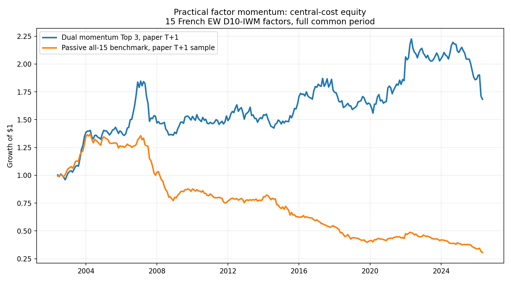
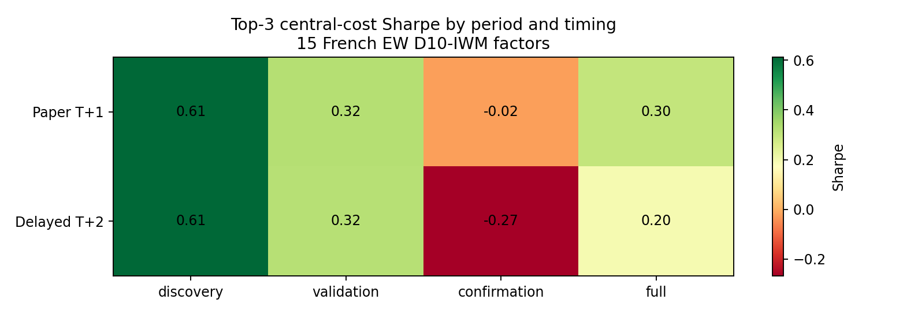

<!-- GENERATED FILE. EDIT THE CANONICAL KNOWLEDGE RECORD. -->

# Practical Factor Momentum: D10 minus IWM

!!! warning "Research-only"
    This page summarizes saved research evidence. It does not authorize LIVE, allocation, or deployment.

## TL;DR

> **Verdict:** The practical construction does not clear every frozen gate. Treat the paper result as diagnostic evidence, not an implementable strategy.

> **Status:** `diagnostic`

> **Disposition:** `not_recorded`

> **Replication:** `not_recorded`

## Research question

Test the Concretum practical D10-IWM dual-momentum construction under explicit timing, costs, financing, and robustness.

## Exact setup

| Field | Value |
| --- | --- |
| Signal family | factor_momentum |
| Universe | ["Fifteen official Kenneth French U.S. equal-weight anomaly decile portfolios"] |
| Decision | After month-end T |
| Fill | Paper diagnostic T+1 monthly return; strict stress T+2 |
| Primary cost layer | central_research |
| Last reviewed | 2026-07-31T09:01:48.387479+00:00 |

## Timing and overnight attribution

```text
information available: After month-end T
primary executable fill: Paper diagnostic T+1 monthly return; strict stress T+2
```

If final `Close_T` data formed the signal, a hypothetical `Close_T` entry is diagnostic only unless a separate pre-close protocol was modeled. Comparing that diagnostic with `Open_(T+1)` and applying the compounded return identity shows whether the apparent edge occurred in the overnight gap. Missing attribution numbers mean **not tested**, not zero.


## Primary metrics

| Metric | Value |
| --- | ---: |
| Period | full common history |
| Universe | 15 French EW D10-IWM factors |
| Cost Layer | central_research |
| Cagr | 2.19% |
| Annualized Volatility | 8.43% |
| Sharpe | 0.299 |
| Maximum Drawdown | -26.33% |
| Turnover | 587.96% |

## Key findings

| Feature | Role | Direction | Status | Effect | Action |
| --- | --- | --- | --- | --- | --- |
| four-horizon average factor-momentum rank | cross-sectional rank | stronger rank should predict higher next-month factor return | diagnostic | See tables/rank_diagnostics.csv and rank_bucket_returns.csv | Do not implement until exact PIT next-open reconstruction passes |
| four-horizon positive-momentum vote share | position-size scaler | higher positive-horizon count increases allocation | diagnostic | Embedded in frozen top-N portfolio results | Retain only as a frozen forward hypothesis |

## Visual evidence






## Limitations

- Paper T+1 monthly return boundary is timing-conflicted.
- French equal-weight D10 baskets are not directly tradable.
- Constituent turnover, liquidity, market impact, and taxes are missing.
- No untouched post-publication sample exists.

## Next gates

- Rebuild the fifteen long D10 baskets point in time from Norgate or CRSP.
- Price Close_T decisions at Open_T+1 with actual constituent orders.
- Measure constituent turnover, ADV participation, spreads, and hedge basis.
- Freeze a forward observation period beginning after July 2026.

## Sources

- `C:/Users/User/Downloads/mom-fact.pdf`
- `C:/Users/User/Downloads/mom-fact2.pdf`

## Canonical artifacts

| Artifact | Pakal path |
| --- | --- |
| Concise Report | `C:\\Users\\User\\Documents\\workspace\\pakal\\pakal-research\\reports\\practical_factor_momentum_research\\REPORT.md` |
| Full Report | `C:\\Users\\User\\Documents\\workspace\\pakal\\pakal-research\\reports\\practical_factor_momentum_research\\REPORT_FULL.md` |
| Notebook | `C:\\Users\\User\\Documents\\workspace\\pakal\\pakal-research\\practical_factor_momentum_research\\practical_factor_momentum_decision.ipynb` |
| Frozen Specification | `C:\\Users\\User\\Documents\\workspace\\pakal\\pakal-research\\reports\\practical_factor_momentum_research\\research_spec_frozen.json` |
| Manifest | `C:\\Users\\User\\Documents\\workspace\\pakal\\pakal-research\\reports\\practical_factor_momentum_research\\run_manifest.json` |
| Primary Source Code | `["C:\\\\Users\\\\User\\\\Documents\\\\workspace\\\\pakal\\\\pakal-research\\\\practical_factor_momentum_research\\\\run_research.py", "C:\\\\Users\\\\User\\\\Documents\\\\workspace\\\\pakal\\\\pakal-research\\\\practical_factor_momentum_research\\\\test_run_research.py"]` |
| Primary Tables | `["C:\\\\Users\\\\User\\\\Documents\\\\workspace\\\\pakal\\\\pakal-research\\\\reports\\\\practical_factor_momentum_research\\\\tables\\\\performance_summary.csv", "C:\\\\Users\\\\User\\\\Documents\\\\workspace\\\\pakal\\\\pakal-research\\\\reports\\\\practical_factor_momentum_research\\\\tables\\\\rank_diagnostics.csv", "C:\\\\Users\\\\User\\\\Documents\\\\workspace\\\\pakal\\\\pakal-research\\\\reports\\\\practical_factor_momentum_research\\\\tables\\\\block_bootstrap.csv", "C:\\\\Users\\\\User\\\\Documents\\\\workspace\\\\pakal\\\\pakal-research\\\\reports\\\\practical_factor_momentum_research\\\\tables\\\\factor_contributions.csv"]` |
| Primary Charts | `["C:\\\\Users\\\\User\\\\Documents\\\\workspace\\\\pakal\\\\pakal-research\\\\reports\\\\practical_factor_momentum_research\\\\charts\\\\central_equity.png", "C:\\\\Users\\\\User\\\\Documents\\\\workspace\\\\pakal\\\\pakal-research\\\\reports\\\\practical_factor_momentum_research\\\\charts\\\\period_timing_heatmap.png", "C:\\\\Users\\\\User\\\\Documents\\\\workspace\\\\pakal\\\\pakal-research\\\\reports\\\\practical_factor_momentum_research\\\\charts\\\\top_n_sharpe.png", "C:\\\\Users\\\\User\\\\Documents\\\\workspace\\\\pakal\\\\pakal-research\\\\reports\\\\practical_factor_momentum_research\\\\charts\\\\rank_return_curves.png"]` |
