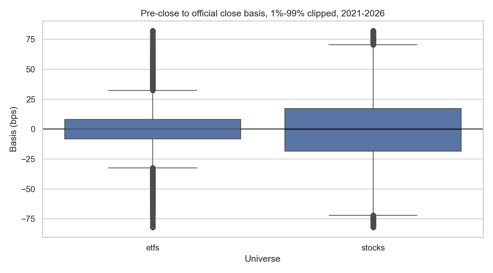
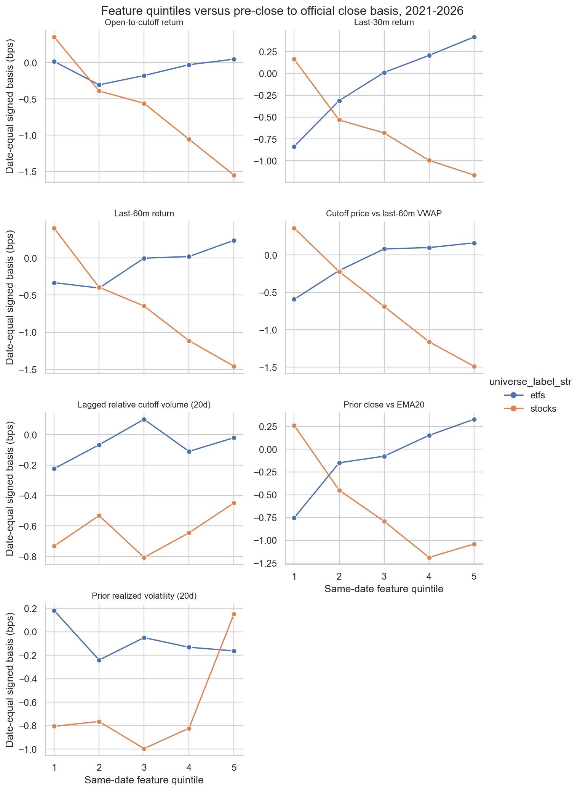

<!-- GENERATED FILE. EDIT THE CANONICAL KNOWLEDGE RECORD. -->

# Pre-close to official close MOC basis study

!!! warning "Research-only"
    This page summarizes saved research evidence. It does not authorize LIVE, allocation, or deployment.

## TL;DR

> **Verdict:** The MOC basis has a period-stable conditional diagnostic, but it is not a deployment-ready signal.

> **Status:** `diagnostic`

> **Disposition:** `not_recorded`

> **Replication:** `not_recorded`

## Research question

Measure and explain the basis from the fully known 15-minute pre-close bar to the official US equity close.

## Exact setup

| Field | Value |
| --- | --- |
| Signal family | closing_auction_basis |
| Universe | ["PIT S&P 500 top 250 by lagged ADV63", "fixed 26-ETF basket"] |
| Decision | 15 minutes before scheduled XNYS close |
| Fill | official same-session condition-6 closing price |
| Primary cost layer | central_research |
| Last reviewed | 2026-08-09T07:52:20.260925+00:00 |

## Timing and overnight attribution

```text
information available: 15 minutes before scheduled XNYS close
primary executable fill: official same-session condition-6 closing price
```

If final `Close_T` data formed the signal, a hypothetical `Close_T` entry is diagnostic only unless a separate pre-close protocol was modeled. Comparing that diagnostic with `Open_(T+1)` and applying the compounded return identity shows whether the apparent edge occurred in the overnight gap. Missing attribution numbers mean **not tested**, not zero.


## Primary metrics

| Metric | Value |
| --- | ---: |
| Period | 2021-01-04/2026-08-07 |
| Universe | stocks_and_etfs_reported_separately |
| Cost Layer | not_applicable |
| Cagr | N/A |
| Annualized Volatility | N/A |
| Sharpe | N/A |
| Maximum Drawdown | N/A |
| Turnover | N/A |

## Key findings

| Feature | Role | Direction | Status | Effect | Action |
| --- | --- | --- | --- | --- | --- |
| prior_realized_volatility_20d_float | diagnostic | positive | forward_hypothesis | 0.2881650018699162 | forward_capture_with_broker_fills |
| prior_realized_volatility_20d_float | diagnostic | positive | forward_hypothesis | 0.18771746057001035 | forward_capture_with_broker_fills |
| lagged_relative_cutoff_volume_20d_float | diagnostic | positive | forward_hypothesis | 0.06459524501491151 | forward_capture_with_broker_fills |
| lagged_relative_cutoff_volume_20d_float | diagnostic | positive | forward_hypothesis | 0.0421057529001512 | forward_capture_with_broker_fills |
| prior_close_vs_ema20_float | diagnostic | positive | forward_hypothesis | 0.038871707930769224 | forward_capture_with_broker_fills |
| open_to_cutoff_return_float | diagnostic | negative | forward_hypothesis | -0.010451147375790925 | forward_capture_with_broker_fills |
| last_30m_return_float | diagnostic | negative | forward_hypothesis | -0.011074553491328553 | forward_capture_with_broker_fills |
| cutoff_price_vs_last_60m_vwap_float | diagnostic | negative | forward_hypothesis | -0.024604127504226685 | forward_capture_with_broker_fills |
| last_30m_return_float | diagnostic | negative | forward_hypothesis | -0.029344441357011097 | forward_capture_with_broker_fills |
| open_to_cutoff_return_float | diagnostic | positive | diagnostic | 0.0021105229326856354 | do_not_use_as_rule |
| last_60m_return_float | diagnostic | negative | diagnostic | -0.005274313940289036 | do_not_use_as_rule |
| cutoff_price_vs_last_60m_vwap_float | diagnostic | negative | diagnostic | -0.009486915068328106 | do_not_use_as_rule |
| prior_close_vs_ema20_float | diagnostic | negative | diagnostic | -0.011657044816376765 | do_not_use_as_rule |
| last_60m_return_float | diagnostic | negative | diagnostic | -0.016237191529357382 | do_not_use_as_rule |
| prior_close_vs_ema20_float | diagnostic | positive | forward_hypothesis | 0.03504701586781809 | forward_capture_with_broker_fills |
| prior_close_vs_ema20_float | diagnostic | negative | forward_hypothesis | -0.016950889752164005 | forward_capture_with_broker_fills |
| last_30m_return_float | diagnostic | negative | forward_hypothesis | -0.022787005159029403 | forward_capture_with_broker_fills |
| open_to_cutoff_return_float | diagnostic | negative | forward_hypothesis | -0.025193854990090126 | forward_capture_with_broker_fills |
| last_60m_return_float | diagnostic | negative | forward_hypothesis | -0.028444909644653082 | forward_capture_with_broker_fills |
| cutoff_price_vs_last_60m_vwap_float | diagnostic | negative | forward_hypothesis | -0.03057834895985216 | forward_capture_with_broker_fills |
| last_30m_return_float | diagnostic | positive | diagnostic | 0.020441954278941497 | do_not_use_as_rule |
| last_60m_return_float | diagnostic | positive | diagnostic | 0.01325728039780814 | do_not_use_as_rule |
| cutoff_price_vs_last_60m_vwap_float | diagnostic | positive | diagnostic | 0.009580266453063924 | do_not_use_as_rule |
| prior_realized_volatility_20d_float | diagnostic | positive | diagnostic | 0.0054107557194455905 | do_not_use_as_rule |
| lagged_relative_cutoff_volume_20d_float | diagnostic | positive | diagnostic | 0.0047436818192642585 | do_not_use_as_rule |
| lagged_relative_cutoff_volume_20d_float | diagnostic | positive | diagnostic | 0.0024870116412662535 | do_not_use_as_rule |
| open_to_cutoff_return_float | diagnostic | negative | diagnostic | -0.005919169548823419 | do_not_use_as_rule |
| prior_realized_volatility_20d_float | diagnostic | negative | diagnostic | -0.010864142675880595 | do_not_use_as_rule |

## Visual evidence






## Limitations

- No broker MOC fills or queue position.
- No order-size or closing-auction participation model.
- Completed 15-minute bar rather than NBBO midpoint snapshot.
- ETF list is fixed.

## Next gates

- Forward-capture broker MOC fills, order notional, condition-6 close, auction volume, and submission timestamp.

## Sources

- `alpaca_market_data_faq`
- `alpaca_market_data_api`
- `norgate_local_us_equities`

## Canonical artifacts

| Artifact | Pakal path |
| --- | --- |
| Concise Report | `C:\\Users\\User\\Documents\\workspace\\pakal\\pakal-research\\reports\\preclose_official_close_moc_basis_study\\REPORT.md` |
| Frozen Specification | `C:\\Users\\User\\Documents\\workspace\\pakal\\pakal-research\\reports\\preclose_official_close_moc_basis_study\\research_spec_frozen.json` |
| Full Report | `C:\\Users\\User\\Documents\\workspace\\pakal\\pakal-research\\reports\\preclose_official_close_moc_basis_study\\REPORT_FULL.md` |
| Manifest | `C:\\Users\\User\\Documents\\workspace\\pakal\\pakal-research\\reports\\preclose_official_close_moc_basis_study\\run_manifest.json` |
| Notebook | `C:\\Users\\User\\Documents\\workspace\\pakal\\pakal-research\\preclose_official_close_moc_basis_study.ipynb` |
| Primary Charts | `["C:\\\\Users\\\\User\\\\Documents\\\\workspace\\\\pakal\\\\pakal-research\\\\reports\\\\preclose_official_close_moc_basis_study\\\\charts\\\\basis_distribution.png", "C:\\\\Users\\\\User\\\\Documents\\\\workspace\\\\pakal\\\\pakal-research\\\\reports\\\\preclose_official_close_moc_basis_study\\\\charts\\\\feature_quintiles.png"]` |
| Primary Source Code | `["C:\\\\Users\\\\User\\\\Documents\\\\workspace\\\\pakal\\\\pakal-research\\\\preclose_official_close_moc_basis_study.py"]` |
| Primary Tables | `["C:\\\\Users\\\\User\\\\Documents\\\\workspace\\\\pakal\\\\pakal-research\\\\reports\\\\preclose_official_close_moc_basis_study\\\\tables\\\\baseline_summary.csv", "C:\\\\Users\\\\User\\\\Documents\\\\workspace\\\\pakal\\\\pakal-research\\\\reports\\\\preclose_official_close_moc_basis_study\\\\tables\\\\feature_ic_summary.csv"]` |
