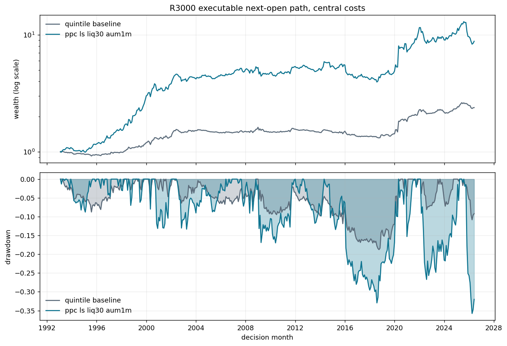
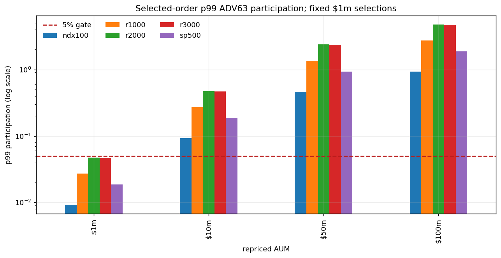

<!-- GENERATED FILE. EDIT THE CANONICAL KNOWLEDGE RECORD. -->

# Price-Path Convexity 5d PPC-LS-LIQ30 continuation

!!! warning "Research-only"
    This page summarizes saved research evidence. It does not authorize LIVE, allocation, or deployment.

## TL;DR

> **Verdict:** PPC-LS-LIQ30 fails the frozen historical continuation gates: central_sharpe, maximum_drawdown, all_required_periods_positive. Stop the fixed-N route on current history.

> **Status:** `diagnostic`

> **Disposition:** `rejected`

> **Replication:** `directionally_replicated`

## Research question

Test the one previously frozen PPC-LS-LIQ30 portfolio-construction continuation without tuning, using causal next-open timing, PIT membership, frozen costs, selected-order capacity, and full search accounting.

## Exact setup

| Field | Value |
| --- | --- |
| Signal family | price_path_convexity_short_horizon_reversal |
| Universe | ["r3000", "r1000", "r2000", "sp500", "ndx100"] |
| Decision | Final adjusted OHLC and ADV63 known after Close_T with same-month point-in-time membership. |
| Fill | Primary Open_(T+1) to Open_(T+6); Close_T to Close_(T+5) diagnostic only. Exact same-exit attribution not tested from the immutable cache. |
| Primary cost layer | central_research |
| Last reviewed | 2026-08-19T13:30:54+00:00 |

## Timing and overnight attribution

```text
information available: Final adjusted OHLC and ADV63 known after Close_T with same-month point-in-time membership.
primary executable fill: Primary Open_(T+1) to Open_(T+6); Close_T to Close_(T+5) diagnostic only. Exact same-exit attribution not tested from the immutable cache.
```

If final `Close_T` data formed the signal, a hypothetical `Close_T` entry is diagnostic only unless a separate pre-close protocol was modeled. Comparing that diagnostic with `Open_(T+1)` and applying the compounded return identity shows whether the apparent edge occurred in the overnight gap. Missing attribution numbers mean **not tested**, not zero.


## Primary metrics

| Metric | Value |
| --- | ---: |
| Period | 1993-02 through 2026-06, full descriptive already-seen history |
| Universe | R3000 PIT |
| Cost Layer | central_research: 10 bp per turnover unit plus 200 bp annual borrow for 5/252 year |
| Cagr | 6.73% |
| Annualized Volatility | 15.78% |
| Sharpe | 0.487 |
| Maximum Drawdown | -35.76% |
| Turnover | 200.00% |

## Four separate verdicts

| Question | Conclusion |
| --- | --- |
| Source Replication | The inherited five-session long-low/short-high quintile proxy reconciles exactly to its saved local parent result; this remains a Norgate proxy rather than literal CRSP replication. |
| Predictive Value | Not separately re-estimated; the continuation tests portfolio construction around an already seen cross-sectional signal. |
| Economic Value | PPC-LS-LIQ30 fails the frozen historical continuation gates: central_sharpe, maximum_drawdown, all_required_periods_positive. Stop the fixed-N route on current history. |
| Promotion | No promotion. Backtest evidence cannot authorize LIVE, allocation, broker, scheduler, release, or forward trading. |

## Key findings

| Feature | Role | Direction | Status | Effect | Action |
| --- | --- | --- | --- | --- | --- |
| ppc_ls_liq30_aum1m | portfolio_construction_and_liquidity | 30 low-convexity longs minus 30 high-convexity shorts after a 5% ADV63 order screen | diagnostic | R3000 central CAGR 6.73%, Sharpe 0.487, drawdown -35.76% | Do not tune N, ADV, regime, or weighting on this history. Any materially different idea requires a new frozen study and prospective evidence. |

## Visual evidence






## Limitations

- The source attachment is a secondary article and the local study is not literal CRSP replication.
- All local dates through 2026-06 were seen before this candidate ran; no locked historical holdout remains.
- Exact same-exit timing attribution is unavailable from the immutable equal-duration cache.
- The parent cache records 612 requested symbols that failed, so missing-symbol bias cannot be ruled out.
- ADV63 is daily and cannot establish opening-auction capacity, borrow availability, or realized fills.
- The hypothetical impact model is not calibrated to fills and is reported separately from explicit costs.
- Failed frozen core gates: central_sharpe, maximum_drawdown, all_required_periods_positive.

## Next gates

- Do not tune N, ADV, regime, or weighting on this history. Any materially different idea requires a new frozen study and prospective evidence.

## Sources

- `C:/Users/User/Downloads/price-path.pdf \| sha256:086280e49bb3da4377cfb3cb4ff24453a9a24ac26f31b00168e3c15ed05ee2e0`
- `pakal-research/sources/price_path_convexity/gulen_woeppel_price_path_convexity.pdf \| sha256:ac22533436b5cb268e96e8f079e87f4ab85c8332d6588ffdcb7f69bd8cf60425`
- `pakal-research/reports/price_path_convexity_5d_t_vs_t1_strategy_run \| inherited local baseline`
- `pakal-research/reports/price_path_convexity_5d_long_only_fixed_n_sweep \| prior diagnosis and frozen candidate provenance`

## Canonical artifacts

| Artifact | Pakal path |
| --- | --- |
| Concise Report | `C:\\Users\\User\\Documents\\workspace\\pakal\\pakal-research\\reports\\price_path_convexity_5d_liq30_long_short\\REPORT.md` |
| Full Report | `C:\\Users\\User\\Documents\\workspace\\pakal\\pakal-research\\reports\\price_path_convexity_5d_liq30_long_short\\REPORT_FULL.md` |
| Notebook | `C:\\Users\\User\\Documents\\workspace\\pakal\\pakal-research\\price_path_convexity_5d_liq30_long_short.ipynb` |
| Frozen Specification | `C:\\Users\\User\\Documents\\workspace\\pakal\\pakal-research\\reports\\price_path_convexity_5d_liq30_long_short\\research_spec_frozen.json` |
| Manifest | `C:\\Users\\User\\Documents\\workspace\\pakal\\pakal-research\\reports\\price_path_convexity_5d_liq30_long_short\\run_manifest.json` |
| Research State | `C:\\Users\\User\\Documents\\workspace\\pakal\\pakal-research\\reports\\price_path_convexity_5d_liq30_long_short\\research_state.json` |
| Hypothesis Registry | `C:\\Users\\User\\Documents\\workspace\\pakal\\pakal-research\\reports\\price_path_convexity_5d_liq30_long_short\\hypothesis_registry.json` |
| Experiment Ledger | `C:\\Users\\User\\Documents\\workspace\\pakal\\pakal-research\\reports\\price_path_convexity_5d_liq30_long_short\\experiment_ledger.jsonl` |
| Decision Log | `C:\\Users\\User\\Documents\\workspace\\pakal\\pakal-research\\reports\\price_path_convexity_5d_liq30_long_short\\decision_log.jsonl` |
| Source Rule Map | `C:\\Users\\User\\Documents\\workspace\\pakal\\pakal-research\\reports\\price_path_convexity_5d_liq30_long_short\\SOURCE_RULE_MAP.md` |
| Primary Source Code | `["C:\\\\Users\\\\User\\\\Documents\\\\workspace\\\\pakal\\\\pakal-research\\\\price_path_convexity_5d_liq30_long_short.py"]` |
| Primary Tables | `["C:\\\\Users\\\\User\\\\Documents\\\\workspace\\\\pakal\\\\pakal-research\\\\reports\\\\price_path_convexity_5d_liq30_long_short\\\\tables\\\\performance_summary.csv", "C:\\\\Users\\\\User\\\\Documents\\\\workspace\\\\pakal\\\\pakal-research\\\\reports\\\\price_path_convexity_5d_liq30_long_short\\\\tables\\\\paired_comparison.csv", "C:\\\\Users\\\\User\\\\Documents\\\\workspace\\\\pakal\\\\pakal-research\\\\reports\\\\price_path_convexity_5d_liq30_long_short\\\\tables\\\\capacity_summary.csv", "C:\\\\Users\\\\User\\\\Documents\\\\workspace\\\\pakal\\\\pakal-research\\\\reports\\\\price_path_convexity_5d_liq30_long_short\\\\tables\\\\capacity_performance.csv", "C:\\\\Users\\\\User\\\\Documents\\\\workspace\\\\pakal\\\\pakal-research\\\\reports\\\\price_path_convexity_5d_liq30_long_short\\\\tables\\\\gate_summary.csv"]` |
| Primary Charts | `["C:\\\\Users\\\\User\\\\Documents\\\\workspace\\\\pakal\\\\pakal-research\\\\reports\\\\price_path_convexity_5d_liq30_long_short\\\\charts\\\\equity_drawdown_primary.png", "C:\\\\Users\\\\User\\\\Documents\\\\workspace\\\\pakal\\\\pakal-research\\\\reports\\\\price_path_convexity_5d_liq30_long_short\\\\charts\\\\universe_sharpe_comparison.png", "C:\\\\Users\\\\User\\\\Documents\\\\workspace\\\\pakal\\\\pakal-research\\\\reports\\\\price_path_convexity_5d_liq30_long_short\\\\charts\\\\capacity_participation.png", "C:\\\\Users\\\\User\\\\Documents\\\\workspace\\\\pakal\\\\pakal-research\\\\reports\\\\price_path_convexity_5d_liq30_long_short\\\\charts\\\\period_cagr.png"]` |
