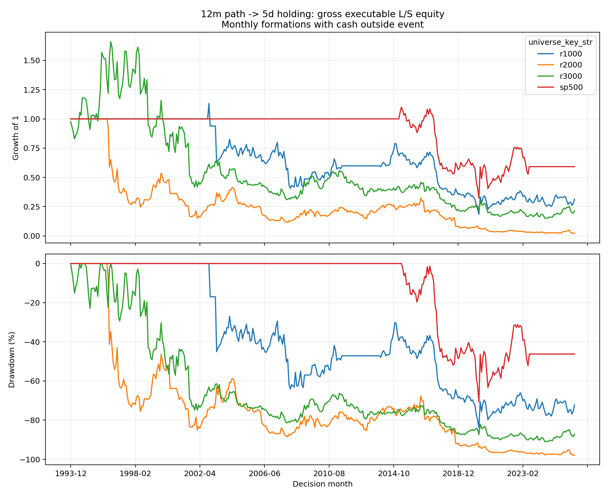
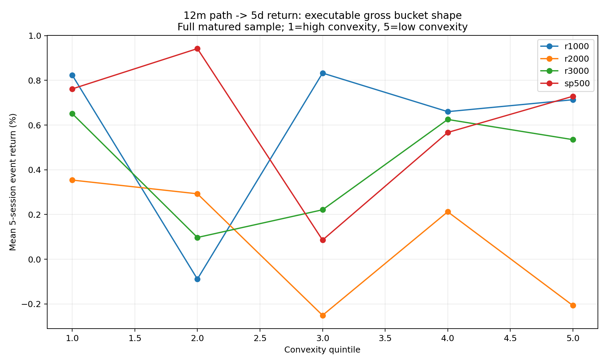

<!-- GENERATED FILE. EDIT THE CANONICAL KNOWLEDGE RECORD. -->

# Price-Path Convexity Multi-Horizon Study

!!! warning "Research-only"
    This page summarizes saved research evidence. It does not authorize LIVE, allocation, or deployment.

## TL;DR

> **Verdict:** הטענה הרב-אופקית הופרכה תחת שער הברוטו הקפוא: אף צירוף אינו עקבי מספיק בין תקופות ויקומים כדי להצדיק בדיקת עלויות.

> **Status:** `diagnostic`

> **Disposition:** `not_recorded`

> **Replication:** `not_recorded`

## Research question

Test price-path convexity across 14 predeclared formation/holding pairs and five PIT universes.

## Exact setup

| Field | Value |
| --- | --- |
| Signal family | cross_sectional_path_shape_reversal |
| Universe | ["r3000", "r1000", "r2000", "sp500", "ndx100"] |
| Decision | Close_T |
| Fill | Open_T+1 |
| Primary cost layer | paper_like |
| Last reviewed | 2026-08-17T12:59:56.380897+03:00 |

## Timing and overnight attribution

```text
information available: Close_T
primary executable fill: Open_T+1
```

If final `Close_T` data formed the signal, a hypothetical `Close_T` entry is diagnostic only unless a separate pre-close protocol was modeled. Comparing that diagnostic with `Open_(T+1)` and applying the compounded return identity shows whether the apparent edge occurred in the overnight gap. Missing attribution numbers mean **not tested**, not zero.


## Primary metrics

| Metric | Value |
| --- | ---: |
| Period | 1993-02 to last matured 5d exit through 2026-06 decision months |
| Universe | r3000 |
| Cost Layer | gross |
| Cagr | -4.64% |
| Annualized Volatility | 25.77% |
| Sharpe | -0.054 |
| Maximum Drawdown | -90.99% |
| Turnover | 200.00% |

## Key findings

| Feature | Role | Direction | Status | Effect | Action |
| --- | --- | --- | --- | --- | --- |
| negative_price_path_convexity_12m_to_5d | entry_rank | lower convexity is better | diagnostic | -0.001170316749364626 | Do not deploy; freeze any surviving pair for fresh future data. |
| matched_past_return | comparator_rank_and_5x5_control | lower formation return is better | diagnostic | N/A | Retain as control, not an optimized ensemble. |

## Visual evidence






## Limitations

- Post-hoc horizon extension; maximum status is forward_hypothesis.
- Nested PIT universe proxies are not independent confirmations or a value-weighted CRSP replication.
- Close_T result is timing-conflicted; adjusted Open is not a verified opening-auction fill.
- Long-horizon labels have pair-specific maturity cutoffs.

## Next gates

- Freeze surviving pairs unchanged for fresh future observations.
- Calibrate spreads, borrow, auction fills, and recalls before any deployment discussion.

## Sources

- `JFQA main paper`
- `Internet Appendix`
- `prior local study`

## Canonical artifacts

| Artifact | Pakal path |
| --- | --- |
| Concise Report | `C:\\Users\\User\\Documents\\workspace\\pakal\\pakal-research\\reports\\price_path_convexity_multi_horizon_smoke\\REPORT.md` |
| Frozen Specification | `C:\\Users\\User\\Documents\\workspace\\pakal\\pakal-research\\reports\\price_path_convexity_multi_horizon_study\\research_spec_frozen.json` |
| Full Report | `C:\\Users\\User\\Documents\\workspace\\pakal\\pakal-research\\reports\\price_path_convexity_multi_horizon_smoke\\REPORT_FULL.md` |
| Manifest | `C:\\Users\\User\\Documents\\workspace\\pakal\\pakal-research\\reports\\price_path_convexity_multi_horizon_smoke\\run_manifest.json` |
| Notebook | `C:\\Users\\User\\Documents\\workspace\\pakal\\pakal-research\\price_path_convexity_multi_horizon_smoke.ipynb` |
| Primary Charts | `["C:\\\\Users\\\\User\\\\Documents\\\\workspace\\\\pakal\\\\pakal-research\\\\reports\\\\price_path_convexity_multi_horizon_smoke\\\\charts"]` |
| Primary Source Code | `["C:\\\\Users\\\\User\\\\Documents\\\\workspace\\\\pakal\\\\pakal-research\\\\price_path_convexity_multi_horizon_study.py"]` |
| Primary Tables | `["C:\\\\Users\\\\User\\\\Documents\\\\workspace\\\\pakal\\\\pakal-research\\\\reports\\\\price_path_convexity_multi_horizon_smoke\\\\tables"]` |
