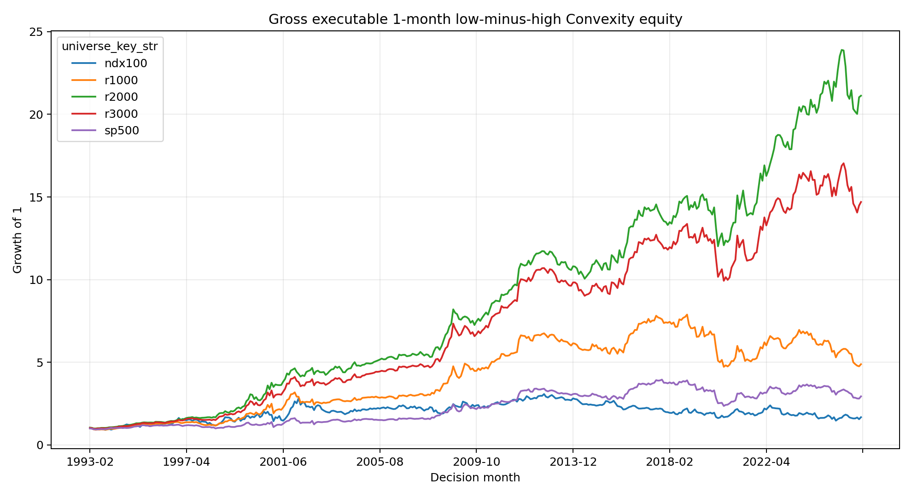
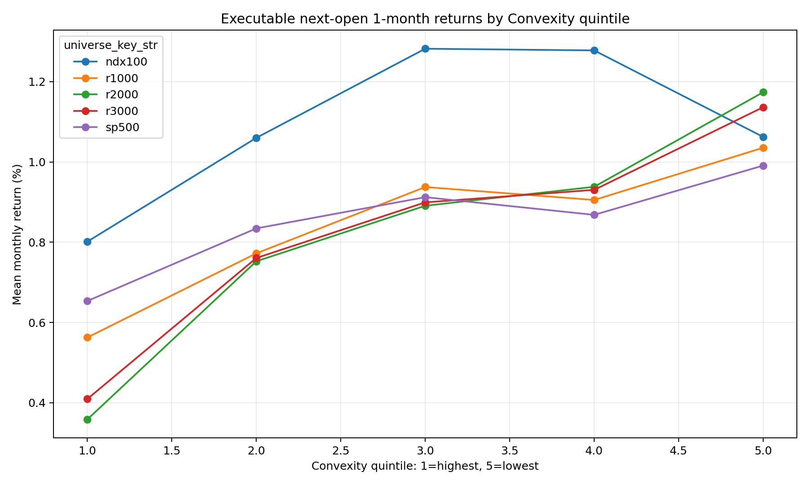

<!-- GENERATED FILE. EDIT THE CANONICAL KNOWLEDGE RECORD. -->

# Price-Path Convexity Signal Study

!!! warning "Research-only"
    This page summarizes saved research evidence. It does not authorize LIVE, allocation, or deployment.

## TL;DR

> **Verdict:** GROSS_GATE_FAIL: fees were not activated and the signal is not promotable.

> **Status:** `diagnostic`

> **Disposition:** `not_recorded`

> **Replication:** `not_recorded`

## Research question

Validate low price-path convexity beyond low past returns with executable timing.

## Exact setup

| Field | Value |
| --- | --- |
| Signal family | short_horizon_cross_sectional_reversal |
| Universe | ["r3000", "r1000", "r2000", "sp500", "ndx100"] |
| Decision | Close_T |
| Fill | Open_T+1 |
| Primary cost layer | paper_like |
| Last reviewed | 2026-08-17T01:36:36.172786+03:00 |

## Timing and overnight attribution

```text
information available: Close_T
primary executable fill: Open_T+1
```

If final `Close_T` data formed the signal, a hypothetical `Close_T` entry is diagnostic only unless a separate pre-close protocol was modeled. Comparing that diagnostic with `Open_(T+1)` and applying the compounded return identity shows whether the apparent edge occurred in the overnight gap. Missing attribution numbers mean **not tested**, not zero.


## Primary metrics

| Metric | Value |
| --- | ---: |
| Period | 1990-07 to 2026-06 |
| Universe | r3000 |
| Cost Layer | gross |
| Cagr | 8.40% |
| Annualized Volatility | 11.30% |
| Sharpe | 0.772 |
| Maximum Drawdown | -25.74% |
| Turnover | N/A |

## Key findings

| Feature | Role | Direction | Status | Effect | Action |
| --- | --- | --- | --- | --- | --- |
| negative_price_path_convexity_1m | entry_rank | lower raw convexity is better | diagnostic | 0.0072675585610704726 | do not promote; require independent post-2022 confirmation |
| negative_past_return_1m | comparator_rank | lower past return is better | rejected_primary_comparator | 0.0016259737864675117 | retain only as a diagnostic control |
| convexity_within_lowest_past_return_quintile | interaction_diagnostic | low minus high convexity | historically_positive_but_decayed | 0.005797952036537026 | do not form an ensemble before fresh confirmation |
| negative_price_path_convexity_5_session_event | forward_hypothesis | lower raw convexity is better | forward_hypothesis | 0.004798945497959562 | freeze a separate stateful event study; do not promote from this sweep |

## Visual evidence






## Limitations

- Equal-weight Norgate PIT proxy, not value-weighted CRSP replication.
- Adjusted Opens are not verified auction fills.
- The frozen gross gate failed, so costs and capacity were intentionally not activated.

## Next gates

- Freeze a separate 5-session month-end event study with stateful cash-day accounting and fresh confirmation.
- Independent CRSP value-weighted replication and live borrow/auction calibration.

## Sources

- `JFQA main paper`
- `Internet Appendix`
- `Erratum`
- `Aligrithm secondary print`

## Canonical artifacts

| Artifact | Pakal path |
| --- | --- |
| Concise Report | `C:\\Users\\User\\Documents\\workspace\\pakal\\pakal-research\\reports\\price_path_convexity_signal_study\\REPORT.md` |
| Frozen Specification | `C:\\Users\\User\\Documents\\workspace\\pakal\\pakal-research\\reports\\price_path_convexity_signal_study\\research_spec_frozen.json` |
| Full Report | `C:\\Users\\User\\Documents\\workspace\\pakal\\pakal-research\\reports\\price_path_convexity_signal_study\\REPORT_FULL.md` |
| Manifest | `C:\\Users\\User\\Documents\\workspace\\pakal\\pakal-research\\reports\\price_path_convexity_signal_study\\run_manifest.json` |
| Notebook | `C:\\Users\\User\\Documents\\workspace\\pakal\\pakal-research\\price_path_convexity_signal_study.ipynb` |
| Primary Charts | `["C:\\\\Users\\\\User\\\\Documents\\\\workspace\\\\pakal\\\\pakal-research\\\\reports\\\\price_path_convexity_signal_study\\\\charts"]` |
| Primary Source Code | `["C:\\\\Users\\\\User\\\\Documents\\\\workspace\\\\pakal\\\\pakal-research\\\\price_path_convexity_signal_study.py"]` |
| Primary Tables | `["C:\\\\Users\\\\User\\\\Documents\\\\workspace\\\\pakal\\\\pakal-research\\\\reports\\\\price_path_convexity_signal_study\\\\tables"]` |
