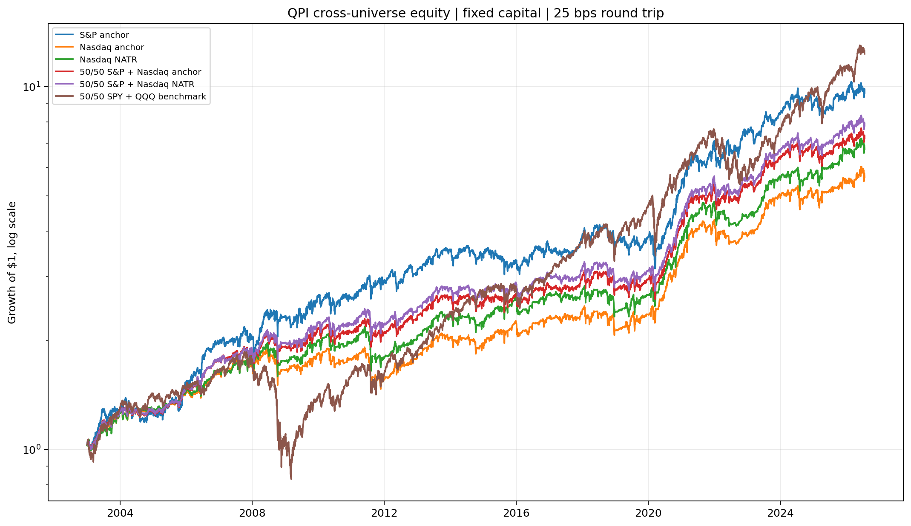
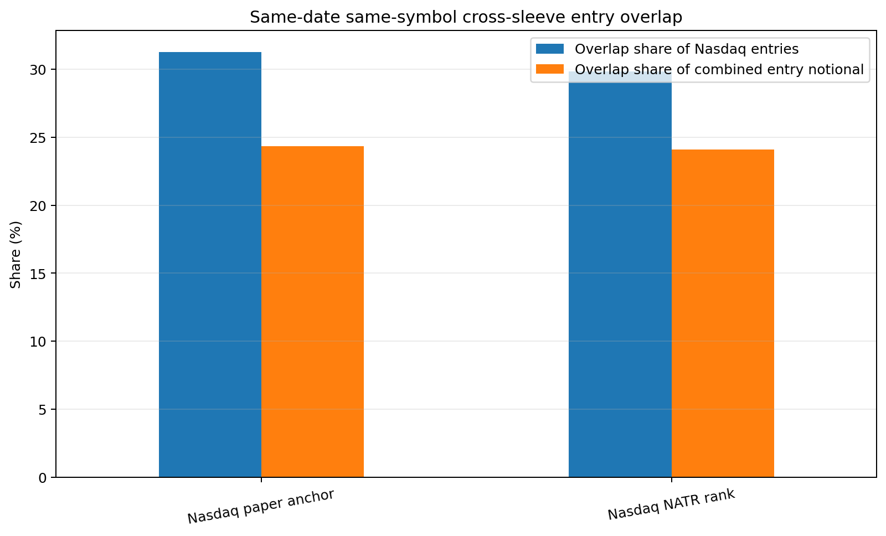

<!-- GENERATED FILE. EDIT THE CANONICAL KNOWLEDGE RECORD. -->

# HPI Cross-Universe Fixed-Capital Ensemble

!!! warning "Research-only"
    This page summarizes saved research evidence. It does not authorize LIVE, allocation, or deployment.

## TL;DR

> **Verdict:** Keep the frozen 50/50 ensemble as a research risk smoother, not as a new alpha source or a live strategy. NATR remains a soft Nasdaq rank vote, while opening-auction liquidity and empirical capacity are the next binding gates.

> **Status:** `research_candidate`

> **Disposition:** `not_recorded`

> **Replication:** `not_recorded`

## Research question

Determine whether a frozen 50/50 S&P 500 and Nasdaq-100 HPI portfolio improves path risk after executable next-open timing, conservative base costs, overlap aggregation, and selected-order ADV stress.

## Exact setup

| Field | Value |
| --- | --- |
| Signal family | long_equity_mean_reversion |
| Universe | ["S&P 500 Current & Past with point-in-time membership", "Nasdaq 100 Current & Past with point-in-time membership"] |
| Decision | after Close_T |
| Fill | Open_T+1 |
| Primary cost layer | conservative_survival |
| Last reviewed | 2026-07-25T22:42:12.6660165+03:00 |

## Timing and overnight attribution

```text
information available: after Close_T
primary executable fill: Open_T+1
```

If final `Close_T` data formed the signal, a hypothetical `Close_T` entry is diagnostic only unless a separate pre-close protocol was modeled. Comparing that diagnostic with `Open_(T+1)` and applying the compounded return identity shows whether the apparent edge occurred in the overnight gap. Missing attribution numbers mean **not tested**, not zero.


## Primary metrics

| Metric | Value |
| --- | ---: |
| Period | 2003-01-02 through 2026-07-24 |
| Universe | fixed initial 50/50 S&P 500 Current & Past plus Nasdaq 100 Current & Past |
| Cost Layer | 25 bps round-trip conservative survival proxy; capacity impact excluded |
| Cagr | 9.13% |
| Annualized Volatility | 13.15% |
| Sharpe | 0.731 |
| Maximum Drawdown | -18.05% |
| Turnover | N/A |

## Key findings

| Feature | Role | Direction | Status | Effect | Action |
| --- | --- | --- | --- | --- | --- |
| fixed 50/50 S&P and Nasdaq initial-capital ensemble | portfolio ensemble | central weights reduce volatility and drawdown while giving up CAGR to the stronger S&P sleeve | research_candidate | versus S&P alone at 25 bps: CAGR -0.88 percentage points, volatility -2.40 points, maximum drawdown improved by 6.32 points, Sharpe 0.70 to 0.73 | retain the frozen 50/50 construction for research; do not optimize the observed 50% to 75% S&P Sharpe plateau |
| Nasdaq NATR14 descending rank | cross-sectional soft rank | higher NATR receives priority among otherwise eligible Nasdaq entries | forward_hypothesis | 50/50 blend at 25 bps improves from 8.76% CAGR and 0.71 Sharpe with turnover rank to 9.13% and 0.73 with NATR rank | retain as a soft vote only; do not convert to a hard NATR threshold |
| selected-order ADV63 participation stress | capacity diagnostic | higher capital and participation consume the edge nonlinearly | diagnostic | moderate scenario CAGR is 7.76% at $1m, 6.08% at $5m, 4.84% at $10m, 2.43% at $25m, and -0.23% at $50m | freeze price, ADV, size-proxy, and participation buckets; add opening-auction liquidity before any capital claim |

## Visual evidence






## Limitations

- The base HPI rule and NATR hypothesis were viewed before the cross-universe study and are not untouched strategy discovery.
- Flat base costs are not decomposed or calibrated from observed fills.
- The impact curve is a scenario and daily ADV is not opening-auction liquidity.
- The impact stress does not rerun portfolio state after stressed costs.
- Aggregate turnover is missing from the saved cross-universe summary.
- The sleeves have 0.687 daily component-return correlation and 24.08% overlapping entry notional.
- The fixed-capital SPY plus QQQ benchmark has higher CAGR.
- CAPITALSPECIAL is not claimed as a cash-dividend total-return series.

## Next gates

- Freeze raw-price, ADV63, and size-proxy buckets and test their interaction with NATR.
- Add a point-in-time opening-auction liquidity proxy if an acceptable source is available.
- Compare a predeclared hard participation cap with smooth liquidity-aware sizing.
- Calibrate spread, auction basis risk, and slippage from actual or representative order-level fills.
- Preserve the 50/50 research portfolio and the same discovery, validation, and confirmation periods.

## Sources

- `{"artifacts": ["C:\\\\Users\\\\User\\\\Downloads\\\\qpi_1.pdf", "C:\\\\Users\\\\User\\\\Downloads\\\\qpi_2.pdf", "C:\\\\Users\\\\User\\\\Downloads\\\\qpi_3.pdf", "C:\\\\Users\\\\User\\\\Downloads\\\\qpi_4.pdf"], "source_id": "qpi-paper-chain"}`
- `{"artifact": "C:\\\\Users\\\\User\\\\Downloads\\\\3. Testing for an Edge _ Quantitativo.pdf", "source_id": "testing-methodology"}`
- `{"artifact": "pakal-research/reports/qpi_cross_universe_ensemble/research_spec_original_v0.json", "sha256": "4ccc5c98069b90ac4f9198d5392533e87214fede82492d2484f6a8a73e02db3f", "source_id": "original-frozen-rule-set"}`

## Canonical artifacts

| Artifact | Pakal path |
| --- | --- |
| Concise Report | `pakal-research/reports/qpi_cross_universe_ensemble/REPORT.md` |
| Full Report | `pakal-research/reports/qpi_cross_universe_ensemble/REPORT_FULL.md` |
| Notebook | `pakal-research/qpi_cross_universe_ensemble.ipynb` |
| Frozen Specification | `pakal-research/reports/qpi_cross_universe_ensemble/research_spec_frozen.json` |
| Manifest | `pakal-research/reports/qpi_cross_universe_ensemble/run_manifest.json` |
| Primary Source Code | `["pakal-research/qpi_cross_universe_ensemble.py", "pakal-research/qpi_nasdaq_stateful_ensemble.py", "pakal-research/qpi_parameter_robustness.py", "pakal-research/qpi_vectorized_portfolio_engine.py"]` |
| Primary Tables | `["pakal-research/reports/qpi_cross_universe_ensemble/tables/weight_neighborhood_summary.csv", "pakal-research/reports/qpi_cross_universe_ensemble/tables/impact_stress_summary.csv", "pakal-research/reports/qpi_cross_universe_ensemble/tables/incremental_return_tests.csv", "pakal-research/reports/qpi_cross_universe_ensemble/tables/entry_overlap_summary.csv"]` |
| Primary Charts | `["pakal-research/reports/qpi_cross_universe_ensemble/charts/primary_equity_curves.png", "pakal-research/reports/qpi_cross_universe_ensemble/charts/weight_neighborhood.png", "pakal-research/reports/qpi_cross_universe_ensemble/charts/entry_overlap.png", "pakal-research/reports/qpi_cross_universe_ensemble/charts/impact_stress_heatmap.png"]` |
