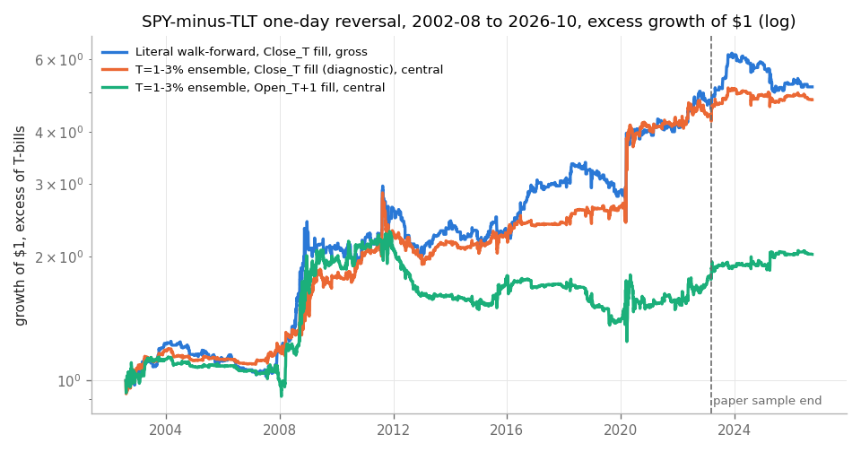
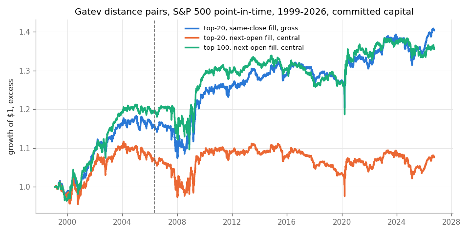

<!-- GENERATED FILE. EDIT THE CANONICAL KNOWLEDGE RECORD. -->

# QuantSeeker short-term mean reversion: stock-bond spread, IBS/MTSI, cross-asset IBS, intraday asymmetry, metals pairs, buy-the-dip, Gatev pairs

!!! warning "Research-only"
    This page summarizes saved research evidence. It does not authorize LIVE, allocation, or deployment.

## TL;DR

> **Verdict:** Most claims replicate as paper-like diagnostics, but almost all of the index-level reversal is earned from Close_T to Open_T+1. At the next open the IBS basket, SPY-TLT spread, intraday asymmetry, silver spreads and Gatev pairs fail; the multi-day IBS/MTSI percentile ensembles that pass the gates are timed equity beta with no alpha versus a beta-matched SPY since 2013. Only a true 15:45 IBS -> MOC trade on SPY/QQQ (signal from ES/NQ bars) keeps the edge (Sharpe 0.85 central 2016-06..2026-08, alpha vs SPY 3.9%/yr t 1.6) and is kept as a shadow forward hypothesis; it misses the frozen validation gate by 0.003 Sharpe. No combined MR sleeve is promoted.

> **Status:** `forward_hypothesis`

> **Disposition:** `rejected`

> **Replication:** `replicated`

## Research question

Replicate eight QuantSeeker MR articles, test executable versions (Open_T+1 vs 15:45/MOC) with three cost tiers and capacity, and decide whether a combined MR sleeve adds value beyond existing MR candidates and trend.

## Exact setup

| Field | Value |
| --- | --- |
| Signal family | mean_reversion |
| Universe | ["Fixed article ETFs (SPY, QQQ, IWM, EEM, VNQ, TLT, UUP, DBC, GLD, SLV, USO, IBIT, AGG, GDX, GDXJ, SIL, SILJ, SPXL, TQQQ, UDOW, DIA)", "S&P 500 point-in-time members (Gatev pairs)", "BTCUSDT US-session bars", "ES/NQ/GC 5-minute RTH bars (signals only)"] |
| Decision | Close_T (daily-bar signals); 15:45 ET for the pre-close protocol |
| Fill | Open_T+1 (primary executable); MOC at Close_T only for 15:45 signals |
| Primary cost layer | central_research |
| Last reviewed | 2026-10-02T15:28:59+03:00 |

## Timing and overnight attribution

```text
information available: Close_T (daily-bar signals); 15:45 ET for the pre-close protocol
primary executable fill: Open_T+1 (primary executable); MOC at Close_T only for 15:45 signals
```

If final `Close_T` data formed the signal, a hypothetical `Close_T` entry is diagnostic only unless a separate pre-close protocol was modeled. Comparing that diagnostic with `Open_(T+1)` and applying the compounded return identity shows whether the apparent edge occurred in the overnight gap. Missing attribution numbers mean **not tested**, not zero.

| Attribution field | Value |
| --- | --- |
| Status | tested |
| Diagnostic Path | Close_T fill from a final-close signal to the declared exit |
| Executable Path | Open_T+1 to the same declared exit; and 15:45 signal -> MOC |
| Method | Compounded overnight and executable-return decomposition per event and per book |
| Headline Result | Overnight share of the IBS<0.3 next-day return: SPY 48%, QQQ 43%, IWM 57%, EEM 63%, VNQ 53%. The 4-ETF basket falls from Sharpe 0.85 (close fill) to 0.04 (next open) at central cost; the 15:45->MOC SPY/QQQ protocol keeps 0.85. |
| Metrics | {"basket_close_fill_central_sharpe": 0.845, "basket_open_fill_central_sharpe": 0.044, "spyqqq_1545_moc_central_sharpe_2016_2026": 0.85} |
| Artifact | pakal-research/reports/quantseeker_mean_reversion_study/tables/B_ibs_event_table.csv |

## Primary metrics

| Metric | Value |
| --- | ---: |
| Period | 2016-06-01 to 2026-08-19 |
| Universe | SPY/QQQ, signal from ES/NQ 15:45 bars, MOC fill |
| Cost Layer | central_research (2 bps per side) |
| Cagr | 10.21% |
| Annualized Volatility | 9.16% |
| Sharpe | 0.850 |
| Maximum Drawdown | -12.51% |
| Turnover | 8100.00% |

## Four separate verdicts

| Question | Conclusion |
| --- | --- |
| Source Replication | replicated: SPY-TLT slopes negative (t -2 to -4) and gross Sharpe 0.61 vs 0.78; cross-asset IBS bp match per ETF; IBS basket gross Sharpe 1.03 vs 1.01; MTSI-proxy QQQ table within 0.05 Sharpe; asymmetry gross 9.6%/0.55 vs 8.0%/0.51; metals in-window Sharpe within 0.05 except SILJ-SIL; buy-the-dip matches to 0.01 Sharpe; Gatev directionally (much smaller than Zhu). |
| Predictive Value | Low IBS predicts next-day equity-ETF returns (t 4-5), not bonds/FX/commodities/BTC-2018+; asymmetry is subsumed by same-day intraday reversal; futures 5-60 min autocorrelation ~0. |
| Economic Value | Executable at Open_T+1: none beyond beta. Executable with a 15:45 snapshot + MOC: SPY/QQQ IBS basket positive in 2020-24 and 2025-26, weak 2016-19. |
| Promotion | No paper trial. Shadow only: SPY/QQQ 15:45 IBS -> MOC basket. Everything else rejected or diagnostic. |

## Key findings

| Feature | Role | Direction | Status | Effect | Action |
| --- | --- | --- | --- | --- | --- |
| IBS (final close) | signal | low IBS -> higher next-day return (long only) | replicated_diagnostic | SPY 13 bp, QQQ 22 bp, IWM 15 bp, EEM 22 bp, VNQ 22 bp per event (IBS<0.3, gross) | use only with a pre-close (15:45) snapshot and MOC; useless at next open |
| IBS 15:45 snapshot | signal | long when <0.1/0.2/0.3 | forward_hypothesis | Sharpe 0.85 central (2016-26), alpha vs SPY 3.9%/yr t 1.6 | shadow log with real ETF 15:45 high/low snapshots |
| MTSI (typical-price VWAP proxy) | signal | low -> long | diagnostic | QQQ L30/L40 Hold1 Sharpe ~1.0 in article window (matches source) | no superiority shown with daily data; true VWAP not tested |
| SPY-TLT one-day return difference | signal | fade large differences | diagnostic | slope t -2.6 to -4.2 | reject standalone; crisis payoff noted |
| Intraday asymmetry ln(H/O)+ln(L/O) | signal | fade | rejected | gross Sharpe 0.55; break-even ~1.4 bps/side | reject |
| Silver ETF spread reversal (horizon ensemble) | signal | fade 5-60d spread drift | rejected | silver3 Sharpe 0.46 paper (2015-26); 0.07 central | reject |
| Monthly buy-the-dip transfer | exposure | adds equity after declines | rejected | every variant below an exposure-matched static mix (2003-26 and 1871-2025) | do not use |
| Gatev distance pairs | signal | convergence | rejected | 0.09-0.17%/month gross (Zhu: 0.46%) | reject |

## Visual evidence






## Limitations

- No ETF intraday data before 2021; 15:45 IBS is proxied from ES/NQ/GC futures RTH bars (2016-06+) and BTC from Binance.
- MTSI uses a typical-price VWAP proxy.
- Shiller bond returns approximated from GS10 duration.
- Holdout 2025+ columns were printed in family tables before the combined-sleeve rule was set; not a clean confirmation.
- Gatev on S&P 500 only (Zhu used the broad CRSP universe).

## Next gates

- Shadow-log SPY/QQQ 15:45 IBS from real ETF 15:45 snapshots with MOC fills and measured auction basis for >= 6 months.
- Test IBS 15:45 with intraday VWAP (true MTSI) once ETF minute data is available.
- Check overlap of the 15:45 IBS basket with the C_main EOM flow line and the Connors/RSI2 shadows before any paper trial.

## Sources

- `QS-2025-02-18`
- `QS-2025-03-09`
- `QS-2025-04-03`
- `QS-2025-05-09`
- `QS-2026-02-08`
- `QS-2026-04-20`
- `QS-2026-06-26`
- `QS-2026-08-27`

## Canonical artifacts

| Artifact | Pakal path |
| --- | --- |
| Concise Report | `pakal-research/reports/quantseeker_mean_reversion_study/REPORT.md` |
| Full Report | `pakal-research/reports/quantseeker_mean_reversion_study/REPORT_FULL.md` |
| Notebook | `pakal-research/reports/quantseeker_mean_reversion_study/quantseeker_mean_reversion_study.ipynb` |
| Frozen Specification | `pakal-research/reports/quantseeker_mean_reversion_study/research_spec_frozen.json` |
| Manifest | `pakal-research/reports/quantseeker_mean_reversion_study/run_manifest.json` |
| Primary Source Code | `["pakal-research/quantseeker_mean_reversion/qmr_build_artifacts.py", "pakal-research/quantseeker_mean_reversion/qmr_charts.py", "pakal-research/quantseeker_mean_reversion/qmr_combine.py", "pakal-research/quantseeker_mean_reversion/qmr_data.py", "pakal-research/quantseeker_mean_reversion/qmr_lib.py", "pakal-research/quantseeker_mean_reversion/qmr_lineage.py", "pakal-research/quantseeker_mean_reversion/qmr_pairs.py", "pakal-research/quantseeker_mean_reversion/qmr_run.py", "pakal-research/quantseeker_mean_reversion/test_qmr_timing.py"]` |
| Primary Tables | `["pakal-research/reports/quantseeker_mean_reversion_study/tables/S_component_gates.csv", "pakal-research/reports/quantseeker_mean_reversion_study/tables/B_ibs_event_table.csv", "pakal-research/reports/quantseeker_mean_reversion_study/tables/B_basket_1545_vs_final.csv", "pakal-research/reports/quantseeker_mean_reversion_study/tables/S_beta_check.csv", "pakal-research/reports/quantseeker_mean_reversion_study/tables/F_btd_spy_agg.csv", "pakal-research/reports/quantseeker_mean_reversion_study/tables/S_capacity_bands.csv"]` |
| Primary Charts | `["pakal-research/reports/quantseeker_mean_reversion_study/charts/A_spy_tlt_equity.png", "pakal-research/reports/quantseeker_mean_reversion_study/charts/B_ibs_1545_vs_close.png", "pakal-research/reports/quantseeker_mean_reversion_study/charts/B_ibs_overnight_vs_intraday.png", "pakal-research/reports/quantseeker_mean_reversion_study/charts/D_asymmetry_cost_curve.png", "pakal-research/reports/quantseeker_mean_reversion_study/charts/E_metals_by_period.png", "pakal-research/reports/quantseeker_mean_reversion_study/charts/F_btd_risk_return.png", "pakal-research/reports/quantseeker_mean_reversion_study/charts/G_gatev_equity.png", "pakal-research/reports/quantseeker_mean_reversion_study/charts/S_beta_matched.png"]` |
| Research State | `pakal-research/reports/quantseeker_mean_reversion_study/research_state.json` |
| Hypothesis Registry | `pakal-research/reports/quantseeker_mean_reversion_study/hypothesis_registry.json` |
| Experiment Ledger | `pakal-research/reports/quantseeker_mean_reversion_study/experiment_ledger.jsonl` |
| Decision Log | `pakal-research/reports/quantseeker_mean_reversion_study/decision_log.jsonl` |
| Source Rule Map | `pakal-research/reports/quantseeker_mean_reversion_study/SOURCE_RULE_MAP.md` |
