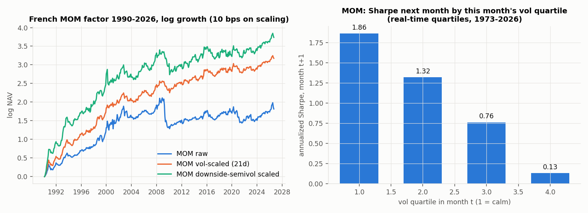
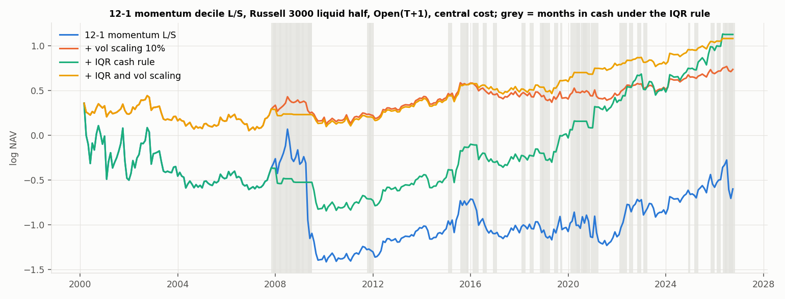

<!-- GENERATED FILE. EDIT THE CANONICAL KNOWLEDGE RECORD. -->

# QuantSeeker momentum & trend archive (15 articles): vol/semivol scaling, IQR momentum timing, 52-week-high neutral, HTP/PTH, informative (earnings) days, smoothness, FCF, linearity TAA, managed-futures ETFs, multi-timeframe BTC, crypto rotation, intraday momentum

!!! warning "Research-only"
    This page summarizes saved research evidence. It does not authorize LIVE, allocation, or deployment.

## TL;DR

> **Verdict:** Most article claims reproduce in direction, but every 'better momentum ranking' (smoothness, 52-week-high neutral, HTP/PTH, FCF, earnings-day or event-weighted returns, R2*slope in TAA, hourly BTC timing, semivolatility) is either not significant, eaten by costs, or reversed after publication. What survives is the WHEN layer: (1) volatility scaling of momentum (French MOM Sharpe 0.51->0.82 since 1963, still +0.20 after 2015; stock L/S max DD -78% -> -29%), and (2) the Liu et al. IQR dispersion switch (cash when last month's cross-sectional return IQR > 80th pct of the prior 60 months): +0.21 Sharpe on 12-1 L/S at central cost (p 0.055), adds +0.10 on top of vol scaling (p 0.09), holds 1995-99 on the French factor, pre-publication and in the 2025+ holdout, leave-one-year-out 0.31-0.42. The vol+IQR 12-1 L/S book is weak standalone (central Sharpe 0.37, CAGR 4.1%, DD -32%) but nearly uncorrelated with BOOK-A (0.07) and raises its monthly Sharpe 1.14 -> 1.21 (2007+) / 1.38 -> 1.53 (2019+) at a 20% overlay. Study-wide BH q for IQR is 0.32: a coherent forward hypothesis, not a confirmed edge. Status: shadow (paper-log the IQR flag and the L/S book), no allocation.

> **Status:** `forward_hypothesis`

> **Disposition:** `promising_component`

> **Replication:** `directionally_replicated`

## Research question

Replicate each article's core claim with point-in-time split-safe data, test the promising ones as executable portfolios with three cost layers, and decide whether any momentum/trend construction beats or adds to what the workspace already holds (Concretum ETF trend, crisis-trend pod, Defense First / BOOK-A, GQR dual momentum).

## Exact setup

| Field | Value |
| --- | --- |
| Signal family | momentum_and_trend_overlays |
| Universe | ["Russell 3000 point-in-time members, raw close >= $5, ADV63 >= $1M, liquid half by 21d turnover (stock modules, 2000-2026)", "Kenneth French daily factors 1963-2026", "SPY QQQ JNK GLD TLT USO; TLT GLD DBC UUP BTAL SPY SPXL; managed-futures ETFs live + delisted (Norgate TR)", "Binance BTCUSDT 5m/1h 2017-08..2026-09; Binance USDT pairs incl. delisted (status BREAK) daily", "26 liquid ETFs, Alpaca SIP 15-minute session panel 2021-01..2026-08"] |
| Decision | Close_T (month-end for monthly books; hourly bar close for BTC; 15:45 ET cutoff for intraday momentum) |
| Fill | Open_(T+1) (stocks, ETFs); next hourly open (BTC); 15:45 price -> MOC official close (intraday, explicit pre-close protocol); French factors paper-like close-to-close |
| Primary cost layer | central_research |
| Last reviewed | 2026-10-02T19:00:00+03:00 |

## Timing and overnight attribution

```text
information available: Close_T (month-end for monthly books; hourly bar close for BTC; 15:45 ET cutoff for intraday momentum)
primary executable fill: Open_(T+1) (stocks, ETFs); next hourly open (BTC); 15:45 price -> MOC official close (intraday, explicit pre-close protocol); French factors paper-like close-to-close
```

If final `Close_T` data formed the signal, a hypothetical `Close_T` entry is diagnostic only unless a separate pre-close protocol was modeled. Comparing that diagnostic with `Open_(T+1)` and applying the compounded return identity shows whether the apparent edge occurred in the overnight gap. Missing attribution numbers mean **not tested**, not zero.

| Attribution field | Value |
| --- | --- |
| Status | tested |
| Diagnostic Path | article timing (signals to T-1 and trade at Close_T for TAA; next-day close for crypto; first-day close for semivol ETFs) |
| Executable Path | Open_(T+1) to the same exit |
| Method | same rules run with both fills |
| Headline Result | TAA: ROR Sharpe 0.93 (article timing) vs 0.85 (Open T+1), LIN 0.94 vs 0.90; semivol ETFs: open vs first-close differences <= 0.1 Sharpe; crypto open vs close fill immaterial. No conclusion depends on same-close execution. |
| Metrics | {} |
| Artifact | tables/m10_taa_stats.csv; tables/m15_semivol_stats.csv; tables/m06_crypto_stats.csv |

## Primary metrics

| Metric | Value |
| --- | ---: |
| Period | 2000-02 .. 2026-09 (monthly) |
| Universe | Russell 3000 PIT liquid half |
| Cost Layer | central_research: 20 bps per side + 50 bps/yr borrow on shorts |
| Cagr | 4.10% |
| Annualized Volatility | 13.20% |
| Sharpe | 0.370 |
| Maximum Drawdown | -32.30% |
| Turnover | 10.7x per year one-way (sum of both legs, scaled) |

## Four separate verdicts

| Question | Conclusion |
| --- | --- |
| Source Replication | directionally replicated for A01, A02, A03, A06, A07 (crash protection), A08, A09 (gross), A10 (drawdown only), A11 (long-only, earnings days), A12, A13, A15; not reproduced for A04 (FCF) and A11 L/S; A14 tested only 2021-2026 with a 15:45 proxy (edge < costs); A05 not assessed (no sentiment data) |
| Predictive Value | vol of momentum predicts its next-month Sharpe; IQR state predicts momentum returns (French MOM next-month mean +0.68%/m low-IQR vs -0.14%/m high-IQR, 1995-2026); ranking refinements add no robust predictive value net of plain 12-1 |
| Economic Value | only the vol + IQR overlay on 12-1 L/S momentum has positive central-cost value that is stable across subperiods; managed-futures ETFs and BTC daily trend add small diversification already covered by the crisis pod / GQR work |
| Promotion | no paper trial; shadow-log the IQR flag and the vol+IQR 12-1 L/S book for 12 months; everything else rejected or diagnostic |

## Key findings

| Feature | Role | Direction | Status | Effect | Action |
| --- | --- | --- | --- | --- | --- |
| volatility scaling of momentum (21d realized vol, 10% target) | sizing | positive | confirmed | French MOM Sharpe +0.31 (0.51 -> 0.82, 1963-2026), +0.20 after 2015; stock L/S max DD -78% -> -29% | keep as the default overlay for any momentum sleeve |
| IQR dispersion switch (Liu et al. 2025) | regime | cash when high | forward_hypothesis | +0.21 Sharpe on 12-1 L/S central; +0.10 on top of vol scaling; French MOM 1995-2026 0.32 -> 0.53 | shadow-log monthly; combine with vol scaling, never replace it |
| semivolatility scaling (Batista & Fernandes) | sizing | mixed | rejected_as_general | R3 up/down ratio beats variance scaling only for USO (+0.47) and marginally BTC; worse for momentum (-0.51), GLD, TLT, SPY | do not replace plain vol scaling |
| nearness to 52-week high neutralization (Byun & Jeon) | neutralizer | crash protection | rejected | raw skew -0.65 -> +0.89, DD -75% -> -50%, Sharpe +0.06 gross; after vol scaling and costs -0.15 | none |
| HTP / PTH decomposition (Busing et al.) | signal | HTP for L/S, PTH for long-only | rejected | HTP +0.06 gross (0.48 vs 0.42), 0 after costs; PTH long-only +0.08 pre-2021, -0.58 after | none |
| earnings-announcement-day momentum (SEC 8-K Item 2.02) | signal | positive long-only | diagnostic | long-only top 50 Sharpe 0.45 vs 0.29 (article 0.49 vs 0.31); L/S worse than MOM; event-weighted momentum worse | record; no build |
| smoothness (t-stat, R2*slope, ID combo) | rank | positive | diagnostic (already known) | +0.07 Sharpe long-only | minor rank component only (prior study agrees) |
| FCF yield + momentum (Fu et al.) | rank | none | not_reproducible | +0.02 / 0.00 Sharpe (article +40%) | none |
| R2*slope trend score in Defense First + BTAL | signal | lower drawdown | diagnostic | Sharpe +0.05 (n.s.), max DD -13.9% -> -10.3% (SPY fallback), -23.9% -> -17.9% (SPXL) | optional drawdown tweak; not a Sharpe improvement |
| hourly timing inside a daily BTC trend | filter | negative after costs | rejected | S2 vs S1 +0.34 Sharpe (claim reproduced), but S2 vs daily-only -0.28 at central cost; 160 vs 11 trades/yr | use daily trend + vol cap (GQR result) if any |
| managed-futures ETF selection by track record | universe | none | rejected | top-half vs bottom-half trailing-Sharpe spread -0.02%/m (t -0.07); rank IC to next 12m Sharpe -0.15 | if MF exposure is wanted, hold the category replicator (DBMF) rather than picking winners |
| intraday market momentum (Baltussen et al.), 15:45->close proxy | signal | weak | rejected | SPY gross 0.4 bps per trade, Sharpe 0.29 (2021-24 0.82, 2025+ -1.0); SMA200 condition no help | none |

## Visual evidence






## Limitations

- No intraday ETF history before 2021; A14 uses the last 15 minutes instead of 30 and only 2021-2026.
- A03/A15 ETF realized variance from daily returns (5-minute only for BTC).
- Norgate has no delisting returns; positions are truncated at the last close.
- SEC CIK mapping covers 52-69% of names before 2005 and > 90% after 2010; FCF frames lack filing dates (120-day lag assumption).
- Crypto universe from Binance only (2017-08+); pairs removed from exchangeInfo are missing.
- Several holdout/post-publication windows are short (IQR post-publication 15 months; MF ETF post-article 8 months).
- The IQR L/S book needs ~120 short positions; borrow availability and recalls are not modelled beyond a flat fee.
- Post-hoc analyses (French MOM IQR 1995+, long-only IQR overlay, book integration) are labelled and cannot confirm the hypothesis.

## Next gates

- Shadow-log monthly from 2026-10: IQR flag, vol-scaled 12-1 L/S and the IQR+vol L/S book; decide after 12 months.
- Test the IQR flag on the live NDX long-only pod (switch to index in high-IQR months) on point-in-time NDX data, as a fresh pre-registered hypothesis.
- If an L/S sleeve is ever considered: Russell 1000-only variant, measured borrow fees, and a cheaper implementation via factor ETFs (MTUM vs USMV/IWB).

## Sources

- `QuantSeeker archive (15 articles listed in research_spec_frozen.json), 0_papers/Articles/quantseeker_archive`
- `Barroso & Santa-Clara 2015; Daniel & Moskowitz 2016; Byun & Jeon 2023; Liu, Zhang, Zhang & Zhao 2025 (SSRN 5287301); Busing, Mohrschladt & Siedhoff 2024; Beckmeyer & Wiedemann 2025; Cai, Li & Keasey 2024; Fu et al. 2024; Batista & Fernandes 2026; Baltussen, Da, Lammers & Martens 2021; Mesicek & Vojtko 2025; Akbari & Ekponon 2024; Carlson 2025`

## Canonical artifacts

| Artifact | Pakal path |
| --- | --- |
| Concise Report | `pakal-research/reports/quantseeker_momentum_trend_study/REPORT.md` |
| Full Report | `pakal-research/reports/quantseeker_momentum_trend_study/REPORT_FULL.md` |
| Notebook | `pakal-research/reports/quantseeker_momentum_trend_study/quantseeker_momentum_trend_study.ipynb` |
| Frozen Specification | `pakal-research/reports/quantseeker_momentum_trend_study/research_spec_frozen.json` |
| Manifest | `pakal-research/reports/quantseeker_momentum_trend_study/run_manifest.json` |
| Primary Source Code | `["pakal-research/quantseeker_momentum_trend/qmt_stock_engine.py", "pakal-research/quantseeker_momentum_trend/qmt_stock_signals.py", "pakal-research/quantseeker_momentum_trend/qmt_m_stock_modules.py", "pakal-research/quantseeker_momentum_trend/qmt_m16_integration.py"]` |
| Primary Tables | `["pakal-research/reports/quantseeker_momentum_trend_study/tables/primary_contrasts.csv", "pakal-research/reports/quantseeker_momentum_trend_study/tables/stock_ls_stats.csv", "pakal-research/reports/quantseeker_momentum_trend_study/tables/m16_book_integration.csv"]` |
| Primary Charts | `["pakal-research/reports/quantseeker_momentum_trend_study/charts/m08_iqr_timing.png", "pakal-research/reports/quantseeker_momentum_trend_study/charts/m16_book_integration.png", "pakal-research/reports/quantseeker_momentum_trend_study/charts/m01_momentum_vol_targeting.png"]` |
| Research State | `not_applicable: non-adaptive frozen study (single declared round); lineage = research_spec_frozen.json amendments + tables/primary_contrasts.csv` |
| Hypothesis Registry | `not_applicable: non-adaptive frozen study (single declared round); lineage = research_spec_frozen.json amendments + tables/primary_contrasts.csv` |
| Experiment Ledger | `not_applicable: non-adaptive frozen study (single declared round); lineage = research_spec_frozen.json amendments + tables/primary_contrasts.csv` |
| Decision Log | `not_applicable: non-adaptive frozen study (single declared round); lineage = research_spec_frozen.json amendments + tables/primary_contrasts.csv` |
| Source Rule Map | `not_applicable: non-adaptive frozen study (single declared round); lineage = research_spec_frozen.json amendments + tables/primary_contrasts.csv` |
