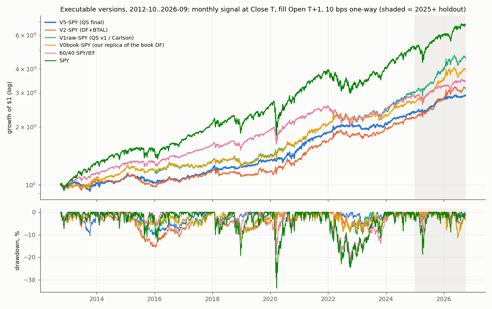
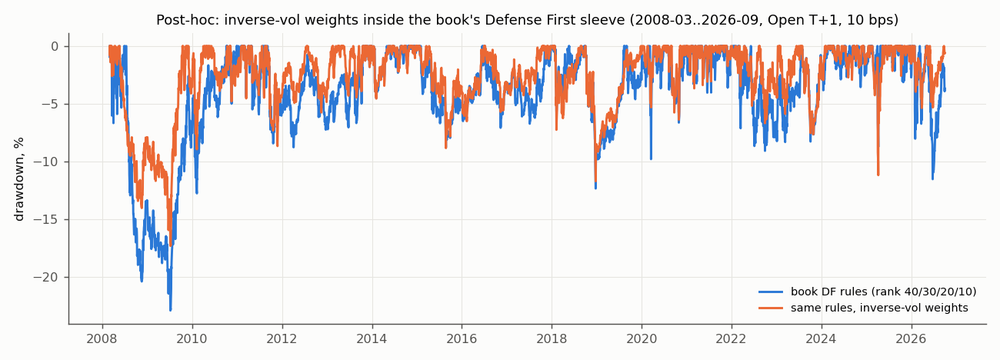

<!-- GENERATED FILE. EDIT THE CANONICAL KNOWLEDGE RECORD. -->

# Quant Seeker TAA lineage (Defense First -> +BTAL -> VIX filter -> linearity -> inverse-vol -> fallback filter; stops, sector timing, macro overlays, futures): replication, fragility and book value

!!! warning "Research-only"
    This page summarizes saved research evidence. It does not authorize LIVE, allocation, or deployment.

## TL;DR

> **Verdict:** Reject V5 (QS final). Its published numbers are reproduced only on a calendar that drops BTAL's 338 no-trade days; on the true calendar CAGR/Sharpe are ~2.5 pp / ~0.25 lower (V5-SPY 9.5%/1.06 vs 11.9%/1.31 in QS's window). Executable V5-SPY 2012-10..2024-12: Sharpe 0.83 vs 60/40 0.80 and book DF 0.84; rebalance-day range 0.60-1.05; only inverse-vol weighting survives as a component; no add-on survives.

> **Status:** `diagnostic`

> **Disposition:** `rejected`

> **Replication:** `replicated`

## Research question

Does QS's step-by-step Defense First TAA beat simple baselines and the book's Defense First sleeve after costs, robustly?

## Exact setup

| Field | Value |
| --- | --- |
| Signal family | defensive_tactical_allocation |
| Universe | ["SPY SSO SPXL TLT GLD DBC UUP BTAL BIL (ETF era 2008/2012-2026)", "1994-2011 proxies (yield-model TLT, XAUUSD, USDX, BCOMTR, LowVol-HighBeta)"] |
| Decision | Month-end Close_T (primary); Close_(T-1) for QS protocol |
| Fill | Open_(T+1) primary; MOC Close_T paper-like |
| Primary cost layer | central_research |
| Last reviewed | 2026-10-02T14:26:02+00:00 |

## Timing and overnight attribution

```text
information available: Month-end Close_T (primary); Close_(T-1) for QS protocol
primary executable fill: Open_(T+1) primary; MOC Close_T paper-like
```

If final `Close_T` data formed the signal, a hypothetical `Close_T` entry is diagnostic only unless a separate pre-close protocol was modeled. Comparing that diagnostic with `Open_(T+1)` and applying the compounded return identity shows whether the apparent edge occurred in the overnight gap. Missing attribution numbers mean **not tested**, not zero.

| Attribution field | Value |
| --- | --- |
| Status | tested |
| Diagnostic Path | Close_T info -> Close_T fill (look-ahead) |
| Executable Path | Close_T -> Open_(T+1); Close_(T-1) -> Close_T |
| Method | same rules, three fill paths, 2012-10..2024-12 |
| Headline Result | V5-SPY Sharpe 0.83 (Open T+1) / 0.94 (QS MOC) / 0.89 (look-ahead close): differences are rebalance-day luck, not look-ahead |
| Metrics | {} |
| Artifact | pakal-research/reports/quantseeker_taa_study/tables/timing_costs_raw.csv |

## Primary metrics

| Metric | Value |
| --- | ---: |
| Period | 2012-10-01..2026-09-30 |
| Universe | V5-SPY ETF |
| Cost Layer | central 10 bps one-way |
| Cagr | 7.92% |
| Annualized Volatility | 7.30% |
| Sharpe | 0.859 |
| Maximum Drawdown | -10.61% |
| Turnover | 7.4x NAV per year (sum \|dw\|) |

## Four separate verdicts

| Question | Conclusion |
| --- | --- |
| Source Replication | Replicated: v1 exactly on the true calendar (raw momentum vs T-bill); v2-v8 within ~0.5 pp CAGR once BTAL no-trade rows are dropped (QS clock artefact). |
| Predictive Value | Lineage components mostly era-dependent; inverse-vol weights positive in both eras (Holm p 0.053, 21/21 rebalance days); BTAL, VIX ladder, fallback filter, stops, macro gates, sector sleeves not supported. |
| Economic Value | V5-SPY Sharpe 0.83 (dev, Open T+1, 10 bps) = 60/40 and book DF; G1, G2, G4 fail; holdout positive (12.4%/yr) but behind simpler V2/V1/DF (22-27%). |
| Promotion | Reject V5. Forward hypothesis only: inverse-vol weights inside the book's Defense First sleeve (post-hoc). |

## Key findings

| Feature | Role | Direction | Status | Effect | Action |
| --- | --- | --- | --- | --- | --- |
| BTAL | universe | negative | not_supported | main effect Sharpe ETF -0.024, proxy -0.039; LOO from V5 -0.004 | do not add |
| linearity | signal | positive | not_supported | main effect Sharpe ETF +0.041, proxy +0.177; LOO from V5 +0.040 | do not add |
| inverse-vol weights | sizing | positive | survives | main effect Sharpe ETF +0.225, proxy +0.055; LOO from V5 +0.261 | use (forward test) |
| fallback trend filter | regime | negative | not_supported | main effect Sharpe ETF -0.149, proxy +0.044; LOO from V5 -0.167 | do not add |
| VIX ladder | regime | positive | not_supported | main effect Sharpe ETF +0.041, proxy -0.059; LOO from V5 +0.003 | do not add |

## Visual evidence






## Limitations

- Quant Seeker's tables are images inside the PDFs; numbers transcribed visually from the archived PDFs.
- Annualisation convention for the momentum score is not stated precisely ('annualized returns'): compound primary, simple and raw as neighbourhood/V0.
- VIX-ladder fractions lost in PDF text extraction; 1/3 and 2/3 inferred.
- Stop re-entry multiple not stated; assumed equal to the stop multiple.
- BTAL had 338 no-trade sessions (2011-2014): stale prices carried; early BTAL fills may be unexecutable at size.
- Futures: only &ES in the local Norgate subscription; GC/DX/UB/CL legs not testable; CL-for-DBC substitution cannot be evaluated.
- Proxy era uses index/spot/yield-model proxies with synthetic opens (close fills only); USD carry ignored in the UUP proxy; BTAL proxy is not sector-neutral.
- SPF dispersion uses the individual-response file; SPF release dates approximated (20th of 2nd month).
- HY OAS (Uyar drawdown model) unavailable beyond 3 years on FRED; drawdown overlay limited to the univariate VIX probit and NFCI.
- Zakamulin similarity sector rotation: the article does not state the similarity window/neighbour count; not tested (QS's own test was negative).
- Holdout 2025-01..2025-10 overlaps Quant Seeker's own design window; only 2025-11..2026-09 is untouched by every QS choice.

## Next gates

- Shadow-log inverse-vol weights inside the book's Defense First sleeve versus the current rank weights for 12 months (forward only)
- If ever reconsidered: run any TAA as 21 rebalance-day tranches, never a single month-end

## Sources

- `0_papers/Articles/quantseeker_archive/2025-07-18_weekly-research-insights-a-simple.pdf (+ text cache)`
- `0_papers/Articles/quantseeker_archive/2025-08-31_tactical-allocation-20-lower-drawdowns.pdf (+ text cache)`
- `0_papers/Articles/quantseeker_archive/2025-09-06_replicating-an-asset-allocation-model.pdf (+ text cache)`
- `0_papers/Articles/quantseeker_archive/2025-09-13_tactical-allocation-and-market-regimes.pdf (+ text cache)`
- `0_papers/Articles/quantseeker_archive/2025-09-19_stress-testing-a-tactical-allocation.pdf (+ text cache)`
- `0_papers/Articles/quantseeker_archive/2025-09-28_timing-leveraged-equity-exposure.pdf (+ text cache)`
- `0_papers/Articles/quantseeker_archive/2025-10-04_linearity-in-momentum-a-smarter-trend.pdf (+ text cache)`
- `0_papers/Articles/quantseeker_archive/2025-10-20_building-a-smarter-taa-model-for.pdf (+ text cache)`
- `0_papers/Articles/quantseeker_archive/2025-10-27_do-stop-loss-rules-add-value-in-tactical.pdf (+ text cache)`
- `0_papers/Articles/quantseeker_archive/2025-11-03_sector-timing-with-interest-rates.pdf (+ text cache)`
- `0_papers/Articles/quantseeker_archive/2025-01-26_interest-rates-and-sector-rotation.pdf (+ text cache)`
- `0_papers/Articles/quantseeker_archive/2025-11-10_combining-taa-with-sector-timing.pdf (+ text cache)`
- `0_papers/Articles/quantseeker_archive/2025-11-17_implementing-a-taa-model-using-futures.pdf (+ text cache)`
- `0_papers/Articles/quantseeker_archive/2025-04-21_what-works-below-the-200-day-moving.pdf (+ text cache)`
- `0_papers/Articles/quantseeker_archive/2025-05-27_market-timing-with-macro-surveys.pdf (+ text cache)`
- `0_papers/Articles/quantseeker_archive/2024-08-19_recessions-and-market-timing.pdf (+ text cache)`
- `0_papers/Articles/quantseeker_archive/2024-11-18_a-market-timing-indicator.pdf (+ text cache)`
- `0_papers/Articles/quantseeker_archive/2026-04-30_which-macro-indicators-actually-predict.pdf (+ text cache)`
- `0_papers/Articles/quantseeker_archive/2026-05-10_dont-be-too-smart-about-history.pdf (+ text cache)`
- `0_papers/Articles/quantseeker_archive/2026-06-02_a-simpler-way-to-rotate-across-sectors.pdf (+ text cache)`
- `0_papers/Articles/quantseeker_archive/2026-04-12_does-optimal-portfolio-construction.pdf (+ text cache)`
- `0_papers/Articles/quantseeker_archive/2026-09-15_improving-fixed-weight-portfolios.pdf (+ text cache)`
- `0_papers/Articles/quantseeker_archive/2024-11-06_the-value-of-stop-loss-strategies.pdf (+ text cache)`
- `0_papers/Articles/quantseeker_archive/2025-02-02_exploring-stock-bond-correlations.pdf (+ text cache)`
- `0_papers/Articles/quantseeker_archive/2024-10-25_vol-estimators-and-vol-targeting.pdf (+ text cache)`

## Canonical artifacts

| Artifact | Pakal path |
| --- | --- |
| Concise Report | `pakal-research/reports/quantseeker_taa_study/REPORT.md` |
| Full Report | `pakal-research/reports/quantseeker_taa_study/REPORT_FULL.md` |
| Notebook | `pakal-research/reports/quantseeker_taa_study/quantseeker_taa_study.ipynb` |
| Frozen Specification | `pakal-research/reports/quantseeker_taa_study/research_spec_frozen.json` |
| Manifest | `pakal-research/reports/quantseeker_taa_study/run_manifest.json` |
| Primary Source Code | `["pakal-research/quantseeker_taa/qtaa_data.py", "pakal-research/quantseeker_taa/qtaa_lib.py", "pakal-research/quantseeker_taa/qtaa_overlays.py", "pakal-research/quantseeker_taa/qtaa_jobs.py", "pakal-research/quantseeker_taa/qtaa_run.py", "pakal-research/quantseeker_taa/qtaa_stages.py", "pakal-research/quantseeker_taa/qtaa_decisions.py", "pakal-research/quantseeker_taa/qtaa_holdout.py", "pakal-research/quantseeker_taa/qtaa_posthoc.py", "pakal-research/quantseeker_taa/qtaa_report.py", "pakal-research/quantseeker_taa/test_qtaa_timing.py"]` |
| Primary Tables | `["pakal-research/reports/quantseeker_taa_study/tables/replication_vs_qs.csv", "pakal-research/reports/quantseeker_taa_study/tables/headline_metrics.csv", "pakal-research/reports/quantseeker_taa_study/tables/component_survival.csv", "pakal-research/reports/quantseeker_taa_study/tables/addon_survival.csv", "pakal-research/reports/quantseeker_taa_study/tables/decisions.json", "pakal-research/reports/quantseeker_taa_study/tables/holdout_and_post_publication.csv", "pakal-research/reports/quantseeker_taa_study/tables/book_integration_2012_2026.csv", "pakal-research/reports/quantseeker_taa_study/tables/posthoc_df_conventions.csv"]` |
| Primary Charts | `["pakal-research/reports/quantseeker_taa_study/charts/replication_qs_vs_ours.png", "pakal-research/reports/quantseeker_taa_study/charts/equity_drawdown_2012_2026.png", "pakal-research/reports/quantseeker_taa_study/charts/offset_fragility.png", "pakal-research/reports/quantseeker_taa_study/charts/component_main_effects.png", "pakal-research/reports/quantseeker_taa_study/charts/neighbourhood_dev_vs_proxy.png", "pakal-research/reports/quantseeker_taa_study/charts/addons_delta_sharpe.png", "pakal-research/reports/quantseeker_taa_study/charts/posthoc_df_ivol_drawdown.png"]` |
| Research State | `pakal-research/reports/quantseeker_taa_study/research_state.json` |
| Hypothesis Registry | `pakal-research/reports/quantseeker_taa_study/hypothesis_registry.json` |
| Experiment Ledger | `pakal-research/reports/quantseeker_taa_study/experiment_ledger.jsonl` |
| Decision Log | `pakal-research/reports/quantseeker_taa_study/decision_log.jsonl` |
| Source Rule Map | `pakal-research/reports/quantseeker_taa_study/source_rule_map.json` |
