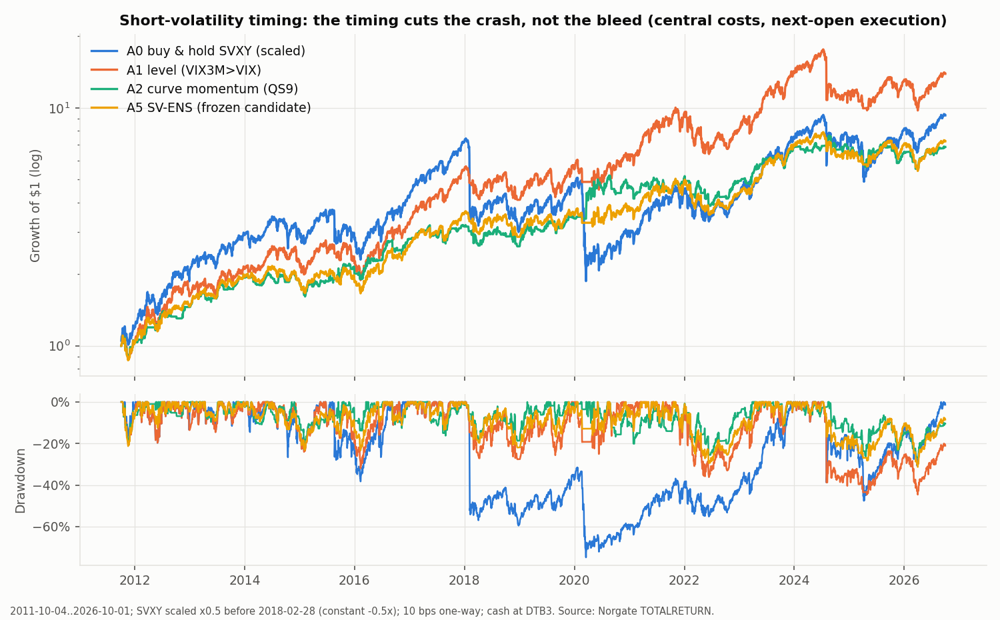
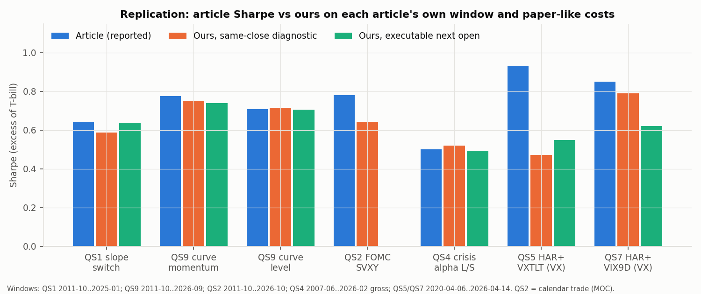

<!-- GENERATED FILE. EDIT THE CANONICAL KNOWLEDGE RECORD. -->

# Quant Seeker VIX / volatility-timing archive (9 articles): replication, executable short-vol timing, crisis-only sleeves vs the crisis-trend pod

!!! warning "Research-only"
    This page summarizes saved research evidence. It does not authorize LIVE, allocation, or deployment.

## TL;DR

> **Verdict:** Signal claims mostly reproduce (QS9 curve momentum, QS1 slope switch, QS4 crisis-alpha L/S, QS6 front-end inversion forecasts RV: replicated; QS2 FOMC, QS3 VIX-timed beta, QS8 drawdown probit: directional; QS5 bond-vol HAR improvement: not reproduced). Executable: VIX-curve timing of short vol halves the drawdown (A5 SV-ENS MDD -31% vs -75% buy-and-hold) but does not raise Sharpe vs holding SVXY or the plain level rule; HAR VX-futures timing is a post-2020 artefact (loses 100% on 2008-2020, negative in 2025-26). No VIX/MOVE trigger adds to the pod at equal budget: faster triggers (VIX9D>VIX, negative curve momentum) pay 2-4x more in shocks but bleed 12-33%/yr in calm years; VIX hedges lose in 2022. Crisis-alpha L/S replicates (+4%/yr net, positive in 8/8 stress windows incl. 2022) and improves an 80/20 book only as an extra sleeve (post-hoc).

> **Status:** `forward_hypothesis`

> **Disposition:** `promising_component`

> **Replication:** `directionally_replicated`

## Research question

Reproduce the Quant Seeker VIX-timing claims and test (a) a short-vol timing sleeve and (b) crisis-only sleeves against the existing crisis-trend pod (core + VIXM-in-backwardation).

## Exact setup

| Field | Value |
| --- | --- |
| Signal family | volatility_term_structure_timing_and_crisis_hedging |
| Universe | ["SVXY (scaled -0.5x), VIXY, VIXM, VXX; Cboe VX futures constant-maturity indices 2004+", "GLD/GDXJ, IEI/REM, XLE/IEZ", "Ken French beta deciles", "crisis-trend pod 17-ETF universe"] |
| Decision | Close_T (Cboe index closes; month-end for QS4/QS8; FOMC calendar known in advance) |
| Fill | Open_(T+1) for ETPs; next settlement for VX; MOC for the FOMC calendar trade |
| Primary cost layer | central_research |
| Last reviewed | 2026-10-02T15:44:41+03:00 |

## Timing and overnight attribution

```text
information available: Close_T (Cboe index closes; month-end for QS4/QS8; FOMC calendar known in advance)
primary executable fill: Open_(T+1) for ETPs; next settlement for VX; MOC for the FOMC calendar trade
```

If final `Close_T` data formed the signal, a hypothetical `Close_T` entry is diagnostic only unless a separate pre-close protocol was modeled. Comparing that diagnostic with `Open_(T+1)` and applying the compounded return identity shows whether the apparent edge occurred in the overnight gap. Missing attribution numbers mean **not tested**, not zero.

| Attribution field | Value |
| --- | --- |
| Status | tested |
| Diagnostic Path | Close_T same-close fill (approximates the articles' 15:45 signal + MOC) |
| Executable Path | Open_(T+1) open-to-open; also MOC at Close_(T+1) |
| Method | same rule, three fill paths; overnight return after switches |
| Headline Result | next-open keeps the same-close Sharpe (A5 0.65 -> 0.63, A1 0.69 -> 0.68); a full day of delay loses ~25% (A1 0.50, A5 0.51); SVXY tends to gain overnight after a switch-off (+18 bps), so open execution is not penalised |
| Metrics | {"A1_moc_next": 0.495, "A1_open": 0.682, "A1_sameclose": 0.691, "A5_moc_next": 0.509, "A5_open": 0.628, "A5_sameclose": 0.654} |
| Artifact | pakal-research/reports/quantseeker_volatility_study/tables/famA_timing_attribution.csv |

## Primary metrics

| Metric | Value |
| --- | ---: |
| Period | 2011-10-04..2026-10-01 |
| Universe | SVXY scaled -0.5x (A5 SV-ENS frozen candidate) |
| Cost Layer | central_research (10 bps one-way) |
| Cagr | 14.15% |
| Annualized Volatility | 22.55% |
| Sharpe | 0.628 |
| Maximum Drawdown | -31.31% |
| Turnover | 2967.85% |

## Four separate verdicts

| Question | Conclusion |
| --- | --- |
| Source Replication | QS1, QS4, QS6, QS9 replicated; QS2, QS3, QS7, QS8 directionally replicated; QS5 VXTLT gain not reproducible on our data |
| Predictive Value | VIX-curve level/momentum/front end carry real state information for next-day short-vol returns and for 1-4 week realized vol; not for VX direction pre-2020 |
| Economic Value | short-vol timing = drawdown control, not alpha (no Sharpe gain vs A0 or A1, Holm p=1); crisis-only VIX triggers do not beat the existing VIXM leg; crisis-alpha L/S is the only additive candidate |
| Promotion | A5 SV-ENS passes the frozen standalone gates (formal status: paper-trial candidate) but is 0.63 correlated with SPY and lowers an 80/20 SPY+pod book Sharpe at 10% (0.979 vs 0.986) while the already-studied EVRP-S01 sleeve raises it (1.028): recommendation = do not use a paper slot on A5; crisis-alpha L/S -> shadow; all other rules rejected or diagnostic |

## Key findings

| Feature | Role | Direction | Status | Effect | Action |
| --- | --- | --- | --- | --- | --- |
| VIX3M/VIX level (contango) | regime | short vol only in contango | replicated | MDD -75% -> -45%, Sharpe 0.56 -> 0.68 (n.s.) | keep as the base gate of any short-vol sleeve |
| VIX curve momentum (QS9) | signal | short vol when spread VIX3M-VIX rising | replicated | MDD -27%, contango+pos 12 bps/day vs 7.5 | use only inside an ensemble; 42 switches/yr make it cost-fragile (0.34 at 25 bps) |
| VIX9D/VIX front-end inversion | signal/diagnostic | inversion -> higher 1-4 week realized vol | replicated (QS6) | +6.5-6.9 pp in-sample R2 at h=5, OOS CW t 4.9 | alarm/diagnostic; as a long-VIXY trigger it pays +60% Volmageddon, +86% Aug 2024 but bleeds ~33%/yr in calm years |
| HAR VIX forecast with VXTLT / MOVE / VIX9D | signal | long VX if forecast > VIX | rejected | VX Sharpe 0.47-0.79 in 2020-04..2026-04 only | do not trade |
| FOMC short-vol window | exposure | short vol Close_(D-2)..Close_D | directionally replicated, decaying | SVXY Sharpe 0.64 raw (article 0.78) | reject |
| crisis-alpha L/S (GLD/GDXJ, IEI/REM, XLE/IEZ) | risk_overlay | always on | replicated | 8.4% gross, 6.4% central, corr -0.49; positive in all 5 article crises and 8/8 pod windows 2011+ | shadow as an extra 10% sleeve (post-hoc result) |
| VIX quintile beta timing (QS3) | diagnostic | high beta after top-quintile VIX | directionally replicated | EW Hi-Lo +1.9%/month in Q5 (t 1.5) | diagnostic only |
| vol-index drawdown probit (QS8) | diagnostic | higher z -> higher P(next-month <= -5%) | directionally replicated (with reconciled event definition) | OOS AUC avg3 0.64 (article 0.65), 9 events | monitoring only; as a VIXM trigger it is flat |

## Visual evidence






## Limitations

- no 15:45 intraday data; same-close results are diagnostic
- VX futures settlements only (no opens) and a constant-maturity approximation of the S&P VIX futures indices
- SVXY pre-2018 scaled x0.5 (article convention)
- 2011+ ETP sample contains few independent crises; holdout overlaps the articles' own windows
- GDXJ proxied by GDX before 2009-11
- QS8 event definition reconciled post-hoc
- crisis-alpha additive sleeve result is post-hoc

## Next gates

- if a short-vol sleeve is wanted, paper-trade EVRP-S01 (already studied, corr 0.06 to SPY) rather than A5; keep A5 as the drawdown-control reference for any naked SVXY holding
- shadow-log crisis-alpha L/S (10% sleeve) with real borrow quotes for REM/GDXJ/IEZ
- log VIX9D>VIX as a pod alarm (no position) and compare its lead time with the VIXM leg
- replace VIXM in the pod leg with VX months 4-7 above ~$0.3M sleeve size

## Sources

- `Quant Seeker articles 2025-03-25, 2025-06-18, 2025-07-04, 2026-02-19, 2026-03-05, 2026-05-18, 2026-05-25, 2026-07-06, 2026-09-23 (archive PDFs and text)`
- `Cooper 2013; Simon & Campasano 2014; Sadik 2023; Lucca & Moench 2015; Bansal & Stivers 2025; Dimitriadis 2026; Degiannakis et al. 2025; Lim 2026; Uyar 2026 (as summarized by the articles)`
- `pakal-research/reports/crisis_trend_pod_study (pod rules reused unchanged)`

## Canonical artifacts

| Artifact | Pakal path |
| --- | --- |
| Concise Report | `pakal-research/reports/quantseeker_volatility_study/REPORT.md` |
| Full Report | `pakal-research/reports/quantseeker_volatility_study/REPORT_FULL.md` |
| Notebook | `pakal-research/reports/quantseeker_volatility_study/quantseeker_volatility_study.ipynb` |
| Frozen Specification | `pakal-research/reports/quantseeker_volatility_study/research_spec_frozen.json` |
| Manifest | `pakal-research/reports/quantseeker_volatility_study/run_manifest.json` |
| Research State | `pakal-research/reports/quantseeker_volatility_study/research_state.json` |
| Hypothesis Registry | `pakal-research/reports/quantseeker_volatility_study/hypothesis_registry.json` |
| Experiment Ledger | `pakal-research/reports/quantseeker_volatility_study/experiment_ledger.jsonl` |
| Decision Log | `pakal-research/reports/quantseeker_volatility_study/decision_log.jsonl` |
| Source Rule Map | `pakal-research/reports/quantseeker_volatility_study/SOURCE_RULE_MAP.md` |
| Primary Source Code | `["pakal-research/quantseeker_volatility/qsv_amend_spec.py", "pakal-research/quantseeker_volatility/qsv_build_bundle.py", "pakal-research/quantseeker_volatility/qsv_build_notebook.py", "pakal-research/quantseeker_volatility/qsv_charts.py", "pakal-research/quantseeker_volatility/qsv_context.py", "pakal-research/quantseeker_volatility/qsv_data.py", "pakal-research/quantseeker_volatility/qsv_extra_tables.py", "pakal-research/quantseeker_volatility/qsv_freeze_spec.py", "pakal-research/quantseeker_volatility/qsv_lib.py", "pakal-research/quantseeker_volatility/qsv_lineage.py", "pakal-research/quantseeker_volatility/qsv_recap_scan.py", "pakal-research/quantseeker_volatility/qsv_replicate.py", "pakal-research/quantseeker_volatility/qsv_run.py", "pakal-research/quantseeker_volatility/qsv_strategies.py", "pakal-research/quantseeker_volatility/test_qsv_timing.py"]` |
| Primary Tables | `["pakal-research/reports/quantseeker_volatility_study/tables/gates.json", "pakal-research/reports/quantseeker_volatility_study/tables/famA_summary.csv", "pakal-research/reports/quantseeker_volatility_study/tables/famB_summary.csv", "pakal-research/reports/quantseeker_volatility_study/tables/pod_integration_books.csv", "pakal-research/reports/quantseeker_volatility_study/tables/crisis_windows_2011plus.csv"]` |
| Primary Charts | `["pakal-research/reports/quantseeker_volatility_study/charts/beta_by_vix_quintile.png", "pakal-research/reports/quantseeker_volatility_study/charts/books_with_pod.png", "pakal-research/reports/quantseeker_volatility_study/charts/crisis_only_payoff_vs_bleed.png", "pakal-research/reports/quantseeker_volatility_study/charts/crisis_windows_heatmap.png", "pakal-research/reports/quantseeker_volatility_study/charts/har_vx_by_period.png", "pakal-research/reports/quantseeker_volatility_study/charts/replication_scorecard.png", "pakal-research/reports/quantseeker_volatility_study/charts/shortvol_episodes.png", "pakal-research/reports/quantseeker_volatility_study/charts/shortvol_equity_drawdown.png", "pakal-research/reports/quantseeker_volatility_study/charts/shortvol_timing_attribution.png"]` |
