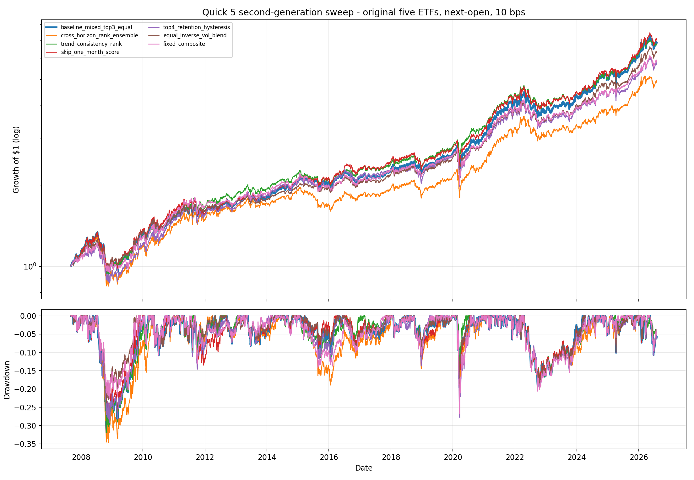
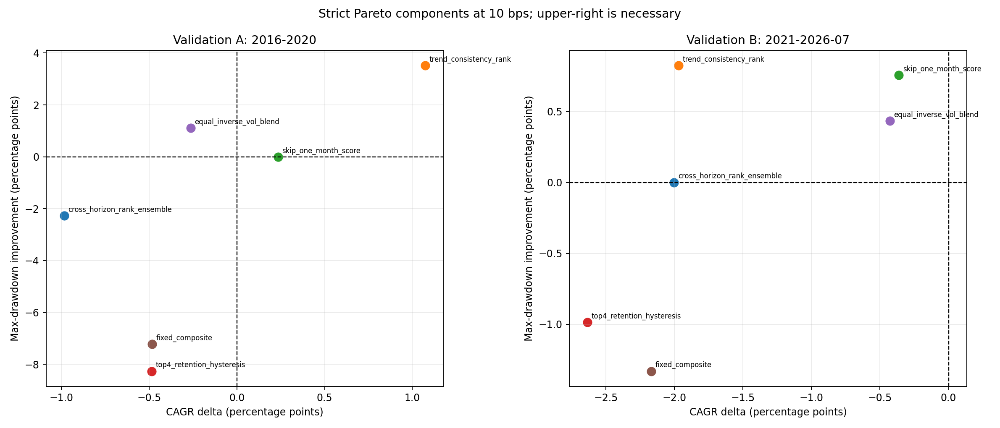

<!-- GENERATED FILE. EDIT THE CANONICAL KNOWLEDGE RECORD. -->

# Quick 5 ETF second-generation strict Pareto improvement sweep

!!! warning "Research-only"
    This page summarizes saved research evidence. It does not authorize LIVE, allocation, or deployment.

## TL;DR

> **Verdict:** Keep the unchanged Quick 5 rule as the research control. None of the six frozen challengers passed the strict return, risk, statistical, turnover, and survival gates in both historical validation blocks.

> **Status:** `diagnostic`

> **Disposition:** `not_recorded`

> **Replication:** `not_recorded`

## Research question

Test six frozen ranking, hysteresis, sizing, and composite hypotheses against the causal Quick 5 baseline under a strict return-and-risk Pareto gate.

## Exact setup

| Field | Value |
| --- | --- |
| Signal family | cross_asset_momentum |
| Universe | ["fixed original five ETFs: VTI, AGG, VNQ, DBC, GLD"] |
| Decision | Close_T |
| Fill | Open_T+1 |
| Primary cost layer | central_research |
| Last reviewed | 2026-08-06T20:21:17.637726+03:00 |

## Timing and overnight attribution

```text
information available: Close_T
primary executable fill: Open_T+1
```

If final `Close_T` data formed the signal, a hypothetical `Close_T` entry is diagnostic only unless a separate pre-close protocol was modeled. Comparing that diagnostic with `Open_(T+1)` and applying the compounded return identity shows whether the apparent edge occurred in the overnight gap. Missing attribution numbers mean **not tested**, not zero.


## Primary metrics

| Metric | Value |
| --- | ---: |
| Period | 2007-08 through 2026-07 |
| Universe | VTI, AGG, VNQ, DBC, GLD |
| Cost Layer | central_research_10_bps |
| Cagr | 10.70% |
| Annualized Volatility | 12.29% |
| Sharpe | 0.782 |
| Maximum Drawdown | -31.92% |
| Turnover | 166.51% |

## Key findings

| Feature | Role | Direction | Status | Effect | Action |
| --- | --- | --- | --- | --- | --- |
| cross_horizon_rank_ensemble | See HYPOTHESIS_MAP.md | validation A Sharpe delta -0.1092; validation B Sharpe delta -0.1093 | rejected | {"validation_a_cagr_delta": -0.009837063907109922, "validation_a_drawdown_delta": -0.022699266691791675, "validation_b_cagr_delta": -0.02002796079534086, "validation_b_drawdown_delta": -5.551115123125783e-16} | Reject as an improvement to the baseline. |
| trend_consistency_rank | See HYPOTHESIS_MAP.md | validation A Sharpe delta 0.1183; validation B Sharpe delta -0.1250 | diagnostic | {"validation_a_cagr_delta": 0.010745736314089704, "validation_a_drawdown_delta": 0.03522086805908431, "validation_b_cagr_delta": -0.019689365046207996, "validation_b_drawdown_delta": 0.008241351633318073} | Retain only as mechanism evidence. |
| skip_one_month_score | See HYPOTHESIS_MAP.md | validation A Sharpe delta 0.0204; validation B Sharpe delta -0.0202 | diagnostic | {"validation_a_cagr_delta": 0.0023496834557708013, "validation_a_drawdown_delta": 2.220446049250313e-16, "validation_b_cagr_delta": -0.0036287852196985604, "validation_b_drawdown_delta": 0.007568809403597276} | Retain only as mechanism evidence. |
| top4_retention_hysteresis | See HYPOTHESIS_MAP.md | validation A Sharpe delta -0.1921; validation B Sharpe delta -0.1582 | rejected | {"validation_a_cagr_delta": -0.0048461294187378545, "validation_a_drawdown_delta": -0.08262898567137189, "validation_b_cagr_delta": -0.026343667251189196, "validation_b_drawdown_delta": -0.009875777846919509} | Reject as an improvement to the baseline. |
| equal_inverse_vol_blend | See HYPOTHESIS_MAP.md | validation A Sharpe delta 0.0602; validation B Sharpe delta -0.0047 | diagnostic | {"validation_a_cagr_delta": -0.0026374443765606603, "validation_a_drawdown_delta": 0.01115787708541549, "validation_b_cagr_delta": -0.004277434059861918, "validation_b_drawdown_delta": 0.004329275174350999} | Retain only as mechanism evidence. |
| fixed_composite | See HYPOTHESIS_MAP.md | validation A Sharpe delta -0.1481; validation B Sharpe delta -0.0758 | rejected | {"validation_a_cagr_delta": -0.00482303592781097, "validation_a_drawdown_delta": -0.07218944178596043, "validation_b_cagr_delta": -0.021695218386943882, "validation_b_drawdown_delta": -0.013309440379193904} | Reject as an improvement to the baseline. |

## Visual evidence






## Limitations

- All historical months informed the hypothesis design; neither validation block is untouched out-of-sample evidence.
- The source basket was selected from 126,144 configurations.
- Only five surviving ETF proxies are tested.
- Opening-auction spreads, depth, queue, and realized fills are unavailable.
- Taxes are investor and account specific and are not modeled.

## Next gates

- Forward-track only passed rows unchanged after 2026-08-04.
- Collect empirical opening fills and auction participation before any deployment review.
- Do not reopen the rejected universe, breadth, cash-filter, or regime families on this history.

## Sources

- `C:/Users/User/Downloads/quick5ETF.pdf`
- `pakal-research/reports/quick5_etf_rotation_signal_study/REPORT_FULL.md`
- `user-approved implementation plan dated 2026-08-06`

## Canonical artifacts

| Artifact | Pakal path |
| --- | --- |
| Concise Report | `pakal-research/reports/quick5_etf_rotation_improvement_sweep/REPORT.md` |
| Frozen Specification | `pakal-research/reports/quick5_etf_rotation_improvement_sweep/research_spec_frozen.json` |
| Full Report | `pakal-research/reports/quick5_etf_rotation_improvement_sweep/REPORT_FULL.md` |
| Manifest | `pakal-research/reports/quick5_etf_rotation_improvement_sweep/run_manifest.json` |
| Notebook | `pakal-research/quick5_etf_rotation_improvement_sweep.ipynb` |
| Primary Charts | `["pakal-research/reports/quick5_etf_rotation_improvement_sweep/charts"]` |
| Primary Source Code | `["pakal-research/quick5_etf_rotation_improvement_sweep.py", "pakal-research/quick5_etf_rotation_signal_study.py"]` |
| Primary Tables | `["pakal-research/reports/quick5_etf_rotation_improvement_sweep/tables"]` |
