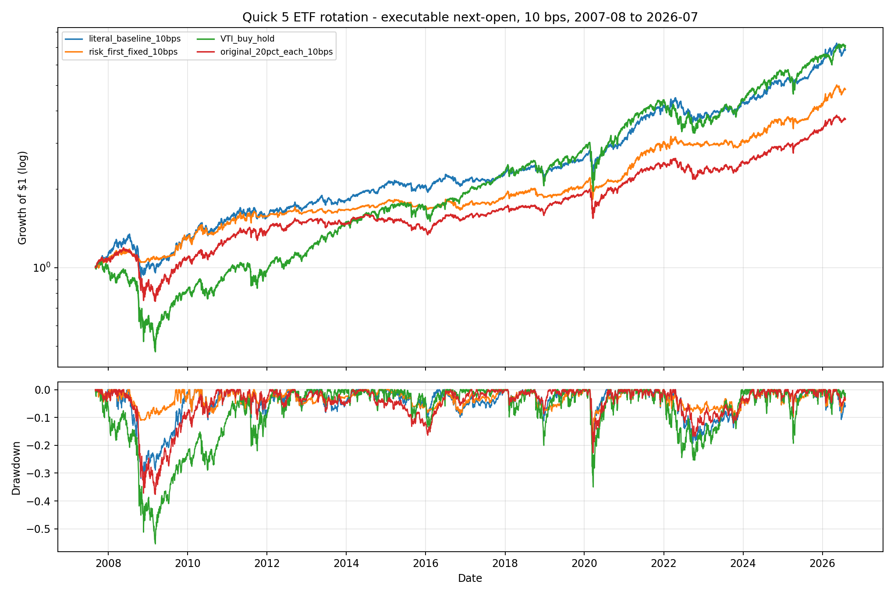
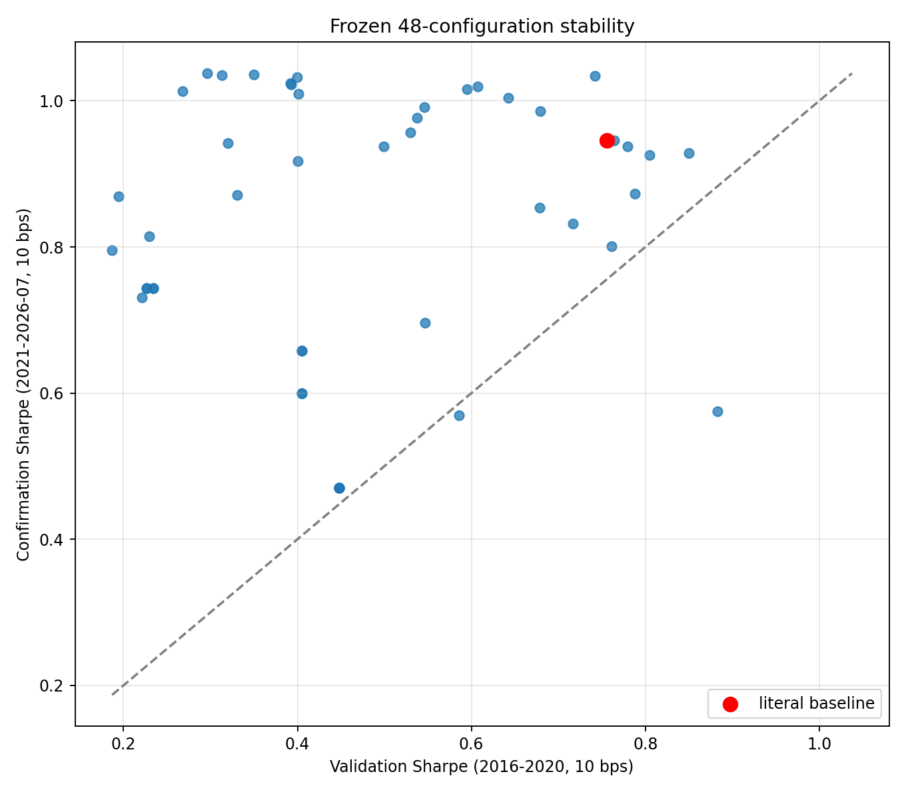

<!-- GENERATED FILE. EDIT THE CANONICAL KNOWLEDGE RECORD. -->

# Quick 5 ETF mixed-momentum rotation replication and improvement study

!!! warning "Research-only"
    This page summarizes saved research evidence. It does not authorize LIVE, allocation, or deployment.

## TL;DR

> **Verdict:** Keep the literal rule as a research diagnostic only. None of the frozen improvements passed both validation and confirmation economic/statistical gates.

> **Status:** `diagnostic`

> **Disposition:** `not_recorded`

> **Replication:** `not_recorded`

## Research question

Test the published top-3 mixed-momentum ETF rotation causally and evaluate a frozen 48-configuration improvement family.

## Exact setup

| Field | Value |
| --- | --- |
| Signal family | cross_asset_momentum |
| Universe | ["original_5", "replace_vnq_xle", "add_xle_6"] |
| Decision | Close_T |
| Fill | Open_T+1 |
| Primary cost layer | central_research |
| Last reviewed | 2026-08-05T22:37:24.081089+03:00 |

## Timing and overnight attribution

```text
information available: Close_T
primary executable fill: Open_T+1
```

If final `Close_T` data formed the signal, a hypothetical `Close_T` entry is diagnostic only unless a separate pre-close protocol was modeled. Comparing that diagnostic with `Open_(T+1)` and applying the compounded return identity shows whether the apparent edge occurred in the overnight gap. Missing attribution numbers mean **not tested**, not zero.


## Primary metrics

| Metric | Value |
| --- | ---: |
| Period | 2007-08 through 2026-07 |
| Universe | VTI, AGG, VNQ, DBC, GLD |
| Cost Layer | central_research_10_bps |
| Cagr | 10.70% |
| Annualized Volatility | 12.29% |
| Sharpe | 0.782 |
| Maximum Drawdown | -31.92% |
| Turnover | 166.51% |

## Key findings

| Feature | Role | Direction | Status | Effect | Action |
| --- | --- | --- | --- | --- | --- |
| absolute_momentum_zero | controlled strategy role | validation Sharpe delta -0.406; confirmation Sharpe delta 0.090 | diagnostic | {"confirmation_cagr_delta": 0.003240886269760823, "validation_cagr_delta": -0.045333842820978854} | Retain only as descriptive robustness evidence. |
| inverse_volatility_63 | controlled strategy role | validation Sharpe delta 0.094; confirmation Sharpe delta -0.018 | diagnostic | {"confirmation_cagr_delta": -0.008790103122225501, "validation_cagr_delta": -0.0058940070444089} | Retain only as descriptive robustness evidence. |
| absolute_momentum_plus_inverse_volatility | controlled strategy role | validation Sharpe delta -0.161; confirmation Sharpe delta 0.070 | diagnostic | {"confirmation_cagr_delta": -0.006827582751593564, "validation_cagr_delta": -0.02902191933937015} | Retain only as descriptive robustness evidence. |
| replace_vnq_with_xle | controlled strategy role | validation Sharpe delta -0.014; confirmation Sharpe delta 0.089 | diagnostic | {"confirmation_cagr_delta": 0.04419179948655527, "validation_cagr_delta": -0.0010937126632621919} | Retain only as descriptive robustness evidence. |
| add_xle_to_universe | controlled strategy role | validation Sharpe delta -0.113; confirmation Sharpe delta 0.059 | diagnostic | {"confirmation_cagr_delta": 0.039496909183425855, "validation_cagr_delta": -0.00807581235404431} | Retain only as descriptive robustness evidence. |
| top_1_concentration | controlled strategy role | validation Sharpe delta -0.351; confirmation Sharpe delta -0.288 | diagnostic | {"confirmation_cagr_delta": 0.004340572196295245, "validation_cagr_delta": -0.024869416107680564} | Retain only as descriptive robustness evidence. |
| top_2_breadth | controlled strategy role | validation Sharpe delta -0.356; confirmation Sharpe delta 0.086 | diagnostic | {"confirmation_cagr_delta": 0.031463581074425484, "validation_cagr_delta": -0.03577149357285747} | Retain only as descriptive robustness evidence. |
| top_4_breadth | controlled strategy role | validation Sharpe delta -0.039; confirmation Sharpe delta -0.114 | rejected | {"confirmation_cagr_delta": -0.03367726863511611, "validation_cagr_delta": -0.0010279372631081252} | Do not add this role to the published baseline. |

## Visual evidence






## Limitations

- Source basket selected from 126,144 configurations.
- No untouched post-publication months.
- Paid code and exact preprocessing unavailable.
- Taxes and empirical opening fills unavailable.

## Next gates

- Forward-track frozen findings after 2026-08-04.
- Calibrate opening fills and auction participation before any deployment review.
- Apply investor-specific tax-lot assumptions outside the signal study.

## Sources

- `C:/Users/User/Downloads/quick5ETF.pdf`
- `https://ersj.eu/journal/422`

## Canonical artifacts

| Artifact | Pakal path |
| --- | --- |
| Concise Report | `pakal-research/reports/quick5_etf_rotation_signal_study/REPORT.md` |
| Frozen Specification | `pakal-research/reports/quick5_etf_rotation_signal_study/research_spec_frozen.json` |
| Full Report | `pakal-research/reports/quick5_etf_rotation_signal_study/REPORT_FULL.md` |
| Manifest | `pakal-research/reports/quick5_etf_rotation_signal_study/run_manifest.json` |
| Notebook | `pakal-research/quick5_etf_rotation_signal_study.ipynb` |
| Primary Charts | `["pakal-research/reports/quick5_etf_rotation_signal_study/charts"]` |
| Primary Source Code | `["pakal-research/quick5_etf_rotation_signal_study.py"]` |
| Primary Tables | `["pakal-research/reports/quick5_etf_rotation_signal_study/tables"]` |
