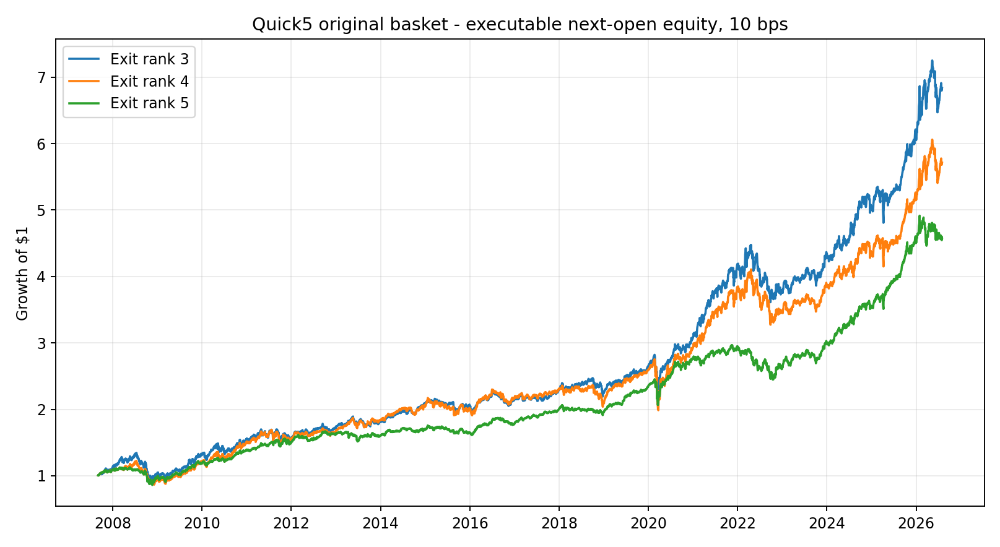
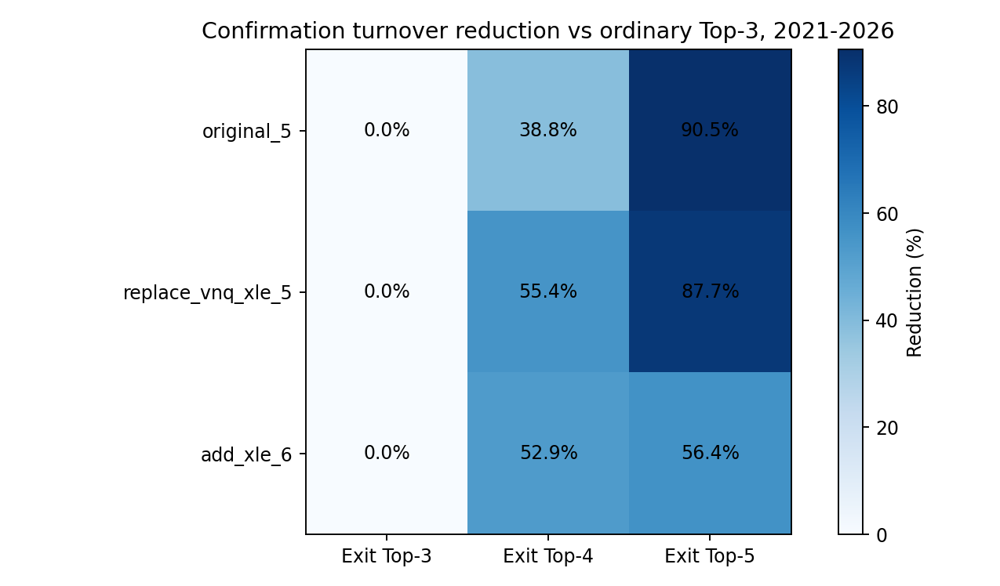

<!-- GENERATED FILE. EDIT THE CANONICAL KNOWLEDGE RECORD. -->

# Quick5 Incumbent Rank-Buffer Exit Hysteresis

!!! warning "Research-only"
    This page summarizes saved research evidence. It does not authorize LIVE, allocation, or deployment.

## TL;DR

> **Verdict:** ה־Exit buffer לא עבר את כל שערי הקידום; הוא נשאר Diagnostic בלבד.

> **Status:** `diagnostic`

> **Disposition:** `not_recorded`

> **Replication:** `not_recorded`

## Research question

Test whether a rank-buffer exit reduces churn without weakening executable net performance.

## Exact setup

| Field | Value |
| --- | --- |
| Signal family | cross_sectional_momentum_rotation |
| Universe | ["original_5", "replace_vnq_xle_5", "add_xle_6"] |
| Decision | Close_T after final monthly close |
| Fill | Open_(T+1) |
| Primary cost layer | central_research |
| Last reviewed | 2026-08-17T18:16:16.209508+03:00 |

## Timing and overnight attribution

```text
information available: Close_T after final monthly close
primary executable fill: Open_(T+1)
```

If final `Close_T` data formed the signal, a hypothetical `Close_T` entry is diagnostic only unless a separate pre-close protocol was modeled. Comparing that diagnostic with `Open_(T+1)` and applying the compounded return identity shows whether the apparent edge occurred in the overnight gap. Missing attribution numbers mean **not tested**, not zero.


## Primary metrics

| Metric | Value |
| --- | ---: |
| Period | confirmation_2021_01_to_2026_07 |
| Universe | original_5 |
| Cost Layer | central_research_10bps_on_one_way_turnover |
| Cagr | 12.66% |
| Annualized Volatility | 12.16% |
| Sharpe | 0.788 |
| Maximum Drawdown | -20.27% |
| Turnover | 7.03% |

## Key findings

| Feature | Role | Direction | Status | Effect | Action |
| --- | --- | --- | --- | --- | --- |
| incumbent_rank_buffer_width_1 | exit signal | hold Top-3 incumbents until rank exceeds Top-4 | diagnostic | {"confirmation_cagr_delta": -0.026343667251189196, "confirmation_sharpe_delta": -0.15819439152869674, "confirmation_turnover_reduction": 0.38776512921935624} | Do not wire to LIVE; forward-shadow unchanged if further evidence is desired. |

## Visual evidence






## Limitations

- Overlapping ETF universes are not independent confirmations.
- Prior Quick5 results and universe variants were already observed.
- Taxes, empirical open spreads, impact, and partial fills are absent.

## Next gates

- Freeze the chosen rule for a forward shadow with real opening-spread observations.
- Do not tune additional buffer widths on this history.

## Sources

- `C:/Users/User/Downloads/Percentile-Rank Momentum.pdf`
- `pakal-research/quick5_etf_rotation_signal_study.py`

## Canonical artifacts

| Artifact | Pakal path |
| --- | --- |
| Concise Report | `pakal-research/reports/quick5_exit_hysteresis_study/REPORT.md` |
| Frozen Specification | `pakal-research/reports/quick5_exit_hysteresis_study/research_spec_frozen.json` |
| Full Report | `pakal-research/reports/quick5_exit_hysteresis_study/REPORT_FULL.md` |
| Manifest | `pakal-research/reports/quick5_exit_hysteresis_study/run_manifest.json` |
| Notebook | `pakal-research/quick5_exit_hysteresis_study.ipynb` |
| Primary Charts | `["pakal-research/reports/quick5_exit_hysteresis_study/charts/turnover_reduction_heatmap.png", "pakal-research/reports/quick5_exit_hysteresis_study/charts/primary_equity.png"]` |
| Primary Source Code | `["pakal-research/quick5_exit_hysteresis_study.py"]` |
| Primary Tables | `["pakal-research/reports/quick5_exit_hysteresis_study/tables/performance_by_period.csv", "pakal-research/reports/quick5_exit_hysteresis_study/tables/paired_inference.csv"]` |
