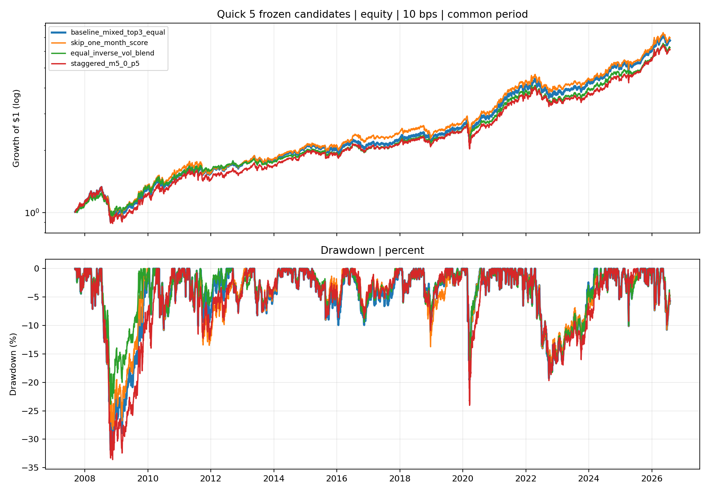
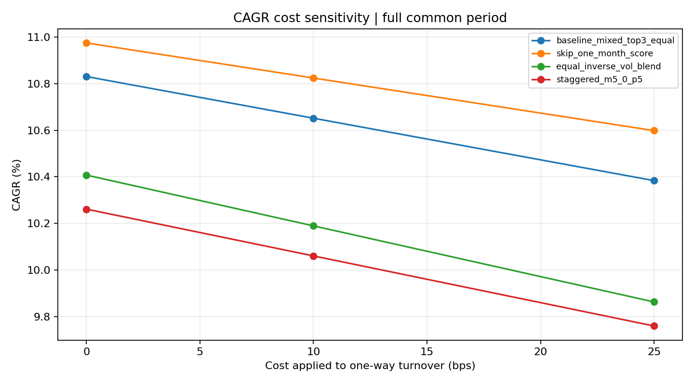

<!-- GENERATED FILE. EDIT THE CANONICAL KNOWLEDGE RECORD. -->

# Quick 5 frozen improvement candidates study

!!! warning "Research-only"
    This page summarizes saved research evidence. It does not authorize LIVE, allocation, or deployment.

## TL;DR

> **Verdict:** At least one mechanism passed its own frozen diagnostic objective, but none is validated or deployment-ready because the evidence is post-hoc.

> **Status:** `diagnostic`

> **Disposition:** `not_recorded`

> **Replication:** `not_recorded`

## Research question

Compare three frozen improvement mechanisms with the unchanged Quick 5 baseline.

## Exact setup

| Field | Value |
| --- | --- |
| Signal family | cross_asset_momentum_rotation |
| Universe | ["VTI, AGG, VNQ, DBC, GLD"] |
| Decision | Close_T |
| Fill | Open_T+1 |
| Primary cost layer | central_research |
| Last reviewed | 2026-08-16T00:32:43.095035+03:00 |

## Timing and overnight attribution

```text
information available: Close_T
primary executable fill: Open_T+1
```

If final `Close_T` data formed the signal, a hypothetical `Close_T` entry is diagnostic only unless a separate pre-close protocol was modeled. Comparing that diagnostic with `Open_(T+1)` and applying the compounded return identity shows whether the apparent edge occurred in the overnight gap. Missing attribution numbers mean **not tested**, not zero.


## Primary metrics

| Metric | Value |
| --- | ---: |
| Period | 2007-09-11 to 2026-07-31 |
| Universe | fixed five ETFs |
| Cost Layer | central_research_10bps |
| Cagr | 10.65% |
| Annualized Volatility | 12.29% |
| Sharpe | 0.778 |
| Maximum Drawdown | -31.92% |
| Turnover | 161.39% |

## Key findings

| Feature | Role | Direction | Status | Effect | Action |
| --- | --- | --- | --- | --- | --- |
| skip_one_month_score | alpha | candidate-specific frozen objective | diagnostic | {"beta_spy_delta_float": -0.011606421622333107, "cagr_delta_float": 0.0017238125920675529, "drawdown_delta_float": 0.03677277744311469, "volatility_delta_float": 0.0002568121985167815} | Do not replace the baseline; retain only as diagnostic evidence. |
| equal_inverse_vol_blend | risk | candidate-specific frozen objective | diagnostic | {"beta_spy_delta_float": -0.06025921816080221, "cagr_delta_float": -0.004617684531798449, "drawdown_delta_float": 0.08074764879350016, "volatility_delta_float": -0.01247045149286348} | Freeze as a forward hypothesis; no live wiring. |
| staggered_m5_0_p5 | calendar_robustness | candidate-specific frozen objective | diagnostic | {"beta_spy_delta_float": 0.012391968426330058, "cagr_delta_float": -0.005905861254834832, "drawdown_delta_float": -0.016615142799374594, "volatility_delta_float": -6.111498265005955e-05} | Do not replace the baseline; retain only as diagnostic evidence. |

## Visual evidence






## Limitations

- All historical observations and two candidate results were visible before freeze.
- Source-level configuration and ETF-proxy selection remain contaminated.
- Adjusted opens are not observed auction fills.
- Taxes, opening spread, queue, and partial fills are absent.

## Next gates

- Forward-track any diagnostic pass unchanged after 2026-07-31.
- Do not combine candidates on the same history.
- Collect empirical opening fills and auction participation before deployment review.

## Sources

- `C:/Users/User/Downloads/5etf.pdf`
- `pakal-research/reports/quick5_etf_rotation_signal_study/REPORT_FULL.md`
- `pakal-research/reports/quick5_etf_rotation_improvement_sweep/REPORT_FULL.md`
- `pakal-research/reports/quick5_rebalance_offset_robustness_study/REPORT_FULL.md`

## Canonical artifacts

| Artifact | Pakal path |
| --- | --- |
| Concise Report | `pakal-research/reports/quick5_frozen_improvement_candidates_study/REPORT.md` |
| Frozen Specification | `pakal-research/reports/quick5_frozen_improvement_candidates_study/research_spec_frozen.json` |
| Full Report | `pakal-research/reports/quick5_frozen_improvement_candidates_study/REPORT_FULL.md` |
| Manifest | `pakal-research/reports/quick5_frozen_improvement_candidates_study/run_manifest.json` |
| Notebook | `pakal-research/quick5_frozen_improvement_candidates_study.ipynb` |
| Primary Charts | `["pakal-research/reports/quick5_frozen_improvement_candidates_study/charts"]` |
| Primary Source Code | `["pakal-research/quick5_frozen_improvement_candidates_study.py"]` |
| Primary Tables | `["pakal-research/reports/quick5_frozen_improvement_candidates_study/tables"]` |
