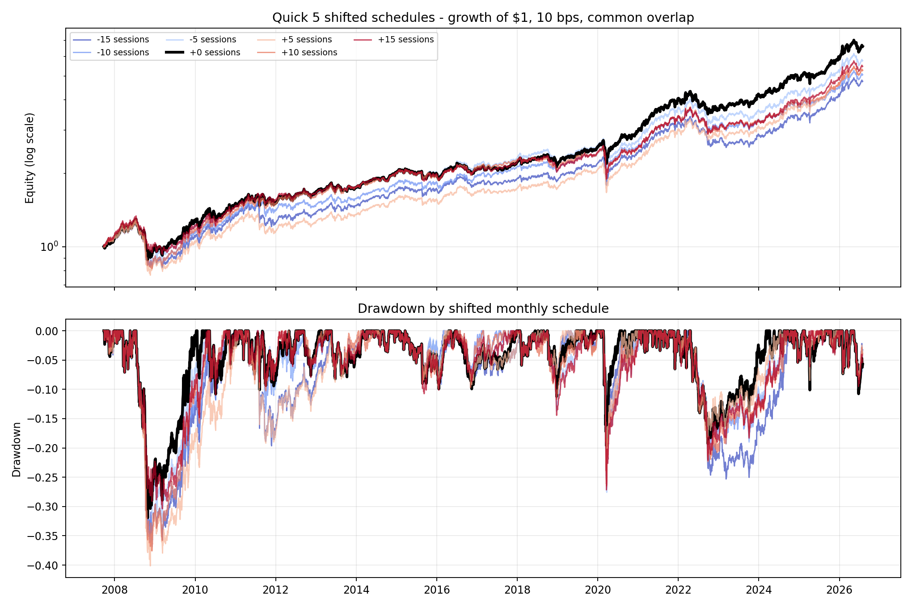
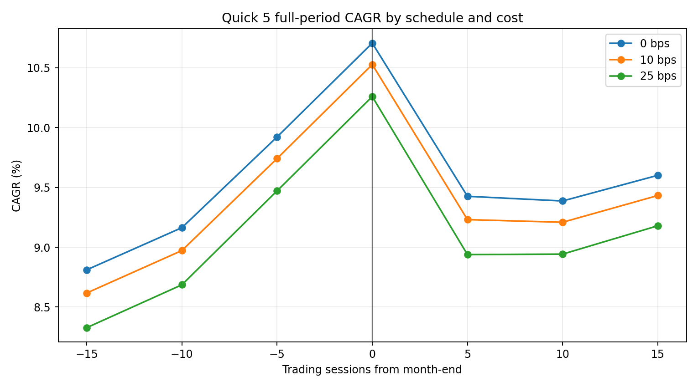

<!-- GENERATED FILE. EDIT THE CANONICAL KNOWLEDGE RECORD. -->

# Quick 5 ETF rebalance-offset robustness study

!!! warning "Research-only"
    This page summarizes saved research evidence. It does not authorize LIVE, allocation, or deployment.

## TL;DR

> **Verdict:** The Quick 5 rule is materially path-sensitive across the frozen +/-15-session family; at least one predeclared schedule-robustness threshold failed.

> **Status:** `diagnostic`

> **Disposition:** `not_recorded`

> **Replication:** `not_recorded`

## Research question

Test whether the unchanged Quick 5 rule is robust to a frozen +/-15 common-session shift of its complete monthly clock.

## Exact setup

| Field | Value |
| --- | --- |
| Signal family | cross_asset_momentum |
| Universe | ["fixed VTI, AGG, VNQ, DBC, GLD"] |
| Decision | shifted Close_T |
| Fill | Open_T+1 |
| Primary cost layer | central_research |
| Last reviewed | 2026-08-15T22:55:10.386900+03:00 |

## Timing and overnight attribution

```text
information available: shifted Close_T
primary executable fill: Open_T+1
```

If final `Close_T` data formed the signal, a hypothetical `Close_T` entry is diagnostic only unless a separate pre-close protocol was modeled. Comparing that diagnostic with `Open_(T+1)` and applying the compounded return identity shows whether the apparent edge occurred in the overnight gap. Missing attribution numbers mean **not tested**, not zero.


## Primary metrics

| Metric | Value |
| --- | ---: |
| Period | 2007-09-25 through 2026-07-31 |
| Universe | VTI, AGG, VNQ, DBC, GLD |
| Cost Layer | central_research_10_bps |
| Cagr | 10.53% |
| Annualized Volatility | 12.30% |
| Sharpe | 0.770 |
| Maximum Drawdown | -31.92% |
| Turnover | 161.72% |

## Key findings

| Feature | Role | Direction | Status | Effect | Action |
| --- | --- | --- | --- | --- | --- |
| rebalance_clock_offset_family | calendar robustness diagnostic only | material path sensitivity | diagnostic | {"cagr_range": 0.01909286631086138, "max_drawdown_range": 0.09731871019482341, "minimum_cagr_ratio": 0.8186315858437754, "sharpe_range": 0.1567848834579466} | Do not select an offset; keep the family as diagnostic and forward-track the unchanged source rule only if separately justified. |

## Visual evidence






## Limitations

- All historical months were visible before the offset family was frozen.
- The source basket came from a 126144-configuration search and author-selected ETF proxies.
- Adjusted next-open bars are not empirical auction fills.
- Taxes and investor-specific frictions are excluded.

## Next gates

- Do not optimize offsets on this history.
- Forward-track the unchanged zero-offset control after 2026-08-04 only if the parent strategy remains under research review.
- Collect empirical opening fills and auction participation before any deployment discussion.

## Sources

- `C:/Users/User/Downloads/5etf.pdf`
- `https://papertoprofit.substack.com/p/quick-5-etf-rotational-strategy-returns/comments`
- `pakal-research/reports/quick5_etf_rotation_signal_study/REPORT_FULL.md`

## Canonical artifacts

| Artifact | Pakal path |
| --- | --- |
| Concise Report | `pakal-research/reports/quick5_rebalance_offset_robustness_study/REPORT.md` |
| Frozen Specification | `pakal-research/reports/quick5_rebalance_offset_robustness_study/research_spec_frozen.json` |
| Full Report | `pakal-research/reports/quick5_rebalance_offset_robustness_study/REPORT_FULL.md` |
| Manifest | `pakal-research/reports/quick5_rebalance_offset_robustness_study/run_manifest.json` |
| Notebook | `pakal-research/quick5_rebalance_offset_robustness_study.ipynb` |
| Primary Charts | `["pakal-research/reports/quick5_rebalance_offset_robustness_study/charts"]` |
| Primary Source Code | `["pakal-research/quick5_rebalance_offset_robustness_study.py"]` |
| Primary Tables | `["pakal-research/reports/quick5_rebalance_offset_robustness_study/tables"]` |
