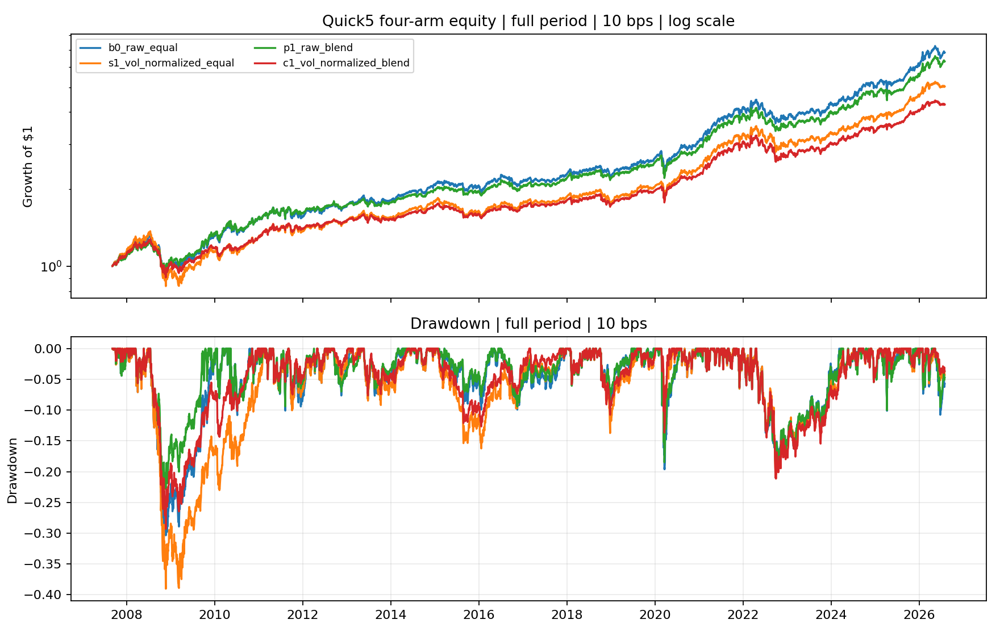
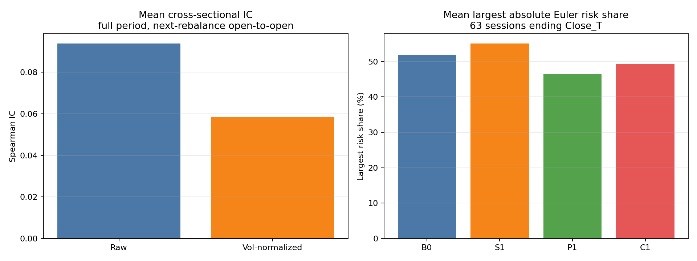

<!-- GENERATED FILE. EDIT THE CANONICAL KNOWLEDGE RECORD. -->

# Quick5 Volatility-Normalized Signal and Positioning

!!! warning "Research-only"
    This page summarizes saved research evidence. It does not authorize LIVE, allocation, or deployment.

## TL;DR

> **Verdict:** Reject the tested signal normalization; retain the fixed positioning blend only as an unchanged forward-shadow hypothesis.

> **Status:** `diagnostic`

> **Disposition:** `promising_component`

> **Replication:** `replicated`

## Research question

Attribute volatility normalization separately in the Quick5 ranking signal and portfolio positioning.

## Exact setup

| Field | Value |
| --- | --- |
| Signal family | cross_asset_momentum |
| Universe | ["Fixed ETF proxies VTI, AGG, VNQ, DBC, GLD"] |
| Decision | Close_T |
| Fill | Open_(T+1) |
| Primary cost layer | central_research |
| Last reviewed | 2026-08-19T16:20:00+03:00 |

## Timing and overnight attribution

```text
information available: Close_T
primary executable fill: Open_(T+1)
```

If final `Close_T` data formed the signal, a hypothetical `Close_T` entry is diagnostic only unless a separate pre-close protocol was modeled. Comparing that diagnostic with `Open_(T+1)` and applying the compounded return identity shows whether the apparent edge occurred in the overnight gap. Missing attribution numbers mean **not tested**, not zero.

| Attribution field | Value |
| --- | --- |
| Status | not_tested |
| Diagnostic Path | Same-close path not rerun in this attribution study |
| Executable Path | Open_(T+1) to the next rebalance Open_(T+1) |
| Method | Reused the parent study's verified stateful next-open engine |
| Headline Result | Executable next-open timing only; no same-close claim. |
| Metrics | {} |
| Artifact | N/A |

## Primary metrics

| Metric | Value |
| --- | ---: |
| Period | 2007-09-04 through 2026-07-31 |
| Universe | VTI, AGG, VNQ, DBC, GLD |
| Cost Layer | 10 bps per unit one-way turnover |
| Cagr | 10.24% |
| Annualized Volatility | 11.04% |
| Sharpe | 0.818 |
| Maximum Drawdown | -23.84% |
| Turnover | 202.60% |

## Four separate verdicts

| Question | Conclusion |
| --- | --- |
| Source Replication | The supplied source is methodological commentary, not a Quick5 strategy; only its return-over-volatility idea was transferred. |
| Predictive Value | The normalized score had weaker full-sample IC than the raw score and failed its corrected-significance gate. |
| Economic Value | The raw-signal positioning blend improved volatility, Sharpe, drawdown, beta, and Euler risk concentration while retaining 95.6% of baseline CAGR. |
| Promotion | No historical promotion; forward-shadow P1 unchanged after 2026-07-31 only. |

## Key findings

| Feature | Role | Direction | Status | Effect | Action |
| --- | --- | --- | --- | --- | --- |
| 63-session horizon-scaled volatility-normalized momentum rank | signal | worse | rejected | CAGR 8.92% versus 10.70% baseline | Do not implement or retune from these results. |
| 50/50 equal and inverse-volatility positioning blend | risk_overlay | lower_risk | promising_component | Volatility 11.04%, max DD -23.84%, CAGR 10.24% | Track unchanged in forward shadow after 2026-07-31. |

## Visual evidence






## Limitations

- All history through 2026-07-31 and prior Quick5 sizing evidence were visible before this study.
- Five assets make date-level Spearman IC coarse.
- The 63-session denominator may be mismatched to 12-month momentum.
- Adjusted opens and full-day ADV do not reproduce auction fills or depth.

## Next gates

- Forward-shadow P1 unchanged after 2026-07-31; no parameter tuning.

## Sources

- `C:/Users/User/Downloads/Percentile-Rank Momentum.pdf`
- `pakal-research/reports/quick5_etf_rotation_signal_study/REPORT_FULL.md`

## Canonical artifacts

| Artifact | Pakal path |
| --- | --- |
| Concise Report | `C:\\Users\\User\\Documents\\workspace\\pakal\\pakal-research\\reports\\quick5_vol_normalized_signal_positioning_study\\REPORT.md` |
| Decision Log | `C:\\Users\\User\\Documents\\workspace\\pakal\\pakal-research\\reports\\quick5_vol_normalized_signal_positioning_study\\decision_log.jsonl` |
| Experiment Ledger | `C:\\Users\\User\\Documents\\workspace\\pakal\\pakal-research\\reports\\quick5_vol_normalized_signal_positioning_study\\experiment_ledger.jsonl` |
| Frozen Specification | `C:\\Users\\User\\Documents\\workspace\\pakal\\pakal-research\\reports\\quick5_vol_normalized_signal_positioning_study\\research_spec_frozen.json` |
| Full Report | `C:\\Users\\User\\Documents\\workspace\\pakal\\pakal-research\\reports\\quick5_vol_normalized_signal_positioning_study\\REPORT_FULL.md` |
| Hypothesis Registry | `C:\\Users\\User\\Documents\\workspace\\pakal\\pakal-research\\reports\\quick5_vol_normalized_signal_positioning_study\\hypothesis_registry.json` |
| Manifest | `C:\\Users\\User\\Documents\\workspace\\pakal\\pakal-research\\reports\\quick5_vol_normalized_signal_positioning_study\\run_manifest.json` |
| Notebook | `C:\\Users\\User\\Documents\\workspace\\pakal\\pakal-research\\quick5_vol_normalized_signal_positioning_study.ipynb` |
| Primary Charts | `["C:\\\\Users\\\\User\\\\Documents\\\\workspace\\\\pakal\\\\pakal-research\\\\reports\\\\quick5_vol_normalized_signal_positioning_study\\\\charts\\\\equity_drawdown.png", "C:\\\\Users\\\\User\\\\Documents\\\\workspace\\\\pakal\\\\pakal-research\\\\reports\\\\quick5_vol_normalized_signal_positioning_study\\\\charts\\\\primary_metrics.png", "C:\\\\Users\\\\User\\\\Documents\\\\workspace\\\\pakal\\\\pakal-research\\\\reports\\\\quick5_vol_normalized_signal_positioning_study\\\\charts\\\\ic_and_risk.png"]` |
| Primary Source Code | `["C:\\\\Users\\\\User\\\\Documents\\\\workspace\\\\pakal\\\\pakal-research\\\\quick5_vol_normalized_signal_positioning_study.py"]` |
| Primary Tables | `["C:\\\\Users\\\\User\\\\Documents\\\\workspace\\\\pakal\\\\pakal-research\\\\reports\\\\quick5_vol_normalized_signal_positioning_study\\\\tables\\\\strategy_metrics.csv", "C:\\\\Users\\\\User\\\\Documents\\\\workspace\\\\pakal\\\\pakal-research\\\\reports\\\\quick5_vol_normalized_signal_positioning_study\\\\tables\\\\predeclared_gates.csv", "C:\\\\Users\\\\User\\\\Documents\\\\workspace\\\\pakal\\\\pakal-research\\\\reports\\\\quick5_vol_normalized_signal_positioning_study\\\\tables\\\\score_ic_summary.csv"]` |
| Research State | `C:\\Users\\User\\Documents\\workspace\\pakal\\pakal-research\\reports\\quick5_vol_normalized_signal_positioning_study\\research_state.json` |
| Source Rule Map | `C:\\Users\\User\\Documents\\workspace\\pakal\\pakal-research\\reports\\quick5_vol_normalized_signal_positioning_study\\SOURCE_RULE_MAP.md` |
