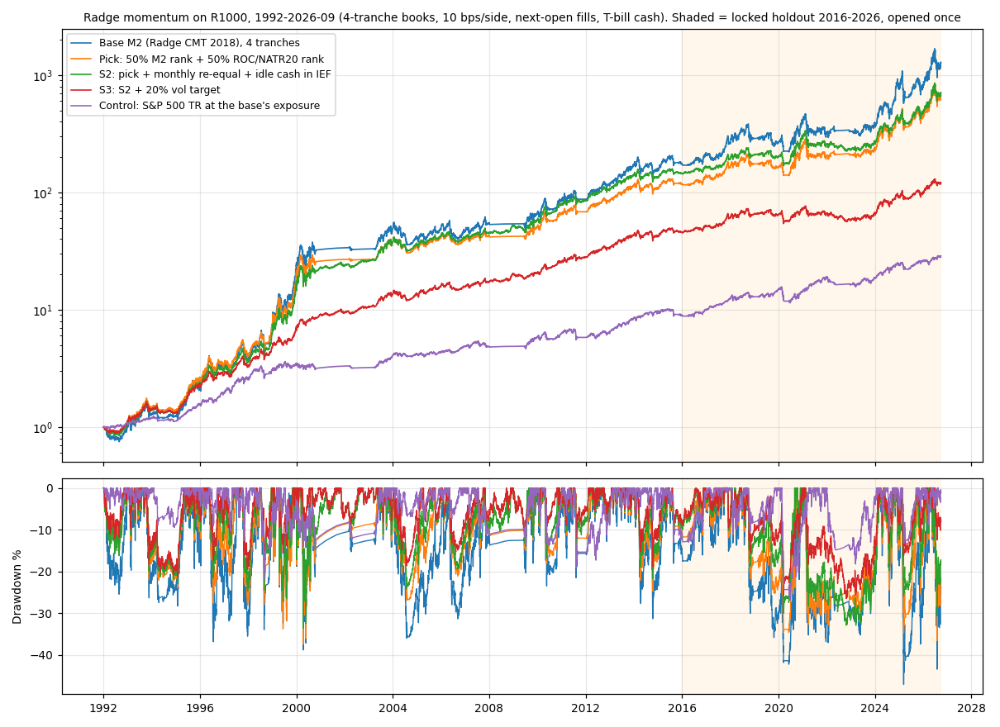
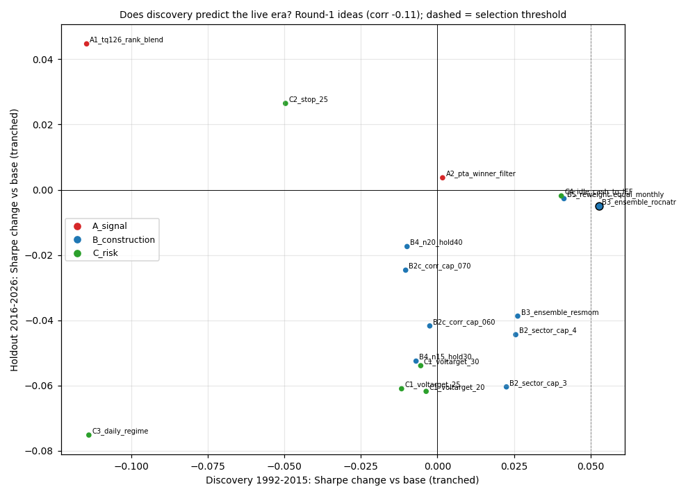

<!-- GENERATED FILE. EDIT THE CANONICAL KNOWLEDGE RECORD. -->

# Improving Radge US relative momentum (R1000, CMT-2018 version): pre-registered study with a locked 2016-2026 live-era holdout

!!! warning "Research-only"
    This page summarizes saved research evidence. It does not authorize LIVE, allocation, or deployment.

## TL;DR

> **Verdict:** No. None of 19 components or 3 candidates raised the 2016-2026 Sharpe. The frozen pick (50/50 M2 + ROC/NATR20 ensemble) is Sharpe-neutral (0.626 vs 0.631) with max DD -36.7% vs -47.1% and CAGR 17.6% vs 20.5% (a drawdown preference, not an edge). Discovery-to-holdout correlation of the component gains is -0.11. Live-era controls: random rank 0.240, S&P 500 at the same exposure 0.704. Keep the base.

> **Status:** `diagnostic`

> **Disposition:** `rejected`

> **Replication:** `replicated`

## Research question

Can Radge's R1000 momentum (M2) be improved by pre-declared construction, risk-overlay and signal changes selected on 1992-2015 and confirmed once on 2016-2026?

## Exact setup

| Field | Value |
| --- | --- |
| Signal family | cross_sectional_momentum_long_only_rotation |
| Universe | ["R1000 PIT (primary)", "Nasdaq-100 PIT and S&P 500 PIT (robustness)"] |
| Decision | Close_T month-end (tranches +5/+10/+15 sessions) |
| Fill | Open_T+1 |
| Primary cost layer | central_research |
| Last reviewed | 2026-10-06T21:22:53+00:00 |

## Timing and overnight attribution

```text
information available: Close_T month-end (tranches +5/+10/+15 sessions)
primary executable fill: Open_T+1
```

If final `Close_T` data formed the signal, a hypothetical `Close_T` entry is diagnostic only unless a separate pre-close protocol was modeled. Comparing that diagnostic with `Open_(T+1)` and applying the compounded return identity shows whether the apparent edge occurred in the overnight gap. Missing attribution numbers mean **not tested**, not zero.

| Attribution field | Value |
| --- | --- |
| Status | tested |
| Diagnostic Path | signal_lag 1 (stale by one session) |
| Executable Path | Open_T+1 |
| Method | Same rules with every decision input lagged one session |
| Headline Result | Lag 1 lowers holdout Sharpe for both base (0.607) and pick (0.585); the ranking is not a same-day artefact. |
| Metrics | {"base_hold_sharpe_lag1": 0.607, "pick_hold_sharpe_lag1": 0.585} |
| Artifact | pakal-research/reports/radge_momentum_improvement_study/tables/robustness_pick_vs_base.csv |

## Primary metrics

| Metric | Value |
| --- | ---: |
| Period | 2016-01-01..2026-09-25 (holdout) |
| Universe | R1000 PIT |
| Cost Layer | central_research (10 bps per side) |
| Cagr | 20.49% |
| Annualized Volatility | 36.70% |
| Sharpe | 0.631 |
| Maximum Drawdown | -47.12% |
| Turnover | about 30-45 trades a year per book (monthly rotation) |

## Four separate verdicts

| Question | Conclusion |
| --- | --- |
| Source Replication | Base reproduced exactly (0.0 max abs daily difference). |
| Predictive Value | Discovery gains do not transfer (corr -0.11); two sign flips. |
| Economic Value | No Sharpe gain; the ensemble trades about 3%/yr of CAGR for about 10 pp less drawdown in the live era. |
| Promotion | Rejected under the frozen rule; no candidate. |

## Key findings

| Feature | Role | Direction | Status | Effect | Action |
| --- | --- | --- | --- | --- | --- |
| two_ranking_ensemble_rocnatr | rank | drawdown down, Sharpe flat | rejected_as_improvement | holdout dSharpe -0.005; maxDD +10.4 pp | optional drawdown-preference variant; not an edge |
| portfolio_vol_target | sizing | drawdown down, Sharpe down in holdout | rejected | holdout dSharpe -0.05..-0.06 | do not use |
| sector_and_correlation_caps | sizing | negative in the live era | rejected | holdout -0.025..-0.060 | do not use |
| trailing_stop_and_daily_regime | exit | negative or unstable | rejected | stop -0.050/+0.026; daily regime -0.114/-0.075 | do not use |
| idle_cash_in_bonds | portfolio construction | regime-dependent | rejected | +0.040 / -0.002 | do not use |
| momentum_rank_vs_random_and_index_controls | diagnostic | rank > random, < index at the same exposure (live era) | diagnostic | 0.631 vs 0.240 vs 0.704 | judge the strategy against SPY at matched exposure |

## Visual evidence






## Limitations

- Smoke-test contamination of 4 kept ideas (disclosed).
- Current GICS (not PIT).
- C4 bond overlay is a return-level approximation.
- M2 is a reconstruction of undisclosed live rules.
- Holdout = one 10-year bull-dominated era.

## Next gates

- None for R1000.
- Optional: frozen-spec NDX ensemble (L-rank + Radge blend) for the L pod as its own study.

## Sources

- `S0 nick_radge_strategies_study (M2)`
- `P1 prior Pakal / alpha_super momentum studies`
- `P2 0_papers/index cards`

## Canonical artifacts

| Artifact | Pakal path |
| --- | --- |
| Concise Report | `pakal-research/reports/radge_momentum_improvement_study/REPORT.md` |
| Full Report | `pakal-research/reports/radge_momentum_improvement_study/REPORT_FULL.md` |
| Notebook | `pakal-research/reports/radge_momentum_improvement_study/radge_momentum_improvement_study.ipynb` |
| Frozen Specification | `pakal-research/reports/radge_momentum_improvement_study/research_spec_frozen.json` |
| Manifest | `pakal-research/reports/radge_momentum_improvement_study/run_manifest.json` |
| Primary Source Code | `["pakal-research/radge_momentum_improvement/rmi_strategy.py", "pakal-research/radge_momentum_improvement/rmi_books.py", "pakal-research/radge_momentum_improvement/rmi_run_round1.py", "pakal-research/radge_momentum_improvement/rmi_open_holdout.py"]` |
| Primary Tables | `["pakal-research/reports/radge_momentum_improvement_study/tables/round1_discovery.csv", "pakal-research/reports/radge_momentum_improvement_study/tables/holdout_2016_2026.csv"]` |
| Primary Charts | `["pakal-research/reports/radge_momentum_improvement_study/charts/02_discovery_vs_holdout_round1.png", "pakal-research/reports/radge_momentum_improvement_study/charts/01_equity_drawdown_base_pick_controls.png"]` |
| Research State | `pakal-research/reports/radge_momentum_improvement_study/research_state.json` |
| Hypothesis Registry | `pakal-research/reports/radge_momentum_improvement_study/hypothesis_registry.json` |
| Experiment Ledger | `pakal-research/reports/radge_momentum_improvement_study/experiment_ledger.jsonl` |
| Decision Log | `pakal-research/reports/radge_momentum_improvement_study/decision_log.jsonl` |
| Source Rule Map | `pakal-research/reports/radge_momentum_improvement_study/SOURCE_RULE_MAP.md` |
