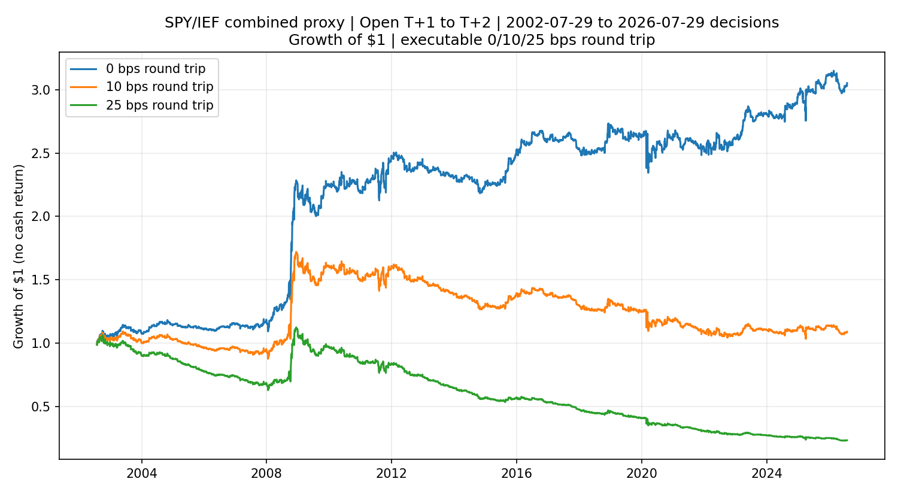
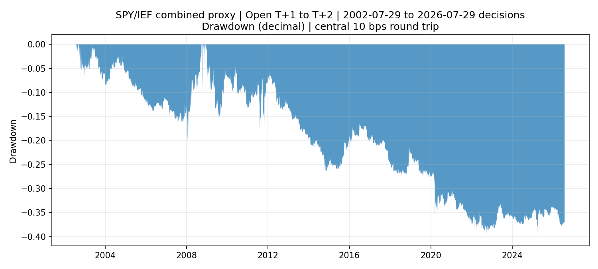

<!-- GENERATED FILE. EDIT THE CANONICAL KNOWLEDGE RECORD. -->

# Rebalancing Front-Run Threshold and Calendar Signals

!!! warning "Research-only"
    This page summarizes saved research evidence. It does not authorize LIVE, allocation, or deployment.

## TL;DR

> **Verdict:** DIAGNOSTIC_ONLY: the frozen SPY/IEF executable proxy failed one or more predeclared numerical gates. Do not implement it in live or forward trading.

> **Status:** `diagnostic`

> **Disposition:** `not_recorded`

> **Replication:** `not_recorded`

## Research question

Determine whether the paper-defined threshold and calendar rebalancing signals of Harvey, Mazzoleni, and Melone retain a causal, cost-aware net edge in a SPY/IEF total-return proxy, and whether the source-selected 26-threshold aggregate and N=5 calendar window survive multiplicity, crisis-leave-out, and forward-extension stress without any local retuning.

## Exact setup

| Field | Value |
| --- | --- |
| Signal family | cross_asset_flow_front_running |
| Universe | ["Fixed SPY/IEF two-asset 60/40 proxy on strict common observed sessions"] |
| Decision | After final adjusted Close_T, using only SPY/IEF returns and the separately loaded Norgate ALLMARKETDAYS session schedule; no future price observation enters the decision |
| Fill | Adjusted Open_T+1 entry/rebalance to adjusted Open_T+2 exit/rebalance; paper-like Close_T-to-Close_T+1 is diagnostic only |
| Primary cost layer | central_research |
| Last reviewed | 2026-08-03T17:49:52.576433+03:00 |

## Timing and overnight attribution

```text
information available: After final adjusted Close_T, using only SPY/IEF returns and the separately loaded Norgate ALLMARKETDAYS session schedule; no future price observation enters the decision
primary executable fill: Adjusted Open_T+1 entry/rebalance to adjusted Open_T+2 exit/rebalance; paper-like Close_T-to-Close_T+1 is diagnostic only
```

If final `Close_T` data formed the signal, a hypothetical `Close_T` entry is diagnostic only unless a separate pre-close protocol was modeled. Comparing that diagnostic with `Open_(T+1)` and applying the compounded return identity shows whether the apparent edge occurred in the overnight gap. Missing attribution numbers mean **not tested**, not zero.


## Primary metrics

| Metric | Value |
| --- | ---: |
| Period | 2002-07-29 through 2026-07-29 |
| Universe | Fixed SPY/IEF two-asset 60/40 proxy on strict common observed sessions |
| Cost Layer | central_research_10_bps_round_trip |
| Cagr | 0.36% |
| Annualized Volatility | 9.11% |
| Sharpe | 0.085 |
| Maximum Drawdown | -39.94% |
| Turnover | 8598.89% |

## Key findings

| Feature | Role | Direction | Status | Effect | Action |
| --- | --- | --- | --- | --- | --- |
| Threshold rebalancing signal (26-delta aggregate) | next-day cross-asset spread predictor | Median 26-threshold drift calibration: a higher predictor is associated with lower next-close SPY-minus-IEF return in the paper-like diagnostic | diagnostic | {"cell_count": 26, "cells_with_bh_q_le_10pct": 26, "maximum_hac_t_stat": -2.539156406857553, "maximum_standardized_effect_bps": -5.600477332987208, "median_effect_coefficient": -0.14216493797998653, "minimum_hac_t_stat": -4.116356134367704, "minimum_standardized_effect_bps": -15.005032876872608, "same_sign_cell_count": 26} | Retain the frozen 26-delta source aggregate as diagnostic mechanism evidence; do not select a locally winning delta. |
| Calendar signal, source N=5 month-end window | month-end flow-pressure timing overlay | Source calendar N=5 interaction: a higher predictor is associated with lower next-close SPY-minus-IEF return in the paper-like diagnostic | diagnostic | {"bh_q_value": 0.09377830394423949, "effect_coefficient": -0.14565897277867465, "hac_t_stat": -1.7672959910298656} | Retain source N=5 without local window selection; treat it as diagnostic until untouched data. |
| Crisis concentration of the combined sleeve | robustness diagnostic | Combined central-cost Sharpe changes from +0.085 with all dates to -0.114 after excluding both declared crisis windows. | diagnostic | {"gfc_gross_log_pnl_contribution": 0.40426937304118615, "march_2020_gross_log_pnl_contribution": -0.044129656579712816, "sharpe_excluding_both": -0.11377448896751323, "sharpe_with_all_dates": 0.08463555470703568} | Keep both predeclared leave-outs in future reviews and do not infer crisis dependence without prospective evidence. |
| Lagged volatility x absolute signal magnitude | descriptive regime interaction | Using prior-only descriptive bands, the highest full-period gross cell was volatility=high, signal magnitude=high at +16.318 bps; the lowest was volatility=low, signal magnitude=middle at -0.199 bps. These cells are diagnostics, not fitted regime filters. | diagnostic | {"full_signal_distribution": "Full-period combined spread weight: median -0.1362, P05 -0.6942, P95 +0.5188, and lag-1 autocorrelation +0.587.", "highest_cell_mean_gross_return_bps": 16.318169485716176, "highest_cell_signal_magnitude_band": "high", "highest_cell_volatility_band": "high", "lowest_cell_mean_gross_return_bps": -0.19942600328613466} | Do not trade the cells; freeze any regime rule before a new prospective test. |

## Visual evidence






## Limitations

- SPY/IEF total returns are not Bloomberg ES/TY futures excess returns.
- Adjusted opens are not verified opening-auction fills.
- Base costs omit financing, borrow, tax, and empirical market impact.
- Capacity uses prior-only full-day turnover, not auction liquidity.
- Validation and most confirmation history are not untouched evidence.

## Next gates

- Reconstruct the exact Bloomberg ES/TY nearby-contract series and custom roll, then test literal paper parity without changing rules.
- Freeze the current SPY/IEF rules and collect genuinely untouched post-revision decisions and Open_(T+1)-to-Open_(T+2) outcomes.
- Calibrate opening-auction spread, depth, partial fills, financing, and impact before assigning any capacity band.

## Sources

- `{"path": "C:/Users/User/Desktop/EOM/Quantitativo-REBALACNING.pdf", "read_complete": true, "role": "Supplied secondary implementation article and performance claim", "rule_summary": "Secondary description of the 60/40 threshold and month-end signal; the January 2026 primary paper controls where definitions differ.", "sha256": "2D4F236E8674287337C3B5E9399507DF7CE3E631B9801F2FA31D1EB37FA01F7A", "source_id": "quantitativo_2025_unintended_rebalancing", "title": "Quantitativo: Rebalancing", "unresolved_gap": "Reset indexing is ambiguous in the article and its proprietary mean-reversion overlay is unspecified."}`
- `{"path": "pakal-research/research_cache/unintended_rebalancing/nber_w33554_202601.pdf", "read_complete": true, "role": "Controlling primary rules, causal indexing, and data construction", "rule_summary": "Counterfactual 60/40 drift, 26-threshold aggregate, source N=5 calendar sleeve, fixed 50/50 blend, and next-daily-return indexing.", "sha256": "ADB7AD35D5A5BDC18F6F75801132391331E33711C19CE944F569B0A9D345E158", "source_id": "harvey_mazzoleni_melone_nber_w33554_202601", "title": "Harvey, Mazzoleni, and Melone, NBER 33554 (Jan. 2026)", "unresolved_gap": "Licensed Bloomberg ES/TY histories, exact custom-roll reconstruction, and an executable closing-fill protocol are unavailable locally."}`

## Canonical artifacts

| Artifact | Pakal path |
| --- | --- |
| Concise Report | `C:\\Users\\User\\Documents\\workspace\\pakal\\pakal-research\\reports\\rebalancing_front_run_signal_study\\REPORT.md` |
| Full Report | `C:\\Users\\User\\Documents\\workspace\\pakal\\pakal-research\\reports\\rebalancing_front_run_signal_study\\REPORT_FULL.md` |
| Notebook | `C:\\Users\\User\\Documents\\workspace\\pakal\\pakal-research\\rebalancing_front_run_signal_study.ipynb` |
| Frozen Specification | `C:\\Users\\User\\Documents\\workspace\\pakal\\pakal-research\\reports\\rebalancing_front_run_signal_study\\research_spec_frozen.json` |
| Source Rule Map | `C:\\Users\\User\\Documents\\workspace\\pakal\\pakal-research\\reports\\rebalancing_front_run_signal_study\\SOURCE_RULE_MAP.md` |
| Knowledge Record | `C:\\Users\\User\\Documents\\workspace\\pakal\\pakal-research\\reports\\rebalancing_front_run_signal_study\\knowledge_record.json` |
| Manifest | `C:\\Users\\User\\Documents\\workspace\\pakal\\pakal-research\\reports\\rebalancing_front_run_signal_study\\run_manifest.json` |
| Summary | `C:\\Users\\User\\Documents\\workspace\\pakal\\pakal-research\\reports\\rebalancing_front_run_signal_study\\summary.json` |
| Primary Source Code | `["C:\\\\Users\\\\User\\\\Documents\\\\workspace\\\\pakal\\\\pakal-research\\\\rebalancing_front_run_signal_study.py"]` |
| Focused Tests | `C:\\Users\\User\\Documents\\workspace\\pakal\\tests\\test_rebalancing_front_run_signal_study.py` |
| Primary Tables | `["C:\\\\Users\\\\User\\\\Documents\\\\workspace\\\\pakal\\\\pakal-research\\\\reports\\\\rebalancing_front_run_signal_study\\\\tables\\\\daily_strategy_returns.csv", "C:\\\\Users\\\\User\\\\Documents\\\\workspace\\\\pakal\\\\pakal-research\\\\reports\\\\rebalancing_front_run_signal_study\\\\tables\\\\performance_metrics.csv", "C:\\\\Users\\\\User\\\\Documents\\\\workspace\\\\pakal\\\\pakal-research\\\\reports\\\\rebalancing_front_run_signal_study\\\\tables\\\\predictive_calibration.csv", "C:\\\\Users\\\\User\\\\Documents\\\\workspace\\\\pakal\\\\pakal-research\\\\reports\\\\rebalancing_front_run_signal_study\\\\tables\\\\signal_distribution.csv", "C:\\\\Users\\\\User\\\\Documents\\\\workspace\\\\pakal\\\\pakal-research\\\\reports\\\\rebalancing_front_run_signal_study\\\\tables\\\\signal_interactions.csv", "C:\\\\Users\\\\User\\\\Documents\\\\workspace\\\\pakal\\\\pakal-research\\\\reports\\\\rebalancing_front_run_signal_study\\\\tables\\\\calendar_year_metrics.csv", "C:\\\\Users\\\\User\\\\Documents\\\\workspace\\\\pakal\\\\pakal-research\\\\reports\\\\rebalancing_front_run_signal_study\\\\tables\\\\crisis_exclusions.csv", "C:\\\\Users\\\\User\\\\Documents\\\\workspace\\\\pakal\\\\pakal-research\\\\reports\\\\rebalancing_front_run_signal_study\\\\tables\\\\capacity_scenarios.csv"]` |
| Primary Charts | `["C:\\\\Users\\\\User\\\\Documents\\\\workspace\\\\pakal\\\\pakal-research\\\\reports\\\\rebalancing_front_run_signal_study\\\\charts\\\\equity_curve.png", "C:\\\\Users\\\\User\\\\Documents\\\\workspace\\\\pakal\\\\pakal-research\\\\reports\\\\rebalancing_front_run_signal_study\\\\charts\\\\drawdown.png", "C:\\\\Users\\\\User\\\\Documents\\\\workspace\\\\pakal\\\\pakal-research\\\\reports\\\\rebalancing_front_run_signal_study\\\\charts\\\\cost_sensitivity.png", "C:\\\\Users\\\\User\\\\Documents\\\\workspace\\\\pakal\\\\pakal-research\\\\reports\\\\rebalancing_front_run_signal_study\\\\charts\\\\predictive_calibration.png", "C:\\\\Users\\\\User\\\\Documents\\\\workspace\\\\pakal\\\\pakal-research\\\\reports\\\\rebalancing_front_run_signal_study\\\\charts\\\\signal_interactions.png", "C:\\\\Users\\\\User\\\\Documents\\\\workspace\\\\pakal\\\\pakal-research\\\\reports\\\\rebalancing_front_run_signal_study\\\\charts\\\\subperiod_stability.png", "C:\\\\Users\\\\User\\\\Documents\\\\workspace\\\\pakal\\\\pakal-research\\\\reports\\\\rebalancing_front_run_signal_study\\\\charts\\\\capacity_participation.png"]` |
