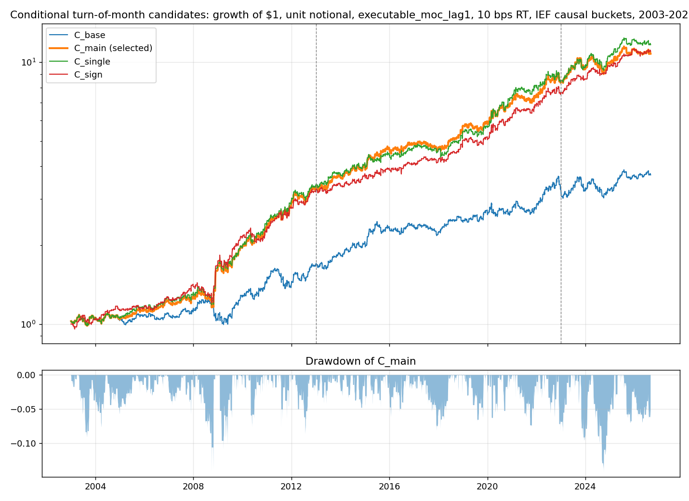
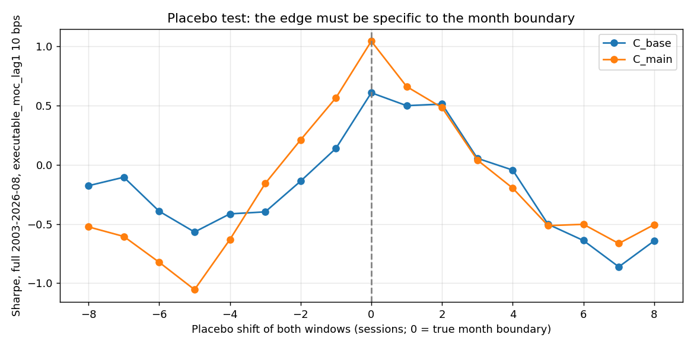

<!-- GENERATED FILE. EDIT THE CANONICAL KNOWLEDGE RECORD. -->

# RJ Macro-ETF Flow Edges: SPY/TLT rebalance-flow trades and the pressure-conditioned turn-of-month bundle

!!! warning "Research-only"
    This page summarizes saved research evidence. It does not authorize LIVE, allocation, or deployment.

## TL;DR

> **Verdict:** RESEARCH CANDIDATE for a small PAPER trial with MOC execution: C_main (final-5 long TLT, or long SPY when 60/40 rebalance pressure is in the bottom causal quintile; first-5 short TLT or half SPY/half short TLT by bucket) earned Sharpe 1.15/1.03/0.77 in 2003-12/2013-22/2023-26 at 10 bps with MOC fills and a one-session-lagged signal, passed placebo, cost and leave-one-year-out checks, but halves under next-open execution, is weak in its early-month leg, and is negative in 2026 YTD. Not a deployment candidate.

> **Status:** `research_candidate`

> **Disposition:** `candidate`

> **Replication:** `replicated`

## Research question

Reproduce Robot James's three SPY/TLT flow trades and his month-end rebalance-pressure diagnostics, reconstruct the pressure-conditioned turn-of-month strategy as a predeclared family, and decide whether anything is robust enough for a small paper trial.

## Exact setup

| Field | Value |
| --- | --- |
| Signal family | calendar_cross_asset_rebalance_flow |
| Universe | ["Fixed SPY/TLT pair with IEF as the bond-pressure proxy on strict common Norgate sessions"] |
| Decision | Calendar known in advance; pressure measured at the close of the seventh-last session (dtme=7) for the final leg and applied to the early leg; bucket from prior months only |
| Fill | Primary: market-on-close at dtme=6, dtme=1 and session 5 (executable_moc_lag1). Conservative: Open_(d) to Open_(d+1) (executable_open_open). Diagnostic: Close-to-Close with same-close pressure (paper_close_close). |
| Primary cost layer | central_research |
| Last reviewed | 2026-09-11T19:30:00+03:00 |

## Timing and overnight attribution

```text
information available: Calendar known in advance; pressure measured at the close of the seventh-last session (dtme=7) for the final leg and applied to the early leg; bucket from prior months only
primary executable fill: Primary: market-on-close at dtme=6, dtme=1 and session 5 (executable_moc_lag1). Conservative: Open_(d) to Open_(d+1) (executable_open_open). Diagnostic: Close-to-Close with same-close pressure (paper_close_close).
```

If final `Close_T` data formed the signal, a hypothetical `Close_T` entry is diagnostic only unless a separate pre-close protocol was modeled. Comparing that diagnostic with `Open_(T+1)` and applying the compounded return identity shows whether the apparent edge occurred in the overnight gap. Missing attribution numbers mean **not tested**, not zero.

| Attribution field | Value |
| --- | --- |
| Status | tested |
| Diagnostic Path | Close_(d-1) to Close_d with the pressure measured at the same close |
| Executable Path | MOC at Close_(d-1) with the pressure lagged one session; and Open_d to Open_(d+1) |
| Method | Overnight/intraday decomposition by month position; per-engine leg returns; one-day decision-stability table |
| Headline Result | TLT month-end premium concentrated in the last two sessions (intraday and overnight) and reverses from the next open; SPY bucket-1 final-5 leg +191 bps CC vs +138 bps OO. C_main Sharpe 1.04 (MOC lag-1) vs 0.64 (OO) full period at 10 bps. |
| Metrics | {"c_main_full_sharpe_moc_lag1_10bps": 1.045, "c_main_full_sharpe_open_open_10bps": 0.641, "c_main_full_sharpe_paper_0bps": 1.217, "f1_decision_change_fraction_one_day_lag": 0.06} |
| Unavailable Reason | N/A |
| Artifact | tables/timing_attribution_by_month_position.csv |

## Primary metrics

| Metric | Value |
| --- | ---: |
| Period | full 2003-01-01 to 2026-08-31 (discovery 2003-2012, validation 2013-2022, confirmation 2023-2026-08) |
| Universe | SPY/TLT, unit notional, C_main, executable_moc_lag1 |
| Cost Layer | central_research |
| Cagr | 10.60% |
| Annualized Volatility | 10.10% |
| Sharpe | 1.045 |
| Maximum Drawdown | -14.20% |
| Turnover | 4440.00% |

## Four separate verdicts

| Question | Conclusion |
| --- | --- |
| Source Replication | replicated (source-1 P&L within 10-30%; source-2 bucket diagnostics within a few bps; final strategy reconstructed, not read) |
| Predictive Value | confirmed for the final-5 leg (bucket-1 SPY / TLT otherwise, q=0.002); weak and unstable for the early-5 leg |
| Economic Value | positive at 10 and 25 bps with MOC fills; marginal with next-open fills |
| Promotion | paper_trial_approved |

## Key findings

| Feature | Role | Direction | Status | Effect | Action |
| --- | --- | --- | --- | --- | --- |
| F1 final-5: long SPY when 60/40 pressure bucket = 1 else long TLT | signal | positive | research_candidate | +64 bps/month, Sharpe 0.95 full, 0.97/0.99/0.82 by period (MOC lag-1, 10 bps) | paper_trial |
| F2 final-5: long SPY when pressure < 0 else TLT (sign rule) | signal | positive | research_candidate | Sharpe 0.96 full, 1.30 in 2023-2026 | shadow_log |
| E2 early-5: flat / short TLT / half SPY-half short TLT by bucket | signal | positive | diagnostic | +24 bps/month, Sharpe 0.47 full, 0.27 in 2023-2026 | keep only as part of the frozen bundle; candidate for removal after the paper trial |
| E0 unconditional short TLT first 5 | signal | positive | diagnostic | Sharpe 0.29 full, -0.07 in 2023-2026 | do_not_trade_alone |
| A2 log(SPY/TLT) 5-day MA reversal | signal | positive gross | rejected | paper 16% CAGR; OO 10 bps Sharpe 0.50; 25 bps -0.10; 140x turnover | reject_for_costs |
| A1 day-15 MTD underperformer to month end | signal | positive | diagnostic | OO 10 bps Sharpe 0.85/0.28/0.98 | see eom_stock_bond_attribution_study |

## Visual evidence






## Limitations

- The source-2 final strategy is pay-walled; the conditional family is a reconstruction.
- 2023-2026 confirmation is untouched by this study but not by the author's selection; the genuinely post-publication window is 4.5 months.
- The MOC engine is a proxy: it assumes closing-auction fills at the official close and a one-session-lagged pressure; real fills were not measured.
- The MOC engine was adopted after observing the CC/OO gap (post-result adaptive decision D2).
- The bucket-1 SPY leg is a fat-tailed crisis-rebound trade; Nov 2008 alone contributed +19%.
- 2026 YTD is negative (-3.4%) for the selected candidate.
- TLT borrow, financing, taxes and impact are excluded.

## Next gates

- Run C_main and C_sign on paper with MOC orders for at least 12 months; compare realised leg returns to the back-test distribution (final leg +64 bps / 61% hit; early leg +24 bps / 51%).
- Measure real closing-auction fills versus the official close for SPY and TLT at the trial size.
- Test dropping the early leg entirely (F1 alone) as a predeclared simplification on the paper-trial period.
- Test W=6 as a predeclared neighbour after the trial period (not selected from history).

## Sources

- `Robot James, three dead simple edges in macro etfs, 2026-04-13 (C:/Users/User/Documents/workspace/0_papers/rj's trading/three dead simple edges in macro etfs.pdf)`
- `Robot James, a simple, crazy-effective, calendar effect trade in macro etfs, 2026-09-10, pages 1-20 (C:/Users/User/Downloads/kenmakeyp.pdf)`

## Canonical artifacts

| Artifact | Pakal path |
| --- | --- |
| Concise Report | `pakal-research/reports/rj_macro_etf_flow_edges_study/REPORT.md` |
| Full Report | `pakal-research/reports/rj_macro_etf_flow_edges_study/REPORT_FULL.md` |
| Notebook | `pakal-research/reports/rj_macro_etf_flow_edges_study/rj_macro_etf_flow_edges_study.ipynb` |
| Frozen Specification | `pakal-research/reports/rj_macro_etf_flow_edges_study/research_spec_frozen.json` |
| Manifest | `pakal-research/reports/rj_macro_etf_flow_edges_study/run_manifest.json` |
| Primary Source Code | `["pakal-research/rj_macro_etf_flow_edges_study.py", "pakal-research/rj_flow_edges_signal.py", "tests/test_rj_macro_etf_flow_edges_study.py"]` |
| Primary Tables | `["pakal-research/reports/rj_macro_etf_flow_edges_study/tables/family_c_conditional_legs.csv", "pakal-research/reports/rj_macro_etf_flow_edges_study/tables/candidate_selection_2003_2022.csv", "pakal-research/reports/rj_macro_etf_flow_edges_study/tables/family_d_robustness_moc_lag1.csv", "pakal-research/reports/rj_macro_etf_flow_edges_study/tables/pressure_bucket_diagnostics.csv"]` |
| Primary Charts | `["pakal-research/reports/rj_macro_etf_flow_edges_study/charts/candidates_equity_moc_lag1_10bps.png", "pakal-research/reports/rj_macro_etf_flow_edges_study/charts/placebo_shift_moc_lag1.png", "pakal-research/reports/rj_macro_etf_flow_edges_study/charts/source2_pressure_buckets.png", "pakal-research/reports/rj_macro_etf_flow_edges_study/charts/tlt_timing_attribution.png"]` |
| Research State | `pakal-research/reports/rj_macro_etf_flow_edges_study/research_state.json` |
| Hypothesis Registry | `pakal-research/reports/rj_macro_etf_flow_edges_study/hypothesis_registry.json` |
| Experiment Ledger | `pakal-research/reports/rj_macro_etf_flow_edges_study/experiment_ledger.jsonl` |
| Decision Log | `pakal-research/reports/rj_macro_etf_flow_edges_study/decision_log.jsonl` |
| Source Rule Map | `pakal-research/reports/rj_macro_etf_flow_edges_study/SOURCE_RULE_MAP.md` |
