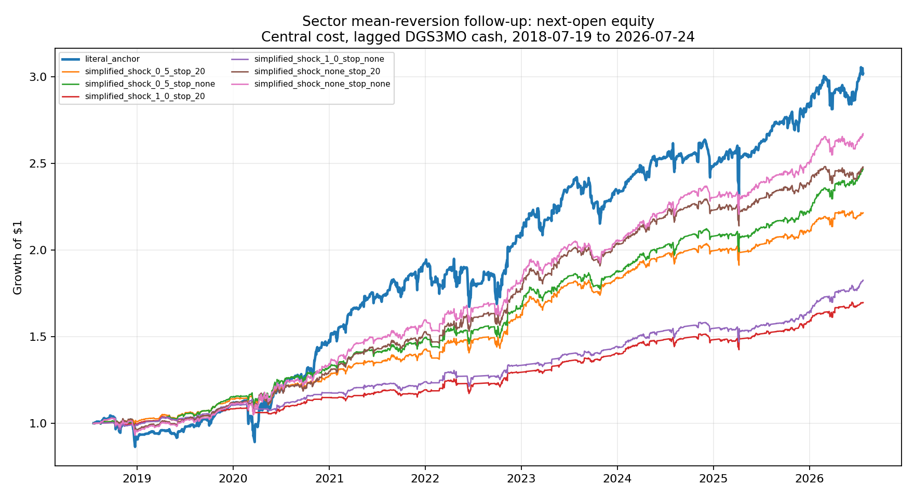
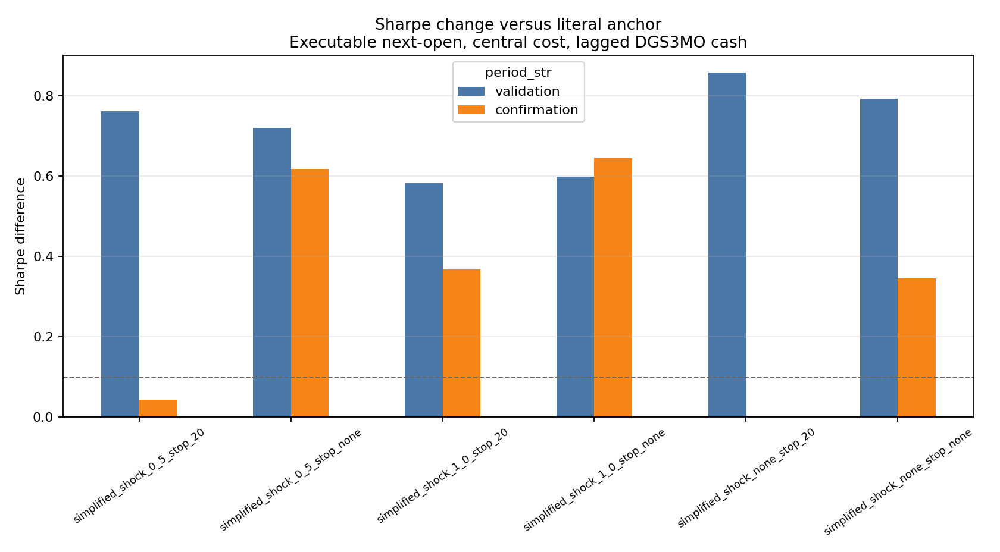

<!-- GENERATED FILE. EDIT THE CANONICAL KNOWLEDGE RECORD. -->

# Sector Mean-Reversion Simplification Follow-up

!!! warning "Research-only"
    This page summarizes saved research evidence. It does not authorize LIVE, allocation, or deployment.

## TL;DR

> **Verdict:** None of the six simplified historical challengers passed all three frozen gates. Retain the simplified rule only as a forward hypothesis and prioritize a true 15:45/MOC test. The strongest balanced forward hypothesis is IBS below 0.05 with a -0.5 prior-ATR sell-off filter, no entry range gate, median-range exit, prior-only NATR rank, five slots, and no time stop.

> **Status:** `forward_hypothesis`

> **Disposition:** `not_recorded`

> **Replication:** `not_recorded`

## Research question

Compare the literal sector-ETF rule with frozen simplified, ATR-shock, and time-stop challengers.

## Exact setup

| Field | Value |
| --- | --- |
| Signal family | mean_reversion |
| Universe | ["Fixed 11 US SPDR sector ETFs"] |
| Decision | Close_T |
| Fill | Open_T+1; same-close shown only as diagnostic |
| Primary cost layer | central_research |
| Last reviewed | 2026-07-27T20:22:08+03:00 |

## Timing and overnight attribution

```text
information available: Close_T
primary executable fill: Open_T+1; same-close shown only as diagnostic
```

If final `Close_T` data formed the signal, a hypothetical `Close_T` entry is diagnostic only unless a separate pre-close protocol was modeled. Comparing that diagnostic with `Open_(T+1)` and applying the compounded return identity shows whether the apparent edge occurred in the overnight gap. Missing attribution numbers mean **not tested**, not zero.


## Primary metrics

| Metric | Value |
| --- | ---: |
| Period | 2018-07-19 through 2026-07-24 |
| Universe | 11 sector ETFs |
| Cost Layer | central_research with lagged DGS3MO cash |
| Cagr | 11.97% |
| Annualized Volatility | 7.79% |
| Sharpe | 1.489 |
| Maximum Drawdown | -6.53% |
| Turnover | 1611.41% |

## Key findings

| Feature | Role | Direction | Status | Effect | Action |
| --- | --- | --- | --- | --- | --- |
| Simplified IBS and median-range rule | entry, exit, rank and slot construction | IBS below 0.05 entry; median-range high-IBS exit | forward_hypothesis | See variant_metrics.csv and promotion_gates.csv. | Test with true 15:45 snapshots and MOC fills. |
| DownShockATR | entry filter | None, below -0.5, or below -1.0 prior ATR units | forward_hypothesis | See full declared variant table. | Do not select a threshold without future data. |
| 20-session time stop | risk exit and slot release | Exit at next open after 20 completed sessions | forward_hypothesis | See paired stop/no-stop variants. | Keep only if forward evidence supports it. |

## Visual evidence






## Limitations

- No 15:45 snapshots or MOC fills.
- All follow-up historical periods are post-hoc.
- DGS3MO is a cash and financing proxy.
- Exposure-matched benchmark is diagnostic.

## Next gates

- Acquire 15:45 snapshots and official closing-auction fills.
- Measure 15:45-to-close signal stability.
- Run a forward-only shadow ledger with actual MOC order evidence.

## Sources

- `{"path": "C:/Users/User/Downloads/sector_mean_reversion.pdf", "read_complete": true, "sha256": "fea029ab56b3300f5cb2590d2bbd36c94e10ba2f7ef3fb4eab657354336b4eb4", "title": "A Mean-Reversion Model for US Sectors"}`
- `{"path": "pakal-research/reports/sector_mean_reversion_research/REPORT_FULL.md", "read_complete": true, "title": "Parent sector mean-reversion research"}`
- `{"path": "https://fred.stlouisfed.org/series/DGS3MO", "read_complete": true, "sha256": "f2221f1652d22992edbaf03876618ecaae73b7c21b5f52b850ad354f5fb1011b", "title": "FRED DGS3MO"}`

## Canonical artifacts

| Artifact | Pakal path |
| --- | --- |
| Concise Report | `C:\\Users\\User\\Documents\\workspace\\pakal\\pakal-research\\reports\\sector_mean_reversion_followup\\REPORT.md` |
| Full Report | `C:\\Users\\User\\Documents\\workspace\\pakal\\pakal-research\\reports\\sector_mean_reversion_followup\\REPORT_FULL.md` |
| Notebook | `C:\\Users\\User\\Documents\\workspace\\pakal\\pakal-research\\sector_mean_reversion_followup.ipynb` |
| Frozen Specification | `C:\\Users\\User\\Documents\\workspace\\pakal\\pakal-research\\reports\\sector_mean_reversion_followup\\research_spec_frozen.json` |
| Manifest | `C:\\Users\\User\\Documents\\workspace\\pakal\\pakal-research\\reports\\sector_mean_reversion_followup\\run_manifest.json` |
| Primary Source Code | `["C:\\\\Users\\\\User\\\\Documents\\\\workspace\\\\pakal\\\\pakal-research\\\\sector_mean_reversion_followup.py", "C:\\\\Users\\\\User\\\\Documents\\\\workspace\\\\pakal\\\\pakal-research\\\\sector_mean_reversion_research.py"]` |
| Primary Tables | `["C:\\\\Users\\\\User\\\\Documents\\\\workspace\\\\pakal\\\\pakal-research\\\\reports\\\\sector_mean_reversion_followup\\\\tables\\\\variant_metrics.csv", "C:\\\\Users\\\\User\\\\Documents\\\\workspace\\\\pakal\\\\pakal-research\\\\reports\\\\sector_mean_reversion_followup\\\\tables\\\\paired_inference.csv", "C:\\\\Users\\\\User\\\\Documents\\\\workspace\\\\pakal\\\\pakal-research\\\\reports\\\\sector_mean_reversion_followup\\\\tables\\\\promotion_gates.csv", "C:\\\\Users\\\\User\\\\Documents\\\\workspace\\\\pakal\\\\pakal-research\\\\reports\\\\sector_mean_reversion_followup\\\\tables\\\\capacity_scenarios.csv"]` |
| Primary Charts | `["C:\\\\Users\\\\User\\\\Documents\\\\workspace\\\\pakal\\\\pakal-research\\\\reports\\\\sector_mean_reversion_followup\\\\charts\\\\next_open_equity_all_variants.png", "C:\\\\Users\\\\User\\\\Documents\\\\workspace\\\\pakal\\\\pakal-research\\\\reports\\\\sector_mean_reversion_followup\\\\charts\\\\validation_confirmation_sharpe_delta.png", "C:\\\\Users\\\\User\\\\Documents\\\\workspace\\\\pakal\\\\pakal-research\\\\reports\\\\sector_mean_reversion_followup\\\\charts\\\\timing_bridge_cagr.png", "C:\\\\Users\\\\User\\\\Documents\\\\workspace\\\\pakal\\\\pakal-research\\\\reports\\\\sector_mean_reversion_followup\\\\charts\\\\paired_daily_difference.png"]` |
