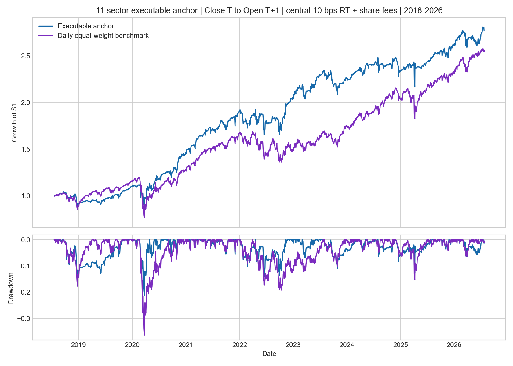
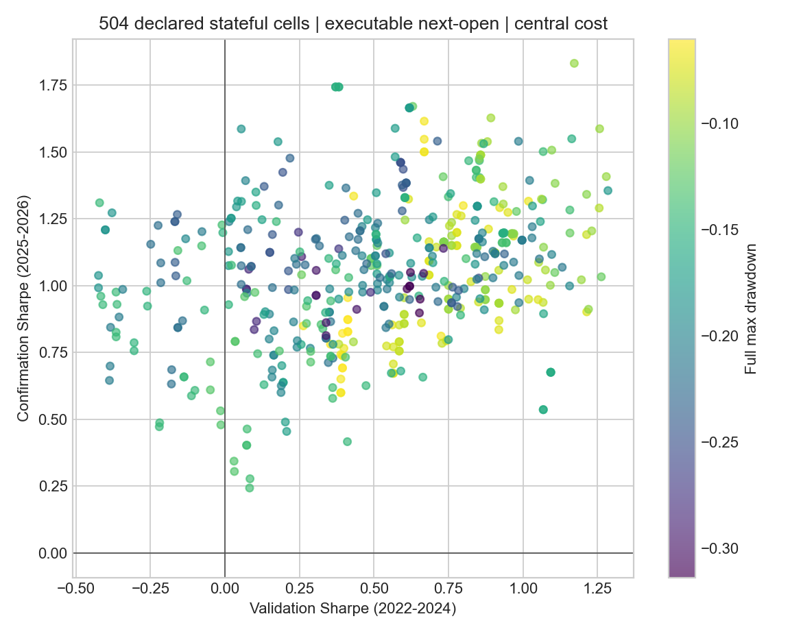

<!-- GENERATED FILE. EDIT THE CANONICAL KNOWLEDGE RECORD. -->

# Sector ETF Mean-Reversion: IBS and Relative Range

!!! warning "Research-only"
    This page summarizes saved research evidence. It does not authorize LIVE, allocation, or deployment.

## TL;DR

> **Verdict:** The executable next-open translation failed 2 of the frozen promotion gates. Do not implement it as a strategy; retain only the feature and timing evidence for future research.

> **Status:** `diagnostic`

> **Disposition:** `not_recorded`

> **Replication:** `not_recorded`

## Research question

Test whether the paper's IBS plus relative-range structure survives executable Close_T to Open_T+1 timing, frozen validation, costs, and capacity stress.

## Exact setup

| Field | Value |
| --- | --- |
| Signal family | mean_reversion |
| Universe | ["11 SPDR sector ETFs from 2018-07-19", "9 original SPDR sector ETFs from 1999-01-25"] |
| Decision | Close_T for executable proxy; paper literal 15:45 unavailable |
| Fill | Open_T+1 for executable proxy; paper literal MOC_T unavailable |
| Primary cost layer | central_research |
| Last reviewed | 2026-07-27T00:50:16.083234+03:00 |

## Timing and overnight attribution

```text
information available: Close_T for executable proxy; paper literal 15:45 unavailable
primary executable fill: Open_T+1 for executable proxy; paper literal MOC_T unavailable
```

If final `Close_T` data formed the signal, a hypothetical `Close_T` entry is diagnostic only unless a separate pre-close protocol was modeled. Comparing that diagnostic with `Open_(T+1)` and applying the compounded return identity shows whether the apparent edge occurred in the overnight gap. Missing attribution numbers mean **not tested**, not zero.


## Primary metrics

| Metric | Value |
| --- | ---: |
| Period | 2022-01-03 through 2026-07-24 |
| Universe | 11 SPDR sector ETFs |
| Cost Layer | central_research |
| Cagr | 9.23% |
| Annualized Volatility | 8.50% |
| Sharpe | 1.081 |
| Maximum Drawdown | -7.88% |
| Turnover | 2155.42% |

## Key findings

| Feature | Role | Direction | Status | Effect | Action |
| --- | --- | --- | --- | --- | --- |
| IBS | entry signal and cross-sectional diagnostic | lower IBS should predict higher next-day return | diagnostic | same-date mean IC -0.0059; anchor event-minus-control 1.03 bps | Retain as a measured feature; do not promote independently of executable portfolio and forward evidence. |
| RelativeRangeStd21 | paper entry and exit filter | paper requires greater than 1 | diagnostic | within IBS<0.10: 0.03 bps when >1 versus -32.11 bps when <=1; the literal gate passed 99.0% of observations | Do not describe the literal standard-deviation ratio as a selective one-sigma expansion filter; treat it and the prior-median companion separately. |
| NATR14 | cross-sectional rank and volatility diagnostic | higher first in constrained-slot variants | diagnostic | See feature_ic.csv, band_evidence.csv, and parameter_marginals.csv. | Use only if the whole rank neighborhood, not one winner, is stable out of sample. |
| SPY trend and volatility regimes | diagnostic regime decomposition | not pre-assumed | diagnostic | See band_evidence.csv for SPY SMA200 and NATR14 regimes. | Any attractive regime split is post-hoc unless it was already frozen as a promotion rule. |

## Visual evidence






## Limitations

- No historical 15:45 OHLC or MOC fill ledger.
- The paper source already observed nearly the entire sample.
- Daily ADV is not opening-auction volume.
- Impact is hypothetical and financing is omitted for paper parity.
- Underlying ETF constituents and historical fund AUM are unavailable.

## Next gates

- Acquire true 15:45 OHLC and MOC auction prints with submission-cutoff metadata.
- Freeze a post-publication tracker starting after July 11, 2026.
- Calibrate spread, auction basis, partial fills, and financing from actual executions before any deployment review.

## Sources

- `{"path": "C:\\\\Users\\\\User\\\\Downloads\\\\sector_mean_reversion.pdf", "read_complete": true, "sha256": "fea029ab56b3300f5cb2590d2bbd36c94e10ba2f7ef3fb4eab657354336b4eb4", "title": "A Mean-Reversion Model for US Sectors"}`

## Canonical artifacts

| Artifact | Pakal path |
| --- | --- |
| Concise Report | `C:\\Users\\User\\Documents\\workspace\\pakal\\pakal-research\\reports\\sector_mean_reversion_research\\REPORT.md` |
| Full Report | `C:\\Users\\User\\Documents\\workspace\\pakal\\pakal-research\\reports\\sector_mean_reversion_research\\REPORT_FULL.md` |
| Notebook | `C:\\Users\\User\\Documents\\workspace\\pakal\\pakal-research\\sector_mean_reversion_research.ipynb` |
| Frozen Specification | `C:\\Users\\User\\Documents\\workspace\\pakal\\pakal-research\\reports\\sector_mean_reversion_research\\research_spec_frozen.json` |
| Manifest | `C:\\Users\\User\\Documents\\workspace\\pakal\\pakal-research\\reports\\sector_mean_reversion_research\\run_manifest.json` |
| Primary Source Code | `["C:\\\\Users\\\\User\\\\Documents\\\\workspace\\\\pakal\\\\pakal-research\\\\sector_mean_reversion_research.py"]` |
| Primary Tables | `["C:\\\\Users\\\\User\\\\Documents\\\\workspace\\\\pakal\\\\pakal-research\\\\reports\\\\sector_mean_reversion_research\\\\tables\\\\paper_anchor_metrics.csv", "C:\\\\Users\\\\User\\\\Documents\\\\workspace\\\\pakal\\\\pakal-research\\\\reports\\\\sector_mean_reversion_research\\\\tables\\\\grid_results.csv", "C:\\\\Users\\\\User\\\\Documents\\\\workspace\\\\pakal\\\\pakal-research\\\\reports\\\\sector_mean_reversion_research\\\\tables\\\\walk_forward_metrics.csv", "C:\\\\Users\\\\User\\\\Documents\\\\workspace\\\\pakal\\\\pakal-research\\\\reports\\\\sector_mean_reversion_research\\\\tables\\\\event_inference.csv", "C:\\\\Users\\\\User\\\\Documents\\\\workspace\\\\pakal\\\\pakal-research\\\\reports\\\\sector_mean_reversion_research\\\\tables\\\\capacity_scenarios.csv"]` |
| Primary Charts | `["C:\\\\Users\\\\User\\\\Documents\\\\workspace\\\\pakal\\\\pakal-research\\\\reports\\\\sector_mean_reversion_research\\\\charts\\\\anchor_equity_drawdown.png", "C:\\\\Users\\\\User\\\\Documents\\\\workspace\\\\pakal\\\\pakal-research\\\\reports\\\\sector_mean_reversion_research\\\\charts\\\\validation_confirmation_scatter.png", "C:\\\\Users\\\\User\\\\Documents\\\\workspace\\\\pakal\\\\pakal-research\\\\reports\\\\sector_mean_reversion_research\\\\charts\\\\walk_forward_cost_sensitivity.png", "C:\\\\Users\\\\User\\\\Documents\\\\workspace\\\\pakal\\\\pakal-research\\\\reports\\\\sector_mean_reversion_research\\\\charts\\\\capacity_scenarios.png"]` |
